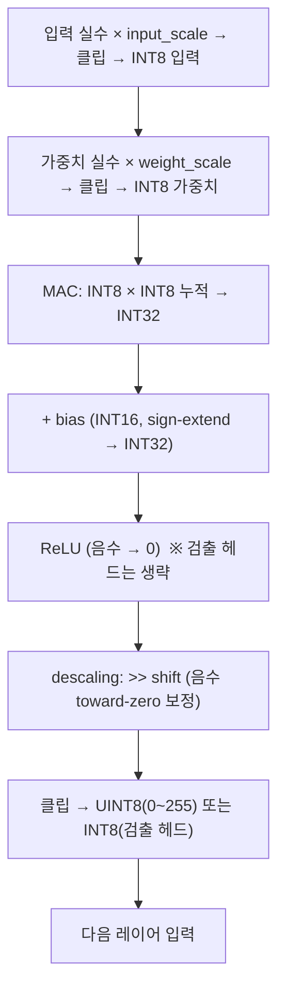

# 2장. 신경망 양자화 기초

> [← 1장 CNN 기초](01_cnn_basics.md) · [목차](README.md) · 다음 장: [3장 FPGA 하드웨어 기초 →](03_fpga_basics.md)
> **Part 0 기초 개념** — [1장](01_cnn_basics.md)의 MAC 개념을 알면 좋습니다.

---

[1장](01_cnn_basics.md)에서 "합성곱 = MAC의 산"임을 배웠습니다. 그런데 PC에서 학습된 신경망의 가중치는 `0.0314`, `-1.872` 같은 **실수(부동소수점)** 입니다. 이 장은 그 실수들을 **정수(INT8)** 로 바꿔서 계산하는 **양자화(quantization)** 를 설명합니다. 양자화는 이 가속기의 정확도(mAP)와 에너지를 동시에 좌우하는 핵심 기술입니다.

---

## 2.1 왜 부동소수점 대신 정수인가?

신경망 학습은 보통 32비트 부동소수점(FP32)으로 합니다. 하지만 추론을 FPGA에서 할 때 FP32를 쓰면 문제가 있습니다.

| 항목 | FP32 (부동소수점) | INT8 (정수) |
|------|-------------------|-------------|
| 곱셈기 크기 | 큼 (FPGA DSP 여러 개) | 작음 (DSP 1개로 충분) |
| 전력 | 높음 | **낮음** |
| 메모리 | 4 byte/값 | **1 byte/값** (4배 절약) |
| 속도 | 느림 | **빠름** |
| 정확도 | 100% | 약간 손실 (보통 무시 가능) |

> 🔑 **점수 공식과의 연결**: 이 대회의 점수는 `10⁴/Energy × ...`로 **에너지가 분모**입니다([7장](07_project_overview.md)). 정수 연산은 부동소수점보다 전력을 훨씬 적게 쓰므로, INT8 양자화는 점수를 올리는 직접적 수단입니다. 메모리도 1/4로 줄어 DRAM 접근(가장 큰 에너지원)이 줄어듭니다.

💡 **비유**: 부동소수점은 "소수점 위치가 자유로운 정밀 저울"이고, 정수 양자화는 "1g 단위로만 재는 단순 저울"입니다. 단순 저울은 약간 부정확하지만 훨씬 싸고 빠릅니다. 신경망은 다행히 약간의 부정확함을 견딜 수 있습니다.

---

## 2.2 핵심 아이디어 — scale로 정수에 매핑하기

양자화의 기본 아이디어는 간단합니다: **실수에 큰 수(scale)를 곱한 뒤 반올림하여 정수로** 만듭니다.

```
정수값 = round( 실수값 × scale )
```

예를 들어 가중치 `0.0314`에 scale `64`를 곱하면:

```
round(0.0314 × 64) = round(2.0096) = 2   (INT8 정수 2)
```

나중에 결과를 해석할 때는 다시 scale로 나누면 원래 크기로 돌아옵니다. 정수끼리 곱하고 더한 뒤, 마지막에 한 번만 scale을 풀어주면 되는 것이 핵심입니다.

⚠️ **정수의 범위 제한**: INT8(부호 있는 8비트)은 **−128 ~ +127** 만 표현합니다. scale을 곱한 결과가 이 범위를 넘으면 잘라냅니다(클리핑, clipping). 그래서 scale을 너무 크게 잡으면 큰 값들이 다 127로 뭉개지고, 너무 작게 잡으면 작은 값들이 0이 되어 정보를 잃습니다. **적절한 scale 고르기가 양자화의 기술**입니다.

---

## 2.3 이 프로젝트의 양자화 방식

이 프로젝트는 **레이어마다 고정된 scale**(per-layer quantization)을 씁니다. 입력과 가중치에 각각 다른 scale을 곱합니다([skeleton의 `do_quantization()`](../../skeleton/src/yolov2_forward_network_quantized.c), [9장](09_skeleton_reference.md)에서 코드로).

```
입력 정수  = clip( 입력 실수  × input_quant_multiplier,  0..255 )
가중치 정수 = clip( 가중치 실수 × weight_quant_multiplier, -128..127 )
```

| 레이어 | `input_quant_multiplier` | `weight_quant_multiplier` |
|--------|--------------------------|----------------------------|
| L0 (첫 레이어) | 128 | 16 |
| L2~L20 (나머지) | 8 | 64 |

❓ **왜 L0만 다를까?**: 입력 이미지 픽셀은 0~1로 정규화되어 값이 작습니다. 작은 값을 정수로 잘 표현하려면 큰 scale(128)이 좋습니다. 반면 중간 레이어의 활성값은 ReLU를 거쳐 범위가 안정되어 작은 scale(8)로 충분합니다. 가중치는 그 반대 경향이라 L0=16, 나머지=64입니다. 이 숫자들은 "정확도가 가장 적게 떨어지도록" 실험으로 고른 값입니다.

⚠️ **입력은 UINT8(0~255), 가중치는 INT8(−128~127)**: 입력은 ReLU 이후라 음수가 없어 부호 없는 8비트(0~255)로 저장하고, 가중치는 음수가 있어 부호 있는 8비트입니다. 그런데 **곱셈할 때는 둘 다 부호 있는 수로 다룹니다**(입력의 최상위 비트가 1이어도 그건 큰 양수). 이 미묘함이 [14장 mul.v](14_rtl_convolution_engine.md)에서 Phase 2 버그의 원인이 되었습니다.

---

## 2.4 INT8 곱셈-누적 — 누적은 왜 INT32인가

이제 양자화된 정수로 MAC을 합니다.

```
한 번의 곱셈:  INT8 × INT8 → 결과는?
  최댓값: (-128) × (-128) = 16384   →  16비트면 충분 (INT16)
```

곱셈 하나는 INT16에 들어갑니다. 그런데 합성곱은 이런 곱셈을 **수백~수천 개 더합니다**([1장 1.3](01_cnn_basics.md)). 16비트짜리를 수천 개 더하면 16비트를 넘쳐버립니다(overflow).

```
누적합 최댓값 ≈ 16384 × (3×3 × 256채널) ≈ 3,700만  →  32비트 필요 (INT32)
```

> 🔑 **그래서 비트폭이 단계적으로 커집니다**: 곱셈 결과는 INT16, 그것들을 모으는 가산 트리는 22비트, 최종 누적기는 32비트. 이 비트폭 변화가 [14장](14_rtl_convolution_engine.md)의 `mul`(16비트) → `add_tree_36in`(22비트) → `accumulator`(32비트)에 그대로 나타납니다. 비트가 부족하면 큰 값이 깨지고, 너무 많으면 회로가 낭비됩니다.

💡 **비유**: 작은 숫자 수천 개를 더할 때 작은 계산기(16자리)로는 합계가 넘쳐서, 큰 종이(32자리)에 적어가며 더하는 것과 같습니다.

---

## 2.5 bias 더하기

합성곱 누적이 끝나면 **편향(bias)** 을 더합니다. bias는 출력 채널마다 하나씩 있는 보정값입니다.

bias도 양자화해야 하는데, **입력과 가중치 scale을 둘 다 곱한 만큼** 키워야 합니다. 왜냐하면 MAC 결과가 이미 `input_scale × weight_scale`만큼 커져 있기 때문에, bias도 같은 크기로 맞춰야 더할 수 있습니다.

```
bias 정수 = clip( bias 실수 × (input_quant_multiplier × weight_quant_multiplier), INT16 )
```

⚠️ **bias는 16비트인데 누적은 32비트**: bias(INT16)를 32비트 누적값에 더하려면 **부호 확장(sign-extend)** 을 해야 합니다. 단순히 위를 0으로 채우면(zero-extend) 음수 bias가 거대한 양수가 되어 결과가 완전히 망가집니다. 이것이 [12장](12_data_representation_memory_map.md)·[CLAUDE.md 규칙 7](../../CLAUDE.md)에서 강조하는 sign-extend입니다.

```
16비트 음수 bias  0xFFFF (= -1)
 → sign-extend:  0xFFFFFFFF (= -1)   ✅ 올바름
 → zero-extend:  0x0000FFFF (= 65535) ❌ 완전히 다른 값
```

---

## 2.6 Descaling — 다시 작게 만들기

MAC + bias 결과는 `input_scale × weight_scale`만큼 부풀어 있는 큰 정수입니다. 이걸 다음 레이어가 쓸 수 있는 작은 정수로 되돌려야 합니다. 이 과정을 **descaling(역스케일링)** 이라 합니다.

원래는 나눗셈이지만, scale이 **2의 거듭제곱**이 되도록 설계해서 **비트 시프트(>>)** 로 대체합니다. 나눗셈은 하드웨어에서 비싸지만 시프트는 거의 공짜이기 때문입니다.

```
descaling = (MAC+bias 결과) >> shift_amount

shift_amount = log₂( input_scale × weight_scale / 다음레이어_input_scale )
```

예를 들어 L2는 `input_scale=8, weight_scale=64`, 다음 레이어 `input_scale=8`:

```
배율 = 8 × 64 / 8 = 64 = 2⁶   →   shift_amount = 6
즉, 결과를 오른쪽으로 6비트 시프트 (= 64로 나누기)
```

| 레이어 | 계산 | shift |
|--------|------|-------|
| L0 | 128×16/8 = 256 = 2⁸ | 8 |
| L2~L13, L17 | 8×64/8 = 64 = 2⁶ | 6 |
| **L14** (검출 헤드 1) | 8×64/**8** = 64 = 2⁶ | **6** |
| **L20** (검출 헤드 2) | 8×64/**1** = 512 = 2⁹ | **9** |

❓ **검출 헤드인데 L14와 L20의 shift가 왜 다를까?**: `next_input_multiplier`(다음 합성곱의 입력 scale)가 다르기 때문입니다. L14 **다음에는 합성곱 L17이 있어** next=8이지만, L20 **다음에는 합성곱이 없어**(L21은 yolo) next=1이 됩니다. 그래서 L14는 8×64/8=64(shift **6**), L20은 8×64/1=512(shift **9**). 둘 다 검출 헤드(ReLU off)이지만 shift는 다릅니다.

> 🔑 이 `shift` 값들이 [13장 yolo_engine](13_rtl_yolo_engine_top.md)의 레이어 파라미터 테이블(`L14_SHIFT=6`, `L20_SHIFT=9` 등)에 그대로 들어갑니다. skeleton이 만든 `CONVnn_param_scales.hex` 파일에서 측정한 값입니다([9장](09_skeleton_reference.md)).

---

## 2.7 반올림 — 음수에서 생기는 1 LSB 차이

여기 함정이 하나 있습니다. **C 언어의 나눗셈과 Verilog의 시프트가 음수에서 다르게 동작**합니다.

```
-50 / 64 의 결과:
  C 언어 (÷):     0   (toward-zero, 0 방향으로 버림)
  Verilog (>>>):  -1  (floor, -∞ 방향으로 내림)
```

골든(C)이 0인데 하드웨어(>>>)가 −1이면 1만큼 차이가 납니다. 이 "1 LSB(최하위 비트) 차이"가 검증에서 mismatch로 잡힙니다.

해결책은 **음수일 때만 시프트 전에 `(2^shift − 1)`을 더해주는 것**입니다. 이러면 Verilog 시프트도 C의 toward-zero와 같아집니다.

```verilog
round_bias = (값이 음수) ? (2^shift - 1) : 0;
결과 = (값 + round_bias) >>> shift;
```

> 이 보정은 ReLU가 있어 음수가 없는 일반 레이어에는 영향이 없고, **ReLU 없는 검출 헤드(L14, L20)에서 결정적**입니다. [14장 post_process](14_rtl_convolution_engine.md)에서 실제 코드로 봅니다. 이 보정을 빠뜨려서 L14가 거의 다 1씩 틀렸던 것이 [20장](20_testbench_per_layer.md)의 디버깅 사례입니다.

---

## 2.8 클리핑 — 0~255로 자르기

descaling 후 최종 출력은 다음 레이어의 입력이 되므로, 다시 8비트 범위로 잘라야 합니다.

- **일반 레이어(ReLU 있음)**: 0~255(UINT8). 음수는 0, 255 초과는 255로.
- **검출 헤드(ReLU 없음)**: −128~+127(INT8). 좌표·확률이라 음수 유지.

```
일반:    [큰 음수] → 0,   [0~255] → 그대로,   [큰 양수] → 255
검출헤드: [< -128] → -128, [-128~127] → 그대로, [> 127] → 127
```

이 두 모드가 [14장 post_process](14_rtl_convolution_engine.md)의 `i_relu_en` 신호로 갈립니다.

---

## 2.9 전체 흐름 한눈에 보기

한 합성곱 레이어의 양자화 추론을 처음부터 끝까지 모으면:



이 흐름이 [14장](14_rtl_convolution_engine.md)의 `mac_kern` + `post_process` 하드웨어와 **단계마다 1:1로 대응**합니다. 그래서 양자화를 이해하면 그 하드웨어가 왜 그렇게 생겼는지 자연스럽게 이해됩니다.

---

## 2.10 양자화 오차와 mAP

양자화는 약간의 오차를 만듭니다. 검증에서 "±1 LSB mismatch"가 보이는 이유입니다. 하지만:

- 대부분의 오차는 **1 LSB(최하위 비트 1 차이)** 수준이라 무시할 만합니다.
- max pooling이 이런 작은 오차를 흡수합니다([1장 1.7](01_cnn_basics.md), [20장](20_testbench_per_layer.md)).
- 최종 검출 정확도(mAP)는 목표 0.2를 넘기는 데 문제없는 수준입니다.

> 🔑 검증의 핵심 판정: **`|하드웨어 − 골든| ≤ 1`이면 PASS**(양자화 noise로 간주). 이 기준이 [19장 검증 전략](19_testbench_strategy.md)의 `TOLERANCE = 1`입니다.

---

## 2.11 이 장의 요약

- 양자화 = 실수에 scale을 곱해 정수(INT8)로 만드는 것. 전력·메모리를 크게 절약(점수의 Energy 항에 직결).
- 이 프로젝트는 레이어별 고정 scale: 입력(L0=128, 나머지=8), 가중치(L0=16, 나머지=64).
- 곱셈은 INT16, 누적은 INT32(넘침 방지). bias는 두 scale의 곱으로 키우고 **sign-extend**로 더함.
- descaling은 `>> shift`(2의 거듭제곱 나눗셈). 음수는 toward-zero 보정 필요(C와 일치).
- 클립: 일반 레이어 UINT8(0~255), 검출 헤드 INT8(−128~127).
- 이 전 과정이 [14장](14_rtl_convolution_engine.md) `mac_kern`+`post_process`와 1:1 대응. 오차는 보통 ±1 LSB(PASS 기준).

다음 장에서는 이 정수 연산을 실제로 수행할 그릇 — **FPGA 하드웨어**의 기본 부품들을 배웁니다.

---

> [← 1장 CNN 기초](01_cnn_basics.md) · [목차](README.md) · 다음 장: [3장 FPGA 하드웨어 기초 →](03_fpga_basics.md)
