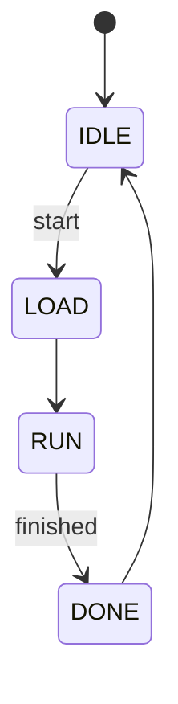

# 4장. RTL 설계와 타이밍 기초

> [← 3장 FPGA 기초](03_fpga_basics.md) · [목차](README.md) · 다음 장: [5장 AXI 버스 프로토콜 기초 →](05_axi_basics.md)
> **Part 0 기초 개념** — 사전 지식: Verilog 기본 문법(`reg`/`wire`, `always`), [3장](03_fpga_basics.md)의 BRAM latency.

---

이 프로젝트의 RTL을 읽다 보면 "왜 신호를 1클럭 늦추지?", "왜 주소를 미리 보내지?" 같은 의문이 계속 생깁니다. 이 장은 그 답인 **타이밍 정렬**의 원리를 설명합니다. 이걸 이해하면 [14장 conv_top](14_rtl_convolution_engine.md)의 까다로운 코드가 "아, 그래서 그렇구나"로 바뀝니다. 실제로 이 프로젝트 Phase 2 버그의 상당수가 타이밍 정렬 문제였습니다.

---

## 4.1 RTL과 클럭 — 조합 논리 vs 순차 논리

RTL(Register-Transfer Level) 설계는 두 가지 논리로 이루어집니다.

### 조합 논리 (combinational) — 즉시 계산

입력이 바뀌면 (전선 지연만 빼고) **즉시** 출력이 바뀝니다. Verilog의 `assign`이나 `always @(*)`.

```verilog
assign sum = a + b;          // a나 b가 바뀌면 즉시 sum이 바뀜
```

### 순차 논리 (sequential) — 클럭에 맞춰 기억

**클럭 상승 에지(`posedge clk`)** 마다 값을 레지스터(FF)에 저장합니다. 값이 "한 클럭 뒤"에 반영됩니다.

```verilog
always @(posedge clk)
    sum_reg <= a + b;        // 다음 클럭에 sum_reg가 (a+b)가 됨
```

> 🔑 **핵심 구분**: 조합 논리는 "지금 이 순간"의 값, 순차 논리는 "한 클럭 전" 값을 기억. 이 "한 클럭"의 차이를 정확히 추적하는 것이 타이밍 정렬입니다.

💡 **비유**: 조합 논리는 "말하면 바로 메아리", 순차 논리는 "녹음기에 녹음했다가 다음 박자에 재생"입니다.

---

## 4.2 FSM — 상태 머신

복잡한 동작(예: "DMA로 데이터 받고 → 연산하고 → 결과 저장")을 순서대로 제어하려면 **유한 상태 머신(FSM)** 을 씁니다. "지금 어느 단계인가"를 상태 레지스터에 저장하고, 조건에 따라 다음 상태로 넘어갑니다.

```verilog
reg [2:0] state;
localparam IDLE=0, LOAD=1, RUN=2, DONE=3;

always @(posedge clk)
    case (state)
        IDLE: if (start)     state <= LOAD;   // 시작하면 LOAD로
        LOAD:                state <= RUN;     // 적재 후 RUN으로
        RUN:  if (finished)  state <= DONE;    // 끝나면 DONE으로
        DONE:                state <= IDLE;    // 다시 대기
    endcase
```



> 🔑 이 프로젝트의 [yolo_engine](13_rtl_yolo_engine_top.md)은 **53개 상태**를 가진 거대한 FSM으로 22개 레이어를 순서대로 처리합니다. [conv_top](14_rtl_convolution_engine.md)도 6개 상태의 작은 FSM입니다. FSM은 하드웨어의 "프로그램 흐름"이라고 보면 됩니다.

💡 **비유**: FSM은 보드게임의 말과 같습니다. "지금 어느 칸(상태)에 있고, 주사위 결과(조건)에 따라 다음 칸으로 이동"합니다.

---

## 4.3 파이프라인 — 왜 계산을 쪼개는가

복잡한 계산(예: 큰 곱셈)을 한 클럭에 다 하려면 클럭을 느리게 해야 합니다([3장 타이밍 클로저](03_fpga_basics.md)). 대신 계산을 여러 단계로 쪼개고, 각 단계 사이에 FF를 넣는 것이 **파이프라인**입니다.

```
파이프라인 없음:  [─────── 긴 계산 ───────] → 클럭이 느려야 함
파이프라인 4단:   [계산1]→FF→[계산2]→FF→[계산3]→FF→[계산4] → 클럭 빠름
```

### Latency와 Throughput — 헷갈리지 말 것

파이프라인을 이해할 때 두 개념을 구분해야 합니다.

- **Latency(지연)**: 입력이 들어가서 결과가 나오기까지 걸리는 클럭 수. (예: 4단 파이프라인 → latency 4)
- **Throughput(처리량)**: 단위 시간당 처리하는 양. 파이프라인이 가득 차면 **매 클럭 하나씩** 결과가 나옵니다.

```
공장 비유: 자동차 한 대 만드는 데 4단계(latency 4)지만,
          라인이 가득 차면 매 단계마다 한 대씩 완성(throughput 1/clk).

클럭:  0    1    2    3    4    5    6
입력:  A    B    C    D    E    ...
출력:            -    -    A    B    C  ...  ← latency 4 후 매 클럭 출력
```

> 🔑 이 프로젝트의 [곱셈기 mul](14_rtl_convolution_engine.md)은 **latency 4**(4단 파이프라인), [가산 트리](14_rtl_convolution_engine.md)도 **latency 4**입니다. 합쳐서 MAC 어레이는 latency 8. 하지만 throughput은 매 클럭 — 파이프라인이 차면 매 클럭 새 결과가 나옵니다. 이 구분이 [18장 성능](18_operation_timing.md)에서 "latency는 채움/비움에만 보이고 throughput이 진짜 속도"라는 말의 의미입니다.

---

## 4.4 BRAM read latency가 만드는 문제

[3장 3.4](03_fpga_basics.md)에서 "BRAM은 주소를 주면 다음 클럭에 데이터가 나온다"(latency 1)고 했습니다. 이게 왜 문제일까요?

가중치를 BRAM에서 읽어 곱셈기에 넣는다고 합시다. 순진하게 짜면:

```
클럭 0: 가중치 주소 발사
클럭 0: 곱셈기에 가중치 입력 ← 아직 데이터가 안 나왔다! (X 값)
```

주소를 발사한 클럭에는 데이터가 아직 없습니다(다음 클럭에 나옴). 그런데 곱셈기는 같은 클럭에 그 데이터를 기대하니, **타이밍이 1클럭 어긋납니다**. 결과가 틀립니다.

해결책은 두 가지입니다.

### 방법 ① 입력 쪽을 1클럭 늦추기

데이터가 도착하는 클럭에 맞춰 "유효" 신호를 1클럭 지연시킵니다.

```verilog
// 주소는 클럭 0에 발사, 데이터는 클럭 1에 도착
// → 곱셈 시작 신호도 1클럭 늦춰 클럭 1에 맞춤
reg vld_delayed;
always @(posedge clk) vld_delayed <= vld;   // 1클럭 지연
```

> [conv_top](14_rtl_convolution_engine.md)의 `mac_vld_d`가 바로 이것입니다.

### 방법 ② 주소를 미리 발사하기 (look-ahead)

다음에 필요할 데이터의 주소를 **한 클럭 먼저** 보냅니다. 그러면 정작 필요한 클럭에 데이터가 준비됩니다.

```
클럭 0: (다음 클럭에 쓸) 주소 미리 발사
클럭 1: 데이터 도착 + 사용  ← 딱 맞음!
```

> [conv_top](14_rtl_convolution_engine.md)이 라인 버퍼에 보내는 `lah_row/col/acc`(look-ahead 좌표)가 이것입니다. [라인 버퍼](15_rtl_memory_buffers.md)는 read latency가 2라서 더 신경 써야 합니다.

⚠️ **이것이 Phase 2 버그의 단골 원인**: 가중치 주소를 1클럭 잘못 advance해서 "가중치가 입력보다 1스텝 앞서가는" 버그가 있었습니다([14장 8.7](14_rtl_convolution_engine.md), [HISTORY](../../HISTORY.md)). 타이밍 정렬은 한 클럭만 틀려도 결과가 완전히 망가지므로 가장 조심해야 합니다.

---

## 4.5 valid 신호 — 데이터가 진짜인지 표시

파이프라인에서는 "지금 이 전선의 값이 진짜 유효한 데이터인가, 아니면 쓰레기인가"를 구분해야 합니다. 그래서 데이터와 함께 **valid 신호**를 흘려보냅니다.

```verilog
// 데이터가 4단 파이프라인을 지나는 동안, valid도 똑같이 4단 지연
reg v1, v2, v3, v4;
always @(posedge clk) begin
    v1 <= vld_in;  v2 <= v1;  v3 <= v2;  v4 <= v3;
end
// v4 = 출력 데이터가 유효한 시점
```

> 🔑 [mac_stack](14_rtl_convolution_engine.md)의 `vld_m1~m4`, [add_tree](14_rtl_convolution_engine.md)의 `vld_d1~d4`가 정확히 이 패턴입니다. 데이터와 valid를 **같은 지연**으로 흘려, 결과가 나오는 정확한 클럭을 알아냅니다.

💡 **비유**: 공장 컨베이어 벨트에서 제품마다 "검사 통과" 스티커(valid)를 함께 붙여 보내는 것. 스티커 없는 것은 빈 자리(쓰레기).

---

## 4.6 signed 연산 — 부호를 잊으면 큰일

Verilog는 기본적으로 비트를 **부호 없는 수**로 다룹니다. 음수를 다루려면 명시적으로 `$signed()`를 써야 합니다.

```verilog
reg [7:0] a;             // 8비트
a = 8'b1111_1111;        // 부호 없으면 255, 부호 있으면 -1

c = a * b;               // 부호 없는 곱셈 (255 × ...)
c = $signed(a) * $signed(b);  // 부호 있는 곱셈 (-1 × ...)
```

> 🔑 [mul.v](14_rtl_convolution_engine.md)는 가중치·입력을 `$signed()`로 곱합니다. Phase 2 버그 중 하나가 입력을 `$signed({1'b0,x})`(억지로 양수)로 다뤄서, 음수 가중치와의 곱이 틀어진 것이었습니다([2장 2.3](02_quantization_basics.md)). 부호 처리는 양자화 정확도와 직결됩니다.

비슷하게, 산술 우측 시프트 `>>>`는 부호를 보존하지만(음수는 위를 1로 채움), 논리 시프트 `>>`는 0으로 채웁니다. descaling에서 `>>>`를 쓰는 이유입니다([2장 2.6](02_quantization_basics.md)).

---

## 4.7 uninitialized X — 시뮬레이션의 함정

Verilog 시뮬레이션에서 초기화하지 않은 레지스터/메모리는 **X(unknown, 알 수 없음)** 상태입니다. X는 계산에 섞이면 결과도 X로 전파됩니다.

```
X + 5 = X,   X > 3 = X (불확실)
```

실제 FPGA의 BRAM은 전원이 켜지면 0으로 초기화되지만, 시뮬레이터는 X로 둘 수 있습니다. 그리고 **시뮬레이터 버전마다 X를 다르게 처리**하기도 합니다.

> 🔑 이것이 [21장](21_vivado_project.md)의 "Vivado 2021 vs 2025" 문제입니다. 초기화 안 된 메모리의 X 때문에, 같은 RTL인데 시뮬레이터 버전에 따라 결과가 달라졌습니다. 해결책은 시뮬용 메모리를 `initial`로 0 초기화하는 것(실제 BRAM과 일치) — [15장](15_rtl_memory_buffers.md). 이것은 RTL 버그가 아니라 시뮬레이션 환경 문제였습니다.

---

## 4.8 왜 이 설계의 타이밍이 특히 까다로운가

이 프로젝트는 여러 BRAM(가중치·라인 버퍼·출력)을 동시에 쓰고, 각각 read latency가 있습니다. 그리고 곱셈기·가산기 파이프라인까지 있습니다. 이 모든 지연을 **한 클럭도 어긋나지 않게** 맞춰야 정확한 결과가 나옵니다.

```
가중치 BRAM (latency 1) ─┐
라인 버퍼 BRAM (latency 2) ─┼→ 곱셈기(4) → 가산트리(4) → 누적 → 후처리(1)
                          ─┘
   ↑ 이 입력들이 정확히 같은 클럭에 곱셈기에 도착해야 함
```

그래서 코드 곳곳에:
- 신호를 1~2클럭 지연(`mac_vld_d`, `offset_r`)
- 주소를 미리 발사(`lah_*` look-ahead)
- valid를 데이터와 같이 지연(`vld_m1~4`)

이런 장치들이 보입니다. [18장 12.4](18_operation_timing.md)에 정렬 장치 표가 정리되어 있습니다. **처음 보면 복잡하지만, 모두 "BRAM·파이프라인 지연을 맞추기 위한 것"** 이라고 생각하면 읽힙니다.

---

## 4.9 이 장의 요약

- RTL은 조합 논리(즉시)와 순차 논리(클럭마다 기억)로 구성. "한 클럭" 차이를 정확히 추적하는 것이 핵심.
- FSM은 하드웨어의 프로그램 흐름(상태 + 전이). yolo_engine은 53-state 거대 FSM.
- 파이프라인은 계산을 쪼개 클럭을 빠르게. **latency**(지연)와 **throughput**(매 클럭 처리)을 구분.
- **BRAM read latency 1**이 타이밍 정렬을 까다롭게 만듦 → 신호 지연 또는 주소 look-ahead로 해결.
- valid 신호를 데이터와 같은 지연으로 흘려 유효 시점 추적. `$signed()`로 음수 처리(빠뜨리면 양자화 오류).
- 시뮬레이션의 uninitialized X는 버전마다 다르게 처리될 수 있어 0 초기화 필요(Vivado 2021/2025 이슈).
- 이 설계의 복잡한 정렬 코드는 모두 "여러 지연을 한 클럭도 안 어긋나게 맞추기 위한 것".

다음 장에서는 FPGA가 외부 메모리·CPU와 데이터를 주고받는 약속 — **AXI 버스 프로토콜**을 배웁니다.

---

> [← 3장 FPGA 기초](03_fpga_basics.md) · [목차](README.md) · 다음 장: [5장 AXI 버스 프로토콜 기초 →](05_axi_basics.md)
