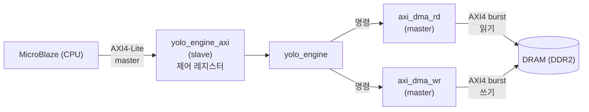

# 5장. AXI 버스 프로토콜 기초

> [← 4장 RTL 타이밍 기초](04_rtl_timing_basics.md) · [목차](README.md) · 다음 장: [6장 YOLO 객체 탐지 기초 →](06_yolo_basics.md)
> **Part 0 기초 개념** — 사전 지식: [4장](04_rtl_timing_basics.md)의 valid/ready 개념.

---

가속기는 외부 DRAM에서 가중치·입력을 읽고 결과를 써야 하고, MicroBlaze(CPU)로부터 "시작" 명령을 받아야 합니다. 이 데이터·명령이 오가는 **통로(버스)** 의 약속이 **AXI**입니다. 이 장을 읽으면 [17장 AXI/DMA](17_rtl_axi_dma.md)의 수많은 `M_AR*`, `M_W*` 신호가 무엇인지 알게 됩니다.

---

## 5.1 버스란 무엇인가

여러 하드웨어 블록이 데이터를 주고받으려면 **공통의 약속(프로토콜)** 이 필요합니다. 이 약속을 따르는 신호선 묶음이 **버스(bus)** 입니다. **AXI(Advanced eXtensible Interface)** 는 ARM이 만든 표준 버스로, Xilinx FPGA에서 가장 널리 쓰입니다.

💡 **비유**: AXI는 "택배 시스템의 표준 규약"입니다. 보내는 사람·받는 사람·주소·물건을 어떤 양식으로 주고받을지 정해두면, 서로 다른 회사(블록)끼리도 문제없이 거래할 수 있습니다.

---

## 5.2 Master와 Slave

AXI에는 두 역할이 있습니다.

- **Master(주인)**: 거래를 **시작**하는 쪽. "이 주소에서 읽어줘", "이 데이터를 저기 써줘"라고 요청.
- **Slave(하인)**: 요청에 **응답**하는 쪽.

> 🔑 이 프로젝트에서:
> - `yolo_engine`은 DRAM에 대해 **master**입니다(읽기·쓰기를 직접 요청) → [axi_dma_rd/wr](17_rtl_axi_dma.md).
> - `yolo_engine`은 MicroBlaze(CPU)에 대해 **slave**입니다(CPU가 제어 레지스터를 읽고 씀) → [yolo_engine_axi](17_rtl_axi_dma.md).
> 즉 같은 모듈이 한쪽에선 주인, 다른 쪽에선 하인입니다.

---

## 5.3 Handshake — valid와 ready의 악수

AXI의 가장 기본 동작은 **valid/ready 핸드셰이크**입니다. 보내는 쪽이 `valid`(준비됐어)를 올리고, 받는 쪽이 `ready`(받을게)를 올립니다. **둘 다 1인 클럭에 전송이 성립**합니다.

```
클럭:    0    1    2    3
valid:   0    1    1    0      (보내는 쪽: 클럭 1~2에 데이터 준비)
ready:   0    0    1    0      (받는 쪽: 클럭 2에 받을 준비)
전송:    -    -    ●    -      ← 클럭 2 (둘 다 1)에 전송 성립
```

💡 **비유**: 물건을 건네줄 때 "줄게(valid)"와 "받을게(ready)"가 동시에 맞아야 손이 오갑니다. 한쪽만 준비되면 기다립니다. 이 방식의 장점은 **빠른 쪽이 느린 쪽을 기다려줘서** 데이터 유실이 없다는 것입니다.

> 🔑 [17장](17_rtl_axi_dma.md)의 `M_ARVALID`/`M_ARREADY`, `M_WVALID`/`M_WREADY` 등이 모두 이 핸드셰이크 쌍입니다. 코드에서 `if (M_ARVALID && M_ARREADY)` 같은 조건이 "전송 성립"을 뜻합니다.

---

## 5.4 AXI4-Lite — 간단한 제어용

AXI에는 여러 변종이 있는데, 가장 단순한 것이 **AXI4-Lite**입니다. 한 번에 한 워드(32비트)만 읽거나 씁니다. 레지스터 몇 개를 제어할 때 씁니다.

> 🔑 이 프로젝트에서 MicroBlaze는 AXI4-Lite로 `yolo_engine`의 **제어 레지스터 4개**를 씁니다([17장 yolo_engine_axi](17_rtl_axi_dma.md)):
> - `ctrl_reg0`: 시작 신호(`ap_start`)와 완료 신호(`network_done`)
> - `ctrl_reg1/2/3`: 가중치·입력·출력의 DRAM 주소

```
CPU가 하는 일 (AXI4-Lite):
  ctrl_reg1 ← 가중치 주소
  ctrl_reg2 ← 입력 주소
  ctrl_reg3 ← 출력 주소
  ctrl_reg0 ← 1 (시작!)
  ... 기다림 ...
  ctrl_reg0 읽기 → bit1이 1이면 완료
```

AXI4-Lite는 채널이 5개입니다: 쓰기 주소(AW), 쓰기 데이터(W), 쓰기 응답(B), 읽기 주소(AR), 읽기 데이터(R). 각각 valid/ready 핸드셰이크를 씁니다.

---

## 5.5 AXI4 (Full) — 대량 데이터용 burst

큰 데이터(특징맵 수만 개)를 한 워드씩 주고받으면 너무 느립니다. 그래서 **AXI4 Full**은 **burst(연속 전송)** 를 지원합니다: "이 주소부터 256개 연속으로 줘"라고 한 번 요청하면, 데이터가 줄줄이 나옵니다.

```
한 워드씩 (느림):  [주소][데이터] [주소][데이터] [주소][데이터] ...
burst (빠름):      [주소+길이256] [데이터][데이터]...[데이터×256]
                    ↑ 주소 한 번 + 데이터 256개 연속
```

> 🔑 이 프로젝트의 [DMA](17_rtl_axi_dma.md)는 **256워드(=1KB) burst** 단위로 DRAM을 읽고 씁니다. 주소를 매번 보내는 오버헤드를 줄여 대역폭을 높입니다. burst 길이는 `M_ARLEN`(읽기)·`M_AWLEN`(쓰기)으로 지정하고, 마지막 워드에 `M_RLAST`/`M_WLAST` 신호가 붙습니다.

💡 **비유**: 택배를 한 개씩 주문하면 매번 주소를 적어야 하지만, "이 주소로 256개 한꺼번에"라고 하면 주소는 한 번만 적고 물건이 줄줄이 옵니다.

---

## 5.6 DMA — CPU 없이 메모리를 옮기기

**DMA(Direct Memory Access)** 는 CPU를 거치지 않고 하드웨어가 직접 메모리를 읽고 쓰는 것입니다. CPU가 일일이 옮기면 느리고 바쁘니, 전용 회로(DMA 엔진)가 알아서 옮깁니다.

> 🔑 이 프로젝트의 `axi_dma_rd`/`axi_dma_wr`이 DMA 엔진입니다([17장](17_rtl_axi_dma.md)). `yolo_engine` FSM이 "이 주소에서 N워드 읽어"(`start_dma`, `start_addr`, `num_trans`)라고 시키면, DMA가 AXI burst로 DRAM을 읽어 내부 버퍼에 채웁니다. 다 끝나면 `done_o`로 알립니다.

```
yolo_engine FSM:  "DRAM 0x1000에서 768워드 읽어와!" (start_dma)
       ↓
axi_dma_rd:       AXI burst로 DRAM 접근 → 데이터를 line buffer에 채움
       ↓
       "다 됐어" (done_o) → FSM이 다음 단계로
```

---

## 5.7 이 프로젝트의 AXI 사용 정리



| 연결 | 프로토콜 | yolo_engine 역할 | 용도 |
|------|----------|------------------|------|
| CPU ↔ yolo_engine | AXI4-Lite | **slave** | 시작 명령·주소 설정·완료 확인 |
| yolo_engine ↔ DRAM | AXI4 (burst) | **master** | 가중치·입력 읽기, 출력 쓰기 |

이 두 인터페이스가 [17장](17_rtl_axi_dma.md)의 세 모듈(`yolo_engine_axi`, `axi_dma_rd`, `axi_dma_wr`)로 구현됩니다.

---

## 5.8 이 장의 요약

- AXI는 ARM 표준 버스 프로토콜. master(요청)와 slave(응답)로 역할이 나뉨.
- 기본 동작은 **valid/ready 핸드셰이크**: 둘 다 1인 클럭에 전송 성립(데이터 유실 없음).
- **AXI4-Lite**는 한 워드씩 주고받는 간단한 제어용(이 프로젝트의 제어 레지스터 4개).
- **AXI4 Full**은 **burst**(256워드 연속 전송)로 대량 데이터를 효율적으로(이 프로젝트의 DMA).
- **DMA**는 CPU 없이 하드웨어가 직접 메모리를 옮기는 것. `axi_dma_rd/wr`이 담당.
- yolo_engine은 CPU에 slave, DRAM에 master로 동시에 동작.

다음 장에서는 이 가속기가 최종적으로 풀려는 문제 — **YOLO 객체 탐지**의 기초를 배웁니다.

---

> [← 4장 RTL 타이밍 기초](04_rtl_timing_basics.md) · [목차](README.md) · 다음 장: [6장 YOLO 객체 탐지 기초 →](06_yolo_basics.md)
