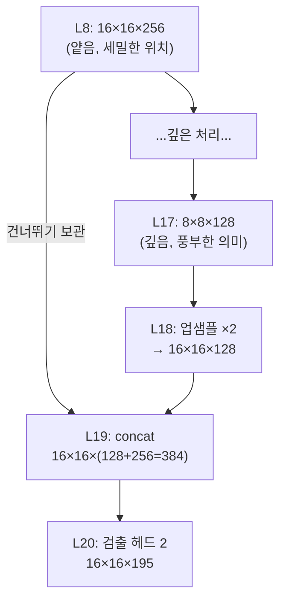

# 6장. YOLO 객체 탐지 기초

> [← 5장 AXI 기초](05_axi_basics.md) · [목차](README.md) · 다음 장: [7장 프로젝트 개요 →](07_project_overview.md)
> **Part 0 기초 개념** — 사전 지식: [1장](01_cnn_basics.md)의 CNN.

---

이 가속기가 최종적으로 푸는 문제는 **객체 탐지(object detection)** 입니다. "사진 안에 무엇이, 어디에 있는가"를 찾는 것이죠. 이 장은 YOLO 방식의 탐지 원리를 설명하고, 왜 출력 채널이 195개인지, 왜 L18에서 업샘플하고 L8과 합치는지를 풀어줍니다. 이것을 알아야 [10장 네트워크 구조](10_network_architecture.md)의 뒷부분(검출 헤드·Route)이 이해됩니다.

---

## 6.1 객체 탐지란 — 분류와의 차이

| | 이미지 분류 (classification) | 객체 탐지 (detection) |
|---|------------------------------|------------------------|
| 질문 | "이 사진은 무엇인가?" | "무엇이, **어디에** 있는가?" |
| 출력 | 클래스 한 개 (예: "고양이") | 여러 개의 (박스 + 클래스) |
| 예 | "고양이 사진" | "(120,80)~(200,160)에 고양이, (10,10)~(50,90)에 개" |

탐지는 분류보다 어렵습니다. **위치(박스)** 까지 찾아야 하기 때문입니다. YOLO("You Only Look Once")는 이를 한 번의 신경망 통과로 빠르게 해냅니다.

---

## 6.2 Grid 기반 탐지 — 이미지를 격자로

YOLO의 핵심 아이디어: 이미지를 **격자(grid)** 로 나누고, **각 격자 칸이 그 위치의 객체를 책임지고 예측**하게 합니다.

```
입력 이미지를 8×8 격자로 (이 네트워크 검출 헤드 1)

┌──┬──┬──┬──┬──┬──┬──┬──┐
├──┼──┼──┼──┼──┼──┼──┼──┤
├──┼──┼──┼──┼──┼──┼──┤      각 칸: "내 위치에 객체가 있나?
├──┼──┼──██━━━━┼──┼──┤              있다면 어떤 박스? 무슨 클래스?"
├──┼──┼──┃고양이┃──┼──┤
├──┼──┼──┗━━━━┛──┼──┤
├──┼──┼──┼──┼──┼──┼──┤
└──┴──┴──┴──┴──┴──┴──┘
```

신경망의 마지막 특징맵의 **공간 크기가 곧 격자 크기**입니다. 이 네트워크는 8×8(검출 헤드 1, L14)과 16×16(검출 헤드 2, L20) 두 격자를 씁니다.

---

## 6.3 Anchor Box — 박스 모양의 후보

객체는 모양이 다양합니다(가로로 긴 차, 세로로 긴 사람). 각 격자 칸이 아무 박스나 예측하면 학습이 어렵습니다. 그래서 미리 **여러 모양의 기준 박스(anchor)** 를 정해두고, 신경망은 "이 anchor를 얼마나 조정할지"만 예측합니다.

```
미리 정한 anchor 모양들 (cfg의 anchors):
  ▭ (가로로 긴 것)    ▯ (세로로 긴 것)    ■ (정사각형) ...

신경망: "2번 anchor를 약간 키우고 오른쪽으로 옮겨" → 실제 박스
```

이 네트워크는 anchor가 6개 있고, 검출 헤드마다 **3개씩** 나눠 씁니다(`mask`로 지정). 그래서 **헤드당 anchor 3개**입니다.

---

## 6.4 한 예측에 담기는 정보

격자 칸 하나가 anchor 하나에 대해 예측하는 값은 다음과 같습니다.

| 정보 | 개수 | 의미 |
|------|------|------|
| 박스 좌표 | 4 | tx, ty(중심 위치 보정), tw, th(크기 보정) |
| objectness | 1 | "여기에 진짜 객체가 있을 확률" |
| 클래스 확률 | 60 | 60개 클래스 각각의 확률 |
| **합** | **65** | (= 5 + 60) |

즉 anchor 하나당 **65개 숫자**(5 + 클래스 60)를 예측합니다.

---

## 6.5 출력 채널 195의 정체

이제 [10장](10_network_architecture.md)에서 보게 될 "출력 195채널"이 어디서 나오는지 계산할 수 있습니다.

```
출력 채널 = (헤드당 anchor 수) × (5 + 클래스 수)
         = 3 × (5 + 60)
         = 3 × 65
         = 195
```

> 🔑 그래서 L14·L20의 출력 채널이 **195**입니다. 격자 칸 하나(채널 방향으로 195개 값)가 "3개 anchor × 각 (박스4 + objectness1 + 클래스60)"을 담습니다.

⚠️ **하드웨어 관점**: 195는 4의 배수가 아닙니다(195 = 48×4 + 3). 이 가속기는 데이터를 4개 단위로 묶어 처리하는데([12장](12_data_representation_memory_map.md)), 195는 딱 떨어지지 않아 마지막에 특별 취급이 필요합니다. 또 검출 헤드는 좌표·확률(음수 포함)을 출력해야 해서 **ReLU를 끄고**(`linear`) INT8 그대로 출력합니다([2장 2.8](02_quantization_basics.md), [14장](14_rtl_convolution_engine.md)).

---

## 6.6 2-Scale 탐지와 Skip Connection

이 네트워크는 검출 헤드를 **두 개**(8×8, 16×16) 둡니다. 왜일까요?

- **8×8 격자(저해상도)**: 칸이 커서 **큰 객체** 탐지에 유리.
- **16×16 격자(고해상도)**: 칸이 작아 **작은 객체** 탐지에 유리.

문제는, 신경망 깊은 곳(8×8)은 "의미 정보"는 풍부하지만 "세밀한 위치 정보"는 잃었다는 것입니다. 그래서 16×16 헤드를 만들 때, 깊은 특징(L17→업샘플)과 **얕은 곳의 세밀한 특징(L8)** 을 합칩니다. 이것이 **skip connection(건너뛰기 연결)** 입니다.



> 🔑 이래서 **L18 업샘플**(8×8 깊은 특징을 16×16으로 키움)과 **L19 concat**(키운 것 + 보관해둔 L8)이 필요합니다([1장 1.8](01_cnn_basics.md), [10장](10_network_architecture.md)). L8을 나중에 쓰려고 DRAM에 보존하는 이유가 이것입니다([12장](12_data_representation_memory_map.md)).

💡 **비유**: 멀리서 보면(8×8) 큰 윤곽은 알지만 디테일이 흐릿하고, 가까이 보면(L8의 16×16) 디테일은 보이지만 전체 맥락이 약합니다. 둘을 합치면 "전체 맥락 + 디테일"을 모두 가진 판단이 가능합니다.

---

## 6.7 NMS — 중복 박스 정리

신경망이 출력한 박스들은 보통 **같은 객체에 여러 박스가 겹쳐서** 나옵니다(이웃 격자 칸들이 같은 고양이를 예측). 이걸 정리하는 후처리가 **NMS(Non-Maximum Suppression, 비최대 억제)** 입니다.

```
NMS 전:  한 고양이에 박스 5개 겹침  🟦🟦🟦
NMS 후:  가장 확신 높은 박스 1개만 남김  🟦
```

방법: ① objectness가 가장 높은 박스를 고르고 ② 그것과 많이 겹치는 다른 박스들을 제거 ③ 반복. 이 과정은 정렬·비교가 많아 하드웨어보다 소프트웨어가 적합합니다.

---

## 6.8 하드웨어 vs 소프트웨어 분담

YOLO 추론 전체에서 무엇을 FPGA가 하고 무엇을 CPU가 하는지 정리하면:

| 단계 | 담당 | 이유 |
|------|------|------|
| 합성곱·풀링·업샘플 (L0~L20) | **FPGA(RTL)** | 규칙적·대량 연산 → 병렬 가속 효과 큼 |
| 검출 헤드 출력 (L14, L20 OFM) | FPGA | 합성곱이므로 |
| Sigmoid·Softmax (확률화) | **소프트웨어** | 비선형 함수, 출력 격자가 작아 빠름 |
| NMS (중복 제거) | **소프트웨어** | 정렬·분기 많음 |
| 좌표 디코딩·그리기 | **소프트웨어** | 불규칙 처리 |

> 🔑 그래서 cfg의 `[yolo]` 레이어(L15, L21)는 RTL에 없습니다([10장](10_network_architecture.md)). 가속기는 검출 헤드의 raw 출력(L14, L20 OFM)까지만 만들고, 그 다음은 소프트웨어(MicroBlaze + host.py)가 처리합니다([22장](22_appendix_future.md)).

---

## 6.9 이 장의 요약

- 객체 탐지는 "무엇이 **어디에** 있는가"를 찾는 것(분류보다 어려움).
- YOLO는 이미지를 격자로 나누고, 각 칸이 anchor를 조정해 박스를 예측.
- 한 예측 = 박스 4 + objectness 1 + 클래스 60 = **65**. anchor 3개 → 출력 채널 **195** (= 3×65).
- 검출 헤드는 ReLU 없이(`linear`) 음수 포함 raw 출력 → 하드웨어에서 특별 취급.
- **2-scale**(8×8 큰 객체, 16×16 작은 객체) + **skip connection**(L18 업샘플 + L8 concat)으로 정확도 향상 → L8 보존 이유.
- NMS·Sigmoid 등 후처리는 소프트웨어 담당(`[yolo]` 레이어는 RTL에 없음).

이것으로 **Part 0 기초 개념**을 마칩니다. 이제 [Part 1](07_project_overview.md)부터는 이 배경지식 위에서 실제 프로젝트와 RTL을 본격적으로 파고듭니다.

---

> [← 5장 AXI 기초](05_axi_basics.md) · [목차](README.md) · 다음 장: [7장 프로젝트 개요 →](07_project_overview.md)
