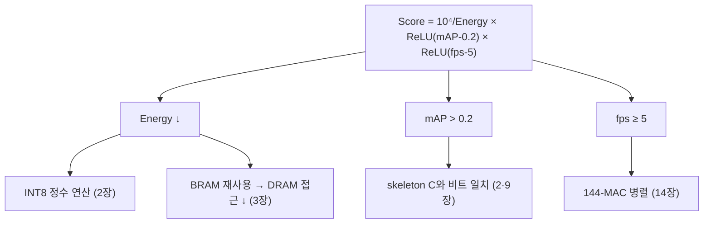
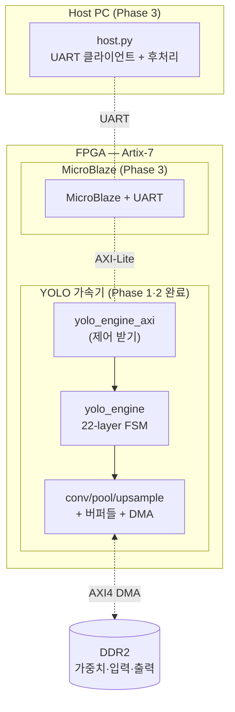
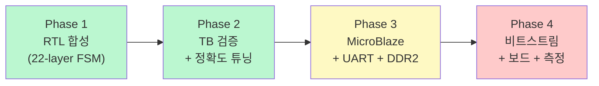

# 7장. 프로젝트 개요

> [← 6장 YOLO 기초](06_yolo_basics.md) · [목차](README.md) · 다음 장: [8장 개발 환경과 빌드 →](08_dev_environment.md)
> **이 장을 읽기 위한 준비**: [1장 CNN](01_cnn_basics.md), [6장 YOLO](06_yolo_basics.md)를 보면 더 잘 이해됩니다.

---

Part 0에서 배경 지식(CNN·양자화·FPGA·RTL·AXI·YOLO)을 익혔으니, 이제 이 프로젝트가 실제로 무엇을 만드는지 큰 그림을 그립니다. 이 장은 "전체 지도"이고, 이후 장들이 각 영역을 확대합니다.

---

## 7.1 이 프로젝트를 한 문장으로

> **22-layer YOLOv2 객체 탐지 신경망 전체를, Nexys A7-100T(Artix-7 XC7A100T) FPGA 한 장에서 추론하는 하드웨어 가속기 SoC.**

[1장](01_cnn_basics.md)에서 본 합성곱·풀링·업샘플과, [6장](06_yolo_basics.md)에서 본 YOLO 탐지 구조를, [3장](03_fpga_basics.md)의 FPGA 부품(DSP48·BRAM)으로 구현합니다. 학습은 PC에서 끝났고, FPGA는 **추론만** 합니다([1장 1.1](01_cnn_basics.md)).

처리 흐름을 거칠게 말하면:
1. 외부 DRAM에 양자화된 가중치와 입력 이미지가 들어 있음.
2. 가속기가 그것을 읽어 L0부터 L21까지 합성곱·풀링·업샘플을 순서대로 계산.
3. 두 검출 헤드(L14, L20)의 출력을 DRAM에 기록.
4. 소프트웨어가 그 출력을 후처리(Sigmoid·NMS)하여 "무엇이 어디에" 목록을 만듦.

---

## 7.2 목표와 점수 공식

이 프로젝트는 "동작하는" 가속기를 넘어 **점수를 최대화**하는 것이 목표입니다. 대회 점수는 다음과 같습니다.

```
Score = 10⁴ / Energy × ReLU(mAP − 0.2) × ReLU(fps − 5)
```

[1장](01_cnn_basics.md)에서 본 `ReLU`(음수면 0)가 여기 쓰입니다. 세 항을 풀어보면:

| 항 | 의미 | 함의 |
|----|------|------|
| `ReLU(fps − 5)` | 속도가 5 미만이면 **0점** | fps는 **통과 조건**이자, 넘으면 가산점 |
| `ReLU(mAP − 0.2)` | 정확도가 0.2 미만이면 **0점** | 양자화 오차가 이 선을 넘으면 안 됨 |
| `10⁴ / Energy` | 에너지가 **분모** | 적은 전력으로 끝낼수록 고득점 |

> 🔑 **이 공식이 모든 설계 결정의 뿌리입니다.** 왜 INT8 정수를 쓰고([2장](02_quantization_basics.md)), 왜 BRAM에 데이터를 재사용하고([3장 3.4](03_fpga_basics.md)), 왜 144개 MAC을 병렬로 돌리는지([14장](14_rtl_convolution_engine.md)) — 모두 "fps↑, mAP 유지, Energy↓"를 위한 것입니다.



---

## 7.3 타겟 하드웨어

[3장 3.8](03_fpga_basics.md)에서 본 FPGA가 이 프로젝트의 무대입니다.

| 항목 | 사양 | 한 줄 설명 |
|------|------|-----------|
| 보드 | Digilent Nexys A7-100T | 교육용 Artix-7 보드 |
| FPGA | Xilinx XC7A100T | DSP48 240개, BRAM ~135개 |
| 외부 메모리 | DDR2 (4 MB 사용) | 가중치·입력·출력 저장 |
| 통신 | UART (USB) | PC ↔ MicroBlaze |

DSP48은 여유롭고(240개 중 144개 사용), **BRAM 용량과 DDR2 대역폭**이 주요 제약입니다([3장 3.6](03_fpga_basics.md)). 이 제약이 "데이터를 잘게 나눠 흘려보내는(streaming)" 설계를 낳습니다([15·18장](18_operation_timing.md)).

---

## 7.4 시스템 큰 그림

전체 SoC를 가장 큰 단위로 그리면 이렇습니다. 점선 박스는 아직 통합 중인 Phase 3 부분입니다.



[5장 5.7](05_axi_basics.md)에서 본 AXI 연결이 여기 나타납니다: CPU는 AXI-Lite로 가속기를 제어하고, 가속기는 AXI4 DMA로 DRAM과 데이터를 주고받습니다.

---

## 7.5 하드웨어와 소프트웨어의 역할 분담

[6장 6.8](06_yolo_basics.md)에서 본 분담을 다시 정리합니다. **규칙적·대량 연산은 하드웨어, 불규칙·제어는 소프트웨어**입니다.

| 구분 | 담당 | 연산 |
|------|------|------|
| **하드웨어 (RTL)** | `yolo_engine` + 서브모듈 | 합성곱(3×3·1×1), bias·descaling, ReLU, 풀링(/2·/1), 업샘플, Route(주소 제어) |
| **소프트웨어** | MicroBlaze + host.py | 가속기 제어, DMA 트리거, L19 concat 배치, 후처리(Sigmoid·Softmax·NMS) |

❓ **왜 후처리는 소프트웨어?**: NMS는 정렬·비교·분기가 많아 하드웨어로 만들면 복잡하고 비효율적입니다. 게다가 검출 헤드 출력 격자가 작아서(8×8, 16×16) 소프트웨어로도 충분히 빠릅니다. "하드웨어가 잘하는 것(대량 곱셈)만 하드웨어로"가 원칙입니다.

---

## 7.6 4단계 개발 로드맵

프로젝트는 4단계로 진행되며, 현재 **Phase 1·2가 완료**되었습니다.



| Phase | 내용 | 상태 |
|-------|------|------|
| 1 | yolo_engine 단독 22-layer 자동 추론 RTL 합성 | ✅ 완료 |
| 2 | Testbench 검증 + shift 실측 (L0~L18 chain 0 mismatch) | ✅ 완료 |
| 3 | MicroBlaze + UART + DDR2 통합 | ⏳ 코드 완성 / 보드 통합 대기 |
| 4 | 비트스트림 + 보드 데모 + fps/mAP/전력 측정 | ⏳ 대기 |

> 본 해설서는 **Phase 2 완료(L0~L18 검증) 시점** 기준입니다. L19~L21과 보드 동작은 [22장 부록](22_appendix_future.md)에 정리되어 있고, 완료되면 본문으로 승격합니다.

---

## 7.7 핵심 설계 결정 미리 보기

이후 장에서 자세히 볼 설계 결정들을 한눈에 모았습니다. "왜?"가 궁금하면 해당 장으로 가십시오.

| 결정 | 이유 | 자세히 |
|------|------|--------|
| INT8 정수 연산 | 전력·메모리 절약(Energy↓) | [2장](02_quantization_basics.md) |
| 144-MAC 병렬 | 한 클럭에 4픽셀 동시 생성 | [14장](14_rtl_convolution_engine.md) |
| 가중치 streaming | 가중치가 BRAM보다 커서 필터별로 흘림 | [13·15장](15_rtl_memory_buffers.md) |
| 1×1 conv는 3×3 엔진 재사용 | 모듈 추가 없이 면적 절약 | [14장](14_rtl_convolution_engine.md) |
| L11 풀링 전용 모듈 | stride=1이라 일반 풀링과 다름 | [16장](16_rtl_special_units.md) |
| Route는 모듈 없이 주소 제어 | 연산이 아니라 데이터 재배치 | [13장](13_rtl_yolo_engine_top.md) |
| Vivado 2025로 검증 통일 | 시뮬레이터 X 처리 차이 회피 | [21장](21_vivado_project.md) |

---

## 7.8 이 장의 요약

- 22-layer YOLOv2를 Artix-7 FPGA에서 추론하는 가속기. 학습은 끝났고 추론만 함.
- 점수 `= 10⁴/Energy × ReLU(mAP−0.2) × ReLU(fps−5)` → fps·mAP는 통과 조건, Energy는 분모 → INT8·BRAM재사용·144-MAC의 뿌리.
- 규칙적 연산(conv/pool/upsample)은 하드웨어, 제어·후처리(NMS 등)는 소프트웨어.
- Phase 1·2(RTL+검증) 완료, Phase 3·4(보드) 대기. 본 문서는 L0~L18 기준.

다음 장에서는 이 시스템을 실제로 빌드·시뮬레이션하는 **개발 환경**을 봅니다.

---

> [← 6장 YOLO 기초](06_yolo_basics.md) · [목차](README.md) · 다음 장: [8장 개발 환경과 빌드 →](08_dev_environment.md)
