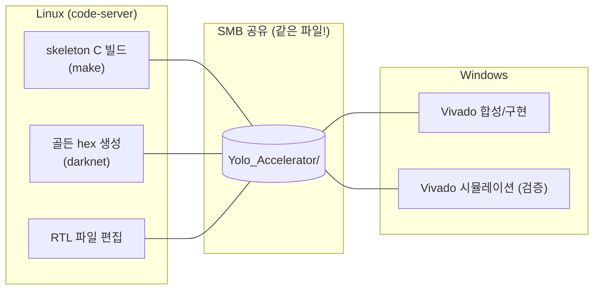

# 8장. 개발 환경과 빌드

> [← 7장 프로젝트 개요](07_project_overview.md) · [목차](README.md) · 다음 장: [9장 skeleton C 레퍼런스 →](09_skeleton_reference.md)
> **이 장을 읽기 위한 준비**: [3장 3.6 합성/시뮬](03_fpga_basics.md), [4장 4.7 X 초기화](04_rtl_timing_basics.md).

---

이 장은 프로젝트를 처음 받은 사람이 "무엇을 어디서 빌드하고 돌리는지" 막히지 않게 안내합니다. 이 프로젝트의 가장 독특한 점은 **두 개의 OS를 오가며 작업**한다는 것입니다. 왜 그런지부터 설명합니다.

---

## 8.1 왜 두 개의 환경인가

신경망 가속기 개발에는 성격이 다른 두 가지 작업이 있습니다.

1. **소프트웨어 작업**(C 컴파일, 골든 데이터 생성): 리눅스가 편함.
2. **FPGA 작업**(Vivado 합성·시뮬레이션): Vivado가 윈도우에서 잘 돌아감.

그래서 이 프로젝트는 **Linux(code-server)와 Windows(Vivado)** 두 환경을 같이 씁니다.



> 🔑 **핵심**: 두 환경은 **SMB 공유로 같은 파일을 봅니다.** Linux에서 RTL을 편집하면 Windows의 Vivado가 그대로 읽습니다. 따라서 RTL 편집은 Linux에서, 합성/시뮬은 Windows에서 합니다.

💡 **비유**: 한 폴더(Google Drive 같은)를 두 사람이 공유하는 것과 같습니다. 한 명(Linux)은 문서를 작성하고, 다른 명(Windows)은 그 문서를 출력합니다.

---

## 8.2 SMB 공유와 경로 차이

같은 파일이지만 OS마다 경로 표기가 다릅니다.

```
Linux:    /data/2026 CAU/AIX2026/git/Yolo_Accelerator/yolohw/src/yolo_engine.v
Windows:  Z:\2026 CAU\AIX2026\git\Yolo_Accelerator\yolohw\src\yolo_engine.v
```

⚠️ **경로 하드코딩 함정**: 일부 Testbench나 스크립트에 절대경로가 박혀 있을 수 있습니다. 이 프로젝트의 verify TB들은 이를 피하려고 **상대경로**(`../../../../../../testbench/...`)로 hex를 참조합니다([20장](20_testbench_per_layer.md)). Windows에서 `C:/yolohw/...` 하드코딩이 필요하면 정션(junction)을 만듭니다:

```cmd
mklink /J C:\yolohw "C:\AIX Project\yolohw"
```

---

## 8.3 프로젝트 디렉토리 구조

처음 보면 폴더가 많지만, 역할별로 묶으면 단순합니다.

```
Yolo_Accelerator/
├── README / ARCHITECTURE / CLAUDE / HISTORY .md   ← 프로젝트 문서
├── skeleton/          ← [소프트웨어] C 골든 레퍼런스 (9장)
│   ├── src/           darknet 소스
│   └── bin/           실행파일 + cfg/weights + 생성된 hex
├── documents/         ← 강의 PDF + 이 해설서(study_guide) + technical_reference
└── yolohw/            ← [하드웨어] 핵심
    ├── src/           ★ RTL 19개 .v 파일 (13~17장)
    ├── testbench/     ★ TB + 골든 hex 데이터 (19~20장)
    ├── sim/           시뮬레이션 출력 (자동 생성)
    ├── fpga/          Vivado 프로젝트 + IP 스크립트 (21장)
    └── firmware/      host.py (22장)
```

> 합성·시뮬 대상은 **`yolohw/src/`(RTL)와 `yolohw/testbench/`(TB)** 뿐입니다. 나머지는 데이터·문서·도구입니다.

---

## 8.4 skeleton C 레퍼런스 빌드 (Linux)

skeleton은 "정답"을 만드는 소프트웨어입니다([2장](02_quantization_basics.md)에서 본 양자화 추론을 수행, [9장](09_skeleton_reference.md)에서 코드 해설). 빌드는 간단합니다.

```bash
cd skeleton
make                    # 컴파일 → ./bin/darknet 실행파일 생성

cd bin/dataset
python make_list_cur.py # 테스트 이미지 경로 목록 갱신 (최초 1회)
```

`make`는 `src/`의 C 파일들을 컴파일해 `bin/darknet`을 만듭니다. 이 실행파일이 양자화 추론과 골든 hex 생성을 담당합니다.

---

## 8.5 골든 hex 파일 생성

검증에 쓸 "정답 데이터"를 만드는 단계입니다.

```bash
cd skeleton/bin

# 이미지 한 장 추론 + 파라미터/특징맵 hex 저장
./darknet detector test yolohw.names aix2024.cfg aix2024.weights \
  -thresh 0.24 test01.jpg -out_filename test01-det-quantized \
  -quantized -save_params
```

명령을 풀어보면:
- `detector test`: 탐지 모드.
- `aix2024.cfg`: 네트워크 구조([10장](10_network_architecture.md)).
- `aix2024.weights`: 학습된 가중치.
- `-quantized`: INT8 양자화 추론([2장](02_quantization_basics.md)).
- `-save_params`: 가중치·bias·scale을 hex로 저장 ← **검증용 핵심 플래그**.

**만들어지는 파일**:

| 위치 | 파일 | 내용 |
|------|------|------|
| `bin/log_param/` | `CONVnn_param_weight/biases/scales.hex` | 양자화 가중치·bias·시프트값 |
| `bin/log_feamap/` | `CONVnn_input/output.hex` | 각 레이어 입출력 특징맵 (검증 골든) |

이 hex들이 Testbench의 입력과 정답이 됩니다([19장](19_testbench_strategy.md)). `scales.hex`의 값이 [2장 2.6](02_quantization_basics.md)의 descaling shift를 결정합니다.

---

## 8.6 Vivado 합성 (Windows)

RTL을 실제 FPGA 회로로 만드는 단계입니다([3장 3.6](03_fpga_basics.md)). Vivado TCL 콘솔에서:

```tcl
cd yolohw/fpga
source create_project_25.tcl   # Vivado 2025 프로젝트 생성
source gen_bram_ips.tcl        # BRAM IP 생성

launch_runs synth_1 -jobs 4    # 합성
launch_runs impl_1 -to_step write_bitstream -jobs 4   # 구현 + 비트스트림
```

이때 **FPGA 매크로가 켜진 상태**여야 DSP48·BRAM IP가 실제 부품으로 합성됩니다(아래 [8.8](#88-fpga-매크로-가장-자주-하는-실수)). 상세는 [21장](21_vivado_project.md).

---

## 8.7 Vivado 시뮬레이션 (검증)

실제 칩에 올리기 전, RTL이 올바른지 PC에서 확인합니다([4장 4.7](04_rtl_timing_basics.md), [19장](19_testbench_strategy.md)). 이때는 **FPGA 매크로를 꺼서** behavioral 메모리 모델을 씁니다.

```tcl
# Testbench를 top으로 지정하고 시뮬레이션 실행
set_property top l18_verify_tb [get_filesets sim_1]
launch_simulation
```

⚠️ **`log_all_signals` 옵션은 끄세요.** 켜면 파형 파일(`.wdb`)이 수백 MB로 폭증해 디스크가 가득 찹니다([CLAUDE.md 규칙 6](../../CLAUDE.md)).

---

## 8.8 FPGA 매크로 — 가장 자주 하는 실수

[user_define_h.v](../../yolohw/src/user_define_h.v)의 `` `define FPGA `` 한 줄이 합성/시뮬을 가릅니다. 이것을 잘못 두면 바로 실패하므로 반드시 기억하세요.

| 매크로 상태 | 용도 | 메모리·곱셈기 |
|-------------|------|---------------|
| `` `define FPGA `` **켜짐** | 합성 | 실제 BRAM IP, DSP48 ([3장](03_fpga_basics.md)) |
| `` //`define FPGA `` **꺼짐(주석)** | 시뮬 | behavioral 모델 ([4장 4.7](04_rtl_timing_basics.md)) |

```verilog
`ifdef FPGA
    // 합성: 진짜 BRAM/DSP IP
`else
    // 시뮬: reg 배열 + $signed 곱셈 (initial로 0 초기화)
`endif
```

⚠️ **흔한 실수 두 가지**:
- 시뮬인데 매크로를 켜둠 → 존재하지 않는 IP를 찾다가 elaboration 실패.
- 합성인데 매크로를 꺼둠 → behavioral 메모리가 LUT로 합성되어 자원 낭비.

> 참고: 실제 프로젝트 스크립트는 파일의 `` `define `` 은 주석으로 두고, **합성할 때만 Vivado가 자동으로 매크로를 주입**하도록 되어 있어 파일 수정 없이 모드가 갈립니다([21장 15.2](21_vivado_project.md)).

---

## 8.9 검증은 Vivado 2025로

> 이것은 권장이 아니라 **검증 정확성의 전제**입니다.

[4장 4.7](04_rtl_timing_basics.md)에서 본 "uninitialized X" 때문에, 같은 RTL인데 Vivado 버전(2021 vs 2025)에 따라 검증 결과가 달라지는 문제가 있었습니다. 해결책은 ① 시뮬용 메모리를 0으로 초기화하고 ② **모든 검증을 Vivado 2025로 통일**하는 것입니다. 자세한 진단·해결 과정은 [21장](21_vivado_project.md)에서 다룹니다.

---

## 8.10 흔한 함정 체크리스트

| # | 함정 | 회피 |
|---|------|------|
| 1 | 시뮬인데 FPGA 매크로 켜둠 | 시뮬 전 주석 처리 |
| 2 | TB 경로가 Windows 절대경로 하드코딩 | 상대경로/정션 |
| 3 | `log_all_signals` ON → 디스크 폭증 | OFF |
| 4 | Vivado 2021로 chain 검증 → 비결정적 mismatch | 2025 사용 |
| 5 | SystemVerilog 구문(`fork` 등) | plain Verilog로 |
| 6 | bias를 zero-extend로 적재 | **sign-extend** ([2장 2.5](02_quantization_basics.md)) |

이 함정들은 [CLAUDE.md §4](../../CLAUDE.md)의 "치명적 에러 방지 규칙"에서 왔습니다. 한 번씩 당해본 실수들이니 미리 알아두면 시간을 아낍니다.

---

## 8.11 이 장의 요약

- **Linux(C 빌드·hex 생성·RTL 편집) + Windows(Vivado 합성·시뮬)** 두 환경을 SMB 공유로 같은 파일을 보며 사용.
- `make` → `darknet … -save_params`로 골든 hex(가중치·특징맵) 생성 → 검증 데이터.
- 합성은 FPGA 매크로 ON + `create_project_25.tcl`, 시뮬은 매크로 OFF.
- 검증은 **Vivado 2025**로 통일(X 처리 차이 회피), `log_all_signals` OFF.
- 6가지 함정(매크로·경로·디스크·버전·구문·sign-extend)을 미리 숙지.

다음 장에서는 골든 데이터를 만드는 **skeleton C 코드**를 직접 들여다봅니다.

---

> [← 7장 프로젝트 개요](07_project_overview.md) · [목차](README.md) · 다음 장: [9장 skeleton C 레퍼런스 →](09_skeleton_reference.md)
