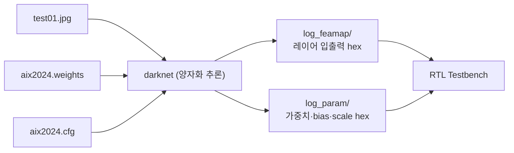
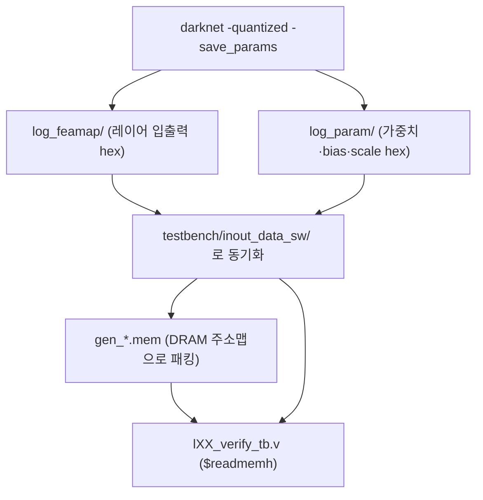

# 9장. skeleton C 골든 레퍼런스

> [← 8장 개발 환경](08_dev_environment.md) · [목차](README.md) · 다음 장: [10장 22-Layer 네트워크 구조 →](10_network_architecture.md)
> **이 장을 읽기 위한 준비**: [2장 양자화](02_quantization_basics.md) 전체. 이 장은 2장의 내용을 실제 C 코드로 확인합니다.

---

검증의 기준은 "RTL이 skeleton C와 같은 결과를 내는가"입니다([2장 2.10](02_quantization_basics.md)). 그러니 이 C 코드를 이해하는 것이 검증을 이해하는 출발점입니다. 이 장은 [2장](02_quantization_basics.md)에서 개념으로 배운 양자화 추론을 **실제 C 코드로 한 줄씩** 따라갑니다.

---

## 9.1 skeleton의 두 가지 역할

skeleton은 Darknet(YOLO 원저자의 C 프레임워크)을 변형한 것으로, 두 가지를 합니다.

1. **양자화 추론**: 입력을 INT8로 바꿔 22-layer를 정수로 계산 → FPGA가 흉내 낼 "정답".
2. **골든 hex 덤프**: 각 레이어 입출력과 양자화 파라미터를 hex 파일로 저장 → Testbench가 읽음.



핵심 파일은 **[yolov2_forward_network_quantized.c](../../skeleton/src/yolov2_forward_network_quantized.c)**(정수 추론 + 덤프)와 **[additionally.c](../../skeleton/src/additionally.c)**(양자화 계수 + 파라미터 저장)입니다.

---

## 9.2 핵심 함수 — forward_convolutional_layer_q()

한 합성곱 레이어의 정수 추론 전체가 이 함수에 있습니다. [2장 2.9](02_quantization_basics.md)의 흐름도와 **단계마다 1:1로** 대응하니, 비교하며 읽으세요.

### 🔍 코드 해설 ① — 입력 양자화

```c
state.input_uint8 = (int8_t*)calloc(l.inputs, sizeof(uint8_t));
for (z = 0; z < l.inputs; ++z) {
    int16_t src = state.input[z] * l.input_quant_multiplier;   // 실수 × scale
    state.input_uint8[z] = max_abs(src, MAX_VAL_UINT_8);       // 0~255로 클립
}
```

- `state.input[z]`: 실수 입력값(이전 레이어의 출력).
- `× l.input_quant_multiplier`: [2장 2.3](02_quantization_basics.md)의 input scale(L0=128, 나머지=8)을 곱함.
- `max_abs(src, 255)`: 0~255 범위로 클립([2장 2.2](02_quantization_basics.md)). 이것이 UINT8 입력.

### 🔍 코드 해설 ② — im2col + GEMM (MAC의 본체)

```c
im2col_cpu_int8(state.input_uint8, l.c, l.h, l.w, l.size, l.stride, l.pad, b);
// ...
gemm_nn_int8_int32(1, n, k, 1, a + t*k, k, b, n, c + t*n, n);
```

- `im2col`: 합성곱을 행렬 곱셈으로 바꾸기 위해, 각 출력 위치가 보는 입력 윈도우를 **한 줄로 펼칩니다**([1장 1.3](01_cnn_basics.md)의 3×3 윈도우를 1차원으로). 소프트웨어의 흔한 기법입니다.
- `gemm_nn_int8_int32`: 펼친 입력과 가중치를 곱해 더하는 행렬 곱셈(General Matrix Multiply). 이름 그대로 **INT8 × INT8 → INT32 누적**입니다([2장 2.4](02_quantization_basics.md)).

> ⚠️ **하드웨어와의 차이**: 소프트웨어는 im2col로 메모리에 펼치지만, FPGA는 메모리가 비싸서 **라인 버퍼**가 윈도우를 즉석에서 만듭니다([15장](15_rtl_memory_buffers.md)). 결과(MAC 누적)는 같습니다.

`gemm` 내부를 보면 누적이 INT32인 이유가 드러납니다:

```c
int32_t *c_tmp = calloc(N, sizeof(int32_t));   // INT32 누적기
register int16_t A_PART = ALPHA*A[i*lda + k];  // 가중치 (INT16 여유)
c_tmp[j] += A_PART*B[k*ldb + j];               // 곱 누적 → INT32
```

곱셈 하나는 작지만, 수천 개를 더하면 넘치므로 INT32에 모읍니다([2장 2.4](02_quantization_basics.md)).

### 🔍 코드 해설 ③ — bias, ReLU, descaling

```c
// bias 덧셈
output_q[fil*out_size + j] = output_q[...] + l.biases_quant[fil];

// ReLU (활성화가 RELU일 때만)
if (l.activation == RELU)
    output_q[i] = (output_q[i] > 0) ? output_q[i] : 0;

// descaling (부동소수점으로 복원)
float ALPHA1 = 1 / (l.input_quant_multiplier * l.weights_quant_multiplier);
l.output[i] = output_q[i] * ALPHA1;
```

- bias를 더하고([2장 2.5](02_quantization_basics.md)), ReLU로 음수를 0으로([2장 2.7→ 1장 1.6](01_cnn_basics.md)).
- **descaling**: C는 `input_scale × weight_scale`로 나눠서 **부동소수점으로 복원**합니다.

> 🔑 **여기가 C와 RTL의 가장 큰 표현 차이입니다.** C는 float으로 복원했다가 다음 레이어에서 다시 정수화합니다. RTL은 float이 없으므로 이 "복원 후 재양자화"를 **하나의 시프트**로 합칩니다([2장 2.6](02_quantization_basics.md)). 그 시프트량이 다음에 볼 `scale`입니다.

### 🔍 코드 해설 ④ — 골든 덤프 (NCHW 순서)

```c
// 출력 특징맵을 hex로 저장
for (int chn = 0; chn < l.n; chn++) {          // 채널 바깥 루프
    for (int idx = 0; idx < out_size; idx++) { // 한 채널 안의 픽셀
        int16_t src = l.output[i] * next_input_quant_multiplier;  // 다음 레이어 scale로 재양자화
        uint8_t pixel = max_abs(src, MAX_VAL_UINT_8);
        fprintf(fp, "%02x\n", pixel);          // 1바이트씩 기록
    }
}
```

- **채널마다 한 특징맵 전체(H×W)를 쭉 쓰고** 다음 채널로 → 이것이 "NCHW byte order"([12장](12_data_representation_memory_map.md)).
- `× next_input_quant_multiplier`: 이 레이어 출력을 **다음 레이어 입력 scale로 재양자화**해서 저장 → 그래서 한 레이어의 `output.hex`가 그대로 다음 레이어의 `input.hex`가 됩니다.

⚠️ **검출 헤드 예외**: L14·L20은 `activation=linear`라 ReLU를 건너뛰고, 다음 conv가 없어 `next_input_quant_multiplier=1`이 됩니다. 그래서 INT8 raw 출력입니다([6장 6.5](06_yolo_basics.md)).

---

## 9.3 양자화 계수 — do_quantization()

[2장 2.3](02_quantization_basics.md)의 multiplier 표가 어디서 오는지 코드로 확인합니다.

```c
float weight_quant_multiplier[11] = { 16, 64, 64, 64, 64, 64, 64, 64, 64, 64, 64 };
float input_quant_multiplier [11] = { 128, 8, 8, 8, 8, 8, 8, 8, 8, 8, 8 };
```

- 11개 conv 레이어 각각의 scale. L0만 input 128/weight 16, 나머지는 input 8/weight 64.

```c
// 가중치 양자화
float w = l->weights[...] * l->weights_quant_multiplier;  // 실수 × scale
l->weights_int8[...] = max_abs(w, MAX_VAL_8);             // -128~127 클립

// bias 양자화 — 두 scale의 곱으로
float biases_multiplier = (l->weights_quant_multiplier * l->input_quant_multiplier);
l->biases_quant[fil] = max_abs(b, MAX_VAL_16);            // INT16 클립
```

bias가 `weight_scale × input_scale`로 커지는 이유는 [2장 2.5](02_quantization_basics.md)에서 설명했습니다 — MAC 결과와 스케일을 맞추기 위함입니다.

---

## 9.4 scale → RTL shift — save_quantized_model()

이 함수가 만드는 `scale` 값이 **RTL의 descaling shift를 직접 결정**합니다([2장 2.6](02_quantization_basics.md)).

### 🔍 코드 해설 — scale 계산

```c
int scale = (l->input_quant_multiplier * l->weights_quant_multiplier)
            / next_input_quant_multiplier;
fprintf(fp_s, "%04x\n", (uint16_t) scale);
```

- `input_scale × weight_scale`: MAC+bias 결과가 부풀어 있는 배율.
- `/ next_input_quant_multiplier`: 다음 레이어 입력 scale로 되돌리기 위한 나눗셈.
- 이 `scale`이 **2의 거듭제곱**이라, RTL은 `log₂(scale)`만큼 시프트하면 됩니다.

직접 계산해보면([2장 2.6](02_quantization_basics.md)):

| 레이어 | input × weight / next | scale | RTL shift = log₂ |
|--------|------------------------|-------|------------------|
| L0 | 128×16/8 | 256 | **8** |
| L2~L13, L17 | 8×64/8 | 64 | **6** |
| L14 | 8×64/8 (다음 conv = L17) | 64 | **6** |
| L20 | 8×64/1 (다음 conv 없음) | 512 | **9** |

> 🔑 이 shift 값들이 [13장](13_rtl_yolo_engine_top.md)의 `L0_SHIFT=8`, `L2_SHIFT=6` 같은 RTL 파라미터입니다. Phase 2에서 이 `scales.hex`를 실측해 RTL에 반영했습니다.

가중치·bias도 같은 함수에서 저장합니다.

```c
fprintf(fp_w, "%02x\n", (uint8_t) l->weights_int8[w_index]);  // INT8 가중치, 1바이트
fprintf(fp_b, "%04x\n", (uint16_t) l->biases_quant[f]);       // INT16 bias, 2바이트
```

---

## 9.5 골든 데이터 워크플로우

skeleton 출력이 Testbench에 도달하는 전체 경로입니다.



- `gen_wgt_dram.mem`, `gen_bias_dram.mem`, `gen_ifm_dram.mem`: DRAM에 적재할 형태로 패킹된 입력.
- `log_feamap/CONVnn_output.hex`: 비교용 정답(골든).

TB는 `.mem`을 DRAM 모델에 넣고 RTL을 돌린 뒤, 결과를 `output.hex`와 대조합니다([19장](19_testbench_strategy.md)).

---

## 9.6 이 장의 요약

- skeleton C(특히 `yolov2_forward_network_quantized.c`)는 RTL이 따라야 할 **정수 추론 골든**.
- `forward_convolutional_layer_q()`는 [2장](02_quantization_basics.md)의 흐름을 코드로 구현: 입력양자화 → im2col → INT32 GEMM → bias → ReLU → descaling → NCHW 덤프.
- `do_quantization()`이 레이어별 scale을, `save_quantized_model()`이 `scale = input×weight/next`를 계산 → 이것이 **RTL shift**(L0=8, 대부분=6, 헤드=9).
- 출력은 다음 레이어 scale로 재양자화되어 저장 → 레이어 간 자연 연결.
- 이 hex들이 `inout_data_sw/`로 동기화되어 Testbench의 입력·정답이 됨.

다음 장에서는 이 코드가 정의하는 **22-layer 네트워크의 구조**를 봅니다.

---

> [← 8장 개발 환경](08_dev_environment.md) · [목차](README.md) · 다음 장: [10장 22-Layer 네트워크 구조 →](10_network_architecture.md)
