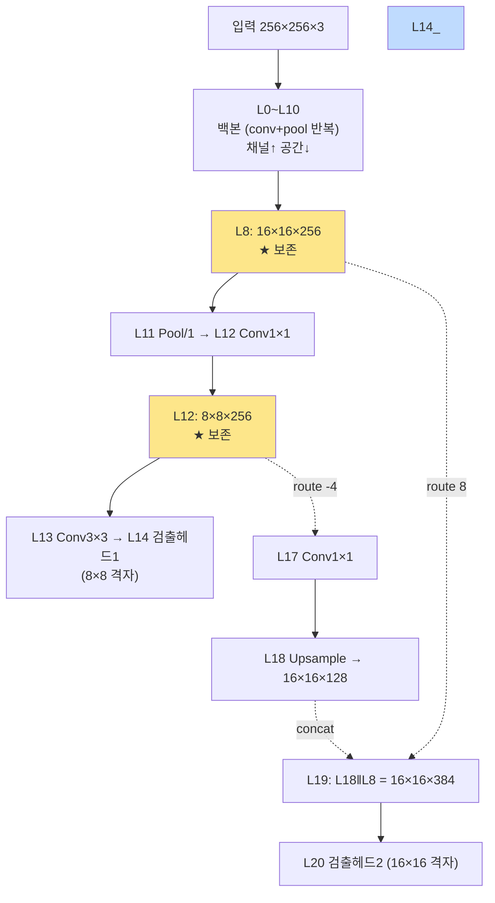

# 10장. 22-Layer 네트워크 구조

> [← 9장 skeleton C 레퍼런스](09_skeleton_reference.md) · [목차](README.md) · 다음 장: [11장 하드웨어 아키텍처 개요 →](11_hardware_overview.md)
> **이 장을 읽기 위한 준비**: [1장 CNN](01_cnn_basics.md), [6장 YOLO](06_yolo_basics.md).

---

이 장은 가속기가 추론하는 신경망의 "지도"를 그립니다. 어떤 레이어가 몇 번째에 있고, 무슨 일을 하며, 데이터가 어떻게 흐르는지를 [aix2024.cfg](../../skeleton/bin/aix2024.cfg) 파일에 근거해 봅니다. 이 지도가 머릿속에 있으면 [13장](13_rtl_yolo_engine_top.md)의 FSM이 "지금 몇 번 레이어를 처리 중"인지 따라갈 수 있습니다.

---

## 10.1 cfg 파일 읽는 법

Darknet은 네트워크 구조를 `.cfg` 텍스트 파일로 정의합니다. `[블록]` 하나가 레이어 하나이고, **파일에 적힌 순서가 곧 레이어 번호(layer_idx)** 입니다.

```ini
[convolutional]      ← 합성곱 레이어
batch_normalize=1    배치 정규화 사용
filters=16           출력 채널 16개
size=3               3×3 커널
stride=1             보폭 1
pad=1                패딩 1
activation=relu      ReLU 활성화

[maxpool]            ← 풀링 레이어
size=2
stride=2             2칸씩 (크기 절반)
```

[1장](01_cnn_basics.md)에서 배운 개념들(filters=출력채널, size=커널, stride=보폭, pad=패딩, activation=ReLU)이 그대로 적혀 있습니다.

> 💡 cfg를 위에서 아래로 읽으면 데이터가 신경망을 통과하는 순서입니다. 첫 블록이 L0, 다음이 L1, ... 식입니다. 주석 처리된 `#[convolutional]` 블록은 번호에서 빠집니다.

---

## 10.2 cfg를 레이어로 펼치기

[aix2024.cfg](../../skeleton/bin/aix2024.cfg)의 블록을 순서대로 레이어 번호와 맞추면:

```
[net] width=256 height=256 channels=3     → 입력 256×256×3

[convolutional] filters=16 size=3  → L0  Conv3×3, 출력 16채널
[maxpool] stride=2                 → L1  Pool/2 (크기 절반)
[convolutional] filters=32 size=3  → L2  Conv3×3, 32채널
[maxpool] stride=2                 → L3  Pool/2
[convolutional] filters=64 size=3  → L4  Conv3×3, 64채널
[maxpool] stride=2                 → L5  Pool/2
[convolutional] filters=128 size=3 → L6  Conv3×3, 128채널
[maxpool] stride=2                 → L7  Pool/2
[convolutional] filters=256 size=3 → L8  Conv3×3, 256채널 ★(나중에 재사용)
[maxpool] stride=2                 → L9  Pool/2
[convolutional] filters=512 size=3 → L10 Conv3×3, 512채널
[maxpool] stride=1                 → L11 Pool/1 ★(stride=1! 크기 유지)
[convolutional] filters=256 size=1 → L12 Conv1×1, 256채널 ★(나중에 재사용)
[convolutional] filters=512 size=3 → L13 Conv3×3, 512채널
[convolutional] filters=195 size=1 activation=linear → L14 검출 헤드 1
[yolo]                             → L15 (소프트웨어 후처리)
[route] layers=-4                  → L16 (L12를 가리킴: 16-4=12)
[convolutional] filters=128 size=1 → L17 Conv1×1, 128채널
[upsample] stride=2                → L18 Upsample×2 (크기 2배)
[route] layers=-1,8                → L19 (L18과 L8을 합침)
[convolutional] filters=195 size=1 activation=linear → L20 검출 헤드 2
[yolo]                             → L21 (소프트웨어 후처리)
```

> 🔑 **`[route]` 읽는 법**: `layers=-4`는 "4칸 뒤 레이어"(16−4=12)를 가리킵니다. `layers=-1,8`은 "직전(18)과 8번"을 합치라는 뜻입니다([6장 6.6 skip connection](06_yolo_basics.md)).

---

## 10.3 네트워크 토폴로지 (데이터 흐름)

위 레이어들의 연결을 그림으로 그리면 skip connection이 보입니다.



- **L0~L10**: 백본. 합성곱과 풀링을 번갈아 하며 채널을 늘리고 공간을 줄입니다(256² → 8²).
- **L8, L12**: 나중에 재사용되므로 DRAM에 보존합니다([6장 6.6](06_yolo_basics.md)).
- **두 검출 헤드**: L14(8×8, 큰 객체) + L20(16×16, 작은 객체).

---

## 10.4 레이어별 상세 표

각 레이어의 형상과 양자화 파라미터입니다. 형상은 stride·pad로 계산했고([1장 1.4](01_cnn_basics.md)), shift는 [9장 9.4](09_skeleton_reference.md)에서 구한 값입니다.

| idx | 연산 | 입력 H×W×C | 출력 H×W×C | 커널 | 활성화 | shift |
|-----|------|------------|------------|------|--------|-------|
| **L0** | Conv3×3 | 256×256×3 | 256×256×16 | 3/1/1 | relu | 8 |
| L1 | Pool/2 | 256×256×16 | 128×128×16 | 2/2 | - | - |
| **L2** | Conv3×3 | 128×128×16 | 128×128×32 | 3/1/1 | relu | 6 |
| L3 | Pool/2 | 128×128×32 | 64×64×32 | 2/2 | - | - |
| **L4** | Conv3×3 | 64×64×32 | 64×64×64 | 3/1/1 | relu | 6 |
| L5 | Pool/2 | 64×64×64 | 32×32×64 | 2/2 | - | - |
| **L6** | Conv3×3 | 32×32×64 | 32×32×128 | 3/1/1 | relu | 6 |
| L7 | Pool/2 | 32×32×128 | 16×16×128 | 2/2 | - | - |
| **L8** | Conv3×3 | 16×16×128 | 16×16×256 | 3/1/1 | relu | 6 |
| L9 | Pool/2 | 16×16×256 | 8×8×256 | 2/2 | - | - |
| **L10** | Conv3×3 | 8×8×256 | 8×8×512 | 3/1/1 | relu | 6 |
| **L11** | **Pool/1** | 8×8×512 | 8×8×512 | 2/**1** | - | - |
| **L12** | Conv1×1 | 8×8×512 | 8×8×256 | 1/1 | relu | 6 |
| **L13** | Conv3×3 | 8×8×256 | 8×8×512 | 3/1/1 | relu | 6 |
| **L14** | Conv1×1 | 8×8×512 | 8×8×195 | 1/1 | **linear** | 6 |
| L15 | YOLO | - | (검출) | - | - | - |
| L16 | Route(=L12) | - | 8×8×256 | - | - | - |
| **L17** | Conv1×1 | 8×8×256 | 8×8×128 | 1/1 | relu | 6 |
| **L18** | Upsample×2 | 8×8×128 | 16×16×128 | - | - | - |
| L19 | Route concat | - | 16×16×384 | - | - | - |
| **L20** | Conv1×1 | 16×16×384 | 16×16×195 | 1/1 | **linear** | 9 |
| L21 | YOLO | - | (검출) | - | - | - |

> ⚠️ **L11이 유일하게 stride=1 풀링**입니다. 크기가 안 줄고(8×8 유지) 윈도우가 겹쳐서, 일반 풀링과 동작이 달라 전용 하드웨어가 필요합니다([1장 1.7](01_cnn_basics.md), [16장](16_rtl_special_units.md)).

---

## 10.5 연산은 세 종류로 나뉜다

22개 레이어는 하드웨어 관점에서 세 부류입니다. 이 분류가 [11장](11_hardware_overview.md)의 모듈 배정을 결정합니다.

| 분류 | 레이어 | 하드웨어 |
|------|--------|----------|
| **합성곱** (3×3, 1×1) | L0,2,4,6,8,10,12,13,14,17,20 | `conv_top` + 144-MAC ([14장](14_rtl_convolution_engine.md)) |
| **형상 변환** (pool, upsample) | L1,3,5,7,9 (/2), L11 (/1), L18 (×2) | `max_pool_unit` / `_s1` / `upsample_unit` ([16장](16_rtl_special_units.md)) |
| **재배치** (route, yolo) | L15,16,19,21 | 연산 없음 (주소 제어 / 소프트웨어) |

합성곱이 11개로 가장 많고, 연산량의 대부분(88%)을 차지합니다.

---

## 10.6 출력 채널 195의 의미 (복습)

L14·L20의 195채널은 [6장 6.5](06_yolo_basics.md)에서 계산했습니다.

```
195 = 3 (헤드당 anchor) × 65 (= 5 박스·objectness + 60 클래스)
```

검출 헤드는 `activation=linear`라 ReLU 없이 음수 포함 INT8로 출력하고, 195가 4의 배수가 아니라 하드웨어에서 특별 취급합니다([12장](12_data_representation_memory_map.md), [14장](14_rtl_convolution_engine.md)).

---

## 10.7 연산량 — 어디에 시간이 쓰이나

각 합성곱의 곱셈(MAC) 횟수를 계산하면([1장 1.3](01_cnn_basics.md): `출력공간 × 출력채널 × k²×입력채널`):

| 레이어 | MAC | 비중 |
|--------|-----|------|
| L0 | 28.3 M | 5% |
| L2,4,6,8,10,13 (각) | 75.5 M | 각 15% |
| L12 | 8.4 M | 2% |
| L14 | 6.4 M | 1% |
| L17 | 2.1 M | 0.4% |
| L20 | 19.2 M | 4% |
| **합계** | **≈ 517 M** | 100% |

> 🔑 **흥미로운 균형**: L2·L4·L6·L8·L10·L13이 모두 75.5 M으로 같습니다. 공간을 절반으로 줄이면서 채널을 두 배로 늘리니, 합성곱 비용이 일정하게 유지되는 것입니다. 이 6개 레이어가 전체의 88%를 차지하므로, **이들을 빠르게 처리하는 것이 fps의 핵심**입니다([18장](18_operation_timing.md)).

메모리 관점에서는 **L0의 출력(256×256×16 = 1 MB)** 이 가장 큽니다. 그래서 큰 레이어는 온칩 버퍼(256 KB)에 한 번에 못 담고 잘게 나눠 처리합니다([15·18장](18_operation_timing.md)).

---

## 10.8 이 장의 요약

- cfg의 `[블록]` 순서가 곧 레이어 번호. 합성곱·풀링·route·yolo로 구성.
- 백본(L0~L10)이 채널↑·공간↓, 두 검출 헤드(L14 8×8, L20 16×16)가 큰/작은 객체 담당.
- L8·L12는 skip/route로 재사용되어 DRAM 보존. L11은 유일한 stride=1 풀링(전용 HW).
- 연산은 합성곱(11개, 88%) / 형상변환(pool·upsample) / 재배치(route·yolo)로 갈림.
- 출력 195 = 3 anchor × 65. 총 ≈517 M MAC, 6개 3×3 레이어(각 75.5 M)가 88%.

다음 장부터 본격적으로 하드웨어로 들어가, 이 레이어들을 처리하는 **모듈 구조**를 봅니다.

---

> [← 9장 skeleton C 레퍼런스](09_skeleton_reference.md) · [목차](README.md) · 다음 장: [11장 하드웨어 아키텍처 개요 →](11_hardware_overview.md)
