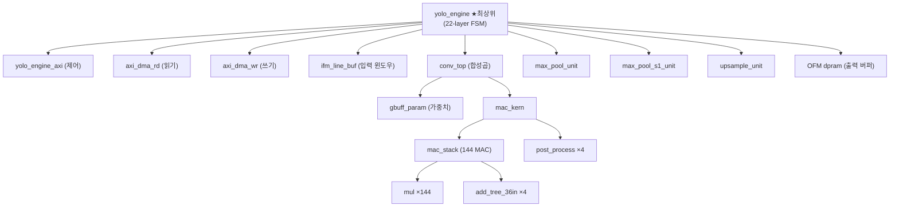
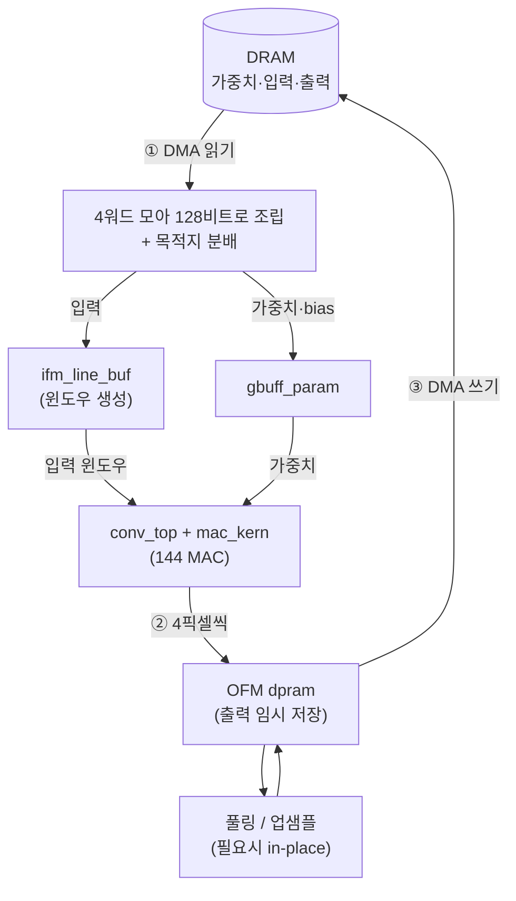

# 11장. 하드웨어 아키텍처 개요

> [← 10장 네트워크 구조](10_network_architecture.md) · [목차](README.md) · 다음 장: [12장 데이터 표현과 메모리 맵 →](12_data_representation_memory_map.md)
> **이 장을 읽기 위한 준비**: [3장 FPGA](03_fpga_basics.md), [1장 1.10 MAC](01_cnn_basics.md).

---

이제 RTL의 세계로 들어갑니다. 이 장은 "숲"을 봅니다 — 어떤 모듈들이 있고, 무엇이 무엇을 품고, 데이터가 어디로 흐르는지. 개별 모듈의 "나무"는 [13~17장](13_rtl_yolo_engine_top.md)에서 하나씩 봅니다. 먼저 전체 지도를 머리에 넣어야 길을 잃지 않습니다.

---

## 11.1 19개의 RTL 파일

합성·시뮬 대상은 [yolohw/src/](../../yolohw/src/)의 **19개 .v 파일**입니다. 역할별로 묶으면 외울 만합니다.

| 묶음 | 파일 | 한 줄 역할 | 자세히 |
|------|------|-----------|--------|
| **최상위** | `yolo_engine.v` | 22-layer를 지휘하는 거대 FSM | [13장](13_rtl_yolo_engine_top.md) |
| **연산 코어** | `conv_top.v` | 합성곱 한 호출을 제어 | [14장](14_rtl_convolution_engine.md) |
| | `mac_kern.v` | 144-MAC + 누적 + 후처리 | [14장](14_rtl_convolution_engine.md) |
| | `mac_stack.v` | 144개 곱셈 + 4개 가산트리 | [14장](14_rtl_convolution_engine.md) |
| | `mul.v` | INT8×INT8 곱셈기 | [14장](14_rtl_convolution_engine.md) |
| | `add_tree_36in.v` | 36입력 덧셈 트리 | [14장](14_rtl_convolution_engine.md) |
| | `post_process.v` | bias·ReLU·시프트·클립 | [14장](14_rtl_convolution_engine.md) |
| **메모리** | `ifm_line_buf.v` | 입력 윈도우 만들기 | [15장](15_rtl_memory_buffers.md) |
| | `gbuff_param.v` | 가중치·bias 저장 | [15장](15_rtl_memory_buffers.md) |
| | `dpram_wrapper.v` / `spram_wrapper.v` | BRAM 래퍼 | [15장](15_rtl_memory_buffers.md) |
| **특수 연산** | `max_pool_unit.v` / `_s1_unit.v` | 풀링 (/2, /1) | [16장](16_rtl_special_units.md) |
| | `upsample_unit.v` | 업샘플 ×2 | [16장](16_rtl_special_units.md) |
| **외부 통신** | `axi_dma_rd.v` / `axi_dma_wr.v` | DRAM 읽기/쓰기 DMA | [17장](17_rtl_axi_dma.md) |
| | `yolo_engine_axi.v` | CPU 제어 받기 | [17장](17_rtl_axi_dma.md) |
| **설정** | `user_define_h.v` / `define.v` | 매크로 | [17장](17_rtl_axi_dma.md) |

---

## 11.2 모듈은 어떻게 포개져 있나 (계층)

`yolo_engine`이 모든 것을 품고, 연산 코어는 인형 안의 인형처럼 4단으로 중첩됩니다.



> 🔑 **핵심**: 연산 유닛(`conv_top`, 풀링, 업샘플)은 **각각 딱 하나씩만** 존재합니다. `yolo_engine`이 22개 레이어를 돌며 같은 유닛을 **재사용**합니다. 매 레이어마다 다른 파라미터(크기·채널·shift)를 끼워주는 식입니다. 이것이 면적·전력을 아끼는 핵심입니다([3장 3.5](03_fpga_basics.md)).

💡 **비유**: 요리사(`conv_top`) 한 명이 22개 요리(레이어)를 순서대로 합니다. 요리마다 레시피(파라미터)만 바꿔서 같은 주방 도구를 씁니다. 주방을 22개 만들 필요가 없습니다.

---

## 11.3 데이터는 어떻게 흐르나

한 레이어를 처리할 때 데이터가 도는 경로입니다. DRAM ↔ 가속기 사이는 [5장](05_axi_basics.md)에서 배운 AXI DMA가 담당합니다.



순서를 말로 풀면:
1. **읽기**: DRAM에서 가중치·입력을 DMA로 읽어, 가중치는 `gbuff_param`에, 입력은 `ifm_line_buf`에 넣습니다.
2. **연산**: `mac_kern`이 144개 곱셈으로 한 클럭에 **4픽셀(2×2 블록)** 을 만들어 OFM 버퍼에 씁니다.
3. **형상 변환**: 풀링·업샘플 레이어는 이 OFM 버퍼를 직접 읽고 씁니다.
4. **쓰기**: 레이어가 끝나면 OFM 버퍼를 DRAM에 DMA로 기록합니다.

이 "읽기 → 연산 → 쓰기"가 22번 반복되면 추론 한 장이 끝납니다([18장](18_operation_timing.md)).

---

## 11.4 144-MAC — 가속의 심장 (미리 보기)

[1장 1.10](01_cnn_basics.md)에서 "합성곱은 MAC의 산"이라고 했습니다. 이 가속기는 그 MAC을 **144개 동시에** 합니다.

```
144 = 36 × 4
       │    └─ 4개 "공간 위치" (출력 2×2 블록의 네 칸)
       └─ 36개 곱셈 (= 4 입력채널 × 3×3 커널)
```

- **36개**: 한 출력점은 `3×3 × 입력채널`개 곱셈이 필요한데([1장 1.3](01_cnn_basics.md)), 입력채널 4개씩 묶어 한 번에 처리 → 4 × 9 = 36.
- **4벌**: 같은 가중치로 인접한 2×2 출력 위치 4개를 동시에 계산 → 한 클럭에 4픽셀.

```
한 클럭에:  입력 윈도우 ──→ [36 곱셈] ×4 위치 ──→ [덧셈 트리] ×4 ──→ 4픽셀
```

입력 채널이 4보다 많으면(거의 모든 레이어), 4개씩 나눠 여러 클럭에 걸쳐 누적합니다. 예를 들어 입력 채널 256개면 256/4 = 64번 누적. 자세한 동작과 코드는 [14장](14_rtl_convolution_engine.md)에서 한 줄씩 봅니다.

> 🔑 [10장 10.7](10_network_architecture.md)에서 본 총 517 M MAC을 144개씩 처리하면 이론상 약 360만 클럭입니다. 실제로는 DMA·제어 오버헤드가 더해집니다([18장](18_operation_timing.md)).

---

## 11.5 어느 레이어를 어느 모듈이 처리하나

[10장 10.5](10_network_architecture.md)의 분류를 모듈 관점으로 다시 보면:

| 모듈 (1개씩만 존재) | 처리 레이어 | 호출 횟수 |
|----------------------|-------------|-----------|
| `conv_top` (+ mac_kern 등) | L0,2,4,6,8,10,13 (3×3) · L12,14,17,20 (1×1) | 11 |
| `max_pool_unit` | L1,3,5,7,9 | 5 |
| `max_pool_s1_unit` | L11 | 1 |
| `upsample_unit` | L18 | 1 |
| (모듈 없음) | L15,16,19,21 (route/yolo) | — |

3×3과 1×1 합성곱은 **같은 `conv_top`** 을 씁니다. 차이는 입력을 모아주는 방식뿐입니다([14장 14.9](14_rtl_convolution_engine.md)).

---

## 11.6 온칩 메모리 — 무엇을 어디에 두나

[3장 3.4](03_fpga_basics.md)에서 본 BRAM을 세 용도로 씁니다.

| 버퍼 | 크기 | 용도 |
|------|------|------|
| 가중치 버퍼 (`gbuff_param`) | 36 KB + bias 10 KB | 현재 레이어의 가중치 |
| 입력 라인 버퍼 (`ifm_line_buf`) | 128비트 × 2048 × 4벌 (~1 MB) | 합성곱 윈도우용 입력 행들 |
| 출력 버퍼 (OFM dpram) | 32비트 × 65536 (256 KB) | 합성곱 출력 + 풀링/업샘플 작업장 |

전체 입력·출력·가중치는 너무 커서 DRAM에 두고([10장 10.7](10_network_architecture.md): L0 출력만 1 MB), **현재 처리 중인 부분만 BRAM에 올립니다.** DRAM 접근을 줄이는 것이 Energy 절약의 핵심이기 때문입니다([3장 3.4](03_fpga_basics.md), [7장 7.2](07_project_overview.md)). 정확한 비트 배치는 [12장](12_data_representation_memory_map.md)에서.

---

## 11.7 이 장의 요약

- 활성 RTL은 19개. `yolo_engine`이 모든 모듈을 품고 FSM으로 지휘.
- 연산 코어는 4단 중첩: `conv_top → mac_kern → mac_stack → (mul ×144 + add_tree ×4)` + `post_process`.
- 데이터 흐름: **DMA 읽기 → (라인버퍼·가중치버퍼) → 144-MAC → 출력버퍼 → DMA 쓰기**를 레이어마다 반복.
- 연산 유닛은 1개씩만 두고 22-layer에 재사용(파라미터 mux) → 면적·전력 절약.
- 144-MAC = 36(4채널×3×3) × 4(2×2 출력) → 한 클럭 4픽셀. 채널 4 초과는 누적.
- BRAM은 가중치·입력라인·출력 버퍼로 사용, 큰 데이터는 DRAM에 두고 일부만 올림.

다음 장에서는 이 데이터가 비트 단위로 어떻게 표현되고 메모리에 배치되는지 정밀하게 봅니다.

---

> [← 10장 네트워크 구조](10_network_architecture.md) · [목차](README.md) · 다음 장: [12장 데이터 표현과 메모리 맵 →](12_data_representation_memory_map.md)
