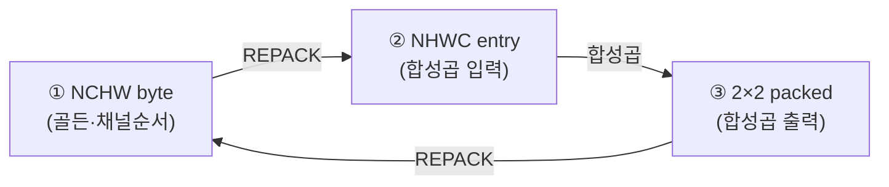

# 12장. 데이터 표현과 메모리 맵

> [← 11장 하드웨어 개요](11_hardware_overview.md) · [목차](README.md) · 다음 장: [13장 yolo_engine 최상위 FSM →](13_rtl_yolo_engine_top.md)
> **이 장을 읽기 위한 준비**: [2장 양자화](02_quantization_basics.md), [1장 1.2 특징맵](01_cnn_basics.md).

---

하드웨어 디버깅에서 mismatch가 났을 때 **가장 먼저 의심하는 것이 데이터 포맷**입니다. 비트 하나만 어긋나도 결과가 완전히 달라지기 때문입니다. 이 장은 가속기를 흐르는 데이터가 비트 단위로 어떻게 생겼고 메모리 어디에 놓이는지를 그림으로 설명합니다. 처음엔 지루해 보여도, [14~16장](14_rtl_convolution_engine.md) 코드를 읽을 때 계속 되돌아올 장입니다.

---

## 12.1 수 표현 — 비트폭이 단계마다 커진다

[2장](02_quantization_basics.md)에서 배운 양자화 수들이 하드웨어에서 갖는 비트폭입니다.

| 데이터 | 비트 | 부호 | 어디서 |
|--------|------|------|--------|
| 입력(활성) | 8 | (저장은 unsigned, 곱셈은 signed) | 라인 버퍼 |
| 가중치 | 8 | signed (INT8) | 가중치 버퍼 |
| 곱셈 결과 | 16 | signed | `mul` 출력 |
| 가산 트리 합 | 22 | signed | `add_tree` |
| 누적기 | 32 | signed | `mac_kern` |
| bias | 16→32 | signed (sign-extend) | `post_process` 입력 |
| 출력 픽셀 | 8 | UINT8 또는 INT8 | OFM |

> 🔑 [2장 2.4](02_quantization_basics.md)에서 설명한 "곱은 작지만 수천 개 더하면 넘친다"가 비트폭 증가로 나타납니다: 곱셈 16비트 → 가산 22비트 → 누적 32비트. 이 숫자들이 [14장](14_rtl_convolution_engine.md)의 `mul`(16) → `add_tree_36in`(22) → accumulator(32)에 그대로 있습니다.

⚠️ **입력의 부호 함정**: 입력은 0~255(UINT8)로 저장되지만 곱셈할 때는 **signed로** 다룹니다. 이걸 헷갈려서 Phase 2에 버그가 있었습니다([2장 2.3](02_quantization_basics.md), [14장](14_rtl_convolution_engine.md)).

---

## 12.2 특징맵의 세 가지 옷

같은 특징맵이 처리 단계에 따라 **세 가지 다른 포맷**으로 변신합니다. 이걸 이해하는 것이 이 장의 핵심입니다.



왜 세 가지나 필요할까요? 각 포맷이 다른 일에 편하기 때문입니다.

### ① NCHW byte order — 채널 순서로 죽 늘어놓기

skeleton이 골든을 저장하는 포맷([9장 9.2-④](09_skeleton_reference.md))이자, 풀링 출력의 포맷입니다.

```
주소 증가 →
[채널0의 모든 픽셀 H×W] [채널1의 모든 픽셀] ... [채널C-1의 모든 픽셀]
 └── 한 채널 통째로 ──┘
1 byte = 1 픽셀
```

채널 하나를 통째로 쓰고 다음 채널로. 단순하고 사람이 읽기 쉽습니다.

### ② NHWC 16-byte entry — 합성곱이 좋아하는 포맷

`ifm_line_buf`가 합성곱에 공급하는 포맷입니다. **128비트(16바이트) = 4개 열(col) × 4개 채널(ch)**.

```
한 entry (128비트 = 16바이트):
 byte 위치 = col×4 + ch     (col 0~3, ch 0~3)

  MSB                                              LSB
 [col3ch3][col3ch2]...[col0ch1][col0ch0]
   byte15   byte14  ...  byte1   byte0
```

❓ **왜 이렇게 섞나?**: 합성곱은 한 클럭에 "여러 채널 × 여러 위치"를 동시에 곱해야 합니다([11장 11.4](11_hardware_overview.md)의 144-MAC). 그래서 채널과 위치를 섞어 한 덩어리(16바이트)에 담아두면, 한 번 읽어서 곧장 곱셈기에 넣을 수 있습니다. 채널 4개·열 4개를 묶은 이유입니다.

### ③ 2×2 packed word — 합성곱이 토해내는 포맷

합성곱이 한 클럭에 만드는 2×2 출력 블록(4픽셀)을 담는 32비트입니다.

```
32비트 word = 한 2×2 출력 블록:
 [픽셀(1,1)][픽셀(1,0)][픽셀(0,1)][픽셀(0,0)]
   byte3      byte2      byte1      byte0
```

[11장 11.4](11_hardware_overview.md)에서 본 "한 클럭 4픽셀"이 이 32비트로 나옵니다. 풀링도 이 포맷을 입력으로 받습니다([16장](16_rtl_special_units.md)).

---

## 12.3 REPACK — 옷 갈아입히기

문제는, 합성곱 **출력**(2×2 packed 또는 풀링 후 채널순서)을 다음 합성곱 **입력**(NHWC entry)으로 바꿔야 한다는 것입니다. 이 변환이 **REPACK**입니다.

```
풀링 출력 (채널순서)  ──REPACK──→  NHWC entry (다음 합성곱 입력)
합성곱 출력 (2×2 packed) ──REPACK──→  NHWC entry
```

REPACK은 새 계산이 아니라 **메모리에서 데이터를 재배치**하는 것입니다. 곱셈이 없습니다. `yolo_engine`이 DMA와 작은 버퍼로 수행합니다([16장 16.5](16_rtl_special_units.md)).

💡 **비유**: 같은 옷가지(데이터)를 서랍에 "색깔별로 정리"(채널순서)했다가, 입을 때는 "상하의 세트로 묶기"(NHWC entry)로 다시 정리하는 것. 옷 자체는 안 바뀝니다.

REPACK이 일어나는 곳: 풀링→합성곱 전환(L1→L2 등), 1×1 합성곱 전환(L11→L12 등). 어떤 레이어에서 일어나는지는 [16장](16_rtl_special_units.md)에 정리되어 있습니다.

---

## 12.4 가중치는 어떻게 저장되나

[11장 11.4](11_hardware_overview.md)의 36개 곱셈기는 한 클럭에 가중치 36개를 받아야 합니다. 그래서 가중치 버퍼는 **한 번 읽으면 36개(288비트)** 가 나옵니다.

```
가중치 버퍼 한 줄 읽기 = 288비트 = 36개 가중치(INT8)
  → mul[0]~mul[35] 에 각각 1개씩
```

3×3 합성곱의 36개 배치는 "입력채널 0의 3×3(9개), 채널 1의 3×3, 채널 2, 채널 3" 순서입니다.

```
가중치 인덱스 i = 입력채널 × 9 + (커널행×3 + 커널열)
  i= 0~8 : 채널0의 3×3
  i= 9~17: 채널1의 3×3
  i=18~26: 채널2의 3×3
  i=27~35: 채널3의 3×3
```

> ⚠️ **1×1의 미묘함**: 1×1은 채널당 가중치가 1개뿐인데, 가중치 슬롯은 채널을 byte 0/9/18/27 위치에 둡니다(3×3과 같은 레이아웃 재사용). 그래서 입력도 같은 위치에 맞춰야 곱셈이 짝이 맞습니다. 이 정렬을 놓쳐서 Phase 2에 1×1 버그가 있었습니다([15장](15_rtl_memory_buffers.md), [HISTORY](../../HISTORY.md)).

---

## 12.5 bias는 sign-extend로

[2장 2.5](02_quantization_basics.md)에서 강조한 sign-extend를 다시 짚습니다. bias는 16비트인데 32비트 누적값에 더해야 하므로, 부호를 보존하며 위를 채웁니다.

```verilog
i_bias = { {16{bias[15]}}, bias };   // bias[15](부호비트)를 위 16비트에 복제
```

```
16비트 음수 bias 0xFFFF(=-1)
 sign-extend → 0xFFFFFFFF (= -1)   ✅
 zero-extend → 0x0000FFFF (= 65535) ❌ 완전히 틀림
```

이걸 틀리면 음수 bias가 거대한 양수가 되어 출력이 망가집니다([CLAUDE.md 규칙 7](../../CLAUDE.md)).

---

## 12.6 descaling과 clamp (코드 미리보기)

[2장 2.6~2.8](02_quantization_basics.md)의 descaling·clamp가 하드웨어 [post_process](14_rtl_convolution_engine.md)에서 어떻게 생겼는지 미리 봅니다(자세히는 14장).

```verilog
biased    = acc_result + bias;                            // ① bias
activated = (i_relu_en && biased<0) ? 0 : biased;          // ② ReLU
round_bias = activated[31] ? ((1<<shift)-1) : 0;           // 음수 toward-zero 보정
scaled    = (activated + round_bias) >>> shift_amount;     // ③ descaling (시프트)
clamped   = i_relu_en ? UINT8(0~255) : INT8(-128~127);     // ④ clamp
```

[2장](02_quantization_basics.md)에서 개념으로 배운 5단계(bias→ReLU→round→shift→clamp)가 거의 그대로입니다. `i_relu_en`이 일반 레이어(UINT8)와 검출 헤드(INT8)를 가릅니다([6장 6.5](06_yolo_basics.md)).

---

## 12.7 DRAM 메모리 맵 — 무엇이 어디에

외부 DRAM은 **세 구역**으로 나뉘고, 시작 주소는 CPU가 제어 레지스터로 알려줍니다([5장 5.4](05_axi_basics.md), [13장](13_rtl_yolo_engine_top.md)).

| 레지스터 | 구역 | 내용 |
|----------|------|------|
| `ctrl_reg1` | 가중치 + bias | 모든 레이어 가중치 (bias는 +0xA00000) |
| `ctrl_reg2` | 입력 이미지 | L0 입력 |
| `ctrl_reg3` | 출력 | 모든 레이어 출력 (레이어마다 다른 위치) |

출력 구역 안에서 각 레이어는 **고정된 위치(offset)** 를 갖습니다(일부):

```
L0 출력  : offset 0        크기 262144 word (1 MB, 가장 큼)
L2 출력  : offset 327680   크기 131072
...
L8 출력  : offset 614400   ★ L19에서 재사용하므로 보존
L12 출력 : offset 651264   ★ L16에서 재사용하므로 보존
L14 출력 : offset 663552   크기 3120 (검출 헤드, 195채널)
...
```

> 🔑 각 레이어 출력 위치가 미리 정해져 있어(결정론적), FSM이 레이어마다 정확한 주소로 읽고 씁니다. L8·L12는 나중에 재사용되므로([6장 6.6](06_yolo_basics.md), [10장](10_network_architecture.md)) 덮어쓰지 않습니다. 전체 표는 [기술 레퍼런스 6장](../technical_reference/06_data_representation_memory_map.md)에 있습니다.

---

## 12.8 온칩 메모리 맵

[11장 11.6](11_hardware_overview.md)의 BRAM 버퍼들의 정확한 모양입니다.

| 버퍼 | 모양 | 포맷 |
|------|------|------|
| 가중치 | 4096 × 72비트 (읽기 1024 × 288비트) | 36개 묶음 |
| bias | 2560 × 32비트 | {bias16, shift16} |
| 라인 버퍼 | 2048 × 128비트 × 4벌 | NHWC entry |
| 출력(OFM) | 65536 × 32비트 (256 KB) | 2×2 packed |

출력 버퍼(OFM dpram)는 한 레이어 동안 여러 용도로 **돌려 씁니다**. 예: L11 풀링은 입력을 앞쪽([0..8191]), 출력을 뒤쪽([8192..])에 두어 충돌을 피합니다([16장](16_rtl_special_units.md)). 이렇게 하나의 버퍼를 알뜰하게 재사용하는 것이 면적 절약입니다.

---

## 12.9 이 장의 요약

- 비트폭: 입력/가중치 8 → 곱셈 16 → 가산 22 → 누적 32 → bias(sign-extend) → 출력 8. ([2장](02_quantization_basics.md) 연결)
- 특징맵은 세 옷: ① NCHW byte(골든·채널순서) ② NHWC 16-byte entry(합성곱 입력) ③ 2×2 packed(합성곱 출력).
- **REPACK** = 출력 포맷을 다음 합성곱 입력 포맷으로 재배치(곱셈 없는 메모리 정리).
- 가중치는 36개 묶음(288비트)으로 읽힘, 1×1은 채널을 byte 0/9/18/27에 정렬. bias는 **sign-extend** 필수.
- DRAM은 가중치·입력·출력 3구역, 출력은 레이어별 고정 위치(L8·L12 보존). 온칩 OFM 버퍼는 in-place 재사용.

이제 배경과 데이터 포맷이 갖춰졌으니, 다음 장부터 **실제 RTL 코드를 한 줄씩** 읽습니다. 먼저 모든 것을 지휘하는 `yolo_engine`입니다.

---

> [← 11장 하드웨어 개요](11_hardware_overview.md) · [목차](README.md) · 다음 장: [13장 yolo_engine 최상위 FSM →](13_rtl_yolo_engine_top.md)
