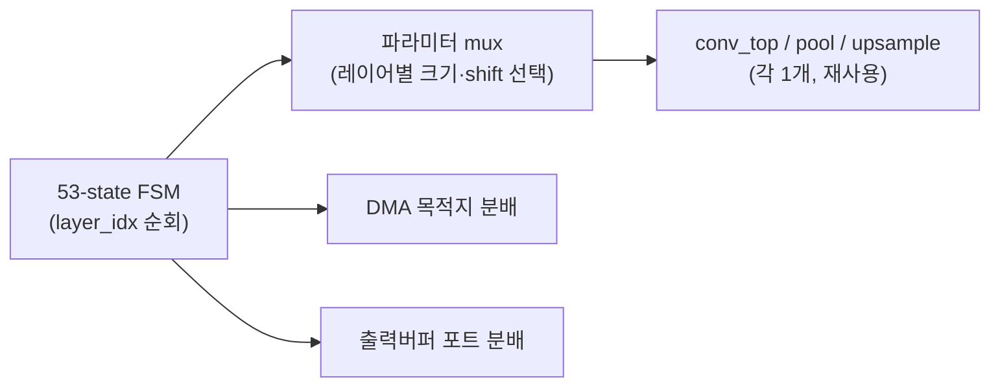
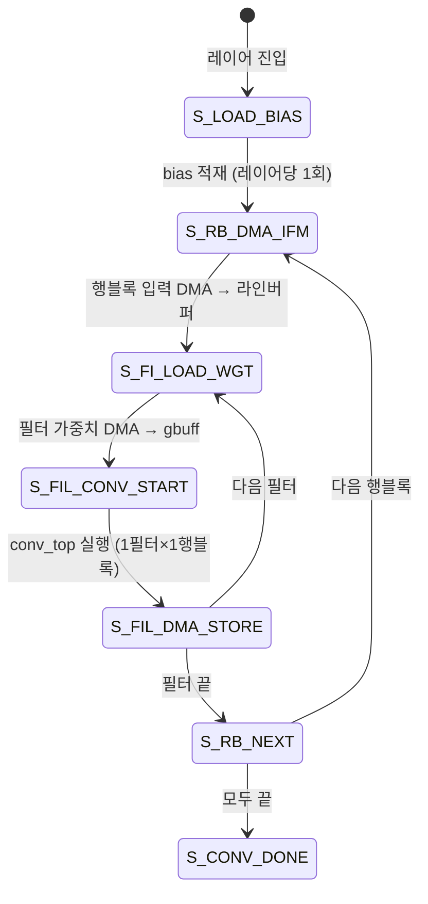

# 13장. RTL — yolo_engine (최상위 FSM)

> [← 12장 데이터/메모리](12_data_representation_memory_map.md) · [목차](README.md) · 다음 장: [14장 Convolution 엔진 →](14_rtl_convolution_engine.md)
> **이 장을 읽기 위한 준비**: [4장 FSM](04_rtl_timing_basics.md), [5장 AXI](05_axi_basics.md), [10장 네트워크](10_network_architecture.md), [12장 메모리맵](12_data_representation_memory_map.md).

---

[yolo_engine.v](../../yolohw/src/yolo_engine.v)(2365줄)는 시스템의 두뇌입니다. 22개 레이어를 자동으로 순회하면서 적절한 파라미터를 골라 모든 모듈을 지휘합니다. 코드가 길지만 구조는 명확합니다: **레이어 파라미터 표 + 거대한 FSM + 자원 분배(mux)** 세 부분입니다. 이 장은 그 세 부분을 코드로 봅니다.

---

## 13.1 핵심 사상 — 하나의 일꾼, 22번 재사용

[11장 11.2](11_hardware_overview.md)에서 본 "요리사 한 명이 22개 요리"가 yolo_engine의 본질입니다. 합성곱 유닛·풀링·업샘플은 각 하나뿐이고, FSM이 레이어를 진행하며 파라미터를 바꿔 끼웁니다.



---

## 13.2 포트 — 무엇이 드나드나

```verilog
module yolo_engine #(...) (
    input  clk, rstn,
    // CPU 제어 (AXI4-Lite slave)
    input  S_AXI_AWADDR, S_AXI_WDATA, ...,
    // DRAM 읽기 (AXI4 master)
    output M_ARVALID, M_ARADDR, ...,  input M_RDATA, ...,
    // DRAM 쓰기 (AXI4 master)
    output M_AWVALID, M_WDATA, ...,
    // 완료
    output o_network_done, network_done_led
);
```

[5장 5.7](05_axi_basics.md)에서 본 두 인터페이스가 보입니다: `S_AXI_*`(CPU가 제어하는 slave), `M_*`(DRAM에 접근하는 master). CPU는 4개 제어 레지스터로 시작 명령과 주소를 줍니다([13.7](#137-제어-레지스터)).

---

## 13.3 레이어 파라미터 테이블

yolo_engine.v의 약 122~610행은 **레이어별 상수의 거대한 표**입니다. 각 레이어가 필요로 하는 모든 수치가 `localparam`으로 정의됩니다.

### 🔍 코드 해설 — L0와 L2의 파라미터

```verilog
// L0 (CONV3×3, 256×256×3 → 256×256×16)
localparam L0_W=256, L0_W_HALF=128, L0_W_BLOCKS=64;
localparam L0_CO=16, L0_ACC_LEN=1, L0_SHIFT=8;

// L2 (CONV3×3, 128×128×16 → 128×128×32)
localparam L2_W=128, L2_CO=32;
localparam L2_ACC_LEN=4, L2_SHIFT=6;       // scale 0x40=64=2^6
localparam L2_OFM_BYTE_BASE = 32'h00180000;
```

- `L0_W=256`: 입력 너비. `L0_W_HALF=128`: 출력 2×2 블록 개수(너비÷2). `L0_W_BLOCKS=64`: 한 행의 entry 수(너비÷4, [12장 NHWC entry](12_data_representation_memory_map.md)).
- `L0_CO=16`: 출력 채널(필터) 수.
- `L0_ACC_LEN=1`: 누적 횟수. L0은 입력 채널이 3개라 4개 묶음 1번이면 끝 → 1. L2는 입력 16채널 → 16/4 = 4.
- `L0_SHIFT=8`: descaling 시프트. [9장 9.4](09_skeleton_reference.md)에서 구한 값(L0=8, 나머지=6).
- `L2_OFM_BYTE_BASE`: L2 출력이 DRAM 어디에 저장될지([12장 12.7](12_data_representation_memory_map.md)).

> 🔑 이 상수들이 모든 레이어에 대해 정의되어 있고, 다음에 볼 mux가 "지금 레이어"에 맞는 값을 골라 연산 유닛에 전달합니다.

---

## 13.4 "지금 몇 번 레이어?" — phase 레지스터

FSM은 두 레지스터로 현재 처리 중인 레이어를 추적합니다.

### 🔍 코드 해설

```verilog
reg [4:0] conv_phase_r;                       // 합성곱 레이어 번호
wire is_conv_l0  = (conv_phase_r == 5'd0);
wire is_conv_l12 = (conv_phase_r == 5'd12);
// ...
wire is_conv_1x1 = is_conv_l12 || is_conv_l14 || is_conv_l17 || is_conv_l20;

reg [4:0] pool_phase_r;                        // 풀링 레이어 번호
wire is_pool_l1 = (pool_phase_r == 5'd1);
```

- `conv_phase_r`이 12면 "지금 L12 처리 중"이라는 뜻.
- `is_conv_1x1`: L12/14/17/20을 하나로 묶어 "1×1 모드"임을 표시 → 합성곱 유닛과 라인 버퍼에 "1×1로 동작해" 신호를 보냄([14장](14_rtl_convolution_engine.md), [15장](15_rtl_memory_buffers.md)).

💡 이 wire들이 파라미터 mux의 선택 신호가 됩니다. 예: `cur_shift = is_conv_l0 ? L0_SHIFT : (is_conv_l2 ? L2_SHIFT : ...)`.

---

## 13.5 53-state FSM — 전체 지도

FSM은 53개 상태를 가지며, 기능별로 7그룹입니다. 상태가 많지만 그룹으로 보면 단순합니다.

```verilog
localparam S_IDLE=0, S_LOAD_BIAS=1, S_LOAD_BIAS_WAIT=2,
           S_RB_DMA_IFM=3, ..., S_CONV_DONE=12,   // 합성곱 그룹
           S_L1_FI_LOAD=13, ..., S_L1_NEXT_FI=19,  // 풀링 그룹
           S_RP_LOAD=20, ..., S_RP_NEXT_CIG=25,    // REPACK 그룹
           S_L11_LOAD=26, ..., S_L11_STORE_WAIT=32,// L11 풀링
           S_L12_RP_LOAD=33, ..., S_L12_RP_NEXT=38,// 1×1 REPACK
           S_L18_LOAD=39, ..., S_L18_STORE_WAIT=44,// 업샘플
           S_L19_RP_LOAD_A=45, ..., S_L19_RP_NEXT=52; // route concat
```

| 그룹 | 담당 | 패턴 |
|------|------|------|
| 합성곱 (0~12) | 모든 conv | bias→IFM→가중치→연산→저장 |
| 풀링/2 (13~19) | L1,3,5,7,9 | 필터별 적재→풀링→저장 |
| REPACK (20~25) | conv 전 포맷변환 | 적재→변환→저장 |
| L11 풀링/1 (26~32) | L11 | stride=1 풀링 |
| 1×1 REPACK (33~38) | L12,13,14,17 전 | conv출력→entry |
| 업샘플 (39~44) | L18 | 적재→복제→저장 |
| route concat (45~52) | L20 전 | L18+L8 합치기 |

> ⚠️ **상태 번호가 기능 순서와 안 맞습니다.** 예: 종료 상태 `S_DONE`이 28번. 이는 개발이 레이어 단위로 점진적으로 진행되며([HISTORY](../../HISTORY.md)) 추가된 순서로 번호가 붙었기 때문입니다. **번호가 아니라 이름과 그룹**으로 읽으세요.

---

## 13.6 합성곱 레이어 실행 흐름 (가장 중요)

여기가 핵심입니다. yolo_engine이 합성곱을 어떻게 돌리는지 봅니다.

### 🔍 코드 해설 — conv_top을 어떻게 부르나

```verilog
conv_top u_conv (
    .i_stream_wgt_mode(1'b1),                     // 가중치 streaming 모드
    .i_mode(is_conv_1x1),                          // 1×1이면 1, 3×3이면 0
    .i_relu_en(!is_conv_l14 && !is_conv_l20),      // 검출 헤드만 ReLU 끔
    .i_ofm_h_half(12'd1),                          // ← 한 번에 1 행블록만!
    .i_co_total(12'd1),                            // ← 한 번에 1 필터만!
    .i_row_start(rb_r), .i_acc_len(cur_acc_len), .i_shift(cur_shift),
    ...
);
```

여기서 가장 중요한 두 줄:
- `i_ofm_h_half(12'd1)`: 한 번 호출에 **출력 1행블록(row-block)** 만.
- `i_co_total(12'd1)`: 한 번 호출에 **1필터(출력채널 1개)** 만.

❓ **왜 한 번에 1필터·1행블록만?**: 가중치 전체가 BRAM(작음)보다 커서, **필터마다 새 가중치를 DMA로 가져와야** 합니다([15장 streaming](15_rtl_memory_buffers.md)). 입력도 라인 버퍼 용량 때문에 행블록 단위로 가져옵니다. 그래서 yolo_engine이 바깥에서 "필터 루프"와 "행블록 루프"를 직접 돌리고, conv_top은 한 조각만 처리합니다.

- `i_relu_en(!is_conv_l14 && !is_conv_l20)`: L14·L20(검출 헤드)만 ReLU를 끕니다([6장 6.5](06_yolo_basics.md), [2장 2.8](02_quantization_basics.md)).

### 합성곱 FSM 흐름



말로 풀면:
```
for 행블록 rb:
    입력 DMA → 라인버퍼
    for 필터 fi:
        가중치 DMA → gbuff_param
        conv_top 실행 → 출력버퍼
        출력버퍼 → DRAM 저장
```

---

## 13.7 제어 레지스터 — CPU와의 약속

[5장 5.4](05_axi_basics.md)에서 본 AXI-Lite 제어 레지스터입니다.

| 레지스터 | 의미 |
|----------|------|
| `ctrl_reg0[0]` | `ap_start` (1 쓰면 시작) |
| `ctrl_reg0[1]` | `network_done` (읽으면 완료 여부) |
| `ctrl_reg1` | 가중치 DRAM 주소 |
| `ctrl_reg2` | 입력 DRAM 주소 |
| `ctrl_reg3` | 출력 DRAM 주소 |

CPU는 주소 3개를 쓰고 `ap_start`를 1로 만든 뒤, `ctrl_reg0`을 읽으며 완료(bit 1)를 기다립니다([22장 host.py](22_appendix_future.md)).

---

## 13.8 DMA 목적지 분배

DMA 읽기 엔진은 하나인데, 읽은 데이터를 여러 곳(가중치·bias·입력·각종 버퍼)에 나눠 보내야 합니다. `dma_target_r`로 분배합니다.

### 🔍 코드 해설

```verilog
localparam DMA_TGT_WGT=1,       // → gbuff_param 가중치
           DMA_TGT_BIAS=2,      // → gbuff_param bias
           DMA_TGT_IFM=3,       // → ifm_line_buf
           DMA_TGT_L1_IFM=4,    // → 출력버퍼 (풀링/REPACK 입력)
           DMA_TGT_L11_IFM=5,   // → 출력버퍼 (L11 입력)
           DMA_TGT_L12_RP_IN=6, // → 출력버퍼 (1×1 REPACK 입력)
           DMA_TGT_L18_IFM=7;   // → 출력버퍼 (업샘플 입력)
```

`dma_target_r`이 현재 무엇을 읽는 중인지 기억하고, 도착한 데이터를 맞는 버퍼에 씁니다. 예를 들어 `DMA_TGT_WGT`면 가중치를 4개 모아 128비트로 만들어 가중치 버퍼에 기록합니다.

---

## 13.9 출력 버퍼 5방향 분배

출력 버퍼(OFM dpram, 256 KB)는 여러 주체가 공유합니다([12장 12.8](12_data_representation_memory_map.md)). 두 포트(쓰기 A, 읽기 B)에 5가지 경로를 mux합니다.

```
쓰기 포트(A):  ① 합성곱 출력  ② DMA 적재(풀링 입력)
              ③ 풀링 출력   ④ stride1 풀링 출력  ⑤ 업샘플 출력
읽기 포트(B):  ① DMA 저장(DRAM으로)  ② 풀링 읽기
              ③ stride1 풀링 읽기   ④ 업샘플 읽기
```

하나의 버퍼를 이렇게 돌려 써서, 합성곱 출력 임시저장·풀링/업샘플 작업·DRAM 저장을 모두 256 KB로 처리합니다. 현재 FSM 그룹에 따라 mux가 자동으로 경로를 고릅니다.

---

## 13.10 Route와 레이어 스킵

L15(yolo)·L16(route)·L19(route)·L21(yolo)은 연산 모듈이 없습니다([10장 10.5](10_network_architecture.md)). FSM이 이렇게 처리합니다.

- **L15, L21 (yolo)**: 아무것도 안 함. 검출 헤드 출력이 DRAM에 있고, 소프트웨어가 후처리([6장 6.8](06_yolo_basics.md)).
- **L16 (route -4)**: L12 출력을 가리키는 별칭. FSM이 L14 다음에 **L15·L16을 건너뛰고 L17로 직행**(`cp==14 done → cp=17`). L17의 REPACK이 L12 출력을 입력으로 읽습니다.
- **L19 (route concat)**: L18과 L8을 합치는 단계. FSM이 두 출력을 출력버퍼에 적재한 뒤 entry로 묶어 L20 입력을 만듭니다([16장 16.5](16_rtl_special_units.md)).

---

## 13.11 이 장의 요약

- yolo_engine은 "일꾼 하나를 22번 재사용"하는 지휘자: 레이어 파라미터 표 + 53-state FSM + 자원 mux.
- 파라미터 표(122~610행)를 `conv_phase_r`/`pool_phase_r`로 골라 연산 유닛에 전달.
- 합성곱은 yolo_engine이 **필터·행블록 루프를 직접 돌리고** conv_top은 "1필터×1행블록"만 처리(가중치/입력 streaming 때문).
- DMA 읽기는 8종 목적지로 분배, 출력버퍼는 5방향 포트 mux로 공유.
- route/yolo는 모듈 없이 FSM 스킵 + 주소 별칭으로 처리.

다음 장에서는 이 FSM이 호출하는 **합성곱 엔진**을 가장 아래 `mul`부터 한 줄씩 봅니다.

---

> [← 12장 데이터/메모리](12_data_representation_memory_map.md) · [목차](README.md) · 다음 장: [14장 Convolution 엔진 →](14_rtl_convolution_engine.md)
