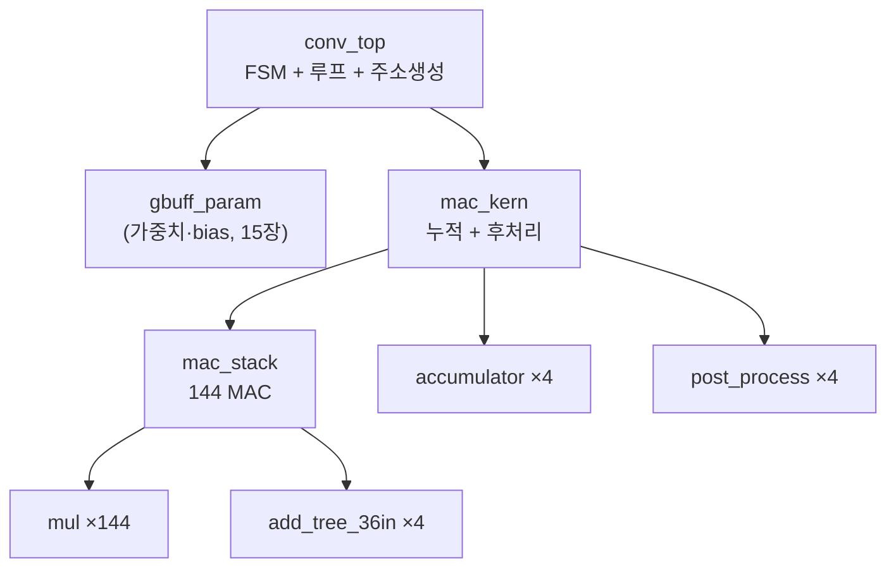

# 14장. RTL — Convolution 엔진 (코드 해설)

> [← 13장 yolo_engine](13_rtl_yolo_engine_top.md) · [목차](README.md) · 다음 장: [15장 메모리 버퍼 →](15_rtl_memory_buffers.md)
> **이 장을 읽기 위한 준비**: [1장 1.10 MAC](01_cnn_basics.md), [2장 양자화](02_quantization_basics.md), [4장 파이프라인·타이밍](04_rtl_timing_basics.md), [12장 데이터포맷](12_data_representation_memory_map.md).

---

이 장은 실제 곱셈-누적이 일어나는 연산 코어를 **가장 아래(`mul`)부터 위(`conv_top`)까지** 코드로 봅니다. 이 5개 모듈이 전체 연산의 88%를 담당하므로([10장 10.7](10_network_architecture.md)), 가장 중요하고 가장 길게 다룹니다. 코드를 한 줄씩 짚으니 천천히 따라오세요.

---

## 14.1 5단 계층 — 곱셈기부터 제어까지



| 모듈 | 하는 일 | latency |
|------|---------|---------|
| `mul` | INT8 곱셈 1개 | 4 |
| `add_tree_36in` | 36개를 더해 1개 | 4 |
| `mac_stack` | 144 곱셈 + 4 덧셈트리 | 8 (4+4) |
| `mac_kern` | + 누적 + 후처리 | 8 + 누적 + 1 |
| `post_process` | bias·ReLU·시프트·클립 | 1 |
| `conv_top` | 루프 제어 | (FSM) |

아래부터 하나씩 코드로 봅니다.

---

## 14.2 mul.v — INT8 곱셈기 한 개

[mul.v](../../yolohw/src/mul.v)는 가중치 하나와 입력 하나를 곱합니다. 가장 작은 부품이며 144개가 병렬로 쓰입니다.

### 🔍 코드 해설 — 시뮬레이션 경로

```verilog
module mul(input clk, input [7:0] w, input [7:0] x, output [15:0] y);
`ifdef FPGA
    // 합성: DSP48 사용 (아래)
`else
    reg [15:0] dsp_P[0:3];                 // 4단 파이프라인 레지스터
    always@(posedge clk) begin
        dsp_P[0] <= $signed(w) * $signed(x);  // ① 곱셈 (부호 있는!)
        dsp_P[1] <= dsp_P[0];                  // ② 지연
        dsp_P[2] <= dsp_P[1];                  // ③ 지연
        dsp_P[3] <= dsp_P[2];                  // ④ 지연
    end
    assign y = dsp_P[3];                       // 4클럭 후 출력
`endif
endmodule
```

- `$signed(w) * $signed(x)`: 가중치와 입력을 **부호 있는 수로** 곱합니다([4장 4.6](04_rtl_timing_basics.md)). `$signed`를 빼면 음수 가중치가 큰 양수가 되어 결과가 틀립니다 — Phase 2의 실제 버그였습니다([2장 2.3](02_quantization_basics.md)).
- `dsp_P[0~3]`: 곱셈 결과를 4단 레지스터로 흘려보냅니다. 왜 4단일까요? 실제 FPGA의 DSP48 곱셈기가 **latency 4**라서, 시뮬레이션도 똑같이 4단으로 맞춥니다([4장 4.3 파이프라인](04_rtl_timing_basics.md)). 그래야 FPGA와 시뮬 타이밍이 일치합니다.

### 🔍 코드 해설 — 합성 경로 (DSP48)

```verilog
`ifdef FPGA
    assign dsp_A = w[7] ? {10'b11_1111_1111, w} : {10'b0, w};  // INT8 → INT18 부호 확장
    assign dsp_B = x[7] ? {10'b11_1111_1111, x} : {10'b0, x};
    xbip_dsp48_macro_0 u_dsp(.CLK(clk), .A(dsp_A), .B(dsp_B), .C(48'b0), .P(dsp_P));
    assign y = dsp_P[15:0];
`endif
```

- `w[7] ? {10'b1...1, w} : {10'b0, w}`: 8비트를 18비트로 **부호 확장**([2장 2.5](02_quantization_basics.md)). 최상위 비트(`w[7]`)가 1(음수)이면 위를 1로, 0(양수)이면 0으로 채웁니다.
- `xbip_dsp48_macro_0`: Xilinx DSP48 곱셈기 IP([3장 3.3](03_fpga_basics.md)). `.C(48'b0)`은 "누산은 안 함"(곱셈만). 누산은 다음의 가산 트리가 합니다.

> 곱의 최댓값은 `(−128)×(−128)=16384`라 16비트면 충분합니다([2장 2.4](02_quantization_basics.md)).

---

## 14.3 add_tree_36in.v — 36개를 하나로

[add_tree_36in.v](../../yolohw/src/add_tree_36in.v)는 곱셈 결과 36개를 더해 1개로 만듭니다. [2장 2.4](02_quantization_basics.md)에서 본 "비트폭이 단계마다 커지는" 가산 트리입니다.

### 🔍 코드 해설 — 4단 트리

```verilog
// Level 1: 36개 → 12개 (3개씩 더함, 18비트)
l1_00 <= $signed(m[0]) + $signed(m[1]) + $signed(m[2]);
// ... l1_11 까지 12개

// Level 2: 12개 → 4개 (3개씩, 20비트)
l2_00 <= $signed(l1_00) + $signed(l1_01) + $signed(l1_02);
// ... l2_03 까지

// Level 3: 4개 → 2개 (2개씩, 21비트)
l3_00 <= $signed(l2_00) + $signed(l2_01);
l3_01 <= $signed(l2_02) + $signed(l2_03);

// Level 4: 2개 → 1개 (22비트)
l4 <= $signed(l3_00) + $signed(l3_01);
```

```
36개 (16비트)
  → Level1: 12개 (18비트)   3개씩 묶어 더함
  → Level2:  4개 (20비트)
  → Level3:  2개 (21비트)
  → Level4:  1개 (22비트)   ← 최종 합
```

- 각 레벨이 한 클럭씩 걸려 **총 4클럭(latency 4)**. 각 레벨 출력이 레지스터(`l1_xx` 등)라 한 클럭 소요.
- 비트폭이 16→18→20→21→22로 커집니다. 더할수록 값이 커지니 넘치지 않게 늘립니다([2장 2.4](02_quantization_basics.md)). 최댓값 `36 × (127×255) ≈ 117만`이라 22비트면 안전.

### 🔍 코드 해설 — valid 신호도 같이 지연

```verilog
always @(posedge clk) begin
    vld_d1 <= vld_i; vld_d2 <= vld_d1; vld_d3 <= vld_d2; vld_d4 <= vld_d3;
end
assign vld_o = vld_d4;   // 데이터와 똑같이 4클럭 지연
```

[4장 4.5](04_rtl_timing_basics.md)에서 본 valid 파이프라인입니다. 데이터가 4단을 지나는 동안 valid도 4단 지연시켜, 출력이 유효한 정확한 클럭을 알려줍니다.

---

## 14.4 mac_stack.v — 144개 MAC 한꺼번에

[mac_stack.v](../../yolohw/src/mac_stack.v)는 [11장 11.4](11_hardware_overview.md)의 144-MAC을 실제로 인스턴스화합니다.

### 🔍 코드 해설 — 144개 곱셈기 생성

```verilog
genvar i;
generate
    for (i=0; i<36; i=i+1) begin: g_mul_arr
        mul u_mul_00 (.clk(clk), .w(wgt[i*8 +: 8]), .x(ifm_00[i*8 +: 8]), .y(muls_00[i*16 +: 16]));
        mul u_mul_01 (.clk(clk), .w(wgt[i*8 +: 8]), .x(ifm_01[i*8 +: 8]), .y(muls_01[i*16 +: 16]));
        mul u_mul_10 (.clk(clk), .w(wgt[i*8 +: 8]), .x(ifm_10[i*8 +: 8]), .y(muls_10[i*16 +: 16]));
        mul u_mul_11 (.clk(clk), .w(wgt[i*8 +: 8]), .x(ifm_11[i*8 +: 8]), .y(muls_11[i*16 +: 16]));
    end
endgenerate
```

- `for (i=0; i<36; ...)` × 4개 인스턴스 = **36 × 4 = 144개 곱셈기**([11장 11.4](11_hardware_overview.md)).
- `wgt[i*8 +: 8]`: 288비트 가중치에서 i번째 8비트(가중치 1개)를 꺼냄([12장 12.4](12_data_representation_memory_map.md)).
- **핵심**: 같은 `wgt`가 4개 인스턴스(`u_mul_00/01/10/11`) 모두에 들어갑니다 → **가중치 broadcast**. 인접한 2×2 출력 위치 4개는 같은 필터를 쓰기 때문입니다.
- `ifm_00/01/10/11`: 4개 출력 위치(2×2 블록의 네 칸)에 해당하는 입력.

```
       wgt (36개, 공유)
        │  │  │  │
   ifm_00 ifm_01 ifm_10 ifm_11   (4개 위치의 입력)
        │  │  │  │
      [36곱셈]×4 → [덧셈트리]×4 → acc_00/01/10/11 (4개 부분합)
```

### 🔍 코드 해설 — 4개 가산 트리

```verilog
add_tree_36in u_at_00 (.clk(clk), .rstn(rstn), .vld_i(vld_m4),
                       .muls(muls_00), .acc_o(acc_00), .vld_o(vld_at_00));
// u_at_01, u_at_10, u_at_11 동일
```

4개 출력 위치 각각에 가산 트리가 하나씩. `vld_m4`는 곱셈기 4단 지연 후의 valid([4장 4.5](04_rtl_timing_basics.md)). 곱셈(4) + 가산(4) = **총 latency 8**.

---

## 14.5 mac_kern.v — 누적과 후처리를 붙이다

[mac_kern.v](../../yolohw/src/mac_kern.v)는 `mac_stack`의 부분합을 **여러 클럭 누적**하고 `post_process`로 최종 픽셀을 만듭니다.

### 🔍 코드 해설 — 누적기

```verilog
always @(posedge clk or negedge rstn) begin
    acc_done <= 1'b0;
    if (mac_vld) begin
        if (cyc_cnt == 8'd0) begin
            psum_00 <= $signed(mac_00);          // 첫 클럭: 초기화
            // psum_01/10/11 동일
        end else begin
            psum_00 <= psum_00 + $signed(mac_00); // 이후: 누적
        end
        if (cyc_cnt == i_len - 8'd1) begin
            acc_done <= 1'b1;                     // 마지막: 완료 펄스
            cyc_cnt  <= 8'd0;
        end else cyc_cnt <= cyc_cnt + 8'd1;
    end
end
```

- `cyc_cnt`: 지금 몇 번째 누적인지 세는 카운터.
- `cyc_cnt == 0`이면 첫 값으로 초기화, 아니면 더하기. 입력 채널이 4개 초과면 4개씩 나눠 여러 클럭 누적합니다([11장 11.4](11_hardware_overview.md)).
- `i_len`: 누적 횟수. 예를 들어 입력 256채널이면 256/4 = 64번. 이 값이 [13장](13_rtl_yolo_engine_top.md)의 `cur_acc_len`입니다.
- `cyc_cnt == i_len-1`이면 누적 끝 → `acc_done` 펄스 → post_process가 받습니다.

> 💡 22비트 부분합을 32비트 `psum`에 누적합니다. 64번 더해도 넘치지 않게 32비트를 씁니다([2장 2.4](02_quantization_basics.md)).

### 🔍 코드 해설 — 4개의 post_process

```verilog
post_process u_pp_00 (.clk(clk), .rstn(rstn),
    .acc_done(acc_done), .acc_result(psum_00),
    .bias(i_bias), .shift_amount(i_shift), .i_relu_en(i_relu_en),
    .pixel_out(px_00), .output_valid(vld_00));
// u_pp_01/10/11 동일

assign o_pixel = {px_11, px_10, px_01, px_00};   // 4픽셀을 32비트로 묶음
```

- 4개 출력 위치 각각에 후처리기. **bias·shift는 4개가 공유**합니다(같은 필터 = 같은 출력 채널이라 동일).
- `o_pixel = {px_11, px_10, px_01, px_00}`: 4픽셀을 [12장 12.2-③](12_data_representation_memory_map.md)의 "2×2 packed" 32비트로 묶어 출력.

---

## 14.6 post_process.v — bias·ReLU·시프트·클립

[post_process.v](../../yolohw/src/post_process.v)는 [2장 2.5~2.8](02_quantization_basics.md)에서 개념으로 배운 후처리를 그대로 구현합니다. 누적 결과를 최종 8비트 픽셀로 만듭니다.

### 🔍 코드 해설 — 4단계 (조합 논리)

```verilog
// ① bias 덧셈
wire signed [31:0] biased = acc_result + bias;

// ② ReLU (i_relu_en=1이고 음수면 0)
wire signed [31:0] activated = (i_relu_en && biased[31]) ? 32'd0 : biased;

// ③ descaling — 음수 toward-zero 보정 후 시프트
wire signed [31:0] round_bias = activated[31] ?
    (($signed(32'sd1) <<< shift_amount) - 32'sd1) : 32'sd0;
wire signed [31:0] scaled = (activated + round_bias) >>> shift_amount;

// ④ clamp
wire [7:0] clamped = i_relu_en ?
    ( (scaled[31]) ? 8'd0 : (|scaled[31:8]) ? 8'hFF : scaled[7:0] ) :   // UINT8 0~255
    ( (scaled > 127) ? 8'h7F : (scaled < -128) ? 8'h80 : scaled[7:0] ); // INT8 -128~127
```

한 줄씩:
- **① bias**: 누적값에 bias를 더함([2장 2.5](02_quantization_basics.md)). `bias`는 sign-extend된 32비트([12장 12.5](12_data_representation_memory_map.md)).
- **② ReLU**: `i_relu_en`이 1이고 `biased[31]`(부호비트=음수)이면 0. 검출 헤드는 `i_relu_en=0`이라 통과([1장 1.6](01_cnn_basics.md), [6장 6.5](06_yolo_basics.md)).
- **③ descaling**: `round_bias`가 핵심입니다. `activated[31]`(음수)이면 `(1<<shift)-1`을 더한 뒤 시프트 → C의 toward-zero와 일치([2장 2.7](02_quantization_basics.md)). 양수면 `round_bias=0`이라 영향 없음.
- **④ clamp**: `i_relu_en`이면 0~255(UINT8), 아니면 −128~127(INT8). 검출 헤드는 음수 유지([2장 2.8](02_quantization_basics.md)).

### 🔍 코드 해설 — 결과 래치

```verilog
always @(posedge clk or negedge rstn) begin
    output_valid <= acc_done;       // acc_done 다음 클럭에 유효
    if (acc_done) pixel_out <= clamped;
    else          pixel_out <= 8'd0;
end
```

`acc_done`이 오면 다음 클럭에 결과를 레지스터에 저장(latency 1).

> 🔑 **shift 값의 중요성**: `shift_amount`(=`i_shift`)는 레이어마다 다릅니다([2장 2.6](02_quantization_basics.md)): L0=8, 대부분=6, **L14=6, L20=9**. 검출 헤드인데도 L14(6)와 L20(9)가 다른 이유는 다음 합성곱 유무 때문입니다([2장 2.6](02_quantization_basics.md), [9장 9.4](09_skeleton_reference.md)). 이 toward-zero 보정과 정확한 shift가 검출 헤드 정확도를 결정합니다([20장](20_testbench_per_layer.md)의 L14 디버깅 사례).

---

## 14.7 conv_top.v — 합성곱 한 호출 제어

[conv_top.v](../../yolohw/src/conv_top.v)는 위 모듈들을 인스턴스화하고, **출력 고정(output-stationary) 4중 루프**로 합성곱 한 조각을 수행합니다.

### 루프 구조

```
for 필터:
  for 행:
    for 열:           ← 한 좌표 = 2×2 출력 블록
      for 누적:        ← 입력채널 4개씩 (acc_len 회)
        mac_kern에 입력+가중치 흘려보내기
```

[13장 13.6](13_rtl_yolo_engine_top.md)에서 봤듯, yolo_engine은 `i_co_total=1, i_ofm_h_half=1`로 호출해 "1필터×1행블록"만 시킵니다.

### 🔍 코드 해설 — FSM

```verilog
localparam ST_IDLE=0, ST_LOAD=1, ST_RUN=2, ST_DRAIN=3, ST_NEXT=4, ST_DONE=5;
always @(*) case (cstate)
    ST_IDLE : if (i_start)              nstate = ST_LOAD;
    ST_LOAD :                           nstate = ST_RUN;
    ST_RUN  : if (spatial_last)         nstate = ST_DRAIN;
    ST_DRAIN: if (out_cnt == q_total)   nstate = ST_NEXT;  // 파이프라인 비우기
    ST_NEXT : if (!i_conv_pause)        nstate = fil_last ? ST_DONE : ST_LOAD;
endcase
```

- `ST_LOAD`: 가중치·bias의 첫 주소를 BRAM에 발사([4장 4.4](04_rtl_timing_basics.md)의 latency 흡수).
- `ST_RUN`: 매 클럭 mac_kern에 입력·가중치를 streaming.
- `ST_DRAIN`: 파이프라인에 남은 픽셀을 다 받을 때까지 기다림([4장 4.3 latency](04_rtl_timing_basics.md)). 곱셈·가산·누적의 지연 때문에 마지막 입력 후에도 결과가 몇 클럭 더 나옵니다.

### 🔍 코드 해설 — 타이밍 정렬 (자주 틀리는 곳)

```verilog
// BRAM read latency 1을 흡수하려고 mac_kern의 valid를 1클럭 늦춤
reg mac_vld_d;
always @(posedge clk) mac_vld_d <= (cstate == ST_RUN);
```

가중치 BRAM은 주소를 준 다음 클럭에 데이터가 나옵니다([4장 4.4](04_rtl_timing_basics.md)). 그래서 mac_kern을 시작하는 valid(`mac_vld_d`)를 1클럭 늦춰, 데이터 도착과 맞춥니다.

```verilog
// 라인 버퍼(latency 2)를 위해 다음 좌표를 미리 발사 (look-ahead)
wire [11:0] lah_col = lah_acc_last ? (lah_col_last ? 0 : col_idx + 1) : col_idx;
assign o_ifm_col = (cstate == ST_RUN) ? lah_col : col_idx;
```

라인 버퍼는 latency 2라([15장](15_rtl_memory_buffers.md)) **다음에 필요할 좌표를 미리** 보냅니다([4장 4.4 look-ahead](04_rtl_timing_basics.md)).

> ⚠️ **Phase 2 버그**: 가중치 주소를 1클럭 잘못 advance해서 "가중치가 입력보다 1스텝 앞서가는" 버그가 있었습니다. ST_LOAD에서 `wgt_addr`를 +1 하지 **않는** 것이 핵심입니다([HISTORY](../../HISTORY.md), [메모리 conv_top_pipeline](../../CLAUDE.md)). 타이밍은 한 클럭만 틀려도 결과가 망가집니다([4장 4.8](04_rtl_timing_basics.md)).

### 🔍 코드 해설 — 가중치 streaming 모드

```verilog
if (!i_stream_wgt_mode)
    wgt_base_r <= wgt_base_r + {2'b00, i_acc_len};  // 일반: 다음 필터 가중치로 이동
// streaming 모드(=1)면 wgt_base_r를 그대로 둠 → 모든 필터가 BRAM[0]부터 읽음
```

`i_stream_wgt_mode=1`(yolo_engine이 항상 1로 호출)이면, 필터마다 새 가중치를 BRAM 처음에 DMA로 채우므로 base 주소를 0으로 고정합니다([15장](15_rtl_memory_buffers.md), [13장 13.6](13_rtl_yolo_engine_top.md)).

---

## 14.8 전체 latency 정리

한 출력 픽셀이 나오기까지:

```
입력 → [곱셈 4] → [가산트리 4] → [누적 i_len] → [후처리 1] → 출력
        └──── mac_stack 8 ────┘
총 latency = 8 + i_len + 1
```

> 🔑 **중요**: 이 latency는 파이프라인 채움/비움에만 보입니다([4장 4.3](04_rtl_timing_basics.md)). 정상 운전 중에는 **`i_len`(=acc_len) 클럭마다 4픽셀**이 쏟아집니다. 이것이 진짜 처리량입니다([18장](18_operation_timing.md)).

---

## 14.9 3×3과 1×1이 같은 엔진을 쓰는 비결

[1장 1.5](01_cnn_basics.md)에서 "1×1과 3×3은 한 출력점에 입력을 몇 개 모으냐만 다르다"고 했습니다. 코드로 보면 `mac_stack`·`mac_kern`·`mul`은 **mode를 전혀 신경 쓰지 않습니다.**

| 항목 | 3×3 | 1×1 |
|------|-----|-----|
| `i_mode` | 0 | 1 |
| 36개 입력의 의미 | 4채널 × 3×3 | 4채널 × 1 (나머지는 다른 채널) |
| 다른 점 | **입력 패킹**(라인 버퍼)과 `acc_len`뿐 | |

차이는 전적으로 [15장](15_rtl_memory_buffers.md)의 `ifm_line_buf`가 입력을 어떻게 묶느냐에 있습니다. 곱셈기는 받은 36개를 그냥 곱할 뿐입니다. 이것이 "1×1을 위해 새 하드웨어를 안 만든다"는 [7장 7.7](07_project_overview.md)의 설계 결정입니다.

---

## 14.10 이 장의 요약

- 연산 코어는 `conv_top → mac_kern → mac_stack → (mul ×144 + add_tree ×4) + post_process ×4`.
- `mul`: `$signed` INT8 곱셈, latency 4(DSP48과 일치). `add_tree`: 4단 트리, 16→22비트, latency 4.
- `mac_stack`: 가중치 broadcast로 144 곱셈 → 4개 부분합(latency 8).
- `mac_kern`: 부분합을 `acc_len`번 누적(32비트), 4개 `post_process`로 4픽셀 생성.
- `post_process`: bias → ReLU → (음수 toward-zero 보정) descaling → clamp. shift는 L0=8/대부분=6/**L14=6,L20=9**.
- `conv_top`: 4중 루프 FSM + 타이밍 정렬(가중치 valid 지연, 라인버퍼 look-ahead, streaming).
- 전체 latency `8+acc_len+1`이지만 처리량은 `4픽셀/acc_len 클럭`. 3×3·1×1은 입력 패킹만 다름.

다음 장에서는 이 엔진에 데이터를 공급하는 **메모리 버퍼**(라인 버퍼·가중치 버퍼)를 봅니다.

---

> [← 13장 yolo_engine](13_rtl_yolo_engine_top.md) · [목차](README.md) · 다음 장: [15장 메모리 버퍼 →](15_rtl_memory_buffers.md)
