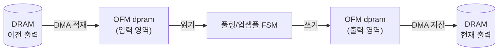
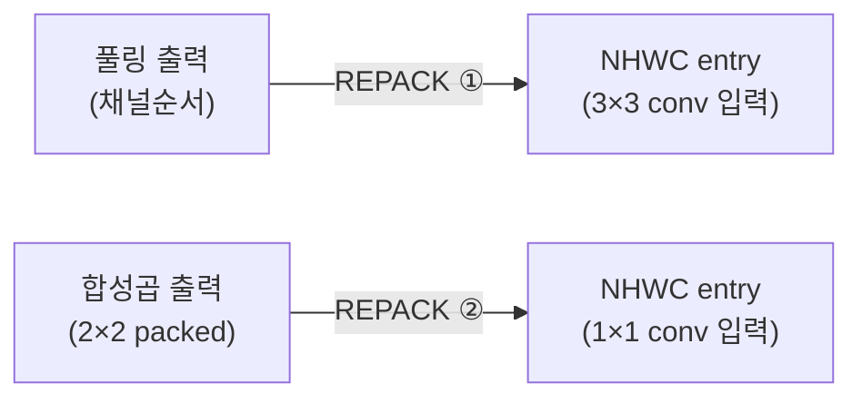

# 16장. RTL — 특수 연산 유닛 (코드 해설)

> [← 15장 메모리 버퍼](15_rtl_memory_buffers.md) · [목차](README.md) · 다음 장: [17장 AXI / DMA 인터페이스 →](17_rtl_axi_dma.md)
> **이 장을 읽기 위한 준비**: [1장 1.7~1.8 풀링·업샘플](01_cnn_basics.md), [12장 12.2~12.3 포맷·REPACK](12_data_representation_memory_map.md).

---

합성곱 외의 형상 변환을 담당하는 세 모듈(`max_pool_unit`, `max_pool_s1_unit`, `upsample_unit`)과, 데이터 포맷을 바꾸는 REPACK 엔진을 코드로 봅니다. 이들의 공통점은 **출력 버퍼(OFM dpram)를 직접 읽고 쓰는 단순 FSM**이라는 것입니다 — 합성곱보다 훨씬 간단합니다.

---

## 16.1 공통 패턴 — load → process → store

세 유닛 모두 [11장 11.3](11_hardware_overview.md)의 출력 버퍼에 붙어 다음 패턴으로 동작합니다.



공통 인터페이스: `i_start`/`o_done`(시작·완료), `o_rd_*`/`i_rd_data`(읽기), `o_wr_*`(쓰기). 데이터는 모두 [12장 12.2-③](12_data_representation_memory_map.md)의 2×2 packed(32비트=4픽셀)입니다.

---

## 16.2 max_pool_unit.v — stride-2 풀링

[max_pool_unit.v](../../yolohw/src/max_pool_unit.v)는 L1/3/5/7/9의 2×2 stride-2 풀링([1장 1.7](01_cnn_basics.md))입니다.

### 핵심 통찰 — 합성곱 2×2 블록 = 풀링 윈도우

합성곱이 만든 32비트(2×2 블록 4픽셀)가 **곧 풀링의 2×2 윈도우**입니다! 그래서 입력 32비트의 4바이트 최댓값을 구하면 풀링 출력 1픽셀이 됩니다. 윈도우 슬라이딩이 필요 없습니다.

```
입력 word = {b3, b2, b1, b0} (2×2 블록)
   → max(b0,b1,b2,b3) = 풀링 출력 1바이트
   → 4개 모으면 다음 2×2 출력 블록 (32비트)
```

### 🔍 코드 해설 — max-of-4

```verilog
wire [7:0] b0 = i_rd_data[7:0],   b1 = i_rd_data[15:8],
           b2 = i_rd_data[23:16], b3 = i_rd_data[31:24];
wire [7:0] m01 = (b0 > b1) ? b0 : b1;       // 둘 중 큰 것
wire [7:0] m23 = (b2 > b3) ? b2 : b3;
wire [7:0] in_max = (m01 > m23) ? m01 : m23; // 넷 중 큰 것
```

비교 3번으로 4개 중 최댓값. [1장 1.7](01_cnn_basics.md)의 max pooling을 하드웨어로 만들면 이렇게 단순합니다.

### 🔍 코드 해설 — 4개 모아 저장

```verilog
case (buf_cnt_r)
    2'd0: buf_b0 <= in_max;
    2'd1: buf_b1 <= in_max;
    2'd2: buf_b2 <= in_max;
    2'd3: begin   // 4번째 → 32비트로 묶어 쓰기
        packed_word_r <= {in_max, buf_b2, buf_b1, buf_b0};
        packed_vld_r  <= 1'b1;
        out_addr_r    <= out_addr_r + 1;
    end
endcase
```

출력 픽셀 4개를 모아 32비트로 묶어 씁니다([12장 12.2-③](12_data_representation_memory_map.md)).

> 💡 **in-place 안전성**: 출력 word `K`는 입력 word `4K+3`까지 읽은 뒤 씁니다. 읽기 주소(4K+3)가 쓰기 주소(K)보다 항상 앞서므로, 같은 버퍼에 덮어써도 안전합니다. 별도 출력 버퍼가 필요 없어 메모리를 아낍니다.

---

## 16.3 max_pool_s1_unit.v — stride-1 풀링 (L11 전용)

[max_pool_s1_unit.v](../../yolohw/src/max_pool_s1_unit.v)는 L11 전용입니다. stride=1이라 크기가 유지되고([1장 1.7](01_cnn_basics.md)) 윈도우가 겹쳐서, stride-2 모듈과 **완전히 다른 동작**이 필요합니다. 그래서 전용 모듈입니다.

### 왜 어려운가 — 출력 한 픽셀이 4개 입력 블록에 걸침

stride-1 2×2 윈도우는 packed 블록 경계를 가로지릅니다. 출력 블록의 네 픽셀이 **인접한 4개 입력 블록**의 특정 바이트에서 옵니다.

### 🔍 코드 해설 — 4-way max

```verilog
wire [7:0] out_pix_00 = max4(rc_b0,  rc_b1,  rc_b2,  rc_b3);   // 블록 RC 안에서
wire [7:0] out_pix_01 = max4(rc_b1,  rc1_b0, rc_b3,  rc1_b2);  // RC + 오른쪽 블록 RC1
wire [7:0] out_pix_10 = max4(rc_b2,  rc_b3,  r1c_b0, r1c_b1);  // RC + 아래 블록 R1C
wire [7:0] out_pix_11 = max4(rc_b3,  rc1_b2, r1c_b1, r1c1_b0); // RC + 세 이웃 블록
```

`rc`(현재), `rc1`(오른쪽), `r1c`(아래), `r1c1`(우하단) — 네 블록에서 골라 max. 경계 밖(`C+1≥W` 등)이면 0으로 채웁니다(same-padding, [1장 1.7](01_cnn_basics.md)).

### 🔍 코드 해설 — 7-phase FSM

```verilog
case (cnt_phase)
    // phase 0~3: 4개 입력 블록 읽기 주소 발사
    // phase 2~5: 도착한 데이터 샘플 (BRAM latency 1 보상)
    3'd2: cache_rc   <= i_rd_data;
    3'd3: cache_rc1  <= valid_rc1 ? i_rd_data : 0;
    3'd4: cache_r1c  <= valid_r1c ? i_rd_data : 0;
    3'd5: cache_r1c1 <= valid_r1c1 ? i_rd_data : 0;
    // phase 6: 출력 쓰기 + 다음 블록으로
endcase
```

출력 블록 하나당 7클럭(phase 0~6). 4개 블록을 순차로 읽어야 해서([4장 4.4 BRAM latency](04_rtl_timing_basics.md)), 발사(0~3)와 샘플(2~5)을 어긋나게 배치합니다. L11 전체는 약 512채널 × 16블록 × 7 ≈ 57,000클럭.

> 🔑 **dpram 분할**: 입력은 `[0..8191]`, 출력은 `[8192..]`에 둡니다. 입력과 출력 영역을 분리해 in-place 충돌을 피합니다([12장 12.8](12_data_representation_memory_map.md)).

---

## 16.4 upsample_unit.v — 2× 업샘플 (L18 전용)

[upsample_unit.v](../../yolohw/src/upsample_unit.v)는 L18에서 8×8을 16×16으로 키웁니다([1장 1.8](01_cnn_basics.md)). 곱셈 없이 값을 복제합니다.

### 🔍 코드 해설 — 한 픽셀을 2×2로 복제

```verilog
wire [7:0] pix_00 = cache_in[7:0];
wire [31:0] word_00 = {pix_00, pix_00, pix_00, pix_00};   // 같은 값 4번 (2×2 블록)
```

입력 한 픽셀(`pix_00`)을 32비트(2×2 블록, 같은 값 4벌)로 만듭니다. 입력 블록의 4픽셀 각각이 출력에서 2×2 블록이 되어, 8×8 → 16×16([1장 1.8](01_cnn_basics.md)).

### 🔍 코드 해설 — 6-phase FSM

```verilog
case (cnt_phase)
    3'd0: begin rd_en_r<=1; rd_addr_r<=addr_in; end       // 읽기 발사
    3'd1: ;                                                // 대기 (BRAM latency)
    3'd2: begin cache_in<=i_rd_data; wr_data_r<=word_00; end // 샘플 + 좌상 쓰기
    3'd3: wr_data_r <= word_01;                            // 우상 쓰기
    3'd4: wr_data_r <= word_10;                            // 좌하 쓰기
    3'd5: begin wr_data_r<=word_11; /*다음 블록*/ end       // 우하 쓰기 + 진행
endcase
```

입력 블록 하나당 6클럭: 1읽기 + 1대기 + 4쓰기(2×2 출력 블록 4개). L18 전체는 128채널 × 16블록 × 6 ≈ 12,000클럭.

> 업샘플은 곱셈이 전혀 없어 단순한 복사 FSM입니다. [7장 7.7](07_project_overview.md)에서 "Route와 달리 주소 패턴이 규칙적이라 전용 모듈화가 깔끔"한 경우입니다.

---

## 16.5 REPACK 엔진 — 포맷 갈아입히기

REPACK은 별도 .v 파일이 아니라 [yolo_engine](13_rtl_yolo_engine_top.md) FSM에 내장된 변환입니다. [12장 12.3](12_data_representation_memory_map.md)에서 본 "옷 갈아입히기"(채널순서/2×2 packed → NHWC entry)입니다. 곱셈이 없고 메모리 재배치만 합니다.

### 두 종류



- **① 풀링→합성곱** (L1→L2 등): 채널순서 데이터를 작은 버퍼(scratch)에 적재 → 열별로 4채널을 묶어(transpose) entry 형성 → DRAM 저장.
- **② 합성곱→합성곱** (L11→L12 등): 2×2 packed에서 바이트를 추출해 entry로 재배치. entry당 13클럭(8읽기 + 4쓰기).

### L19 Route concat (2-source REPACK)

L20 입력은 L18(128채널)과 L8(256채널)을 합친 384채널입니다([6장 6.6](06_yolo_basics.md), [10장](10_network_architecture.md)). FSM이:
1. `S_L19_RP_LOAD_A`: L18 출력을 버퍼 앞쪽에 적재
2. `S_L19_RP_LOAD_B`: L8 출력을 버퍼 뒤쪽에 적재
3. `S_L19_RP_GEN`: 둘을 묶어 NHWC entry로 변환 → L20 입력

이것이 [6장 6.6](06_yolo_basics.md)의 skip connection을 하드웨어로 구현한 것입니다. L8을 위해 DRAM에 보존해둔 이유가 이것입니다([12장 12.7](12_data_representation_memory_map.md)).

---

## 16.6 특수 유닛 비교

| 유닛 | 레이어 | 동작 | 클럭/단위 | dpram 분할 |
|------|--------|------|-----------|-----------|
| `max_pool_unit` | L1,3,5,7,9 | 2×2 블록 = 윈도우, max-of-4 | ~1/word | in-place |
| `max_pool_s1_unit` | L11 | stride-1, 4블록 걸침 | 7/block | 0 / 8192 |
| `upsample_unit` | L18 | 1픽셀 → 2×2 복제 | 6/block | 0 / 2048 |
| REPACK ① | L2,4,6,8,10 전 | 채널순서 → entry | ~9/열 | scratch |
| REPACK ② | L12,13,14,17 전 | 2×2 packed → entry | 13/entry | dpram 영역 |

---

## 16.7 이 장의 요약

- 특수 유닛은 모두 출력 버퍼에 붙어 `적재 → 처리 → 저장` 패턴, 2×2 packed(32비트) 데이터를 다룸.
- `max_pool_unit`(stride-2): 합성곱 2×2 블록이 곧 윈도우 → max-of-4로 끝, in-place 안전.
- `max_pool_s1_unit`(L11): stride-1이라 출력 픽셀이 4개 입력 블록에 걸침 → 7-phase FSM + same-padding.
- `upsample_unit`(L18): 한 픽셀을 2×2로 복제, 6-phase FSM, 곱셈 없음.
- REPACK은 yolo_engine 내장 FSM: 채널순서/2×2 packed → NHWC entry 재배치. L19는 L18+L8 concat(skip connection).

다음 장에서는 외부 DRAM·CPU와 통신하는 **AXI/DMA 인터페이스**를 봅니다.

---

> [← 15장 메모리 버퍼](15_rtl_memory_buffers.md) · [목차](README.md) · 다음 장: [17장 AXI / DMA 인터페이스 →](17_rtl_axi_dma.md)
