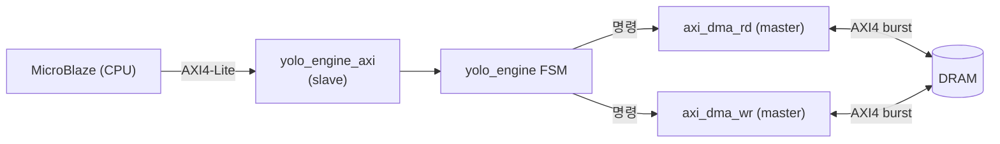
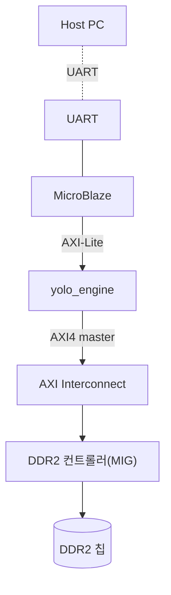

# 17장. RTL — AXI / DMA 인터페이스 (코드 해설)

> [← 16장 특수 연산 유닛](16_rtl_special_units.md) · [목차](README.md) · 다음 장: [18장 동작 과정과 타이밍 →](18_operation_timing.md)
> **이 장을 읽기 위한 준비**: [5장 AXI 프로토콜](05_axi_basics.md), [4장 FSM](04_rtl_timing_basics.md).

---

가속기가 외부 세계와 통신하는 경계입니다: DRAM과 데이터를 주고받는 **DMA 한 쌍**(`axi_dma_rd`, `axi_dma_wr`), CPU 명령을 받는 **AXI-Lite slave**(`yolo_engine_axi`), 그리고 합성/시뮬을 가르는 매크로 파일. [5장](05_axi_basics.md)에서 배운 AXI 개념이 실제 코드로 어떻게 나타나는지 봅니다.

---

## 17.1 통신 경계 전경



[5장 5.2](05_axi_basics.md)에서 본 대로, yolo_engine은 CPU에 **slave**(명령 받음), DRAM에 **master**(직접 접근)입니다.

---

## 17.2 axi_dma_rd.v — DRAM 읽기 DMA

[axi_dma_rd.v](../../yolohw/src/axi_dma_rd.v)는 DRAM에서 가중치·bias·입력을 읽어옵니다. [5장 5.6](05_axi_basics.md)의 DMA 엔진입니다.

### 기능 인터페이스 — yolo_engine과 약속

```verilog
input  start_dma;              // 1클럭 펄스: 시작
input  [BITS_TRANS-1:0] num_trans;   // 읽을 워드 수
input  [AXI_WIDTH_AD-1:0] start_addr; // DRAM 시작 주소
output data_o, data_vld_o;     // 받은 데이터 (1클럭 지연)
output done_o;                 // 완료 펄스
```

yolo_engine이 "이 주소에서 N워드 읽어"(`start_dma`, `start_addr`, `num_trans`)라고 시키면, DMA가 알아서 AXI burst로 읽어 `data_o`로 흘려줍니다. 다 되면 `done_o`([5장 5.6](05_axi_basics.md)).

### 🔍 코드 해설 — 5-state FSM

```verilog
localparam RD_IDLE=0, RD_PRE=1, RD_START=2, RD_SEQ=3, RD_WAIT=4;

case(st_rdaxi)
    RD_IDLE:  if(start_dma_d) next = RD_PRE;           // 시작 대기
    RD_PRE:   if(q_burst_cnt_rd == num_trans_d) next = RD_IDLE;  // 다 읽음 → 종료
              else next = RD_START;                     //  아니면 burst 시작
    RD_START: if(ext_arready) begin                     // AR 핸드셰이크
                  ext_arvalid = 1'b1;
                  ext_arlen   = q_burst_size_rd;          // burst 길이
                  ext_arsize  = 3'b010;                   // 4바이트/beat
                  ext_arburst = 2'b01;                    // INCR
                  next = RD_SEQ;
              end
    RD_SEQ:   if(ext_rlast_r) next = RD_WAIT;            // 마지막 beat 수신
    RD_WAIT:  begin d_burst_cnt += burst_size; next = RD_PRE; end // 다음 burst
endcase
```

[5장 5.3 handshake](05_axi_basics.md)와 [5장 5.5 burst](05_axi_basics.md)가 보입니다:
- `RD_START`: AR 채널로 "이 주소에서 burst 길이만큼 줘" 요청. `ext_arready`(slave 준비)를 확인하고 `ext_arvalid`(요청 유효)를 올림 = 핸드셰이크.
- `ARSIZE=4바이트`, `ARBURST=INCR`(주소 자동 증가).
- `RD_SEQ`: R 채널에서 데이터가 줄줄이 들어옴. `ext_rlast`(마지막 beat)까지 받음.
- `RD_WAIT → RD_PRE`: 다음 burst로. `num_trans`를 다 읽을 때까지 반복.

### 🔍 코드 해설 — burst 분할

```verilog
localparam FIXED_BURST_SIZE = 256;   // 한 burst에 256워드(1KB)

if(q_burst_cnt_rd + FIXED_BURST_SIZE > num_trans_d)
    q_burst_size_rd <= num_trans_d[7:0] - 1;   // 마지막 burst: 남은 만큼
else
    q_burst_size_rd <= FIXED_BURST_SIZE - 1;    // 중간 burst: 256개
```

큰 데이터를 **256워드(1KB) 단위**로 나눠 여러 burst로 읽습니다([5장 5.5](05_axi_basics.md)). 마지막 burst는 남은 워드만큼만. 주소를 매번 보내는 오버헤드를 줄여 대역폭을 높입니다.

> `M_RREADY`(받을 준비)는 항상 1입니다 — 데이터가 오는 대로 즉시 받습니다(back-pressure 없음).

---

## 17.3 axi_dma_wr.v — DRAM 쓰기 DMA

[axi_dma_wr.v](../../yolohw/src/axi_dma_wr.v)는 출력 버퍼의 결과를 DRAM에 씁니다. 읽기와 대칭이지만, **데이터를 yolo_engine에서 받아야** 하므로 요청 신호가 추가됩니다.

### 🔍 코드 해설 — 데이터 요청

```verilog
output indata_req_o;     // "다음 데이터 줘" 요청
input  indata;           // yolo_engine이 공급하는 데이터
```

`indata_req_o=1`인 클럭의 **다음 클럭에 `indata`가 유효**해야 합니다(1클럭 look-ahead). yolo_engine은 이 요청에 맞춰 출력 버퍼 읽기 주소를 진행시켜 데이터를 공급합니다([13장 13.9](13_rtl_yolo_engine_top.md)).

### 6-state FSM

```
WR_IDLE → WR_PRE → WR_START → WR_SEQ → WR_WAIT → (반복)
```

- `WR_START`: AW 채널로 주소·길이 전송([5장 5.3](05_axi_basics.md)).
- `WR_SEQ`: W 채널로 데이터 beat 전송, `M_WSTRB=4'b1111`(4바이트 모두 유효), 마지막에 `M_WLAST=1`.
- `WR_WAIT`: B 채널 응답(`BRESP=OKAY`) 대기. AXI 쓰기는 응답 채널(B)이 있어 "잘 썼는지" 확인합니다([5장 5.4](05_axi_basics.md)).

---

## 17.4 yolo_engine_axi.v — CPU 제어 받기

[yolo_engine_axi.v](../../yolohw/src/yolo_engine_axi.v)는 [5장 5.4](05_axi_basics.md)의 AXI4-Lite slave로, CPU가 읽고 쓰는 제어 레지스터 4개를 제공합니다.

### 레지스터 맵

| 주소 | 레지스터 | 의미 |
|------|----------|------|
| 0x0 | `ctrl_reg0` | `[0]`=ap_start(쓰기), 읽으면 `[1]`=network_done |
| 0x4 | `ctrl_reg1` | 가중치 DRAM 주소 |
| 0x8 | `ctrl_reg2` | 입력 DRAM 주소 |
| 0xC | `ctrl_reg3` | 출력 DRAM 주소 |

### 🔍 코드 해설 — 완료 polling 트릭

```verilog
// ctrl_reg0를 읽을 때, bit[1]에 network_done을 끼워 넣음
reg_data_out = { slv_reg0[31:2], network_done, slv_reg0[0] };
```

CPU는 `ctrl_reg0`을 반복해서 읽으며 bit[1](`network_done`)이 1이 되기를 기다립니다. RTL이 추론을 끝내면 `network_done`을 1로 올리고, CPU가 그것을 읽어 "완료"를 압니다.

```
CPU: ctrl_reg1/2/3 ← 주소 쓰기
     ctrl_reg0 ← 1 (ap_start)
     loop { ctrl_reg0 읽기 → bit1==1 ? 완료 : 계속 대기 }
     → 출력 DRAM 읽어 후처리
```

이 흐름이 [22장 host.py](22_appendix_future.md)의 추론 시퀀스입니다.

---

## 17.5 user_define_h.v / define.v — 매크로

[user_define_h.v](../../yolohw/src/user_define_h.v)는 [8장 8.8](08_dev_environment.md)에서 본 `` `define FPGA `` 를 정의합니다.

```verilog
`define NUM_BRAMS  16
`define BRAM_WIDTH 128
//`define FPGA  1        // ← 합성 시 주석 해제 / 시뮬 시 주석 (현재)
```

`` `define FPGA `` 가 켜지면 합성용 IP(DSP48·BRAM) 경로, 꺼지면 시뮬용 behavioral 경로가 컴파일됩니다([3장 3.6](03_fpga_basics.md), [4장 4.7](04_rtl_timing_basics.md)). 합성에 필요한 IP 목록도 이 파일 주석에 정리되어 있습니다([21장](21_vivado_project.md)).

[define.v](../../yolohw/src/define.v)는 `mul.v`가 참조하는 빈 stub입니다. 실제 매크로는 모두 `user_define_h.v`에 있고, 이 파일은 컴파일 호환성용으로 비어 있습니다.

---

## 17.6 Phase 3 — 실제 SoC 통합 (전망)

현재 Phase 1·2에서는 Testbench가 가짜 DRAM 모델로 AXI에 응답합니다([19장](19_testbench_strategy.md)). Phase 3에서는 실제 SoC에 통합됩니다([22장](22_appendix_future.md)).



yolo_engine의 master 2개(읽기·쓰기)가 interconnect를 거쳐 MicroBlaze와 DDR2 대역폭을 공유합니다. DMA 코드는 그대로 재사용됩니다.

---

## 17.7 이 장의 요약

- 데이터 평면: `axi_dma_rd`(5-state, 256워드 burst)와 `axi_dma_wr`(6-state, indata 1클럭 look-ahead 공급)의 master 한 쌍.
- 두 DMA 모두 [5장](05_axi_basics.md)의 handshake·burst·INCR을 코드로 구현, `done_o`로 완료 알림.
- 제어 평면: `yolo_engine_axi`(AXI-Lite slave) — ctrl_reg0~3(ap_start·주소), 읽기 시 bit[1]에 network_done 끼워 polling 지원.
- `user_define_h.v`의 `` `define FPGA `` 가 합성/시뮬 전환, `define.v`는 빈 호환 stub.
- Phase 3에서 MicroBlaze + interconnect + DDR2와 통합 예정.

이것으로 모든 RTL 모듈(13~17장)을 다뤘습니다. 다음 장에서는 이들이 시간 축에서 어떻게 협력하는지 **동작·타이밍**을 종합합니다.

---

> [← 16장 특수 연산 유닛](16_rtl_special_units.md) · [목차](README.md) · 다음 장: [18장 동작 과정과 타이밍 →](18_operation_timing.md)
