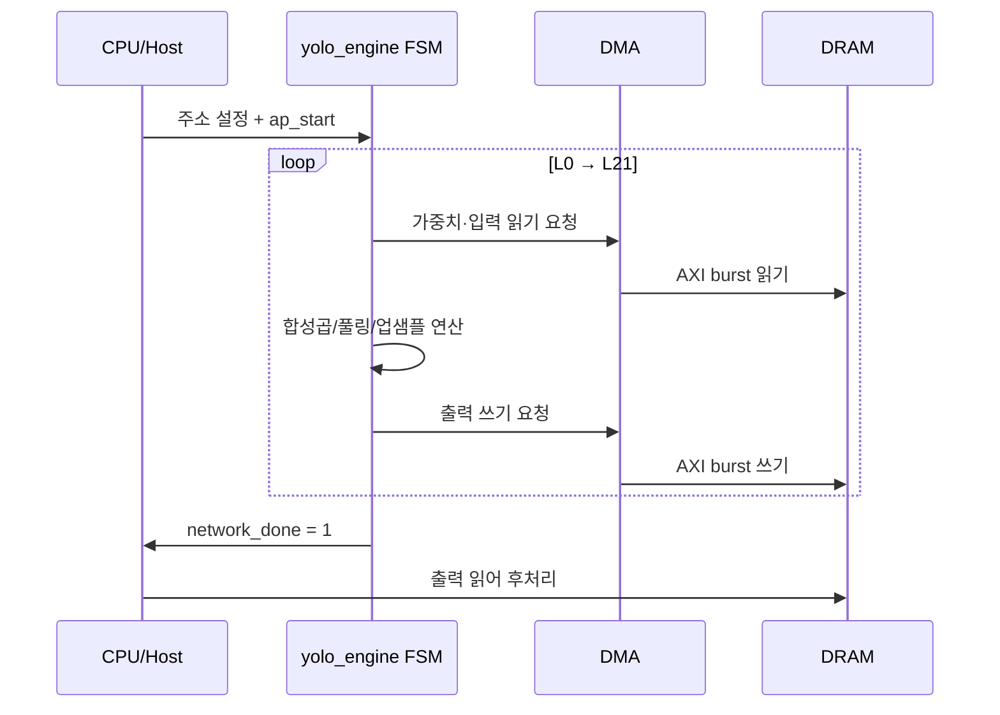

# 18장. 동작 과정과 타이밍

> [← 17장 AXI/DMA](17_rtl_axi_dma.md) · [목차](README.md) · 다음 장: [19장 검증 전략 →](19_testbench_strategy.md)
> **이 장을 읽기 위한 준비**: [4장 4.3 파이프라인](04_rtl_timing_basics.md), [13~17장 RTL 모듈](13_rtl_yolo_engine_top.md).

---

[13~17장](13_rtl_yolo_engine_top.md)에서 모듈을 하나씩 봤다면, 이 장은 그것들이 **시간 축에서 어떻게 협력해 한 장의 추론을 완성하는지** 종합합니다. 전체 시퀀스 → 레이어 내부 → MAC 파이프라인 → 성능 추정 순으로 좁혀 들어갑니다.

---

## 18.1 전체 추론 시퀀스

`ap_start` 한 번으로 [yolo_engine](13_rtl_yolo_engine_top.md) FSM이 L0부터 L21까지 자동 순회합니다.



"읽기 → 연산 → 쓰기"가 22번 반복됩니다([11장 11.3](11_hardware_overview.md)). 시간 비중은 합성곱이 압도적입니다([10장 10.7](10_network_architecture.md)).

```
████████████████████████████ 합성곱 (88%, 특히 6개 3×3 레이어)
███ 1×1 합성곱 + 검출 헤드
█ 풀링/업샘플/REPACK (제어 오버헤드)
```

---

## 18.2 합성곱 한 레이어의 cycle 흐름

[13장 13.6](13_rtl_yolo_engine_top.md)의 이중 루프를 시간으로 펼치면:

```
레이어 시작
 └ bias 읽기 (레이어당 1회)
 └ for 행블록 rb:
      └ 입력 읽기 (DMA) → 라인 버퍼          ← DMA 시간
      └ for 필터 fi:
           └ 가중치 읽기 (DMA) → gbuff        ← DMA 시간
           └ conv_top 실행 (1필터×1행블록)    ← 연산 시간
           └ 출력 쓰기 (DMA)                  ← DMA 시간
```

핵심 관찰:
- **DMA와 연산이 순차로 일어납니다.** 현재 구조는 "읽고 → 계산하고 → 쓰기"가 직렬이라 단순하지만, DMA 시간이 연산 시간에 더해집니다.
- 작은 레이어(L17)는 DMA·제어 오버헤드 비중이, 큰 레이어(L2~L10)는 연산 비중이 큽니다.

---

## 18.3 MAC 파이프라인 타이밍 — latency vs throughput

[4장 4.3](04_rtl_timing_basics.md)에서 배운 두 개념이 여기서 빛납니다. conv_top의 `ST_RUN` 구간을 보면:

```
입력 (매 클럭) ──┐
                 ├ 곱셈 4 ┐
                 │        ├ 가산트리 4 ┐
                 │        │            ├ 누적 acc_len ┐
                 │        │            │              ├ 후처리 1 → 출력
   총 latency = 8 + acc_len + 1
```

### 중요 — latency는 보이지 않고 throughput이 진짜 속도

```
클럭:  0   1   2  ...  acc_len  ...
입력:  ●   ●   ●  ...   (다음 픽셀 그룹)
출력:           (채움 후)  매 acc_len 클럭마다 4픽셀 ✓
```

[4장 4.3](04_rtl_timing_basics.md)의 공장 비유처럼, 파이프라인이 차면 **`acc_len` 클럭마다 4픽셀**이 나옵니다. latency(`8+acc_len+1`)는 파이프라인 채움·비움(`ST_LOAD`/`ST_DRAIN`)에만 보입니다.

| 레이어 | acc_len | 처리량 |
|--------|---------|--------|
| L0 (Ci=3) | 1 | 1클럭마다 4픽셀 (가장 빠름) |
| L10 (Ci=256) | 64 | 64클럭마다 4픽셀 |

> 🔑 채널이 깊을수록(acc_len↑) 한 출력당 오래 걸리지만, 출력 공간이 작아(8×8) 균형이 맞습니다. [10장 10.7](10_network_architecture.md)에서 본 "6개 3×3 레이어가 모두 75.5 M MAC으로 같은" 구조적 균형과 같은 이치입니다.

---

## 18.4 BRAM latency 정렬 — 종합

이 설계에서 가장 섬세한 부분은 [4장 4.4·4.8](04_rtl_timing_basics.md)에서 본 **여러 BRAM·파이프라인 지연을 한 클럭도 안 어긋나게 맞추는 것**입니다. 곳곳의 정렬 장치를 한 표에 모으면:

| 위치 | 장치 | 목적 |
|------|------|------|
| conv_top → gbuff | `mac_vld_d`(1클럭 지연) | 가중치 BRAM latency 1 흡수 |
| conv_top → 라인버퍼 | look-ahead 좌표 | 라인버퍼 latency 2 보상 |
| 라인버퍼 내부 | `offset_r` 등 pipeline | BRAM 출력과 판정 정렬 |
| max_pool | `issued_d` 지연 플래그 | 읽기 결과 샘플 타이밍 |
| max_pool_s1 | phase 0~3 발사 / 2~5 샘플 | 4-read 순차 정렬 |
| DMA | `start_dma_d`, `ext_rlast_r` 래치 | AXI 핸드셰이크 정렬 |

> ⚠️ Phase 2 버그 상당수가 이 정렬 문제였습니다. 한 클럭만 틀려도 결과가 완전히 망가지므로 가장 조심하는 부분입니다([14장 14.7](14_rtl_convolution_engine.md), [4장 4.8](04_rtl_timing_basics.md)).

---

## 18.5 특수 레이어 타이밍

[16장](16_rtl_special_units.md)에서 본 유닛들의 cycle 비용:

| 레이어 | 유닛 | 클럭/단위 | 총 클럭(대략) |
|--------|------|-----------|----------------|
| L1/3/5/7/9 | max_pool | ~1/word | 입력 word 수 |
| L11 | max_pool_s1 | 7/block | ~57,000 |
| L18 | upsample | 6/block | ~12,000 |
| REPACK | FSM | 9~13/단위 | (작음) |

합성곱에 비하면 작지만, 각 레이어 전후로 DMA가 직렬로 붙어 무시 못 할 오버헤드가 됩니다.

---

## 18.6 DMA 타이밍

[17장](17_rtl_axi_dma.md)의 DMA는 256워드(1KB) burst 단위입니다([5장 5.5](05_axi_basics.md)).

```
start_dma → [준비 → AR 핸드셰이크 → 256 beat 수신 → 응답] × burst 수 → done
```

- 한 burst = AR 핸드셰이크(수 클럭) + 256 beat(이상적 256클럭) + 응답.
- 큰 레이어의 입력·가중치는 여러 burst로 나뉘고, burst 사이 오버헤드가 누적됩니다.
- 실제 DDR2 대역폭·지연은 Phase 3에서 확정됩니다([22장](22_appendix_future.md)).

---

## 18.7 성능 추정

> ⚠️ 아래는 **이상적 합성곱 처리량 기반 거친 추정**입니다. DMA 대기·제어 오버헤드·실제 DDR2 대역폭이 빠져 있어, 확정 fps·전력은 [Phase 4 보드 측정](22_appendix_future.md)에서 결정됩니다.

### 합성곱 클럭 (이상적)

레이어 클럭 ≈ `(출력너비/2) × (출력높이/2) × 출력채널 × acc_len`:

| 레이어 | 클럭 (대략) |
|--------|-------------|
| L0 | 262 K |
| L2,4,6,8,10,13 (각) | 524 K |
| L12 | 524 K |
| L14 | 399 K |
| L17 | 131 K |
| L20 | 1198 K |
| **합계** | **≈ 5.7 M 클럭** |

### fps 추정

```
이상적 합성곱:  5.7 M 클럭 @ 100 MHz = 57 ms → ~17 fps (합성곱만)
오버헤드 포함:  DMA·풀링·REPACK·파이프라인 → 더 느려짐
목표:          5 fps = 200 ms = 20 M 클럭 @ 100 MHz
```

- 이상적으로는 ~17 fps이지만, DMA·제어 오버헤드를 더하면 낮아집니다.
- 목표 **5 fps(20 M 클럭 예산)** 안에 들 가능성이 높습니다. 합성곱 5.7 M에 오버헤드를 더해도 여유가 있습니다.
- 정확한 값은 실제 클럭 주파수(timing closure 후, [3장 3.7](03_fpga_basics.md))와 DDR2 대역폭에 좌우됩니다.

---

## 18.8 Energy — 점수의 분모

[7장 7.2](07_project_overview.md)에서 점수 분모가 Energy임을 봤습니다. 이 설계가 Energy를 줄이는 선택들:

| 선택 | 효과 | 배운 곳 |
|------|------|---------|
| INT8 정수 연산 | 곱셈기·스위칭 에너지 ↓ | [2장](02_quantization_basics.md) |
| 144-MAC 병렬 + 빠른 완료 | 짧은 시간 → 누설 에너지 ↓ | [14장](14_rtl_convolution_engine.md) |
| 온칩 버퍼 재사용(streaming, in-place) | DRAM 접근 ↓ (최대 에너지원) | [3장 3.4](03_fpga_basics.md), [15·16장](15_rtl_memory_buffers.md) |
| 연산 유닛 1개 재사용 | 유휴 면적 ↓ | [11장](11_hardware_overview.md) |

> 🔑 DRAM 접근이 온칩 연산보다 훨씬 큰 에너지를 씁니다. 그래서 **streaming 가중치 + in-place 풀링 + 출력 버퍼 재사용**이 Energy 점수에 직접 기여합니다. 실측 전력은 Phase 4 보드 측정으로 확정됩니다.

---

## 18.9 이 장의 요약

- `ap_start` 하나로 FSM이 L0~L21을 순회, 레이어마다 `읽기 → 연산 → 쓰기` 반복.
- 합성곱 한 (필터,행블록)은 `채움(ST_LOAD) + 운전(ST_RUN) + 비움(ST_DRAIN)`; 처리량은 `4픽셀/acc_len 클럭`.
- MAC latency `8+acc_len+1`은 채움·비움에만 보이고, 정상 운전은 acc_len 주기로 4픽셀(throughput이 진짜 속도).
- 여러 BRAM·파이프라인 지연을 look-ahead·지연 플래그로 정밀 정렬(Phase 2 버그 영역).
- 이상적 합성곱 ~5.7 M 클럭(≈17 fps@100 MHz), 오버헤드 포함해도 목표 5 fps 예산 내 가능 — 확정은 Phase 4.
- Energy는 INT8·버퍼 재사용으로 절감(DRAM 접근 최소화가 핵심).

다음 장부터는 이 동작이 "정확한지" 확인하는 **검증(Testbench)** 을 봅니다.

---

> [← 17장 AXI/DMA](17_rtl_axi_dma.md) · [목차](README.md) · 다음 장: [19장 검증 전략 →](19_testbench_strategy.md)
