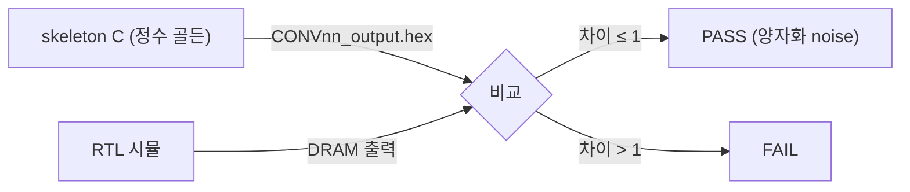
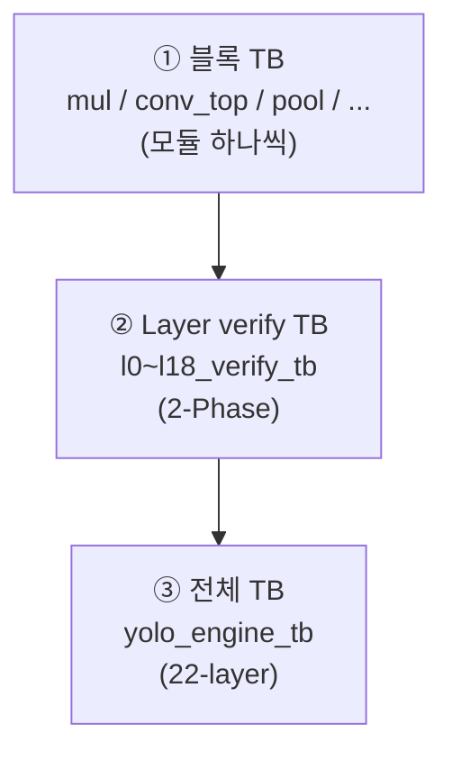

# 19장. 검증 전략과 인프라

> [← 18장 동작과 타이밍](18_operation_timing.md) · [목차](README.md) · 다음 장: [20장 Layer별 / 블록 Testbench →](20_testbench_per_layer.md)
> **이 장을 읽기 위한 준비**: [9장 skeleton 골든](09_skeleton_reference.md), [2장 2.10 tolerance](02_quantization_basics.md).

---

"RTL이 정확한가?"를 객관적으로 판정하는 방법을 다룹니다. 검증을 이해하면 [20장](20_testbench_per_layer.md)의 결과(mismatch 수)를 올바로 읽을 수 있습니다.

---

## 19.1 검증 철학 — 골든과 비교

모든 검증의 기준은 하나입니다: **"RTL 출력이 skeleton C(정수 골든)와 같은가?"** ([9장](09_skeleton_reference.md))



- **PASS**: 골든과 정확히 같거나(exact), `|RTL − 골든| ≤ 1`. 1 LSB 차이는 [2장 2.10](02_quantization_basics.md)에서 본 양자화/반올림 noise로 간주.
- 이 정의 덕분에 "정확함"이 주관이 아니라 **측정 가능한 수치**(mismatch 개수)가 됩니다.

💡 **비유**: 채점 기준표가 있는 시험과 같습니다. "정답(골든)과 한 자리 차이까지는 정답 처리"라는 명확한 기준이 있어, 누가 채점해도 같은 결과가 나옵니다.

---

## 19.2 3계층 검증 — 작은 것부터

검증은 작은 단위부터 전체까지 쌓아 올립니다.



| 계층 | TB | 검증 대상 |
|------|-----|-----------|
| ① 블록 | `mul_tb`, `conv_top_tb`, `pool_tb`, ... | 단일 모듈 |
| ② 레이어 | `l0~l18_verify_tb` | 한 레이어 (단독 + chain) |
| ③ 전체 | `yolo_engine_tb` | 22-layer 완주 |

작은 단위가 맞아야 큰 단위로 올라갑니다. 자세한 내용은 [20장](20_testbench_per_layer.md).

---

## 19.3 2-Phase 검증 — 같은 레이어를 두 방식으로

Layer verify TB의 핵심입니다. **같은 레이어를 두 방식으로** 검증해 신뢰도를 높입니다.

### Phase A — Standalone (단위 테스트)

해당 레이어만 단독 실행. golden 입력을 직접 넣으므로 **그 레이어 RTL의 정확성만** 분리 검증합니다.

```verilog
// golden 입력을 REPACK해서 DRAM에 배치
software_repack_l13_ifm;
// 레이어 진입점으로 강제 점프 (force)
force u_yolo_engine.layer_idx    = 5'd13;
force u_yolo_engine.conv_phase_r = 5'd13;
force u_yolo_engine.state_r      = 6'd1;   // S_LOAD_BIAS
// release 후 실행 → 완료까지 대기 → 비교
release ...;
wait (u_yolo_engine.layer_idx == 5'd14);
compare_l13_ofm(mm_A, tf_A);
```

💡 **비유**: `force`/`release`는 게임의 "치트키로 특정 스테이지로 점프"하는 것입니다. L0부터 다 거치지 않고 곧장 L13으로 가서 L13만 테스트합니다.

### Phase B — Chain (통합 테스트)

`ap_start`만 주고 L0부터 자연 진행. 이전 레이어 출력이 누적되어 들어오므로 **REPACK·레이어 연결·FSM 전체**까지 검증합니다.

```verilog
force slv_reg0 = 1;                       // ap_start만
wait (u_yolo_engine.layer_idx == 5'd14);  // L0~L13 자연 진행
compare_l13_ofm(mm_B, tf_B);
```

> 🔑 **두 Phase가 모두 PASS여야 신뢰**합니다. Phase A만 보면 "레이어는 맞지만 연결이 틀렸을" 수 있고, Phase B만 보면 "어느 레이어가 틀렸는지" 모릅니다. 둘을 비교해 이중 확인합니다.

---

## 19.4 통일 로그 포맷

모든 verify TB는 같은 형식의 로그를 출력합니다(canonical = `l13_verify_tb`). 그래야 결과를 한눈에 비교할 수 있습니다.

```
[L13V-TB] ============== Phase A : Standalone L13 ==============
[L13V-TB] delta dist : total=0  +d=0  -d=0  max|d|=0
[L13V-TB]   |d|=1    : 0  (0%)
[L13V-TB]   |d|>1 (tol-exceed) : 0
[L13V-TB][Phase A] *** PASS (exact, 0 mismatches) ***
[L13V-TB] Phase A : PASS (mismatch=0, tol-exceed=0)
[L13V-TB] Phase B : PASS (mismatch=0, tol-exceed=0)
```

규칙: 태그 `[LNNV-TB]`, `TOLERANCE=1`, 판정 3분기(exact PASS / tolerance PASS / FAIL), **ASCII만**(→는 `->`, ×는 `x`). 단 코드 주석은 한글 유지([CLAUDE.md 메모리](../../CLAUDE.md)).

---

## 19.5 Tolerance와 delta 분포 — 디버깅의 단서

`compare` 작업은 단순 통과/실패가 아니라 **오차의 분포**를 셉니다.

```verilog
if (got !== exp) begin
    mismatch_cnt++;
    abs_diff = |got - exp|;
    // |d|=1, 2, 3, 4~8, >8 구간별로 카운트
    if (abs_diff > TOLERANCE) tol_fail_cnt++;   // 진짜 실패
end
```

이 분포가 버그의 종류를 알려줍니다:

| 패턴 | 의미 |
|------|------|
| 대부분 `\|d\|=1` | 양자화/반올림 noise (정상, PASS) |
| `\|d\|`가 크거나 특정 패턴 | 진짜 RTL 버그 |

> 🔑 예: L14의 `got=00 exp=ff`는 ReLU가 음수를 잘못 0으로 만든 버그, `\|d\|=1`이 98%면 toward-zero rounding 차이([2장 2.7](02_quantization_basics.md)). 분포를 보면 "어디를 고쳐야 하는지"가 보입니다 — [20장 20.3](20_testbench_per_layer.md)의 L14 디버깅 사례에서 실제로 활용됩니다.

---

## 19.6 가짜 DRAM 모델

verify TB는 각자 **간단한 AXI4 slave DRAM 모델**을 내장합니다. 실제 DDR2 대신 시뮬레이션에서 메모리 역할을 합니다.

```verilog
reg [31:0] dram [0:DRAM_WORDS-1];        // 4M word = 16 MB 배열
// 읽기 FSM: M_ARVALID 받으면 dram[addr]를 beat로 출력
// 쓰기 FSM: M_WVALID 받으면 dram[addr] = M_WDATA
```

[5장](05_axi_basics.md)의 AXI 핸드셰이크에 응답하는 단순 모델입니다. `dram_zero`로 0 초기화해 [4장 4.7](04_rtl_timing_basics.md)의 X 문제를 피합니다.

더 정교한 [sim_dram_model/](../../yolohw/testbench/sim_dram_model/)(FIFO 기반 AXI SRAM)은 전체 통합 TB(`yolo_engine_tb`)에서 보드 DDR2에 가까운 동작을 모델링합니다.

---

## 19.7 Software REPACK — 골든 입력 준비

Phase A는 golden 입력(채널순서)을 합성곱 입력 포맷(NHWC entry)으로 직접 변환해 DRAM에 넣습니다. 이는 [16장 16.5](16_rtl_special_units.md)의 RTL REPACK의 **소프트웨어 참조 구현**이기도 합니다.

```verilog
// golden(채널순서) → DRAM(NHWC entry)
tb[col_l*4 + ch_l] = golden[(ci_g*4+ch_l)*64 + row*8 + (col_b*4+col_l)];
```

> 🔑 Phase A(software REPACK)와 Phase B(RTL REPACK)가 둘 다 PASS면, **RTL REPACK이 소프트웨어 참조와 일치**함이 증명됩니다([12장 12.3](12_data_representation_memory_map.md)).

---

## 19.8 이 장의 요약

- 검증 기준: "RTL == skeleton C 정수 골든", `|차이| ≤ 1`이면 PASS(양자화 noise).
- 3계층(블록 → 레이어 verify → 전체)으로 작은 것부터 검증.
- verify TB는 2-Phase: A(force/release 단독, 단위 테스트) + B(ap_start chain, 통합). 둘 다 PASS여야 신뢰.
- 통일 로그(canonical=l13): TOLERANCE=1, delta 분포, 3분기 판정, ASCII만.
- delta 분포가 버그 종류를 가리킴(|d|=1=noise, 큰 값/패턴=진짜 버그).
- 가짜 DRAM 모델 + software REPACK(RTL REPACK의 참조)로 검증.

다음 장에서는 L0~L18 각 TB와 결과를 구체적으로 봅니다.

---

> [← 18장 동작과 타이밍](18_operation_timing.md) · [목차](README.md) · 다음 장: [20장 Layer별 / 블록 Testbench →](20_testbench_per_layer.md)
