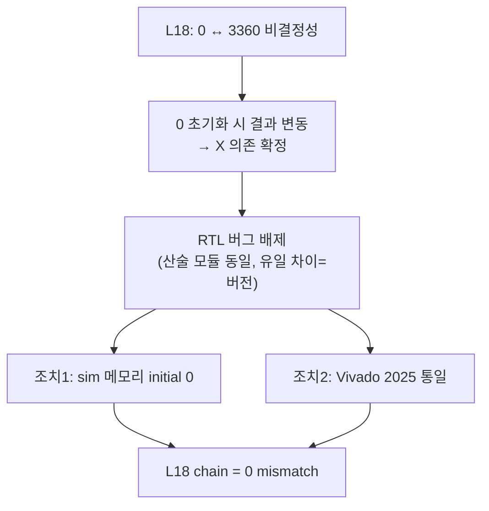

# 21장. Vivado 프로젝트

> [← 20장 Layer별 Testbench](20_testbench_per_layer.md) · [목차](README.md) · 다음 장: [22장 부록 →](22_appendix_future.md)
> **이 장을 읽기 위한 준비**: [3장 3.6 합성흐름](03_fpga_basics.md), [4장 4.7 X 초기화](04_rtl_timing_basics.md).

---

RTL을 실제 FPGA 비트스트림으로 만들고 시뮬레이션하는 Vivado 환경을 봅니다. 프로젝트 생성·BMG IP·합성/시뮬 흐름, 그리고 **검증 정확성을 좌우한 Vivado 버전 이슈**를 다룹니다.

---

## 21.1 프로젝트 개요

| 항목 | 값 |
|------|----|
| 도구 | **Vivado 2025.x** |
| FPGA | `xc7a100tcsg324-1` (Nexys A7-100T) |
| Top 모듈 | `yolo_engine` |

[yolohw/fpga/](../../yolohw/fpga/) 구성:

| 파일 | 역할 |
|------|------|
| `create_project_25.tcl` | Vivado 2025 프로젝트 생성 (권장) |
| `gen_bram_ips.tcl` | BRAM IP 생성 |
| `NEXYS_A7_100T.xdc` | 핀·클럭 제약 |
| `vivado_yolohw/` | 생성된 프로젝트 |
| `vitis/` | MicroBlaze 펌웨어 (Phase 3) |

---

## 21.2 프로젝트 생성 — create_project_25.tcl

[create_project_25.tcl](../../yolohw/fpga/create_project_25.tcl)이 깨끗한 새 프로젝트를 만듭니다.

```tcl
# Windows Vivado 2025.x Tcl Console
set fpga_dir "Z:/2026 CAU/AIX2026/git/Yolo_Accelerator/yolohw/fpga"
source $fpga_dir/create_project_25.tcl
```

### 🔍 핵심 — 합성 fileset에만 매크로 주입

```tcl
add_files -norecurse [glob $origin_dir/../src/*.v]      # RTL 추가
set_property verilog_define {FPGA=1} [get_filesets sources_1]  # 합성에만 FPGA 매크로
```

[8장 8.8](08_dev_environment.md)에서 본 매크로 문제를 우아하게 해결합니다: 파일의 `` `define FPGA `` 는 주석으로 두고(시뮬 기본), **합성 fileset(`sources_1`)에만 `FPGA=1`을 주입**합니다. 이러면:
- 합성 → FPGA 매크로 ON (실제 IP)
- 시뮬 → 매크로 OFF (behavioral)

이 분리가 **파일을 수정하지 않고** 자동으로 됩니다. 매크로를 깜빡 켜두거나 꺼두는 실수를 방지합니다([8장 8.8](08_dev_environment.md)).

---

## 21.3 BRAM IP — gen_bram_ips.tcl

[gen_bram_ips.tcl](../../yolohw/fpga/gen_bram_ips.tcl)이 [3장 3.4](03_fpga_basics.md)의 BRAM(BMG IP)을 생성합니다. 합성 시 [15장](15_rtl_memory_buffers.md)의 버퍼들이 이 IP로 실체화됩니다.

| IP | 종류 | 크기 | 용도 |
|----|------|------|------|
| `dpram_4096x72` | Simple DP | 쓰기72 / **읽기288** | 가중치 (비대칭) |
| `spram_2560x32` | Single | 32×2560 | bias |
| `dpram_2048x128_tdp` | True DP | 128×2048 | 라인 버퍼 (×4) |
| `dpram_65536x32` | Simple DP | 32×65536 | 출력 버퍼 (256KB) |

> 🔑 **두 가지 중요 설정**:
> - 모두 **"No Output Register"** → read latency **1클럭**([3장 3.4](03_fpga_basics.md), [4장 4.4](04_rtl_timing_basics.md)). [15장](15_rtl_memory_buffers.md) 시뮬 모델의 `N_DELAY=1`과 일치. output register를 켜면 latency 2가 되어 [14장 14.7](14_rtl_convolution_engine.md)의 정렬이 깨집니다.
> - `dpram_4096x72`는 쓰기72/읽기288 **비대칭**([12장 12.4](12_data_representation_memory_map.md)) → 한 번 읽으면 가중치 36개.

---

## 21.4 제약 — NEXYS_A7_100T.xdc

[NEXYS_A7_100T.xdc](../../yolohw/fpga/NEXYS_A7_100T.xdc)는 보드의 핀 매핑과 클럭 제약을 정의합니다. 클럭 입력, 리셋, LED(`network_done_led`)를 FPGA 핀에 연결합니다. 실제 클럭 주파수는 구현 후 확정되며 [18장 18.7](18_operation_timing.md)의 fps 추정을 좌우합니다.

---

## 21.5 합성 / 시뮬 흐름

```tcl
# 합성 (FPGA 매크로 자동 ON)
launch_runs synth_1 -jobs 4
launch_runs impl_1 -to_step write_bitstream -jobs 4

# 시뮬 (FPGA 매크로 OFF, behavioral)
set_property top l18_verify_tb [get_filesets sim_1]
launch_simulation
```

- 합성: DSP48·BRAM IP를 명시적으로 사용([3장 3.3~3.4](03_fpga_basics.md)).
- 시뮬: `log_all_signals` OFF 유지(디스크 폭증 방지, [8장 8.7](08_dev_environment.md)).

---

## 21.6 Vivado 2021 vs 2025 — 검증 정확성의 함정

> [4장 4.7](04_rtl_timing_basics.md)에서 예고한 "uninitialized X" 문제의 실제 사례입니다. 매우 교육적이니 자세히 봅니다.

### 증상

L18 chain 검증에서 **같은 RTL·데이터·TB인데 환경에 따라 결과가 0 ↔ 3360 mismatch로 달라졌습니다.**

| Vivado | L18 chain 결과 |
|--------|----------------|
| **2025** | **0 mismatch** ✅ |
| 2021 | 3360 mismatch |

### 원인 — uninitialized 메모리(X)의 버전별 처리 차이

[4장 4.7](04_rtl_timing_basics.md)에서 본 X(unknown)가 범인이었습니다. 초기화 안 된 behavioral 메모리의 X를 Vivado 버전마다 다르게 처리한 것입니다.

**결정적 증거**: 메모리를 0으로 강제 초기화하니 2021 결과가 3360 → **3676으로 바뀜**. 즉 chain 결과가 미초기화 메모리 값에 의존한다는 직접 증거.

### RTL 버그가 아님을 확인한 과정

| 검증 | 결과 |
|------|------|
| golden 자가 일관성 | 100% (인접 레이어 출력==입력) |
| 다른 PC와 산술 모듈 비교 | mul/mac_kern/... **완전히 동일(byte-identical)** |
| 입력·골든·TB 비교 | **모두 동일** |
| 유일한 차이 | **Vivado 버전** |

### 해결

1. **시뮬 메모리를 `initial` 0 초기화** ([15장 15.3](15_rtl_memory_buffers.md)): `dpram_wrapper`, `spram_wrapper`, `ifm_line_buf`, `gbuff_param`. 합성에는 영향 없고(BMG IP 경로), 실제 FPGA BRAM의 0 초기화와 일치 → **fps·Energy·정확도 무관**.
2. **검증을 Vivado 2025로 통일**.



> 🔑 **교훈**: mismatch가 보인다고 항상 RTL 버그는 아닙니다. 시뮬레이션 환경(초기화·버전)도 원인일 수 있습니다. 산술 모듈이 동일하고 유일한 차이가 도구 버전이라면, 환경을 의심해야 합니다. 이 결론으로 RTL은 정확하며 ±1 LSB는 점수(mAP/fps/Energy)에 무관함이 확인되었습니다([HISTORY 2026-05-24](../../HISTORY.md)).

---

## 21.7 이 장의 요약

- Vivado **2025** + `xc7a100tcsg324-1`, top=`yolo_engine`. `create_project_25.tcl`이 새 프로젝트 생성.
- 합성 fileset에만 `verilog_define FPGA=1` 주입 → 파일 수정 없이 합성/시뮬 분리.
- BMG IP 4종(가중치 비대칭, 출력 256KB, 라인버퍼 등), 모두 **No Output Register = read latency 1**.
- Vivado 2021은 uninitialized X 처리가 달라 chain 비결정성 → sim 메모리 0 초기화 + 2025 통일로 해결.
- 교훈: mismatch ≠ 항상 RTL 버그. 환경(초기화·버전)도 의심하라.

다음 장(부록)에서는 아직 검증 중인 L19~L21, Phase 3·4, 용어집을 정리합니다.

---

> [← 20장 Layer별 Testbench](20_testbench_per_layer.md) · [목차](README.md) · 다음 장: [22장 부록 →](22_appendix_future.md)
