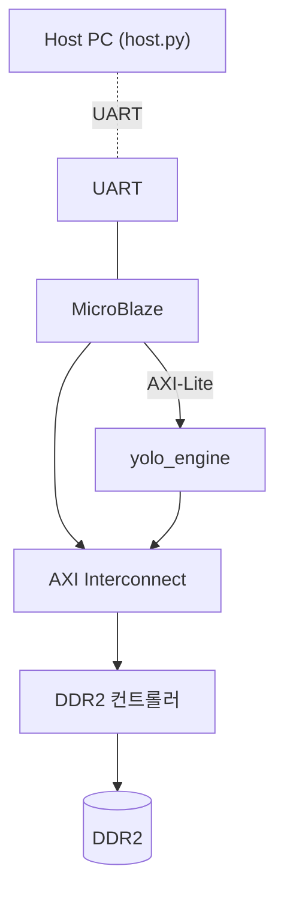
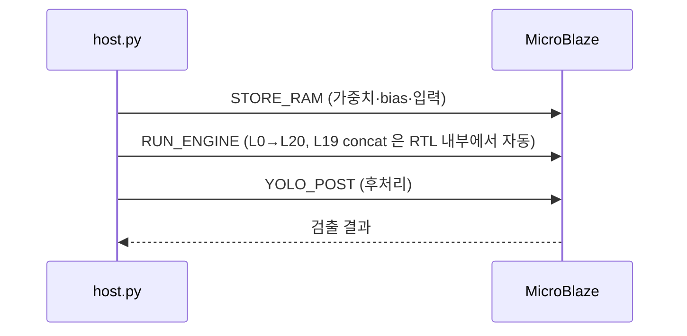

# 22장. 부록 — 향후 작업 / 용어집

> [← 21장 Vivado 프로젝트](21_vivado_project.md) · [목차](README.md)

---

이 장은 **현재 해설서 범위(L0~L18 검증) 밖**의 내용과, 학습에 도움이 되는 용어집·참고 자료를 모읍니다. L19~L21과 Phase 3·4가 완료되면 해당 절을 본문으로 승격할 예정입니다.

---

## 22.1 L19~L21 — 검증 진행 중

### L19 Route concat

L20 입력은 업샘플된 L18(16×16×128)과 백본 L8(16×16×256)을 채널 축으로 이어 붙인 16×16×384입니다([6장 6.6 skip connection](06_yolo_basics.md)). RTL은 [16장 16.5](16_rtl_special_units.md)의 2-source REPACK으로 처리합니다.

- L18 출력을 출력 버퍼 앞쪽에, L8 출력을 뒤쪽에 적재 → NHWC entry로 묶어 L20 입력 생성.
- 검증 TB: [l20_verify_tb.v](../../yolohw/testbench/l20_verify_tb.v).
- L8 출력 골든은 별도 생성 필요(`CONV20_input.hex`의 채널 128~383).

### L20 검출 헤드 2

L14와 같은 검출 헤드 구조(`linear`, ReLU off)이며, Ci=384, Co=195, 16×16 격자. **descale shift = 9**(L20은 다음 합성곱이 없어 next=1, [2장 2.6](02_quantization_basics.md), [9장 9.4](09_skeleton_reference.md)). post_process의 toward-zero 보정도 적용됩니다([14장 14.6](14_rtl_convolution_engine.md)).

### L21 YOLO output

RTL 동작 없음. L20 출력이 DRAM에 있고 소프트웨어가 후처리합니다([6장 6.8](06_yolo_basics.md)).

> **승격 조건**: L20 chain(Phase B)이 0 mismatch가 되면, 이 절을 [10·14·20장](20_testbench_per_layer.md) 본문으로 통합합니다.

---

## 22.2 Phase 3 — MicroBlaze + UART + DDR2

### 시스템 통합 (예정)



[17장 17.6](17_rtl_axi_dma.md)에서 본 통합입니다. Vivado block design으로 MicroBlaze + UART + DDR2 + yolo_engine을 연결하고, Vitis 펌웨어가 제어합니다.

### host.py — Host PC 클라이언트

[host.py](../../yolohw/firmware/host.py)는 UART로 가속기를 구동합니다([5장 5.1](05_axi_basics.md)).

**명령(MODE)**:

| MODE | 값 | 역할 |
|------|----|----|
| `STORE_RAM` | 0x03 | DRAM에 데이터 적재 |
| `RUN_ENGINE` | 0x06 | 22-layer 추론 + 완료 대기 |
| `CONCAT_L19` | 0x07 | (레거시) L19 가 RTL REPACK 으로 처리되어 single-inference 에서는 미사용 |
| `YOLO_POST` | 0x08 | Sigmoid/NMS → 검출 목록 |

**DRAM 메모리 맵**:

```
0x0000_0000  weight
0x00A0_0000  bias
0x0100_0000  입력 이미지
0x0200_0000  출력 (레이어별)
```

**추론 시퀀스 (한 번 추론 — L19 는 RTL 이 처리)**:



> ❓ **왜 한 번이면 될까?**: L19 concat 은 L8(추론 초반 생성)과 L18(추론 후반 생성)을 합치는데([6장 6.6](06_yolo_basics.md)), 이 합치기를 **하드웨어(yolo_engine FSM 의 REPACK 단계)가 추론 도중 자동으로** 수행합니다. 그래서 한 번의 추론(L0→L20)으로 L20 까지 끝납니다. 과거에는 software 가 L8 을 L18 뒤에 복사한 뒤 두 번째 추론을 했지만(double-inference), 이제는 불필요합니다. 보드 통합 후 이 흐름의 타이밍·전력이 Phase 4에서 측정됩니다.

---

## 22.3 Phase 4 — 비트스트림 / 보드 / 측정

| 작업 | 산출물 |
|------|--------|
| 합성 → 구현 → 비트스트림 | `.bit` ([21장 21.5](21_vivado_project.md)) |
| 보드 프로그래밍 | Nexys A7-100T |
| 100장 테스트셋 추론 | mAP, fps, 전력 측정 |
| 점수 산출 | `10⁴/Energy × ReLU(mAP−0.2) × ReLU(fps−5)` ([7장 7.2](07_project_overview.md)) |

이 단계에서 [18장 18.7~18.8](18_operation_timing.md)의 fps·Energy 추정이 실측으로 확정됩니다. 결과는 새 장("23장 보드 측정 결과")으로 추가할 예정입니다.

---

## 22.4 용어집

처음 보는 용어를 한곳에 모았습니다. 자세한 설명은 링크된 장에.

| 용어 | 쉬운 설명 | 장 |
|------|-----------|----|
| **추론(inference)** | 학습된 신경망으로 새 입력의 답을 계산 | [1장](01_cnn_basics.md) |
| **특징맵(feature map)** | H×W×C 모양의 데이터 덩어리 | [1장](01_cnn_basics.md) |
| **합성곱(convolution)** | 커널을 슬라이딩하며 곱하고 더하기 | [1장](01_cnn_basics.md) |
| **MAC** | Multiply-Accumulate, "곱하고 더하기" 한 번 | [1장](01_cnn_basics.md) |
| **양자화** | 실수를 정수(INT8)로 바꾸기 | [2장](02_quantization_basics.md) |
| **descaling** | 부풀린 결과를 시프트로 되돌리기 | [2장](02_quantization_basics.md) |
| **LUT / FF / DSP48 / BRAM** | FPGA 기본 부품(논리/기억/곱셈/메모리) | [3장](03_fpga_basics.md) |
| **FSM** | 상태 머신, 하드웨어의 "프로그램 흐름" | [4장](04_rtl_timing_basics.md) |
| **파이프라인** | 계산을 여러 클럭으로 쪼갬 | [4장](04_rtl_timing_basics.md) |
| **latency / throughput** | 지연 / 단위 시간당 처리량 | [4장](04_rtl_timing_basics.md) |
| **AXI** | FPGA 표준 버스 프로토콜 | [5장](05_axi_basics.md) |
| **DMA** | CPU 없이 하드웨어가 메모리 옮기기 | [5장](05_axi_basics.md) |
| **anchor / NMS** | 박스 후보 / 중복 박스 제거 | [6장](06_yolo_basics.md) |
| **NCHW / NHWC entry / 2×2 packed** | 세 가지 특징맵 저장 포맷 | [12장](12_data_representation_memory_map.md) |
| **REPACK** | 포맷을 다음 합성곱 입력으로 재배치 | [12·16장](16_rtl_special_units.md) |
| **streaming weight** | 필터마다 가중치를 새로 가져오기 | [15장](15_rtl_memory_buffers.md) |
| **cyclic row mapping** | 라인 버퍼가 줄을 순환 배치(row mod 4) | [15장](15_rtl_memory_buffers.md) |
| **look-ahead** | BRAM 지연 보상 위해 주소 미리 보내기 | [4·14장](14_rtl_convolution_engine.md) |
| **Phase A / B** | 단독 / chain 검증 | [19장](19_testbench_strategy.md) |
| **tolerance** | mismatch 허용 한도(±1 LSB) | [19장](19_testbench_strategy.md) |

---

## 22.5 약어

| 약어 | 풀이 |
|------|------|
| IFM / OFM | Input / Output Feature Map (입력/출력 특징맵) |
| MAC | Multiply-Accumulate |
| BRAM / DPRAM / SPRAM | Block / Dual-Port / Single-Port RAM |
| BMG | Block Memory Generator (BRAM IP 생성기) |
| DSP48 | Xilinx 곱셈 전용 블록 |
| FSM | Finite State Machine |
| NMS | Non-Maximum Suppression |
| mAP | mean Average Precision (검출 정확도) |
| LSB | Least Significant Bit (최하위 비트) |

---

## 22.6 참고 자료와 우선순위

| 자료 | 위치 | 용도 |
|------|------|------|
| 기술 레퍼런스 | [../technical_reference/](../technical_reference/README.md) | 간결·정확한 빠른 참조(AI·숙련자용) |
| `CLAUDE.md` | [../../CLAUDE.md](../../CLAUDE.md) | 작업 규칙 8가지 |
| `HISTORY.md` | [../../HISTORY.md](../../HISTORY.md) | 검증·버그 수정 이력 |
| 강의 PDF 12종 | [../](../) | DSP/MAC, BRAM, System Integration |

> 충돌 시 우선순위: **실제 소스 코드 > 기술 레퍼런스 > 본 해설서 > 강의 PDF**. 본 해설서는 "이해를 돕는" 것이 목적이라, 정밀한 사실은 소스·기술 레퍼런스로 교차 확인하세요.

강의 PDF 중 직접 관련된 것:
- DSP/MAC → [3·14장](14_rtl_convolution_engine.md)
- BRAM → [3·15장](15_rtl_memory_buffers.md)
- System Integration → [13·17장](17_rtl_axi_dma.md)
- Quantization → [2·9장](09_skeleton_reference.md)

---

## 22.7 문서 유지보수 가이드

이 해설서를 최신으로 유지하려면:

1. **L19~L21 검증 완료 시**: [22.1](#221-l19l21--검증-진행-중)을 [10·14·20장](20_testbench_per_layer.md) 본문으로 통합.
2. **Phase 3 보드 통합 시**: [22.2](#222-phase-3--microblaze--uart--ddr2)를 새 장으로 승격.
3. **Phase 4 측정 후**: 새 장에 fps/mAP/Energy/Score 실측 추가, [18장](18_operation_timing.md) 추정을 실측으로 교체.
4. **RTL 변경 시**: 해당 모듈 장(13~17장)의 코드 인용·설명을 갱신.
5. **기술 레퍼런스와 동기화**: 같은 사실을 다루므로 한쪽을 고치면 다른 쪽도 점검.

---

## 22.8 맺음말 — 전체 한 장으로

이 해설서를 다 읽었다면, 이제 아래 한 문단이 모두 이해될 것입니다.

> **이 가속기는 256×256 이미지를 INT8로 양자화([2장])하여, 144개의 MAC([14장])으로 22개 레이어의 합성곱·풀링·업샘플([1장])을 순서대로 계산한다([13·18장]). 가중치와 특징맵은 너무 커서 DRAM에 두고 AXI DMA로 필요한 부분만 BRAM에 올려 재사용하며([5·15장]), 출력은 두 개의 YOLO 검출 헤드([6장])를 거쳐 객체의 위치와 종류를 찾는다. 모든 RTL은 skeleton C와 비트 단위로 일치하도록 검증되었고([9·19·20장]), INT8 정수 연산과 버퍼 재사용으로 에너지를 최소화하여 점수를 극대화한다([7·18장]).**

각 괄호의 장으로 돌아가면 그 부분을 깊이 들여다볼 수 있습니다. L21까지의 검증과 보드 동작이 완료되면, 이 해설서는 그 결과를 담아 완성됩니다.

---

> [← 21장 Vivado 프로젝트](21_vivado_project.md) · [목차](README.md)
