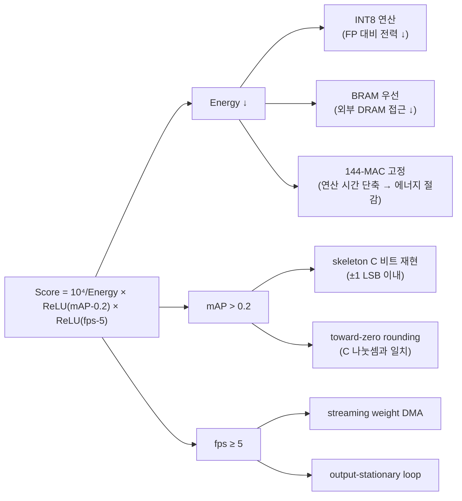
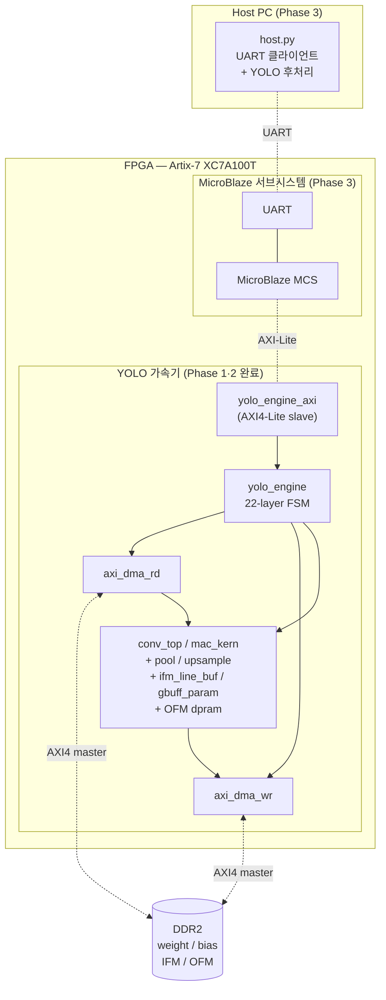
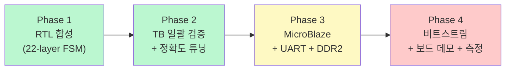

# 1장. 프로젝트 개요

> [← 목차로](README.md) · 다음 장: [2장 개발 환경과 빌드 →](02_dev_environment.md)

---

## 1.1 프로젝트 한 문장 정의

본 프로젝트는 **22-layer YOLOv2 객체 탐지 신경망 전체를 Nexys A7-100T(Xilinx Artix-7 XC7A100T) FPGA 한 장 위에서 추론하는 하드웨어 가속기 SoC**를 설계하는 것입니다. 중앙대학교 AIX2026 Deep Learning Hardware 설계 경진대회(팀 베타트론) 출품작이며, 단순히 "동작하는" 가속기를 넘어 **에너지·정확도·속도의 균형으로 점수를 극대화**하는 것이 최종 목표입니다.

가속기는 외부 DDR2 메모리에 적재된 양자화 가중치·입력 이미지를 읽어, 합성곱(Convolution)·풀링(Pooling)·업샘플(Upsample)·라우팅(Route) 연산을 순차적으로 수행하고, 두 개의 YOLO 검출 헤드(L14, L20) 출력을 다시 DDR2에 기록합니다. 최종 후처리(Sigmoid·Softmax·NMS)는 소프트웨어(MicroBlaze + Host PC)가 담당합니다.

---

## 1.2 대회 목표와 점수 공식

### 1.2.1 정량 목표

| 항목 | 목표 | 의미 |
|------|------|------|
| 추론 속도 | **≥ 5 fps** | 초당 5장 이상 처리 (미달 시 점수 0) |
| 정확도 | **mAP > 0.2** | 양자화 후에도 검출 품질 유지 (미달 시 점수 0) |
| 에너지 | **최소화** | 점수의 분모. 낮을수록 고득점 |

### 1.2.2 점수 공식

```
Score = 10⁴ / Energy × ReLU(mAP − 0.2) × ReLU(fps − 5)
```

이 공식은 설계 전반의 의사결정을 지배합니다. 세 항을 따로 보면:

- **`ReLU(fps − 5)`** — fps가 5 미만이면 0. 즉 **속도는 통과/탈락(gate) 조건이자, 통과 후에는 선형 가산점**. 5 fps를 갓 넘기는 것보다 여유 있게 넘기는 편이 점수에 직접 기여합니다.
- **`ReLU(mAP − 0.2)`** — mAP가 0.2 미만이면 0. 양자화로 인한 정확도 손실이 이 선을 넘지 않아야 합니다. 그래서 RTL은 skeleton C의 정수 연산을 **비트 단위로 충실히 재현**하는 데 집중합니다(±1 LSB 이내).
- **`10⁴ / Energy`** — 에너지가 분모이므로, 같은 fps·mAP라면 **연산을 적은 전력으로 끝내는 설계가 압도적으로 유리**합니다.

### 1.2.3 점수 공식이 설계에 미친 영향



요약하면, **"INT8 정수 파이프라인 + 온칩 버퍼 재사용 + 144-MAC 병렬"** 이라는 핵심 설계가 모두 이 점수 공식에서 도출됩니다. 자세한 정량 추정은 [12장 동작 과정과 타이밍](12_operation_timing.md)에서 다룹니다.

---

## 1.3 타겟 하드웨어 플랫폼

| 항목 | 사양 | 비고 |
|------|------|------|
| 보드 | Digilent **Nexys A7-100T** | 교육용 Artix-7 평가 보드 |
| FPGA | Xilinx **XC7A100T-1CSG324C** | Artix-7 패밀리 |
| 로직 셀 | 약 101,440 | LUT/FF |
| DSP48E1 슬라이스 | **240개** | 곱셈기 자원 (본 설계는 144 MAC 사용) |
| Block RAM | 약 4.86 Mb (135 × 36 Kb) | 온칩 버퍼 |
| 외부 메모리 | **DDR2** (보드 탑재, 본 설계 4 MB 사용) | 가중치·IFM·OFM 저장 |
| 통신 | **UART** (USB-UART 브리지) | Host PC ↔ MicroBlaze |

DSP48E1이 240개 있고 설계가 144개를 사용하므로, 곱셈기 자원은 충분합니다. 핵심 제약은 오히려 **Block RAM 용량**(온칩에 얼마나 많은 가중치/특징맵을 둘 수 있는가)과 **DDR2 대역폭**(레이어 간 데이터 이동 시간)입니다. 이 두 제약이 [9장 메모리 버퍼](09_rtl_memory_buffers.md)의 streaming 설계와 [10장](10_rtl_special_units.md)의 in-place 처리를 낳았습니다.

---

## 1.4 시스템 한눈에 보기

전체 SoC를 가장 큰 단위로 그리면 다음과 같습니다. 점선 박스는 Phase 3에서 통합될 부분입니다.



데이터 관점의 흐름은 단순합니다:

1. Host PC가 양자화된 가중치·바이어스·입력 이미지를 UART로 전송 → MicroBlaze가 DDR2에 적재
2. MicroBlaze가 `ctrl_reg`로 DRAM base 주소를 알려주고 `ap_start`를 펄스
3. `yolo_engine` FSM이 L0부터 L21까지 자동 순회하며, 레이어마다 **(DMA read → 연산 → DMA write)** 를 반복
4. 모든 레이어 완료 시 `network_done` assert → MicroBlaze가 OFM을 읽어 YOLO 후처리 → 결과를 Host PC로 반환

> 참고: L19 Route concat 때문에 실제로는 추론을 두 번 트리거합니다(1차: L0~L18까지 자연 진행 후 L8을 L18 뒤에 복사, 2차: L20 재계산). 상세는 [16장 부록](16_appendix_future.md)의 host.py 절을 참조하십시오.

---

## 1.5 하드웨어 / 소프트웨어 역할 분담

신경망 추론을 전부 하드웨어로 구현하지 않고, **연산 집약적이고 규칙적인 부분만 RTL로** 가속하며 **불규칙하고 제어 위주인 부분은 소프트웨어로** 남겼습니다. 이 경계는 면적·에너지 효율과 직결됩니다.

| 구분 | 담당 | 연산 |
|------|------|------|
| **하드웨어 (RTL)** | `yolo_engine` 및 서브모듈 | Conv 3×3 / 1×1, Bias 덧셈, Descaling(시프트), ReLU, MaxPool(stride 2 / 1), Upsample 2×, Route(DMA 주소 제어) |
| **소프트웨어 (MicroBlaze + Host PC)** | Vitis 펌웨어 + `host.py` | 가속기 제어(ctrl_reg), DMA 트리거, L19 concat 메모리 배치, YOLO 후처리(Sigmoid·Softmax·NMS·바운딩박스) |

핵심 판단:
- **검출 헤드 이후(Sigmoid/Softmax/NMS)는 소프트웨어** — 분기·정렬·비선형 함수가 많아 하드웨어 비용 대비 효율이 낮고, 이미지당 출력 격자(8×8, 16×16)가 작아 소프트웨어로도 충분히 빠릅니다.
- **Route는 전용 모듈 없이 DMA 주소 제어로** — L16(=L12 alias), L19(=L18‖L8 concat)는 데이터를 "옮기는" 동작일 뿐이므로, 연산 모듈을 새로 만들지 않고 메모리 주소만 조정합니다([CLAUDE.md 규칙 4](../../CLAUDE.md) 참조).

---

## 1.6 프로젝트 4-Phase 로드맵

프로젝트는 4단계로 진행되며, 본 문서 집필 시점에 **Phase 1·2가 완료**되었습니다.



| Phase | 내용 | 상태 |
|-------|------|------|
| **Phase 1** | MicroBlaze 제외 RTL 합성 완료 (`yolo_engine` 단독 22-layer 자동 추론) | ✅ 완료 |
| **Phase 2** | TB 일괄 검증 + 정확도 튜닝 (shift 실측, conv_top_tb 0 mismatch, L0~L18 chain 0 mismatch) | ✅ 완료 |
| **Phase 3** | MicroBlaze + UART + DDR2 통합 | ⏳ 코드 완성 / 보드 통합 대기 |
| **Phase 4** | 비트스트림 + 보드 데모 + 측정 | ⏳ 대기 |

각 Phase의 상세 진행과 버그 수정 이력은 [HISTORY.md](../../HISTORY.md)에, 현재 범위(L0~L18)의 검증 결과는 [14장](14_testbench_per_layer.md)에 정리되어 있습니다.

---

## 1.7 핵심 설계 결정 요약

이 절은 "왜 이렇게 만들었는가"를 한 표로 모은 것으로, 이후 장들의 배경이 됩니다.

| 설계 결정 | 선택 | 이유 | 상세 |
|-----------|------|------|------|
| 수 표현 | INT8 weight/activation, INT16 bias, INT32 누적 | DSP48 효율, 전력 절감, mAP 유지 | [6장](06_data_representation_memory_map.md) |
| MAC 병렬도 | 144 (36 mul × 4 spatial) | 한 cycle에 2×2 출력 블록 4픽셀 동시 생성 | [8장](08_rtl_convolution_engine.md) |
| Conv 루프 순서 | output-stationary (filter→row→col→acc) | 출력 픽셀을 고정하고 입력·가중치를 흘려 누적 | [8장](08_rtl_convolution_engine.md) |
| 가중치 적재 | per-filter **streaming** DMA | 전체 가중치(>BRAM 용량)를 한 번에 못 올림 → 필터 단위로 흘림 | [7·9장](09_rtl_memory_buffers.md) |
| 1×1 Conv | 3×3용 `mac_kern` **재사용** | 모듈 추가 없이 `ifm_line_buf` 1×1 mode + acc_len 조정 | [8·9장](08_rtl_convolution_engine.md) |
| Pooling stride 1 (L11) | 전용 모듈 `max_pool_s1_unit` | stride 2 모듈로 처리 시 크기 깨짐 (same-padding 필요) | [10장](10_rtl_special_units.md) |
| Upsample (L18) | 전용 모듈 `upsample_unit` | 1 입력 → 2×2 복제, 단순 주소 패턴 | [10장](10_rtl_special_units.md) |
| Route (L16/L19) | 모듈 없음, DMA 주소 제어 | 연산이 아니라 데이터 재배치 | [7·16장](07_rtl_yolo_engine_top.md) |
| 메모리 포맷 변환 | layer 간 REPACK (NCHW↔NHWC entry) | conv 입력은 NHWC 16-byte entry 필요 | [6·10장](06_data_representation_memory_map.md) |
| 검증 시뮬레이터 | **Vivado 2025** 통일 + sim 메모리 0 초기화 | 2021은 uninitialized X 처리가 달라 chain mismatch | [15장](15_vivado_project.md) |

---

## 1.8 이 장의 요약

- 목표는 22-layer YOLOv2를 Artix-7 FPGA에서 **≥5 fps, mAP>0.2** 로 추론하되 **에너지를 최소화**하여 점수를 극대화하는 것.
- 점수 공식이 **INT8 정수 파이프라인 · 온칩 버퍼 재사용 · 144-MAC 병렬**이라는 핵심 설계를 결정.
- 연산 집약 부분(Conv/Pool/Upsample)은 RTL, 제어·후처리(NMS 등)는 소프트웨어로 분담.
- Phase 1·2(RTL + 검증) 완료, Phase 3·4(보드 통합·측정) 대기.

다음 장에서는 이 설계를 실제로 빌드·시뮬레이션하는 **개발 환경**을 다룹니다.

---

> [← 목차로](README.md) · 다음 장: [2장 개발 환경과 빌드 →](02_dev_environment.md)
