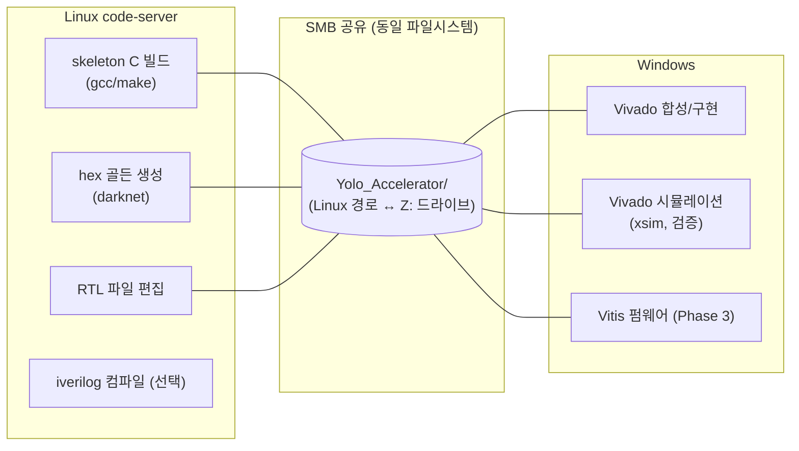

# 2장. 개발 환경과 빌드

> [← 1장 프로젝트 개요](01_project_overview.md) · [목차](README.md) · [3장 skeleton C 레퍼런스 →](03_skeleton_reference.md)

---

이 장은 프로젝트를 처음 체크아웃한 사람이 **무엇을 어디서 빌드·시뮬레이션하는지** 막힘없이 따라올 수 있도록 환경 구성과 명령을 정리합니다. 이 프로젝트의 가장 큰 환경적 특징은 **두 개의 OS를 오가며 작업한다**는 점입니다.

---

## 2.1 이중 실행 환경

본 프로젝트는 작업 종류에 따라 두 개의 실행 환경이 혼재합니다. 같은 파일시스템을 SMB 공유로 공유하지만, **실행 주체가 다릅니다.**



| 작업 | 실행 환경 | 경로 |
|------|----------|------|
| skeleton C 빌드 / hex 생성 | **Linux code-server** | `/data/2026 CAU/AIX2026/git/Yolo_Accelerator/` |
| RTL 파일 편집 | Linux code-server | 동일 파일 (양쪽 공유) |
| Vivado 합성 / 시뮬레이션 | **Windows (Vivado GUI)** | `Z:\2026 CAU\AIX2026\git\Yolo_Accelerator\` |
| Vitis 펌웨어 (Phase 3) | Windows | `Z:\...\yolohw\fpga\vitis\` |

> **Claude Code(및 본 문서의 쉘 예시)는 Linux code-server에서 실행됩니다.** 따라서 쉘 명령은 Linux 기준이며, **Vivado TCL 명령은 Windows에서 직접 실행**해야 합니다. 이 구분은 [CLAUDE.md §2·§8](../../CLAUDE.md)의 핵심 규칙입니다.

---

## 2.2 SMB 공유와 경로 매핑

Linux와 Windows는 **SMB 공유(Z 드라이브 매핑)** 로 동일한 파일시스템을 봅니다. 같은 파일을 양쪽에서 편집·읽기 할 수 있으나, 경로 표기가 다릅니다.

```
Linux:    /data/2026 CAU/AIX2026/git/Yolo_Accelerator/yolohw/src/yolo_engine.v
Windows:  Z:\2026 CAU\AIX2026\git\Yolo_Accelerator\yolohw\src\yolo_engine.v
```

**경로 하드코딩 주의**: TB 파일이나 TCL 스크립트에 절대경로(예: `C:/yolohw/...`)가 박혀 있을 수 있습니다. Windows Vivado 시뮬레이션 시에는 `Z:` 경로 또는 정션(junction)을 사용합니다.

```cmd
:: Windows: C:\yolohw 를 실제 경로로 연결 (TB의 C:/yolohw/... 하드코딩 호환)
mklink /J C:\yolohw "C:\AIX Project\yolohw"
```

verify TB들은 이런 하드코딩 문제를 피하기 위해 **상대경로**(`../../../../../../testbench/inout_data_sw/...`)로 hex를 참조하도록 통일되어 있습니다([14장](14_testbench_per_layer.md) 참조).

---

## 2.3 프로젝트 디렉토리 구조

```
Yolo_Accelerator/
├── README.md / ARCHITECTURE.md / CLAUDE.md / HISTORY.md   ← 루트 문서
├── skeleton/                  C 골든 레퍼런스 + hex 생성기 (Linux 빌드)
│   ├── src/                   darknet 소스 (.c/.h)
│   └── bin/                   darknet 실행 + cfg/weights + log_param/ log_feamap/
├── documents/                 강의자료 PDF 12종 + technical_reference/ (본 문서)
├── .recycle_bin/              소프트 삭제 보관함 (REASON.md)
└── yolohw/
    ├── src/                   ★ 활성 RTL (19 .v)
    ├── testbench/             ★ 활성 TB (l0~l20 verify + 블록 TB)
    │   ├── inout_data_sw/     C 레퍼런스 출력 hex (gen_*.mem, log_feamap, log_param)
    │   └── sim_dram_model/    AXI slave DRAM 모델
    ├── sim/                   iverilog 컴파일 출력 전용 (.gitignore)
    ├── fpga/                  Vivado 프로젝트(2025) + BMG IP TCL + Vitis firmware
    └── firmware/              host.py (Host PC UART 클라이언트)
```

**합성·시뮬 대상은 `yolohw/src/` + `yolohw/testbench/` 만**입니다. legacy 파일은 `.recycle_bin/`에 격리되어 있으며 합성에 포함되지 않습니다. 각 디렉토리의 상세는 [5장](05_hardware_overview.md)·[14장](14_testbench_per_layer.md)·[15장](15_vivado_project.md)에서 다룹니다.

---

## 2.4 skeleton C 레퍼런스 빌드 (Linux)

skeleton은 darknet 기반 C 레퍼런스로, **RTL 검증의 골든(정답) 데이터를 생성**합니다. 자세한 내부 구조는 [3장](03_skeleton_reference.md)에서 설명하고, 여기서는 빌드·실행 명령만 정리합니다.

```bash
# 프로젝트 루트 기준
cd skeleton
make                       # ./bin/darknet 생성

cd bin/dataset
python make_list_cur.py    # 테스트 이미지 경로 갱신 (최초 1회)
```

---

## 2.5 양자화 hex 파일 생성

```bash
cd skeleton/bin

# 단일 이미지 추론 + 파라미터/특징맵 hex 저장 (-save_params 핵심)
./darknet detector test yolohw.names aix2024.cfg aix2024.weights \
  -thresh 0.24 test01.jpg -out_filename test01-det-quantized \
  -quantized -save_params

# 전체 테스트셋 mAP (양자화)
sh script-unix-aix2024-test-all-quantized.sh
```

**생성물:**

| 위치 | 파일 | 내용 |
|------|------|------|
| `skeleton/bin/log_param/` | `CONV{NN}_param_weight.hex` | 8-bit 양자화 가중치 |
| | `CONV{NN}_param_biases.hex` | 16-bit bias |
| | `CONV{NN}_param_scales.hex` | shift 스케일 (RTL shift 파라미터 결정) |
| `skeleton/bin/log_feamap/` | `CONV{NN}_input.hex` / `_output.hex` | 레이어별 입출력 특징맵 (검증 골든) |

이 hex들은 TB가 읽을 수 있도록 `yolohw/testbench/inout_data_sw/`로 동기화되고, DRAM 포맷(`gen_wgt_dram.mem` 등)으로 패킹됩니다. 데이터 흐름은 [3장](03_skeleton_reference.md)과 [13장](13_testbench_strategy.md)에서 상세히 다룹니다.

---

## 2.6 Vivado 합성 (Windows)

합성은 **`user_define_h.v`의 `` `define FPGA `` 가 활성화**된 상태에서 수행합니다(아래 [2.8](#28-fpga-매크로-토글) 참조). Vivado TCL 콘솔에서:

```tcl
# Vivado TCL 콘솔 (Windows)
cd yolohw/fpga
source create_project_25.tcl     # Vivado 2025 프로젝트 생성 (권장)
source gen_bram_ips.tcl          # BMG(BRAM) IP 생성

launch_runs synth_1 -jobs 4
wait_on_run synth_1
launch_runs impl_1 -to_step write_bitstream -jobs 4
```

> 합성 시 DSP48/BRAM IP는 **반드시 명시적으로 인스턴스화**하며, `a*b+c` 추론에 의존하지 않습니다([CLAUDE.md 규칙 1](../../CLAUDE.md)). 상세는 [15장](15_vivado_project.md).

---

## 2.7 Vivado 시뮬레이션 (검증)

시뮬레이션은 **`` `define FPGA `` 를 주석 처리**하여 behavioral 메모리 모델을 사용합니다. Vivado TCL 콘솔에서 TB를 top으로 지정하고 실행합니다.

```tcl
# 블록 단위 TB
set_property top conv_top_tb        [get_filesets sim_1]
launch_simulation

# Layer별 chain 검증 (예: L18까지)
set_property top l18_verify_tb      [get_filesets sim_1]
launch_simulation

# 전체 22-layer end-to-end
set_property top yolo_engine_tb     [get_filesets sim_1]
launch_simulation
```

두 가지 운영 규칙이 있습니다:

- ⚠️ **`log_all_signals` 옵션 OFF 유지** — 켜면 `.wdb` 파형 파일이 TB당 수백 MB까지 쌓여 디스크가 폭증합니다([CLAUDE.md 규칙 6](../../CLAUDE.md)).
- ⚠️ **chain 검증은 Vivado 2025** — 아래 [2.9](#29-검증-시뮬레이터-vivado-2025-통일) 참조.

---

## 2.8 FPGA 매크로 토글

[user_define_h.v](../../yolohw/src/user_define_h.v)의 `` `define FPGA `` 한 줄이 합성/시뮬 동작을 가릅니다. 이는 본 프로젝트에서 가장 자주 실수하는 지점이므로 반드시 기억해야 합니다.

| 매크로 | 상태 | 메모리 모델 | 곱셈기 |
|--------|------|------------|--------|
| `` `define FPGA `` **활성** | 합성 시 | Xilinx BMG IP (dpram/spram) | DSP48 매크로 인스턴스 |
| `` //`define FPGA `` **주석** | 시뮬 시 | behavioral reg 배열 (`initial` 0 초기화) | behavioral 4-stage shift |

이 매크로는 RTL 곳곳의 `` `ifdef FPGA … `else … `endif `` 블록을 전환합니다. 상세 동작은 [11장 §user_define_h](11_rtl_axi_dma.md)·[15장](15_vivado_project.md)에서 다룹니다.

---

## 2.9 검증 시뮬레이터 Vivado 2025 통일

> **이것은 단순 권장이 아니라 검증 정확성의 전제 조건입니다.**

L18 chain 검증 중 **동일 RTL·데이터·TB인데도 환경에 따라 mismatch가 0 ↔ 3360으로 달라지는** 현상이 발견되었습니다. 정밀 진단 결과 원인은 **uninitialized 메모리(X)의 시뮬레이터 버전 간 처리 차이**였습니다.

| Vivado 버전 | L18 chain 결과 |
|-------------|----------------|
| **2025** | **0 mismatch** (PASS) |
| 2021 | 3360 mismatch (\|Δ\|≤3, 92%가 \|Δ\|=1) — RTL 버그 아님 |

**RTL 버그가 아님을 배제한 근거**, **취한 조치(sim 메모리 `initial` 0 초기화 + 2025 통일)**, 그리고 이것이 **mAP·점수에 무관한 이유**는 [15장 §Vivado 2021 vs 2025](15_vivado_project.md)와 [HISTORY.md 2026-05-24](../../HISTORY.md)에 상세히 기록되어 있습니다.

핵심 결론만 옮기면:
1. sim behavioral 메모리(`dpram_wrapper`/`spram_wrapper`/`ifm_line_buf`/`gbuff_param`)의 reg 배열·read latency 레지스터를 `initial`로 0 초기화 (실제 FPGA BRAM의 0 초기화와 일치, 합성·fps·Energy에 영향 없음).
2. **모든 chain 검증은 Vivado 2025**로 수행 (`yolohw/fpga/create_project_25.tcl`).

---

## 2.10 흔한 함정 체크리스트

[CLAUDE.md §4](../../CLAUDE.md)의 "치명적 에러 방지 규칙"에서 환경 관련 항목을 발췌했습니다. RTL 설계 관련 함정은 해당 모듈 장에서 다룹니다.

| # | 함정 | 회피 |
|---|------|------|
| 1 | 시뮬인데 `` `define FPGA `` 켜둠 | 시뮬 전 반드시 주석 처리 (반대도 마찬가지) |
| 2 | TB hex 경로가 Windows 절대경로로 하드코딩 | 상대경로 사용 / 정션 생성 |
| 3 | `log_all_signals` ON → 디스크 폭증 | OFF 유지 |
| 4 | Vivado 2021로 chain 검증 → ±1 LSB mismatch | Vivado 2025 사용 |
| 5 | SystemVerilog 구문(`fork`/`join_any`/`let`) 사용 | plain Verilog (`while` 폴링 등)로 대체 |
| 6 | 16-bit bias를 zero-extend로 32-bit 적재 | **sign-extend** (`{ {16{b[15]}}, b }`) |

---

## 2.11 이 장의 요약

- 작업은 **Linux(C 빌드/hex 생성/RTL 편집)** 와 **Windows(Vivado 합성/시뮬)** 두 환경에서, SMB 공유로 같은 파일을 보며 수행.
- skeleton `make` → `darknet … -save_params` 로 가중치/특징맵 골든 hex 생성 → `inout_data_sw/`로 동기화.
- 합성은 `` `define FPGA `` ON + `create_project_25.tcl`, 시뮬은 `` `define FPGA `` OFF.
- **검증 시뮬레이터는 Vivado 2025로 통일**하고 sim 메모리는 0 초기화 — 그렇지 않으면 chain에서 비결정적 ±1 LSB mismatch.

다음 장에서는 골든 데이터를 만들어내는 **skeleton C 레퍼런스의 내부 구조와 양자화 시스템**을 들여다봅니다.

---

> [← 1장 프로젝트 개요](01_project_overview.md) · [목차](README.md) · [3장 skeleton C 레퍼런스 →](03_skeleton_reference.md)
