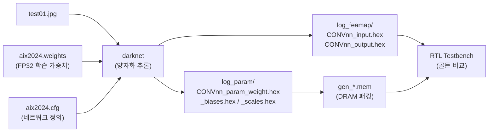
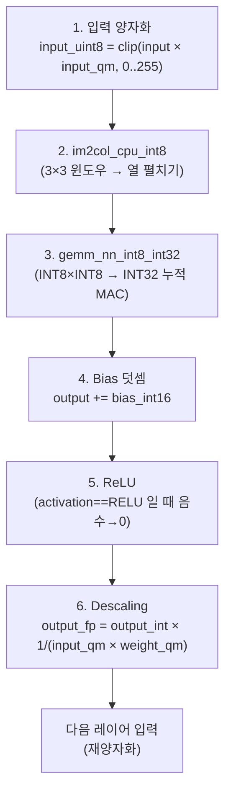
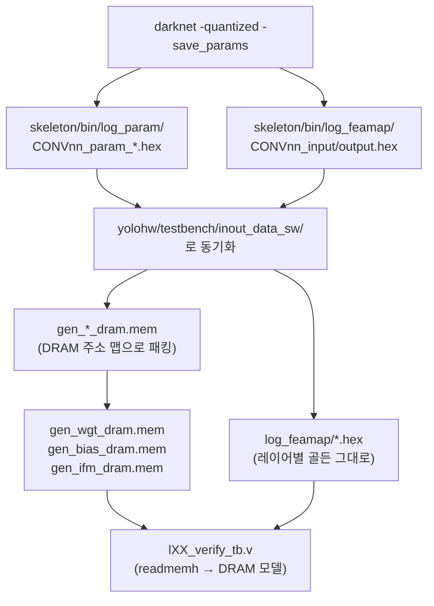

# 3장. skeleton C 골든 레퍼런스

> [← 2장 개발 환경](02_dev_environment.md) · [목차](README.md) · [4장 22-Layer 네트워크 구조 →](04_network_architecture.md)

---

이 장은 RTL이 "정답"으로 삼는 소프트웨어 모델, 즉 **skeleton C 레퍼런스**의 내부를 설명합니다. RTL의 모든 검증(mismatch 판정)은 결국 "RTL 출력이 이 C 코드의 출력과 같은가?"를 묻는 것이므로, 이 코드를 이해하는 것이 검증을 이해하는 출발점입니다.

---

## 3.1 skeleton의 역할: 골든 데이터 생성기

skeleton은 Darknet(YOLO 원저자 pjreddie의 C 프레임워크)을 변형한 것으로, 두 가지 일을 합니다.

1. **양자화 추론**: 입력 이미지를 INT8로 양자화하여 22-layer를 정수 연산으로 추론합니다. 이것이 FPGA가 흉내 낼 동작입니다.
2. **골든 hex 덤프**: 각 레이어의 입력/출력 특징맵과, 각 conv 레이어의 양자화 가중치/바이어스/스케일을 hex 파일로 저장합니다. RTL TB는 이 hex를 읽어 "입력"으로 주입하고 "출력"과 대조합니다.



> **검증 철학**: skeleton C(정수 모델)가 ground truth입니다. RTL이 C와 비트 단위로 같으면 PASS, ±1 LSB 차이는 시뮬레이터/반올림 차이로 간주(tolerance)합니다. 이 정의 덕분에 "RTL이 맞다"를 객관적으로 판정할 수 있습니다. 검증 메커니즘은 [13장](13_testbench_strategy.md)에서 다룹니다.

---

## 3.2 디렉토리·파일 구조

```
skeleton/
├── Makefile                 Linux 빌드 (make → bin/darknet)
├── src/
│   ├── main.c               엔트리 포인트 + 명령행 처리
│   ├── additionally.c       양자화·GEMM·유틸 (do_quantization, save_quantized_model)
│   ├── additionally.h       구조체/매크로 정의
│   ├── yolov2_forward_network.c            FP32 추론 (참고용)
│   ├── yolov2_forward_network_quantized.c  ★ INT8 양자화 추론 (RTL 골든)
│   ├── box.c / box.h        바운딩박스·NMS
│   └── stb_image*.h         이미지 로더 (헤더 only)
└── bin/
    ├── darknet              컴파일 결과 (Linux)
    ├── aix2024.cfg          22-layer 네트워크 정의
    ├── aix2024.weights      FP32 학습 가중치
    ├── yolohw.names         클래스명 (60 classes)
    ├── yolohw.data          데이터셋 경로 설정
    ├── test01~03.jpg        테스트 이미지
    ├── log_param/           ★ 양자화 파라미터 hex (CONVnn_param_*.hex)
    └── log_feamap/          ★ 레이어 입출력 특징맵 hex (CONVnn_input/output.hex)
```

RTL 검증과 직접 관련된 핵심 파일은 **`yolov2_forward_network_quantized.c`** (정수 추론 + hex 덤프) 와 **`additionally.c`** (양자화 계수 결정 + 파라미터 저장)입니다. 아래에서 이 둘을 중심으로 설명합니다.

---

## 3.3 양자화 시스템

### 3.3.1 양자화 수 표현

| 대상 | 타입 | 매크로 | 클립 범위 |
|------|------|--------|-----------|
| 입력 특징맵(activation) | INT8 (실제 uint8 저장) | `MAX_VAL_UINT_8 = 255` | 0 ~ 255 |
| 가중치 | INT8 (signed) | `MAX_VAL_8 = 127` | −128 ~ +127 |
| 바이어스 | INT16 (signed) | `MAX_VAL_16 = 32767` | −32768 ~ +32767 |
| MAC 누적 | INT32 | `MAX_VAL_32` | 31-bit |

> 클립 함수 `max_abs(src, max_val)`는 [additionally.c:16](../../skeleton/src/additionally.c#L16)에 정의됩니다. 핵심은 음수 포화 시 `-max_val-1`(2의 보수 비대칭 범위, 예 −128)을 쓴다는 점이며, RTL의 클램프 로직과 일치해야 합니다.

### 3.3.2 레이어별 양자화 계수 (multiplier)

[additionally.c:303-327](../../skeleton/src/additionally.c#L303)의 `do_quantization()`이 11개 conv 레이어에 대해 계수를 부여합니다. 본 프로젝트는 **per-network(레이어별 고정) 양자화**를 사용합니다.

| 순번 | 레이어 | `input_quant_multiplier` | `weight_quant_multiplier` | `bias_multiplier`(=곱) |
|------|--------|--------------------------|---------------------------|------------------------|
| 0 | CONV0 (L0) | **128** | **16** | 2048 |
| 1 | CONV2 (L2) | 8 | 64 | 512 |
| 2 | CONV4 (L4) | 8 | 64 | 512 |
| 3 | CONV6 (L6) | 8 | 64 | 512 |
| 4 | CONV8 (L8) | 8 | 64 | 512 |
| 5 | CONV10 (L10) | 8 | 64 | 512 |
| 6 | CONV12 (L12) | 8 | 64 | 512 |
| 7 | CONV13 (L13) | 8 | 64 | 512 |
| 8 | CONV14 (L14) | 8 | 64 | 512 |
| 9 | CONV17 (L17) | 8 | 64 | 512 |
| 10 | CONV20 (L20) | 8 | 64 | 512 |

L0만 input=128, weight=16인 이유: 원본 이미지 픽셀(0~1 정규화)은 동적 범위가 작아 큰 input multiplier(128)가 유리하고, 가중치는 비교적 큰 값이라 작은 multiplier(16)로 충분하기 때문입니다. L2 이후는 ReLU 통과 활성값의 범위가 안정되어 input=8, weight=64로 통일됩니다.

### 3.3.3 양자화 식

가중치·바이어스·입력은 각각 다음과 같이 정수화됩니다([yolov2_forward_network_quantized.c:355-367](../../skeleton/src/yolov2_forward_network_quantized.c#L355), [:130](../../skeleton/src/yolov2_forward_network_quantized.c#L130)):

```
weight_int8 = clip( weight_fp32 × weight_qm,  ±127 )
bias_int16  = clip( bias_fp32  × (weight_qm × input_qm),  ±32767 )
input_uint8 = clip( input_fp32 × input_qm,  0..255 )
```

바이어스 multiplier가 `weight_qm × input_qm`인 것이 핵심입니다. MAC 결과(=Σ input_int × weight_int)는 자동으로 `input_qm × weight_qm`만큼 스케일된 정수이므로, 바이어스도 같은 스케일로 맞춰야 더할 수 있습니다.

---

## 3.4 양자화 추론 파이프라인

한 conv 레이어의 정수 추론은 [forward_convolutional_layer_q()](../../skeleton/src/yolov2_forward_network_quantized.c#L116)에서 다음 순서로 진행됩니다. **이 순서가 RTL `mac_kern` + `post_process`의 동작과 1:1 대응**합니다([8장](08_rtl_convolution_engine.md)).



| 단계 | C 코드 | RTL 대응 |
|------|--------|----------|
| 1. 입력 양자화 | `state.input_uint8[z] = max_abs(input × input_qm, 255)` | 이전 레이어 OFM 덤프 시 미리 적용 |
| 2. im2col | `im2col_cpu_int8(...)` | `ifm_line_buf`의 윈도우 패킹 |
| 3. MAC | `gemm_nn_int8_int32(...)` | `mac_stack` (144 MAC) + accumulator |
| 4. Bias | `output_q += l.biases_quant[fil]` | `post_process` bias 덧셈 |
| 5. ReLU | `(output_q>0)?output_q:0` | `post_process` ReLU (i_relu_en) |
| 6. Descaling | `× 1/(input_qm × weight_qm)` | `post_process` arithmetic shift |

> **주의 — Descaling의 표현 차이**: C는 descaling을 부동소수점 곱(`× ALPHA1`)으로 복원한 뒤 다음 레이어에서 다시 정수화합니다. RTL은 부동소수점이 없으므로, 이 "복원 후 재양자화"를 **하나의 산술 우측 시프트**로 합쳐서 수행합니다. 그 시프트량을 결정하는 것이 다음 절의 `scale`입니다.

---

## 3.5 hex 덤프 — 특징맵 (log_feamap)

`run_single_image_test=1`일 때, 각 conv 레이어는 입력과 출력 특징맵을 hex로 덤프합니다([:148](../../skeleton/src/yolov2_forward_network_quantized.c#L148), [:208](../../skeleton/src/yolov2_forward_network_quantized.c#L208)).

### 데이터 포맷: NCHW byte order

```
for chn in 0..C-1:          # 채널 바깥쪽
    for idx in 0..H*W-1:    # 한 채널 안의 픽셀 (행 우선)
        write "%02x" (1 byte/line)
```

즉 **채널 단위로 한 특징맵 전체(H×W)를 쭉 쓰고, 다음 채널로** 넘어갑니다. 이것이 본 프로젝트가 "NCHW byte order"라고 부르는 골든 포맷입니다([6장](06_data_representation_memory_map.md)에서 RTL의 NHWC entry 포맷으로 어떻게 REPACK되는지 설명).

### 출력의 "재양자화"

OFM 덤프 시 핵심은 [:211-227](../../skeleton/src/yolov2_forward_network_quantized.c#L211)입니다:

```c
// 다음 CONV 레이어의 input_quant_multiplier 를 찾아서
int16_t src = l.output[i] * next_input_quant_multiplier;
uint8_t pixel = max_abs(src, MAX_VAL_UINT_8);   // 0..255 클립
```

즉 OFM hex는 "이 레이어 출력(float 복원값)을 **다음 레이어의 input multiplier로 다시 양자화한** uint8"입니다. 그래서 한 레이어의 `output.hex`는 그대로 다음 레이어의 `input.hex`가 됩니다 — 레이어 간 데이터가 자연스럽게 연결됩니다.

> **검출 헤드(L14, L20) 예외**: activation이 `linear`이고 다음 conv가 없으므로 `next_input_quant_multiplier`가 1로 남습니다. 이 출력은 INT8 raw로 취급되며, RTL `post_process`에서도 ReLU를 끄고(`i_relu_en=0`) INT8(−128~+127)로 클램프합니다([8장](08_rtl_convolution_engine.md)).

---

## 3.6 hex 덤프 — 파라미터 (log_param)

`-save_params` 플래그 시 [save_quantized_model()](../../skeleton/src/additionally.c#L378)이 conv 레이어마다 3개 파일을 만듭니다.

| 파일 | 포맷 | 내용 |
|------|------|------|
| `CONVnn_param_weight.hex` | `%02x` (1 byte/line) | INT8 가중치, 필터별 `size×size×c` 순서 |
| `CONVnn_param_biases.hex` | `%04x` (2 byte/line) | INT16 바이어스, 필터당 1개 |
| `CONVnn_param_scales.hex` | `%04x` (2 byte/line) | 16-bit `scale`, 필터당 1개 |

### scale ↔ RTL shift 의 관계 (가장 중요)

`scale`은 [additionally.c:424](../../skeleton/src/additionally.c#L424)에서 다음과 같이 계산됩니다:

```c
int scale = (l->input_quant_multiplier * l->weights_quant_multiplier)
            / next_input_quant_multiplier;
```

이 값은 "MAC+bias 결과(=input_qm×weight_qm 스케일)를 다음 레이어 입력 스케일(next_input_qm)로 바꾸려면 얼마로 나눠야 하는가"입니다. 본 네트워크에서는 이 `scale`이 항상 2의 거듭제곱이 되도록 multiplier가 선택되어 있어, **나눗셈을 산술 우측 시프트로 대체**할 수 있습니다:

| 레이어 | input_qm | weight_qm | next_input_qm | scale | **RTL shift = log₂(scale)** |
|--------|----------|-----------|---------------|-------|------------------------------|
| L0 | 128 | 16 | 8 (L2) | 128×16/8 = **256** | **8** |
| L2 | 8 | 64 | 8 (L4) | 8×64/8 = **64** | **6** |
| L4~L13, L17 | 8 | 64 | 8 | **64** | **6** |
| L14 (검출 헤드 1) | 8 | 64 | 8 (L17) | 8×64/8 = **64** | **6** |
| L20 (검출 헤드 2) | 8 | 64 | 1 (다음 conv 없음) | 8×64/1 = **512** | **9** |

> 이 표가 [yolo_engine.v](../../yolohw/src/yolo_engine.v)의 per-layer `shift`(또는 `lyr_shift`) 파라미터의 근거입니다. Phase 2에서 이 scale 파일을 실측하여 RTL shift를 확정했습니다(L0: 8, 대부분: 6, **L20: 9**). 검출 헤드는 다음 conv 의 input quant multiplier 에 따라 shift 가 달라집니다 — **L14=6**(다음 L17 conv 존재), **L20=9**(다음 conv 없음). 검출 헤드의 shift 처리와 toward-zero rounding + INT8 signed clamp 는 [8장 post_process](08_rtl_convolution_engine.md)에서 다룹니다.

---

## 3.7 골든 데이터 워크플로우

skeleton 출력이 RTL TB에 도달하기까지의 전체 경로입니다.



| 산출물 | 위치 | TB에서의 용도 |
|--------|------|---------------|
| `gen_wgt_dram.mem` | `inout_data_sw/` | DRAM weight 영역 초기화 (`$readmemh`) |
| `gen_bias_dram.mem` | `inout_data_sw/` | DRAM bias 영역 초기화 |
| `gen_ifm_dram.mem` | `inout_data_sw/` | DRAM 입력 이미지(L0 IFM) 초기화 |
| `log_feamap/CONVnn_input.hex` | `inout_data_sw/log_feamap/` | Phase A 단독 검증 입력 |
| `log_feamap/CONVnn_output.hex` | `inout_data_sw/log_feamap/` | 출력 골든 (mismatch 비교 대상) |

`gen_*.mem`을 만드는 패킹 스크립트(weight를 16-byte slot으로, IFM를 NHWC entry로 배치)와 DRAM 주소 맵은 [6장](06_data_representation_memory_map.md)·[13장](13_testbench_strategy.md)에서 상세히 다룹니다.

---

## 3.8 이 장의 요약

- skeleton C(특히 `yolov2_forward_network_quantized.c`)는 RTL이 재현해야 할 **정수 추론 골든**이며, 레이어별 입출력·파라미터를 hex로 덤프합니다.
- 양자화는 레이어별 고정 multiplier(L0: input 128/weight 16, 그 외 input 8/weight 64)를 쓰고, bias는 두 multiplier의 곱으로 스케일합니다.
- conv 파이프라인은 **im2col → INT32 MAC → bias → ReLU → descaling** 순서이며, RTL `mac_kern`+`post_process`와 1:1 대응합니다.
- 특징맵 hex는 **NCHW byte order**이고, OFM은 다음 레이어 input multiplier로 재양자화되어 저장되므로 레이어 간 자연 연결됩니다.
- `scale = input_qm × weight_qm / next_input_qm`이 2의 거듭제곱이며, 그 **log₂가 RTL의 descaling shift**입니다(L0=8, 대부분=6, 검출 헤드=9).

다음 장에서는 이 코드가 정의하는 **22-layer 네트워크의 형상과 연산**을 레이어별로 해부합니다.

---

> [← 2장 개발 환경](02_dev_environment.md) · [목차](README.md) · [4장 22-Layer 네트워크 구조 →](04_network_architecture.md)
