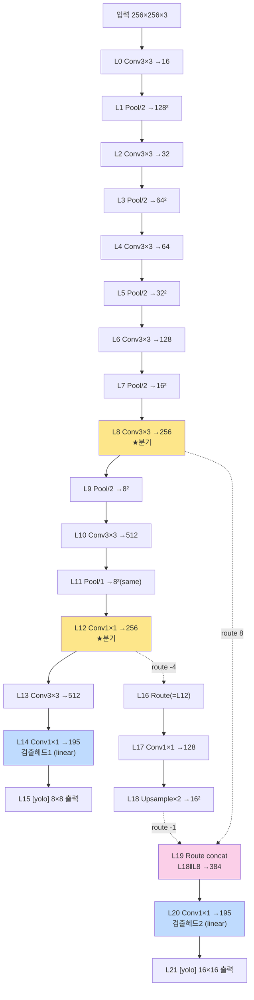

# 4장. 22-Layer 네트워크 구조

> [← 3장 skeleton C 레퍼런스](03_skeleton_reference.md) · [목차](README.md) · [5장 하드웨어 아키텍처 개요 →](05_hardware_overview.md)

---

이 장은 가속기가 추론하는 신경망의 토폴로지를 [aix2024.cfg](../../skeleton/bin/aix2024.cfg)에 근거해 레이어 단위로 해부합니다. RTL이 각 레이어를 어떤 모듈로 처리하는지의 매핑은 [5장](05_hardware_overview.md)에서, 메모리 배치는 [6장](06_data_representation_memory_map.md)에서 이어집니다.

---

## 4.1 모델 개요

| 항목 | 값 |
|------|----|
| 기반 모델 | YOLOv2-tiny 변형 (Darknet) |
| 입력 | 256 × 256 × 3 (RGB) |
| 레이어 수 | 22 (`layer_idx` 0~21) |
| 클래스 | 60 (`classes=60`) |
| 검출 헤드 | 2개 (L14: 8×8 격자, L20: 16×16 격자) |
| 앵커 | 6개, 헤드당 3개씩 (`mask`로 분배) |
| 양자화 | uint8 activation / int8 weight (레이어별 고정 multiplier) |

이 네트워크는 전형적인 **백본(다운샘플) → 검출 헤드 1 → 업샘플 + skip concat → 검출 헤드 2** 구조의 2-scale YOLO입니다. 작은 객체는 고해상도(16×16) 헤드가, 큰 객체는 저해상도(8×8) 헤드가 담당합니다.

---

## 4.2 네트워크 토폴로지

cfg의 `[route]`가 만드는 데이터 의존성(skip connection)을 포함한 전체 흐름입니다. 굵은 경로가 주 흐름, 점선이 skip/route입니다.



핵심 토폴로지 포인트:
- **L8이 두 번 쓰입니다**: 주 흐름(→L9)과 L19 concat. 그래서 L8 OFM은 DRAM에 보존되어야 합니다.
- **L12도 두 번 쓰입니다**: 주 흐름(→L13)과 L16 route(=L12 alias)→L17. 역시 보존 필요.
- **L19는 concat**: 업샘플된 L18(16×16×128)과 백본 L8(16×16×256)을 채널 축으로 이어 붙여 16×16×384를 만듭니다.

---

## 4.3 레이어별 상세 표

`cfg`의 블록 순서가 곧 `layer_idx`입니다(주석 처리된 `#[convolutional]` 블록은 인덱스에서 제외). 형상은 stride·pad로 계산했고, 양자화 multiplier는 [3장 3.3.2](03_skeleton_reference.md)에서 가져왔습니다.

| idx | cfg 블록 | 연산 | 입력(H×W×C) | 출력(H×W×C) | k/s/p | act | in_qm | w_qm | shift |
|-----|----------|------|-------------|-------------|-------|-----|-------|------|-------|
| **L0** | conv bn | Conv3×3 | 256×256×3 | 256×256×16 | 3/1/1 | relu | 128 | 16 | 8 |
| L1 | maxpool | Pool/2 | 256×256×16 | 128×128×16 | 2/2/- | - | - | - | - |
| **L2** | conv bn | Conv3×3 | 128×128×16 | 128×128×32 | 3/1/1 | relu | 8 | 64 | 6 |
| L3 | maxpool | Pool/2 | 128×128×32 | 64×64×32 | 2/2/- | - | - | - | - |
| **L4** | conv bn | Conv3×3 | 64×64×32 | 64×64×64 | 3/1/1 | relu | 8 | 64 | 6 |
| L5 | maxpool | Pool/2 | 64×64×64 | 32×32×64 | 2/2/- | - | - | - | - |
| **L6** | conv bn | Conv3×3 | 32×32×64 | 32×32×128 | 3/1/1 | relu | 8 | 64 | 6 |
| L7 | maxpool | Pool/2 | 32×32×128 | 16×16×128 | 2/2/- | - | - | - | - |
| **L8** | conv bn | Conv3×3 | 16×16×128 | 16×16×256 | 3/1/1 | relu | 8 | 64 | 6 |
| L9 | maxpool | Pool/2 | 16×16×256 | 8×8×256 | 2/2/- | - | - | - | - |
| **L10** | conv bn | Conv3×3 | 8×8×256 | 8×8×512 | 3/1/1 | relu | 8 | 64 | 6 |
| **L11** | maxpool | **Pool/1** | 8×8×512 | 8×8×512 | 2/**1**/- | - | - | - | - |
| **L12** | conv bn | Conv1×1 | 8×8×512 | 8×8×256 | 1/1/1 | relu | 8 | 64 | 6 |
| **L13** | conv bn | Conv3×3 | 8×8×256 | 8×8×512 | 3/1/1 | relu | 8 | 64 | 6 |
| **L14** | conv | Conv1×1 | 8×8×512 | 8×8×195 | 1/1/1 | **linear** | 8 | 64 | 6 |
| L15 | yolo | 출력 | 8×8×195 | (검출) | - | - | - | - | - |
| L16 | route -4 | Route(=L12) | - | 8×8×256 | - | - | - | - | - |
| **L17** | conv bn | Conv1×1 | 8×8×256 | 8×8×128 | 1/1/1 | relu | 8 | 64 | 6 |
| **L18** | upsample | Upsample×2 | 8×8×128 | 16×16×128 | s2 | - | - | - | - |
| L19 | route -1,8 | Route concat | - | 16×16×384 | - | - | - | - | - |
| **L20** | conv | Conv1×1 | 16×16×384 | 16×16×195 | 1/1/1 | **linear** | 8 | 64 | 9 |
| L21 | yolo | 출력 | 16×16×195 | (검출) | - | - | - | - | - |

> **`pad=1`과 1×1 conv**: cfg가 1×1 conv에도 `pad=1`을 적어두지만, Darknet은 `pad`를 `size/2`로 재계산하므로 1×1(size=1)의 실제 패딩은 0입니다. 따라서 1×1 레이어는 공간 크기를 바꾸지 않습니다.

---

## 4.4 연산이 세 종류로 갈리는 이유

22개 레이어는 RTL 관점에서 **세 부류**로 나뉩니다. 이 분류가 [5장](05_hardware_overview.md)의 모듈 매핑을 결정합니다.

### (a) Convolution — 11개 (L0,2,4,6,8,10,12,13,14,17,20)

가속기 연산의 거의 전부입니다. 3×3과 1×1 두 종류가 있으나, **둘 다 같은 `mac_kern`(144 MAC)으로 처리**합니다. 1×1은 `ifm_line_buf`의 1×1 mode로 윈도우 패킹만 달라집니다([8·9장](08_rtl_convolution_engine.md)).

### (b) 형상 변환 — Pool / Upsample (7개)

- **MaxPool stride 2** (L1,3,5,7,9): 2×2 영역의 최댓값, 공간 절반. `max_pool_unit`.
- **MaxPool stride 1** (L11): 2×2 윈도우를 1칸씩 슬라이드하며 same-padding으로 **크기를 유지**. 일반 풀링과 동작이 달라 전용 `max_pool_s1_unit`을 씁니다([CLAUDE.md 규칙 3](../../CLAUDE.md)).
- **Upsample ×2** (L18): 1픽셀을 2×2로 복제(nearest-neighbor), 공간 2배. `upsample_unit`.

### (c) 데이터 재배치 — Route / YOLO (4개, 연산 모듈 없음)

- **L16 Route(layers=-4)**: 4칸 뒤 레이어(=L12) 출력을 그대로 가리킵니다. RTL은 새 연산 없이 **DMA 주소를 L12 OFM으로 alias**합니다.
- **L19 Route(layers=-1,8)**: 직전(L18)과 L8을 채널 축으로 concat. **RTL REPACK**(`S_L19_RP_*` 8 states)이 L18·L8 OFM 을 dpram 에 적재 후 NHWC entry 로 재배치하여 L20 IFM 을 자동 생성합니다([10장](10_rtl_special_units.md)). software memcpy·double-inference 불필요.
- **L15, L21 YOLO**: 검출 헤드 출력을 좌표/클래스로 디코딩하는 단계로, RTL 연산 없이 소프트웨어 후처리입니다.

---

## 4.5 검출 헤드: 출력 채널 195의 유래

L14·L20의 출력 채널 수 195는 다음에서 나옵니다:

```
출력 채널 = (헤드당 앵커 수) × (5 + 클래스 수)
         = 3 × (5 + 60)
         = 3 × 65 = 195
```

- `3` = `mask`가 지정하는 헤드당 앵커 수 (L15는 `mask=3,4,5`, L21은 `mask=0,1,2`)
- `5` = 박스 좌표 4개(tx, ty, tw, th) + objectness 1개
- `60` = 클래스 확률

195는 4의 배수가 아니므로(195 = 48×4 + 3), RTL의 2×2 packed/16-byte entry 정렬에서 특별 취급이 필요합니다([6장](06_data_representation_memory_map.md)). 또한 검출 헤드는 `activation=linear`라서 ReLU·재양자화 없이 **INT8 raw**로 출력됩니다([3장 3.5](03_skeleton_reference.md), [8장 post_process](08_rtl_convolution_engine.md)).

---

## 4.6 연산량·메모리 프로파일

레이어별 곱셈(MAC) 횟수와 특징맵 크기를 직접 계산했습니다. MAC = `출력공간 × 출력채널 × (k² × 입력채널)`.

| 레이어 | MAC | 비중 | 출력 특징맵 크기(byte) |
|--------|-----|------|------------------------|
| L0 Conv3×3 | 28.3 M | 5.5% | 1,048,576 (1 MB) |
| L2 Conv3×3 | 75.5 M | 14.6% | 524,288 |
| L4 Conv3×3 | 75.5 M | 14.6% | 262,144 |
| L6 Conv3×3 | 75.5 M | 14.6% | 131,072 |
| L8 Conv3×3 | 75.5 M | 14.6% | 65,536 |
| L10 Conv3×3 | 75.5 M | 14.6% | 32,768 |
| L12 Conv1×1 | 8.4 M | 1.6% | 16,384 |
| L13 Conv3×3 | 75.5 M | 14.6% | 32,768 |
| L14 Conv1×1 | 6.4 M | 1.2% | 12,480 |
| L17 Conv1×1 | 2.1 M | 0.4% | 8,192 |
| L20 Conv1×1 | 19.2 M | 3.7% | 49,920 |
| **합계** | **≈ 517 M MAC** | 100% | — |

관찰:
- **L2·L4·L6·L8·L10·L13이 모두 75.5 M으로 동일** — 공간을 절반으로 줄이면서 채널을 두 배로 늘리는 설계라 conv 비용이 일정하게 유지됩니다. 6개 3×3 레이어가 전체 연산의 88%를 차지합니다.
- **메모리 피크는 L0 OFM(1 MB)** 과 입력 이미지(192 KB)입니다. 그래서 L0·L2처럼 큰 레이어는 OFM dpram(256 KB)에 한 번에 못 담고 row-block 단위로 streaming합니다([7·12장](12_operation_timing.md)).
- 가중치 총량은 약 3.1 M 개(INT8 ≈ 3 MB). DRAM에서는 16-byte slot 정렬 패딩으로 더 큰 영역(~9.8 MB)을 차지합니다([6장](06_data_representation_memory_map.md)).

---

## 4.7 RTL 구현 관점 요약 매핑

| 분류 | 레이어 | RTL 처리 | 상세 장 |
|------|--------|----------|---------|
| Conv 3×3 | L0,2,4,6,8,10,13 | `conv_top` + `mac_kern` (3×3 mode) | [8장](08_rtl_convolution_engine.md) |
| Conv 1×1 | L12,14,17,20 | 동일 모듈 (1×1 mode) | [8·9장](09_rtl_memory_buffers.md) |
| Pool/2 | L1,3,5,7,9 | `max_pool_unit` | [10장](10_rtl_special_units.md) |
| Pool/1 | L11 | `max_pool_s1_unit` | [10장](10_rtl_special_units.md) |
| Upsample | L18 | `upsample_unit` | [10장](10_rtl_special_units.md) |
| Route/YOLO | L15,16,19,21 | FSM skip + DMA 주소 / 소프트웨어 | [7·16장](07_rtl_yolo_engine_top.md) |
| 포맷 변환 | L1→L2, L3→L4, … L12→L13, L13→L14 등 | REPACK 엔진(NCHW→NHWC entry) | [10장](10_rtl_special_units.md) |

---

## 4.8 이 장의 요약

- 네트워크는 256×256×3 입력의 2-scale YOLOv2로, 백본(L0~L10) → 검출 헤드1(L14, 8×8) → 업샘플+skip concat(L17~L19) → 검출 헤드2(L20, 16×16) 구조.
- L8·L12가 skip/route로 두 번 쓰이므로 두 OFM은 DRAM에 보존됩니다.
- 연산은 (a) Conv(3×3·1×1, 같은 MAC 재사용) (b) Pool/Upsample(형상 변환) (c) Route/YOLO(재배치·후처리)로 갈립니다.
- 검출 헤드 출력 195 = 3앵커 × (5 + 60클래스)이며, `linear` 활성·INT8 raw 출력입니다.
- 총 연산은 약 517 M MAC이고, 6개 3×3 레이어(각 75.5 M)가 88%를 차지하며 메모리 피크는 L0 OFM(1 MB)입니다.

다음 장부터 본격적으로 하드웨어로 들어가, 이 레이어들을 처리하는 **모듈 계층과 데이터 흐름**을 조망합니다.

---

> [← 3장 skeleton C 레퍼런스](03_skeleton_reference.md) · [목차](README.md) · [5장 하드웨어 아키텍처 개요 →](05_hardware_overview.md)
