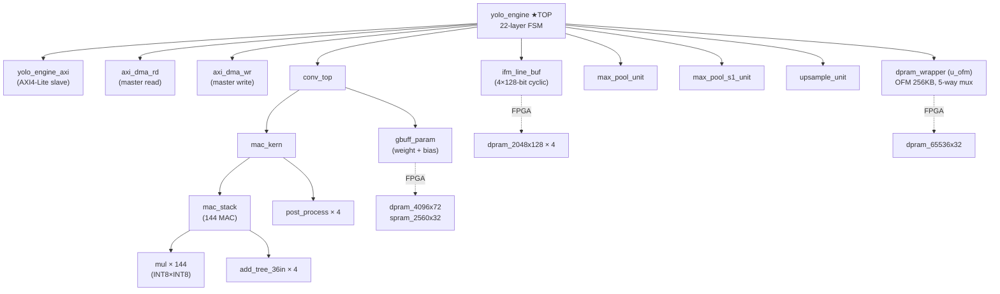

# 5장. 하드웨어 아키텍처 개요

> [← 4장 네트워크 구조](04_network_architecture.md) · [목차](README.md) · [6장 데이터 표현과 메모리 맵 →](06_data_representation_memory_map.md)

---

이 장은 RTL 전체를 "숲"의 관점에서 조망합니다. 개별 모듈의 "나무"는 [7~11장](07_rtl_yolo_engine_top.md)에서 하나씩 다루며, 여기서는 **무엇이 무엇을 인스턴스화하고, 데이터가 어디로 흐르는지**의 큰 지도를 제공합니다.

---

## 5.1 활성 RTL 파일 목록

합성·시뮬 대상은 [yolohw/src/](../../yolohw/src/)의 **19개 .v** 파일입니다. (`define.v`는 `mul.v`가 참조하는 include stub이며 실제 매크로는 `user_define_h.v`에 있습니다.)

| # | 파일 | 모듈 | 한 줄 역할 | 상세 장 |
|---|------|------|-----------|---------|
| 1 | [yolo_engine.v](../../yolohw/src/yolo_engine.v) | `yolo_engine` | 최상위. 22-layer 자동 추론 FSM(53 state), DRAM 맵, OFM dpram 포트 mux | [7](07_rtl_yolo_engine_top.md) |
| 2 | [yolo_engine_axi.v](../../yolohw/src/yolo_engine_axi.v) | `yolo_engine_axi` | AXI4-Lite slave (ctrl_reg0~3, network_done) | [11](11_rtl_axi_dma.md) |
| 3 | [axi_dma_rd.v](../../yolohw/src/axi_dma_rd.v) | `axi_dma_rd` | AXI4 master read (IFM/Weight/Bias) | [11](11_rtl_axi_dma.md) |
| 4 | [axi_dma_wr.v](../../yolohw/src/axi_dma_wr.v) | `axi_dma_wr` | AXI4 master write (OFM store) | [11](11_rtl_axi_dma.md) |
| 5 | [conv_top.v](../../yolohw/src/conv_top.v) | `conv_top` | Conv wrapper, output-stationary 4중 loop FSM | [8](08_rtl_convolution_engine.md) |
| 6 | [mac_kern.v](../../yolohw/src/mac_kern.v) | `mac_kern` | 144-MAC + 4 accumulator + 4 post_process | [8](08_rtl_convolution_engine.md) |
| 7 | [mac_stack.v](../../yolohw/src/mac_stack.v) | `mac_stack` | 36 mul × 4 spatial = 144 MAC + 4 가산트리 | [8](08_rtl_convolution_engine.md) |
| 8 | [mul.v](../../yolohw/src/mul.v) | `mul` | INT8×INT8→INT16 곱셈기 (DSP48 / behavioral) | [8](08_rtl_convolution_engine.md) |
| 9 | [add_tree_36in.v](../../yolohw/src/add_tree_36in.v) | `add_tree_36in` | 36-입력 부호 가산 트리 | [8](08_rtl_convolution_engine.md) |
| 10 | [post_process.v](../../yolohw/src/post_process.v) | `post_process` | bias + ReLU + shift + clamp | [8](08_rtl_convolution_engine.md) |
| 11 | [ifm_line_buf.v](../../yolohw/src/ifm_line_buf.v) | `ifm_line_buf` | 4-row cyclic 라인버퍼 + 윈도우 패킹(3×3/1×1) | [9](09_rtl_memory_buffers.md) |
| 12 | [gbuff_param.v](../../yolohw/src/gbuff_param.v) | `gbuff_param` | weight(4096×72) + bias(2560×32) 버퍼 | [9](09_rtl_memory_buffers.md) |
| 13 | [dpram_wrapper.v](../../yolohw/src/dpram_wrapper.v) | `dpram_wrapper` | Dual-port RAM 래퍼 (OFM 65536×32 등) | [9](09_rtl_memory_buffers.md) |
| 14 | [spram_wrapper.v](../../yolohw/src/spram_wrapper.v) | `spram_wrapper` | Single-port RAM 래퍼 | [9](09_rtl_memory_buffers.md) |
| 15 | [max_pool_unit.v](../../yolohw/src/max_pool_unit.v) | `max_pool_unit` | stride-2 maxpool (L1/3/5/7/9) | [10](10_rtl_special_units.md) |
| 16 | [max_pool_s1_unit.v](../../yolohw/src/max_pool_s1_unit.v) | `max_pool_s1_unit` | stride-1 maxpool (L11) | [10](10_rtl_special_units.md) |
| 17 | [upsample_unit.v](../../yolohw/src/upsample_unit.v) | `upsample_unit` | 2× nearest-neighbor upsample (L18) | [10](10_rtl_special_units.md) |
| 18 | [user_define_h.v](../../yolohw/src/user_define_h.v) | (헤더) | `` `define FPGA `` 매크로 + BRAM 매크로 | [11](11_rtl_axi_dma.md) |
| 19 | [define.v](../../yolohw/src/define.v) | (헤더) | `mul.v` 참조용 include stub | [11](11_rtl_axi_dma.md) |

---

## 5.2 모듈 인스턴스 계층



핵심 인스턴스 관계:
- `yolo_engine`이 **모든 연산 유닛과 DMA, 메모리를 직접 인스턴스화**하고 FSM으로 조율합니다.
- 연산 코어는 `conv_top → mac_kern → mac_stack → (mul × 144 + add_tree × 4)`의 4단 계층입니다.
- `gbuff_param`과 `ifm_line_buf`는 `conv_top`/`mac_kern`에 데이터를 공급합니다.
- `` `ifdef FPGA `` 일 때만 점선의 BMG IP(BRAM)가 실체화되고, 시뮬에서는 behavioral reg 배열로 대체됩니다([15장](15_vivado_project.md)).

---

## 5.3 데이터 흐름

한 레이어를 처리할 때 데이터가 도는 경로입니다. DDR2 ↔ 가속기의 모든 이동은 **AXI master DMA 한 쌍**이 담당합니다.

```mermaid
graph TB
    DDR[("DDR2<br/>weight/bias/IFM/OFM")]
    DDR -->|DMA read| ASM["4-word assembler<br/>→ 128-bit<br/>+ dma_target demux"]
    ASM -->|IFM| LB["ifm_line_buf"]
    ASM -->|Weight 72b / Bias 32b| GP["gbuff_param"]
    LB -->|4 × 288-bit<br/>(2×2 spatial set)| MK["conv_top + mac_kern<br/>144-MAC + 4 post_process"]
    GP -->|288-bit wgt + 32-bit bias| MK
    MK -->|32-bit packed<br/>(2×2 = 4 픽셀)| OFM["OFM dpram<br/>(256KB, 5-way mux)"]
    OFM --> PL["max_pool / s1_pool / upsample"]
    PL --> OFM
    OFM -->|DMA write| DDR
```

흐름 요약:
1. **DMA read**: DRAM에서 32-bit씩 받아 4개를 모아 128-bit로 조립하고, `dma_target`에 따라 IFM(→`ifm_line_buf`)·Weight·Bias(→`gbuff_param`)로 분배.
2. **연산**: `conv_top`이 라인버퍼에서 2×2 spatial set(각 288-bit)을, 파라미터 버퍼에서 가중치(288-bit)+bias를 받아 144-MAC로 4픽셀을 동시 산출.
3. **OFM staging**: 결과를 OFM dpram에 임시 저장. pool/upsample 레이어는 이 dpram을 in-place로 읽고 씀.
4. **DMA write**: 레이어가 끝나면 OFM dpram → DRAM으로 기록.

각 단계의 cycle-by-cycle 타이밍은 [12장](12_operation_timing.md)에서 다룹니다.

---

## 5.4 144-MAC 어레이 (요약)

연산 코어는 한 cycle에 **2×2 출력 블록의 4픽셀을 동시에** 만듭니다.

```
144 MAC = 36 multiplier × 4 spatial set
          └── 36 = 3×3 커널 × 4 입력채널 (3×3 conv 한 윈도우)
          └── 4 spatial set = 출력 2×2 블록의 네 위치 (00, 01, 10, 11)
```

- 36개 곱셈은 3×3 커널(9)과 4개 입력 채널(4)을 한 번에 처리하는 단위입니다.
- 같은 가중치 세트로 인접한 4개 출력 위치(2×2)를 동시에 계산하기 위해 spatial set이 4벌 있습니다.
- 입력 채널이 4를 초과하면(거의 모든 레이어), `acc_len` cycle 동안 누적(accumulate)합니다. 예: L10은 Ci=256이므로 256/4 = 64 cycle 누적.

자세한 데이터패스·파이프라인 latency(`8 + acc_len + 1` cycle)는 [8장](08_rtl_convolution_engine.md)에서 다룹니다.

---

## 5.5 22-Layer ↔ 모듈 매핑

[4장 표](04_network_architecture.md)를 모듈 관점에서 다시 정리하면:

| 사용 모듈 | 담당 레이어 | 호출 횟수 |
|-----------|-------------|-----------|
| `conv_top` (+ `mac_kern`, `gbuff_param`, `ifm_line_buf`) | L0,2,4,6,8,10,13 (3×3) · L12,14,17,20 (1×1) | 11 |
| `max_pool_unit` | L1,3,5,7,9 | 5 |
| `max_pool_s1_unit` | L11 | 1 |
| `upsample_unit` | L18 | 1 |
| REPACK 엔진(FSM 내장) | L2,4,6,8,10 직전 + L12→13, L13→14, L12→17, L13→17 등 | 다수 |
| (모듈 없음) Route/YOLO | L15,16,19,21 | — |

`conv_top`을 비롯한 연산 유닛은 **물리적으로 1벌만 인스턴스화**되어, FSM이 레이어를 순회하며 파라미터(W/H/Ci/Co/acc_len/shift/mode)를 mux로 바꿔가며 재사용합니다. 이것이 면적·에너지를 절감하는 핵심입니다.

---

## 5.6 온칩 메모리 자원 요약

| 버퍼 | 모듈 | 크기 | 포맷 | 용도 |
|------|------|------|------|------|
| Weight 버퍼 | `gbuff_param` | 4096 × 72-bit = 36 KB | write 72 / read 288 비대칭 | 가중치(streaming) |
| Bias 버퍼 | `gbuff_param` | 2560 × 32-bit = 10 KB | {bias16, shift16} | 바이어스 + 시프트 |
| IFM 라인버퍼 | `ifm_line_buf` | 2048 × 128-bit × 4 bank | 4-row cyclic | 입력 윈도우 |
| OFM staging | `dpram_wrapper` | 65536 × 32-bit = 256 KB | 2×2 packed | 출력 + pool/upsample |

총 온칩 BRAM 사용량은 약 1.3 MB(IFM 라인버퍼가 1 MB로 최대) 수준이며, Artix-7 XC7A100T의 BRAM(약 4.86 Mb ≈ 600 KB… 실제로는 BRAM 36Kb × 135)을 고려하면 IFM 라인버퍼 깊이는 신중히 설계되어 있습니다. 각 메모리의 정확한 비트 배치와 포트 구조는 [9장](09_rtl_memory_buffers.md)에서, DRAM 외부 메모리 맵은 [6장](06_data_representation_memory_map.md)에서 다룹니다.

> 메모리 용량은 합성 시 BMG IP 설정에 따라 BRAM 타일 수가 결정됩니다. 실제 점유 타일 수는 [15장](15_vivado_project.md)의 합성 리포트에서 확인합니다(보드 통합 Phase 4에서 확정 예정).

---

## 5.7 이 장의 요약

- 활성 RTL은 19개 .v로, `yolo_engine`이 모든 연산 유닛·DMA·메모리를 인스턴스화하고 FSM으로 조율합니다.
- 연산 코어 계층은 `conv_top → mac_kern → mac_stack → (mul ×144 + add_tree ×4)`.
- 데이터 흐름은 **DMA read → (line_buf/param_buf) → 144-MAC → OFM dpram → DMA write**의 레이어 반복.
- 144-MAC = 36(3×3×4ch) × 4(2×2 출력)로 한 cycle 4픽셀 생성, Ci>4는 `acc_len` cycle 누적.
- 연산 유닛은 1벌만 두고 파라미터 mux로 22-layer를 재사용 — 면적·에너지 절감의 핵심.

다음 장에서는 이 하드웨어가 다루는 **데이터의 비트 단위 표현과 DRAM/온칩 메모리 맵**을 정밀하게 정의합니다.

---

> [← 4장 네트워크 구조](04_network_architecture.md) · [목차](README.md) · [6장 데이터 표현과 메모리 맵 →](06_data_representation_memory_map.md)
