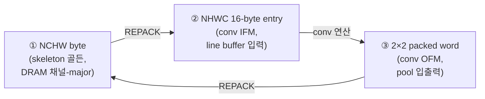

# 6장. 데이터 표현과 메모리 맵

> [← 5장 하드웨어 개요](05_hardware_overview.md) · [목차](README.md) · [7장 yolo_engine TOP FSM →](07_rtl_yolo_engine_top.md)

---

이 장은 가속기 내부를 흐르는 데이터의 **비트 단위 표현**과, 그것이 외부 DRAM·온칩 BRAM에 **어떻게 배치되는지**를 정의합니다. RTL 디버깅에서 mismatch가 났을 때 가장 먼저 확인해야 하는 것이 데이터 포맷이므로, 이 장은 검증의 기준점입니다.

---

## 6.1 수 표현

| 데이터 | 비트폭 | 부호 | 범위 | 사용처 |
|--------|--------|------|------|--------|
| 입력/활성(activation) | 8 | unsigned로 저장하되 곱셈은 signed | 0~255 (또는 −128~127) | `mul.x`, line buffer |
| 가중치(weight) | 8 | **signed (INT8)** | −128~+127 | `mul.w`, gbuff weight |
| 곱셈 결과 | 16 | signed | −16384~+16383 | `mul.y` |
| 가산 트리 합 | 22 | signed | ±2²¹ (36×127×255≈1.17 M) | `add_tree_36in`, `mac_stack` |
| 누적(accumulator) | 32 | signed | 31-bit | `mac_kern` psum |
| 바이어스 | 16→32 | signed (sign-extend) | −32768~+32767 | `post_process.bias` |
| 시프트량 | 5 | unsigned | 0~31 | `post_process.shift_amount` |
| 출력 픽셀 | 8 | UINT8(relu) / INT8(linear) | 0~255 / −128~127 | OFM |

### 곱셈기의 부호 처리 — 자주 틀리는 지점

[mul.v](../../yolohw/src/mul.v)는 `w`, `x` 모두 INT8 signed로 취급합니다. Phase 2의 핵심 버그가 바로 여기였습니다: 입력 `x`를 `$signed({1'b0,x})`(uint8)로 다루면 음수 가중치와의 곱이 틀어집니다. 수정 후 `$signed(x)`로 INT8 signed 처리하여 conv_top_tb mismatch가 31→0이 되었습니다([HISTORY 2026-05-22](../../HISTORY.md)).

```verilog
// 시뮬 경로 (mul.v:62)
dsp_P[0] <= $signed(w) * $signed(x);     // 둘 다 INT8 signed
// FPGA 경로 (mul.v:44) — INT18로 부호 확장 후 DSP48에 공급
assign dsp_A = w[7] ? {10'b11_1111_1111, w} : {10'b00_0000_0000, w};
```

곱의 최댓값은 `(−128)×(−128)=16384`이므로 16-bit signed로 충분합니다(상위 비트는 부호 확장).

---

## 6.2 특징맵 포맷 — 세 가지

가속기는 같은 특징맵을 단계에 따라 **세 가지 포맷**으로 다룹니다. 이 변환을 이해하는 것이 데이터 흐름 이해의 핵심입니다.



### ① NCHW byte order (skeleton 골든 / 채널-major DRAM)

skeleton C가 덤프하는 포맷이자, pool/upsample 출력의 채널-major 스트림 포맷입니다.

```
주소 증가 →
[ch0: pix(0,0) pix(0,1) ... pix(H-1,W-1)] [ch1: ...] ... [ch(C-1): ...]
  └────────── 한 채널 전체 (H×W byte) ──────────┘
```

채널 하나를 통째로 쓰고 다음 채널로 넘어갑니다. 1 byte = 1 픽셀. [3장 3.5](03_skeleton_reference.md) 참조.

### ② NHWC 16-byte entry (conv 입력 / line buffer)

`ifm_line_buf`가 요구하는 conv 입력 포맷입니다. **128-bit(16 byte) = 4 col × 4 ch**.

```
한 entry (128-bit) = 4개 col × 4개 ch:
 byte index b = col*4 + ch     (col∈0..3, ch∈0..3)

  MSB                                                              LSB
  ┌──────┬──────┬──────┬──────┬─────┬──────┬──────┬──────┬──────┐
  │col3  │col3  │col3  │col3  │ ... │col0  │col0  │col0  │col0  │
  │ ch3  │ ch2  │ ch1  │ ch0  │     │ ch3  │ ch2  │ ch1  │ ch0  │
  └──────┴──────┴──────┴──────┴─────┴──────┴──────┴──────┴──────┘
   byte15 byte14 ...                  byte3  byte2  byte1  byte0
```

- 한 행(row)은 `ceil(W/4)`개 entry(`i_w_blocks`)로 구성됩니다.
- line buffer는 이 entry 4개 행(4 bank)을 cyclic하게 저장하여 3×3 윈도우를 만듭니다([9장](09_rtl_memory_buffers.md)).
- conv 직전 레이어 출력(채널-major)을 이 포맷으로 바꾸는 것이 **REPACK**입니다([6.6](#66-repack--포맷-변환의-필요성), [10장](10_rtl_special_units.md)).

### ③ 2×2 packed word (conv 출력 / pool 입출력)

conv가 한 cycle에 생성하는 2×2 출력 블록을 담는 32-bit 포맷입니다.

```
32-bit word = 한 2×2 OFM block (4 픽셀):
 conv_top o_pixel = {px11, px10, px01, px00}

  MSB                                  LSB
  ┌────────┬────────┬────────┬────────┐
  │ px(1,1)│ px(1,0)│ px(0,1)│ px(0,0)│
  └────────┴────────┴────────┴────────┘
   byte3    byte2    byte1    byte0
```

- `byte0 = (0,0)`, `byte1 = (0,1)`, `byte2 = (1,0)`, `byte3 = (1,1)` (행 우선 2×2).
- `max_pool_unit`은 이 32-bit word(=2×2 블록)의 4 byte 최댓값을 구합니다([10장](10_rtl_special_units.md)).

---

## 6.3 가중치 패킹 — 16-byte slot

`gbuff_param`의 가중치 메모리는 **write 72-bit / read 288-bit 비대칭**입니다([9장](09_rtl_memory_buffers.md)). read 한 entry(288-bit = 36 byte)가 `mac_stack`의 36개 곱셈기에 그대로 들어갑니다.

```
read entry (288-bit) = 36 weight (INT8):
  mac_stack 의 mul[i].w = wgt[i*8 +: 8],  i = 0..35

3×3 conv 의 인덱스 매핑 (i = c_local*9 + kh*3 + kw):
  i =  0.. 8 : 입력채널 0 의 3×3 (9 weight)
  i =  9..17 : 입력채널 1 의 3×3
  i = 18..26 : 입력채널 2 의 3×3
  i = 27..35 : 입력채널 3 의 3×3
```

288 = 4 × 72이므로, write 측에서는 72-bit씩 4번 쓰면 한 read entry가 됩니다. **소프트웨어가 hex 생성 시점에 3×3(=9) 가중치를 16-byte(slot) 경계에 0-padding 정렬**합니다([CLAUDE.md 규칙: 128-bit 정렬](../../CLAUDE.md)).

### 1×1 conv에서의 채널 배치 (Phase 2 버그 수정 지점)

1×1 conv는 커널이 1개뿐이므로 한 입력채널당 weight 1개입니다. weight slot이 채널 0~3을 byte `0, 9, 18, 27`(9 byte 간격, 각 slot의 LSB)에 두므로, `ifm_line_buf`의 1×1 mode도 입력 채널 0~3을 **동일한 byte 0, 9, 18, 27 위치**에 배치합니다([ifm_line_buf.v:418-436](../../yolohw/src/ifm_line_buf.v#L418)). 이 정렬을 맞추지 않아 ch1~3 곱셈이 무시되던 것이 Phase 2 버그였고, 수정 후 L12 mismatch가 10997→0이 되었습니다([HISTORY 6차](../../HISTORY.md)).

---

## 6.4 바이어스 + 시프트 패킹

`gbuff_param`의 bias 메모리는 entry당 32-bit로 **`{bias[15:0], shift[15:0]}`** 를 packed합니다(설계 의도). 실제 `mac_kern`에는 32-bit bias와 5-bit shift가 분리되어 전달되며, **16-bit bias를 32-bit로 적재할 때는 반드시 sign-extend** 해야 합니다([CLAUDE.md 규칙 7](../../CLAUDE.md)):

```verilog
i_bias = { {16{bias[15]}}, bias };   // ✅ sign-extend (zero-extend 금지)
```

zero-extend하면 음수 바이어스가 큰 양수가 되어 출력이 완전히 깨집니다.

---

## 6.5 Descaling과 Clamp

[post_process.v](../../yolohw/src/post_process.v)가 누적 결과를 최종 픽셀로 만드는 4단계입니다.

```
① biased    = acc_result + bias
② activated  = (i_relu_en && biased<0) ? 0 : biased     ← ReLU
③ scaled    = (activated + round_bias) >>> shift_amount  ← descaling
④ clamped   = relu_en ? UINT8(0..255) : INT8(-128..127)  ← 포화
```

### toward-zero rounding (검출 헤드 정확도의 핵심)

Verilog `>>>`는 floor(−∞ 방향), C의 `/`는 toward-zero입니다. 음수에서 둘이 1 LSB 다릅니다(예: −50/64 = 0(C) vs −1(`>>>`)). C와 일치시키려고 **음수일 때만 `(2^shift − 1)`을 더한 뒤 시프트**합니다([post_process.v:56](../../yolohw/src/post_process.v#L56)):

```verilog
wire signed [31:0] round_bias = activated[31] ?
    (($signed(32'sd1) <<< shift_amount) - 32'sd1) : 32'sd0;
wire signed [31:0] scaled = (activated + round_bias) >>> shift_amount;
```

양수일 때 `round_bias=0`이라 ReLU가 적용되는 일반 레이어(L0~L13, L17)에는 영향이 없습니다. 이 보정은 ReLU가 없어 음수 출력이 나오는 **검출 헤드 L14·L20에서 결정적**이며, 이를 추가하여 L14가 0 mismatch가 되었습니다([HISTORY 9차](../../HISTORY.md)).

### Clamp 두 모드

| `i_relu_en` | 레이어 | clamp |
|-------------|--------|-------|
| 1 | L0~L13, L17 | UINT8 0~255 (음수→0, 255 초과→255) |
| 0 | L14, L20 (검출 헤드) | INT8 −128~+127 (`0x80`~`0x7F`) |

`yolo_engine`은 `i_relu_en = !is_conv_l14`(및 L20) 식으로 검출 헤드에서만 ReLU를 끕니다.

---

## 6.6 REPACK — 포맷 변환의 필요성

conv 출력(2×2 packed) 또는 pool 출력(채널-major)을 다음 conv의 입력(NHWC 16-byte entry)으로 바꾸려면 **REPACK**이 필요합니다. 이는 별도 연산이 아니라 **메모리 재배치**이며, `yolo_engine`의 FSM이 DMA+dpram으로 수행합니다([10장](10_rtl_special_units.md)).

```
채널-major / 2×2 packed  ──REPACK──►  NHWC 16-byte entry
  (이전 레이어 OFM)                      (다음 conv IFM)
```

REPACK이 일어나는 지점: L1→L2, L3→L4, L5→L6, L7→L8, L9→L10(pool 후 3×3 conv 전), 그리고 L11→L12, L12→L13, L13→L14, L12→L17 등(1×1/3×3 conv 전). 변환식의 비트 단위 상세는 [10장 §REPACK 엔진](10_rtl_special_units.md)에서 다룹니다.

---

## 6.7 DRAM 메모리 맵

DRAM은 **세 영역**으로 나뉘며, base 주소는 `yolo_engine`의 제어 레지스터로 외부에서 지정합니다([7장](07_rtl_yolo_engine_top.md)).

| 제어 레지스터 | 의미 | 내용 |
|---------------|------|------|
| `ctrl_reg1` | `dram_wgt_base` | weights + bias (bias는 `+0x00A0_0000` offset) |
| `ctrl_reg2` | `dram_ifm_base` | 입력 이미지 (L0 IFM) |
| `ctrl_reg3` | `dram_ofm_base` | 모든 레이어 OFM (per-layer offset 적용) |

### 검증 시점의 절대 배치 (HISTORY 기준)

```
WGT  : 0x0000_0000  (~10 MB, 11 layer weights)
BIAS : 0x00A0_0000  (2294 word ≈ 9.2 KB)
IFM  : 0x00B0_0000  (65536 word = 256 KB, L0 입력 이미지)
OFM  : 0x00C0_0000  → 아래 per-layer offset
```

### Per-layer OFM offset (32-bit word, `yolo_engine.v` case table)

| Layer | offset(word) | size(word) | 포맷 | 비고 |
|-------|-------------|-----------|------|------|
| L0 | 0 | 262144 | 2×2 packed | 1 MB (최대) |
| L1 | 262144 | 65536 | 채널-major | |
| L2 | 327680 | 131072 | 2×2 packed | REPACK IFM 별도 |
| L3 | 458752 | 32768 | | |
| L4 | 491520 | 65536 | | |
| L5 | 557056 | 16384 | | |
| L6 | 573440 | 32768 | | |
| L7 | 606208 | 8192 | | |
| **L8** | 614400 | 16384 | | ★ L19 concat용 보존 |
| L9 | 630784 | 4096 | | |
| L10 | 634880 | 8192 | | |
| L11 | 643072 | 8192 | | pool/1 |
| **L12** | 651264 | 4096 | | ★ L16 alias용 보존 |
| L13 | 655360 | 8192 | | |
| L14 | 663552 | 3120 | | 검출 헤드1 (195ch) |
| L16 | 651264 | 4096 | | = L12 alias |
| L17 | 666672 | 2048 | | |
| L18 | 668720 | 8192 (+16384 L8) | | upsample, concat 예약 |
| L19 | 668720 | 24576 | | = L18+L8 concat |
| L20 | 693296 | 12480 | | 검출 헤드2 (195ch) |

> 핵심: 각 레이어 OFM은 **고정(결정론적) offset**에 배치됩니다. L8·L12는 route(L19 concat, L16 alias)에서 재사용되므로 덮어쓰지 않고 보존합니다. 195채널(L14/L20)은 4의 배수가 아니라 별도 크기가 할당됩니다.

---

## 6.8 온칩 메모리 맵

| 버퍼 | 깊이 × 폭 | 포맷 | 비고 |
|------|-----------|------|------|
| Weight (`gbuff_param`) | 4096 × 72-bit (read 1024 × 288) | 16-byte slot 정렬 | 36 KB |
| Bias (`gbuff_param`) | 2560 × 32-bit | {bias16, shift16} | 10 KB, 전 레이어 합 ≈2294 |
| Line buffer (`ifm_line_buf`) | 2048 × 128-bit × 4 bank | NHWC entry, cyclic | 1 MB, line=row mod 4 |
| OFM dpram (`u_ofm`) | 65536 × 32-bit | 2×2 packed | 256 KB, 5-way mux |

OFM dpram은 한 레이어 동안 여러 용도로 in-place 재사용됩니다. 예를 들어 L11(pool/1)은 입력을 `[0..8191]`, 출력을 `[8192..16383]`에 두고, L18(upsample)은 입력을 `[0..2047]`, 출력을 `[2048..10239]`에 둡니다([10장](10_rtl_special_units.md)). 포트 mux 구조는 [7장](07_rtl_yolo_engine_top.md)·[9장](09_rtl_memory_buffers.md)에서 다룹니다.

---

## 6.9 이 장의 요약

- 수 표현: INT8 weight/activation(곱셈은 signed), 16-bit 곱, 22-bit 가산, 32-bit 누적, INT16 bias(sign-extend), UINT8/INT8 출력.
- 특징맵은 ① NCHW byte(골든·채널-major) ② NHWC 16-byte entry(conv 입력) ③ 2×2 packed word(conv 출력)의 세 포맷을 오갑니다.
- 가중치는 16-byte slot 정렬(288-bit read = 36 weight), 1×1은 채널을 byte 0/9/18/27에 배치(weight와 정렬).
- descaling은 산술 시프트 + 음수 toward-zero 보정(C 일치), clamp는 ReLU 레이어 UINT8 / 검출 헤드 INT8.
- DRAM은 WGT/BIAS/IFM/OFM 3영역, OFM은 per-layer 고정 offset이며 L8·L12는 route용 보존.

다음 장부터는 이 데이터를 실제로 조율하는 **RTL 모듈을 하나씩** 해부합니다. 먼저 모든 것을 지휘하는 최상위 `yolo_engine`입니다.

---

> [← 5장 하드웨어 개요](05_hardware_overview.md) · [목차](README.md) · [7장 yolo_engine TOP FSM →](07_rtl_yolo_engine_top.md)
