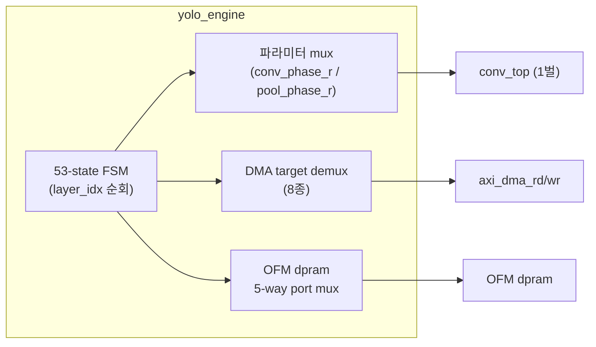
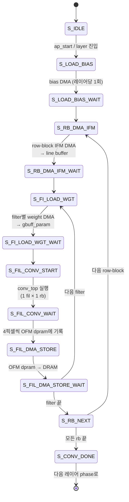

# 7장. RTL — yolo_engine (최상위 FSM)

> [← 6장 데이터 표현과 메모리 맵](06_data_representation_memory_map.md) · [목차](README.md) · [8장 Convolution 엔진 →](08_rtl_convolution_engine.md)

---

[yolo_engine.v](../../yolohw/src/yolo_engine.v)(2365줄)는 시스템의 두뇌입니다. 22-layer를 자동으로 순회하면서, 매 레이어마다 적절한 파라미터를 골라 DMA·연산 유닛·메모리를 지휘합니다. 이 장은 그 **제어 구조(FSM)와 자원 조율(mux)**을 해부합니다. 연산 유닛 자체는 [8~11장](08_rtl_convolution_engine.md)에서 다룹니다.

---

## 7.1 역할: 단일 연산 유닛을 22번 재사용하는 지휘자

핵심 설계 사상은 **"연산 유닛은 1벌, 파라미터는 레이어마다 바꿔 끼운다"** 입니다. `conv_top`·`max_pool_unit`·`upsample_unit`은 각각 물리적으로 1개만 인스턴스화되고, `yolo_engine`의 FSM이 `layer_idx`를 진행시키며 W/H/Ci/Co/acc_len/shift/mode/DRAM 주소를 mux로 바꿔 공급합니다.



---

## 7.2 포트 인터페이스

| 그룹 | 신호 | 방향 | 설명 |
|------|------|------|------|
| 클럭/리셋 | `clk`, `rstn` | in | |
| AXI4-Lite slave | `S_AXI_*` | in/out | 제어 레지스터 (ctrl_reg0~3) — `yolo_engine_axi` 경유 |
| AXI4 master read | `M_AR*`, `M_R*` | in/out | DRAM read (`axi_dma_rd`) |
| AXI4 master write | `M_AW*`, `M_W*`, `M_B*` | in/out | DRAM write (`axi_dma_wr`) |
| 완료 | `o_network_done`, `network_done_led` | out | 전체 추론 완료 |

파라미터: `C_S_AXI_DATA_WIDTH=32`, `C_S_AXI_ADDR_WIDTH=4`, `AXI_M_WIDTH_AD/DA=32`, `AXI_M_WIDTH_ID=4`.

제어 레지스터(`yolo_engine_axi` 경유, [11장](11_rtl_axi_dma.md)):

| 레지스터 | 의미 |
|----------|------|
| `ctrl_reg0[0]` | `ap_start` (추론 시작 펄스) |
| `ctrl_reg0[1]` | `network_done` (read-back) |
| `ctrl_reg1` | `dram_wgt_base` |
| `ctrl_reg2` | `dram_ifm_base` |
| `ctrl_reg3` | `dram_ofm_base` |

---

## 7.3 레이어 파라미터 case table

`yolo_engine.v`의 약 122~610행은 **레이어별 상수(localparam)의 거대한 테이블**입니다. 각 레이어가 conv/pool/REPACK에 필요한 모든 수치를 정의합니다. 예시(L0, L2):

```verilog
// L0 (CONV3×3, 256×256×3 → 256×256×16)
localparam L0_W=256, L0_H=256, L0_W_HALF=128, L0_W_BLOCKS=64;
localparam L0_CO=16, L0_ACC_LEN=1, L0_SHIFT=8, L0_CI_GRPS=1;

// L2 (CONV3×3, 128×128×16 → 128×128×32)
localparam L2_W=128, L2_W_BLOCKS=32, L2_CO=32;
localparam L2_ACC_LEN=4, L2_SHIFT=6, L2_CI_GRPS=4;     // scale 0x40=64=2^6
localparam L2_BIAS_ENTRY_BASE=16;
localparam L2_OFM_BYTE_BASE=32'h00180000;
```

| 파라미터 유형 | 예시 상수 | 용도 |
|---------------|-----------|------|
| 공간 크기 | `Lx_W`, `Lx_H`, `Lx_W_HALF`, `Lx_W_BLOCKS` | conv loop 범위, line buffer |
| 채널 | `Lx_CO`, `Lx_CI_GRPS`, `Lx_ACC_LEN` | filter 수, 누적 길이 |
| 양자화 | `Lx_SHIFT` | descaling (← [3장 scale](03_skeleton_reference.md)) |
| DRAM 주소 | `Lx_OFM_BYTE_BASE`, `Lx_WGT_BYTE_OFF`, `Lx_BIAS_BYTE_OFF` | DMA base |
| DMA 크기 | `Lx_BIAS_DMA_WORDS`, `Lx_IFM_INIT/NEXT_WORDS`, `Lx_WGT_PER_FI_WORDS` | burst 길이 |
| 버퍼 entry | `Lx_BIAS_ENTRY_BASE` | gbuff bias 위치 |

이 상수들은 약 762행부터의 **conv 파라미터 mux**와 **REPACK 파라미터 mux**에서 `conv_phase_r`/`pool_phase_r` 값에 따라 선택되어 `cur_w_half`, `cur_acc_len`, `cur_shift` 등의 wire로 묶입니다. 그 wire가 `conv_top` 입력에 연결됩니다([7.6](#76-conv-layer-실행-흐름)).

---

## 7.4 레이어 식별 — conv_phase_r / pool_phase_r

FSM은 두 개의 phase 레지스터로 "지금 처리 중인 레이어"를 가립니다.

```verilog
reg [4:0] conv_phase_r;   // conv 레이어 식별 (값 = layer_idx)
wire is_conv_l0  = (conv_phase_r == 5'd0);
wire is_conv_l12 = (conv_phase_r == 5'd12);
...
wire is_conv_1x1 = is_conv_l12 || is_conv_l14 || is_conv_l17 || is_conv_l20;

reg [4:0] pool_phase_r;   // pool 레이어 식별
wire is_pool_l1 = (pool_phase_r == 5'd1);
...
```

- `conv_phase_r`은 conv 레이어(L0,2,4,6,8,10,12,13,14,17,20)에서 해당 인덱스를 가집니다.
- `is_conv_1x1`은 1×1 레이어(L12/14/17/20)를 묶어, `conv_top.i_mode`와 `ifm_line_buf.i_mode`를 1로 설정합니다.
- `pool_phase_r`은 stride-2 pool(L1,3,5,7,9)을 식별합니다(L11은 별도 state로 처리).

---

## 7.5 53-state FSM 전경

FSM(`state_r [5:0]`, 53 state)은 기능별로 7개 그룹으로 나뉩니다.

| 그룹 | state 범위 | 담당 | 비고 |
|------|-----------|------|------|
| **Conv** | `S_IDLE`(0) ~ `S_CONV_DONE`(12) | 모든 conv 레이어 | bias→IFM→weight→conv→store |
| **Pool/2** | `S_L1_FI_LOAD`(13) ~ `S_L1_NEXT_FI`(19) | L1/3/5/7/9 | filter별 load→pool→store |
| **REPACK(pool→conv)** | `S_RP_LOAD`(20) ~ `S_RP_NEXT_CIG`(25) | L2/4/6/8/10 직전 | 채널-major → NHWC entry |
| **L11 Pool/1** | `S_L11_LOAD`(26,27), `S_L11_POOL`(29,30), `S_L11_STORE`(31,32) | L11 | stride-1 maxpool |
| **REPACK(conv→conv)** | `S_L12_RP_LOAD`(33) ~ `S_L12_RP_NEXT`(38) | L12/13/14/17 직전 | conv OFM → NHWC entry |
| **L18 Upsample** | `S_L18_LOAD`(39) ~ `S_L18_STORE_WAIT`(44) | L18 | 2× upsample |
| **L19 Route concat** | `S_L19_RP_LOAD_A`(45) ~ `S_L19_RP_NEXT`(52) | L20 직전 | L18‖L8 concat → L20 IFM |
| 종료 | `S_DONE`(28) | — | network_done |

> **state 번호가 기능 순서와 다른 이유**: 개발이 레이어 단위로 점진적으로 진행되어(HISTORY 5~11차) state가 추가된 순서대로 번호가 붙었습니다. 따라서 `S_DONE`이 28번, L11 처리가 26~32번에 흩어져 있습니다. 번호가 아닌 **이름과 그룹**으로 읽으십시오.

---

## 7.6 Conv layer 실행 흐름

가장 중요한 흐름입니다. 핵심은 **`yolo_engine`이 filter loop와 row-block(rb) loop를 직접 돌리고, `conv_top`은 "1 filter × 1 row-block"만** 처리하도록 호출한다는 점입니다([conv_top.v 인스턴스](../../yolohw/src/yolo_engine.v#L1110)):

```verilog
conv_top u_conv (
    .i_stream_wgt_mode(1'b1),         // 필터별 weight streaming
    .i_mode(is_conv_1x1),
    .i_relu_en(!is_conv_l14 && !is_conv_l20),  // 검출 헤드 ReLU off
    .i_ofm_h_half(12'd1),             // ← 한 번에 1 row-block만
    .i_co_total(12'd1),               // ← 한 번에 1 filter만
    .i_row_start(rb_r),
    .i_acc_len(cur_acc_len), .i_shift(cur_shift), ...
);
```

이렇게 하는 이유: ① 가중치가 BRAM(4096 entry)보다 커서 **필터마다 fresh 가중치를 DMA**해야 하고, ② IFM도 라인버퍼 용량 때문에 **row-block 단위로 streaming**해야 하기 때문입니다([9장](09_rtl_memory_buffers.md)).



루프 중첩 구조:

```
for rb in 0..(H/2 - 1):              ← row-block (S_RB_DMA_IFM)
    IFM DMA load (line buffer)
    for fi in 0..(Co - 1):           ← filter (S_FI_LOAD_WGT)
        weight DMA load (gbuff)
        conv_top 실행 (1 fil × 1 rb) ← (S_FIL_CONV)
        OFM dpram → DRAM store        ← (S_FIL_DMA_STORE)
```

---

## 7.7 Pool / REPACK / 특수 레이어 흐름 (요약)

각 그룹의 상세 cycle 동작은 [10장](10_rtl_special_units.md)에서 다루고, 여기서는 FSM 진행만 요약합니다.

| 그룹 | 진행 | 데이터 경로 |
|------|------|------------|
| **Pool/2** (L1/3/5/7/9) | filter별 `LOAD→POOL→STORE` | DRAM(이전 OFM)→dpram→`max_pool_unit`(in-place)→DRAM |
| **REPACK(pool→conv)** | ci_group별 `LOAD→GEN→STORE` | DRAM(채널-major)→scratch_a→transpose→scratch_b→DRAM(NHWC entry) |
| **L11 Pool/1** | `LOAD→POOL→STORE` | DRAM(L10 OFM)→dpram[0..8191]→`max_pool_s1_unit`→dpram[8192..]→DRAM |
| **REPACK(conv→conv)** | entry별 `LOAD→GEN(13cyc)→STORE` | DRAM(conv OFM)→dpram→2-byte 추출→entry→DRAM |
| **L18 Upsample** | `LOAD→UP→STORE` | DRAM(L17 OFM)→dpram[0..2047]→`upsample_unit`→dpram[2048..]→DRAM |
| **L19 Route** | `LOAD_A→LOAD_B→GEN→STORE` | DRAM(L18)+DRAM(L8)→dpram→entry→DRAM(L20 IFM) |

---

## 7.8 DMA target demux

DMA read는 하나의 `axi_dma_rd`가 여러 목적지에 데이터를 공급하므로, `dma_target_r`로 분배합니다.

```verilog
localparam DMA_TGT_NONE      = 3'd0,
           DMA_TGT_WGT       = 3'd1,   // → gbuff_param weight
           DMA_TGT_BIAS      = 3'd2,   // → gbuff_param bias
           DMA_TGT_IFM       = 3'd3,   // → ifm_line_buf
           DMA_TGT_L1_IFM    = 3'd4,   // → OFM dpram[0..] (pool/REPACK load)
           DMA_TGT_L11_IFM   = 3'd5,   // → dpram[0..8191] (L11 입력)
           DMA_TGT_L12_RP_IN = 3'd6,   // → dpram[0..8191] (L12 REPACK load)
           DMA_TGT_L18_IFM   = 3'd7;   // → dpram[0..2047] (L18 입력)
```

- **WGT/IFM**은 32-bit 4개를 모아 128-bit로 조립(`asm_full`)한 뒤 `gbuff_param`/`ifm_line_buf`에 기록.
- **BIAS**는 32-bit 그대로 직접 기록.
- **L1_IFM/L11_IFM/L12_RP_IN/L18_IFM**은 32-bit를 OFM dpram에 순차 기록(`dpram_load_we`). 목적지 base 주소가 다릅니다.

---

## 7.9 OFM dpram 5-way 포트 mux

[OFM dpram](../../yolohw/src/yolo_engine.v#L1690)(`dpram_wrapper`, 65536×32)은 한 레이어 동안 여러 주체가 공유하므로, 두 포트에 5가지 경로를 mux합니다.

```
Port A (write):
  ├─ conv:       conv_pixel_vld → conv_ofm_addr, conv_pixel (4픽셀)
  ├─ DMA load:   dpram_load_we → DMA rd_data (pool/REPACK/L11/L18 입력)
  ├─ pool:       max_pool_unit.o_wr_*
  ├─ s1_pool:    max_pool_s1_unit.o_wr_*
  └─ upsample:   upsample_unit.o_wr_*

Port B (read):
  ├─ DMA store:  dpram_store_addr_r → dma_wr_indata
  ├─ pool:       max_pool_unit.o_rd_*
  ├─ s1_pool:    max_pool_s1_unit.o_rd_*
  └─ upsample:   upsample_unit.o_rd_*
```

이 공유 덕분에 별도 버퍼 없이 conv 출력 staging, pool/upsample in-place 처리, DMA store를 하나의 256 KB dpram으로 처리합니다. mux 선택은 현재 FSM 그룹(`pool_phase`, `upsample_phase` 등)으로 결정됩니다.

---

## 7.10 서브모듈 인스턴스 요약

| 인스턴스 | 모듈 | 위치 | 역할 |
|----------|------|------|------|
| `yolo_engine_axi #(...)` | `yolo_engine_axi` | [619](../../yolohw/src/yolo_engine.v#L619) | AXI-Lite slave |
| `axi_dma_rd #(...)` | `axi_dma_rd` | [894](../../yolohw/src/yolo_engine.v#L894) | DRAM read |
| `axi_dma_wr #(...)` | `axi_dma_wr` | [920](../../yolohw/src/yolo_engine.v#L920) | DRAM write |
| `u_line_buf` | `ifm_line_buf` | [1063](../../yolohw/src/yolo_engine.v#L1063) | IFM 라인버퍼 |
| `u_conv` | `conv_top` | [1110](../../yolohw/src/yolo_engine.v#L1110) | conv (1 fil×1 rb) |
| `u_pool` | `max_pool_unit` | [1206](../../yolohw/src/yolo_engine.v#L1206) | stride-2 pool |
| `u_pool_s1` | `max_pool_s1_unit` | [1233](../../yolohw/src/yolo_engine.v#L1233) | stride-1 pool |
| `u_upsample` | `upsample_unit` | [1264](../../yolohw/src/yolo_engine.v#L1264) | upsample |
| `u_ofm` | `dpram_wrapper` | [1690](../../yolohw/src/yolo_engine.v#L1690) | OFM 256 KB |

---

## 7.11 Route / YOLO 레이어 스킵

L15·L16·L19·L21은 연산 모듈이 없습니다. FSM은 이들을 다음과 같이 처리합니다:

- **L15 [yolo], L21 [yolo]**: RTL 동작 없음. 검출 헤드 출력(L14/L20 OFM)이 DRAM에 있고, 소프트웨어가 후처리.
- **L16 Route(-4)**: L12 OFM을 가리키는 alias. L17의 REPACK이 L12 OFM(`0x...`)을 입력으로 읽도록 주소를 잡아, 별도 복사 없이 진행. FSM 전이는 `cp==14 done → cp=17 직점프`로 L15/L16을 건너뜁니다([HISTORY 10차](../../HISTORY.md)).
- **L19 Route(-1,8)**: L18(=직전)과 L8을 concat. FSM은 `S_L19_RP_LOAD_A`(L18 OFM)와 `S_L19_RP_LOAD_B`(L8 OFM)로 두 소스를 dpram에 적재한 뒤, REPACK하여 L20 IFM(NHWC entry)을 만듭니다. 보드 동작 시에는 소프트웨어가 L8 OFM을 적절한 위치에 배치하는 책임을 집니다([16장](16_appendix_future.md)).

---

## 7.12 이 장의 요약

- `yolo_engine`은 단일 연산 유닛을 22-layer에 재사용하는 지휘자로, 53-state FSM이 `layer_idx`를 자동 순회합니다.
- 레이어별 상수 테이블(122~610행)을 `conv_phase_r`/`pool_phase_r`로 mux하여 연산 유닛에 공급합니다.
- conv는 `yolo_engine`이 **rb·filter 루프를 직접 돌리고** `conv_top`은 "1 fil×1 rb"만 처리 — 가중치/IFM streaming 때문.
- DMA read는 8종 target으로 demux, OFM dpram은 5-way 포트 mux로 conv·pool·upsample·DMA가 공유.
- Route/YOLO는 모듈 없이 FSM skip + DMA 주소 alias/concat으로 처리.

다음 장에서는 이 FSM이 호출하는 **Convolution 연산 엔진(`conv_top`부터 `mul`까지)**의 내부를 데이터패스 단위로 들여다봅니다.

---

> [← 6장 데이터 표현과 메모리 맵](06_data_representation_memory_map.md) · [목차](README.md) · [8장 Convolution 엔진 →](08_rtl_convolution_engine.md)
