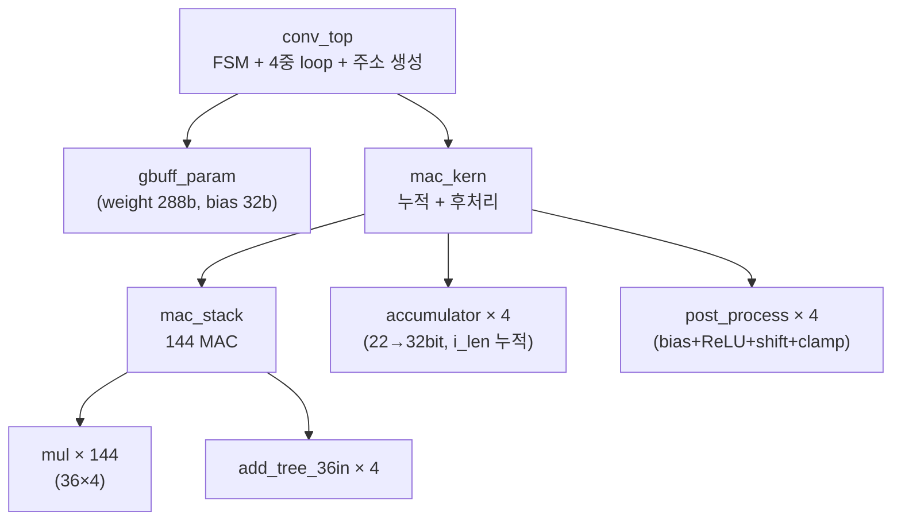
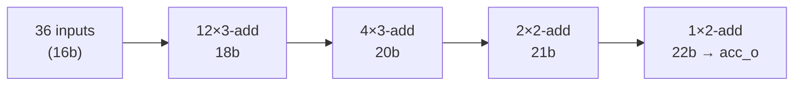
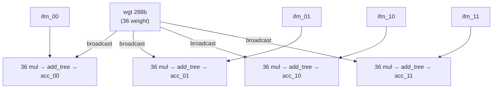
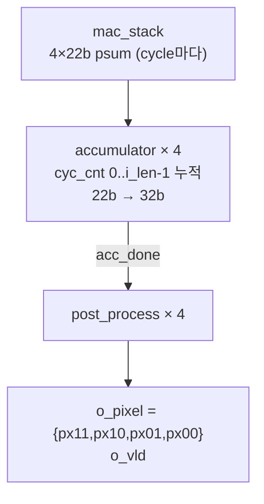
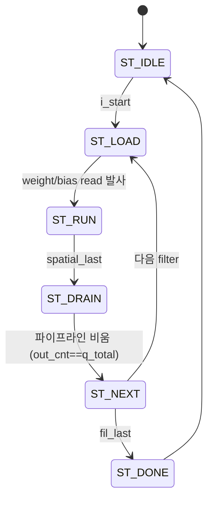

# 8장. RTL — Convolution 엔진

> [← 7장 yolo_engine TOP](07_rtl_yolo_engine_top.md) · [목차](README.md) · [9장 메모리 버퍼 →](09_rtl_memory_buffers.md)

---

이 장은 실제 곱셈-누적이 일어나는 연산 코어를 가장 아래(`mul`)부터 위(`conv_top`)까지 쌓아 올리며 설명합니다. 이 5개 모듈이 전체 연산의 88%(6개 3×3 레이어)를 담당하므로, 성능·에너지·정확도가 모두 여기서 결정됩니다.

---

## 8.1 계층 구조와 데이터패스



| 모듈 | 입력 → 출력 | latency | 핵심 |
|------|-------------|---------|------|
| `mul` | INT8×INT8 → INT16 | 4 | DSP48 / behavioral |
| `add_tree_36in` | 36×16b → 22b | 4 | 4단 가산 트리 |
| `mac_stack` | 288b wgt + 4×288b ifm → 4×22b | 8 | 144 MAC = 36×4 |
| `mac_kern` | + bias/shift → 4×8b 픽셀 | 8+`i_len`+1 | 누적 + 후처리 |
| `post_process` | 32b acc → 8b 픽셀 | 1 | descaling + clamp |
| `conv_top` | 레이어 파라미터 → OFM stream | (FSM) | 4중 loop 제어 |

전체 latency = **`8`(mac_stack) + `i_len`(누적) + `1`(post_process)** cycle. 마지막 `i_vld`부터 `output_valid`까지의 거리이며, [12장](12_operation_timing.md)에서 cycle 단위로 분석합니다.

---

## 8.2 mul.v — INT8 곱셈기

[mul.v](../../yolohw/src/mul.v)는 가중치(`w`)와 입력(`x`)을 곱하는 가장 작은 단위입니다. `mac_stack`에서 144개 인스턴스로 병렬 사용됩니다.

```verilog
module mul(input clk, input [7:0] w, input [7:0] x, output [15:0] y);
```

| 항목 | 값 |
|------|----|
| 입력 | `w`, `x` 각 INT8 signed |
| 출력 | `y` INT16 signed (latency 4 cycle) |
| 최댓값 | (−128)×(−128) = 16384 → 16-bit로 표현 |

**두 경로** ([2.8 FPGA 매크로](02_dev_environment.md)):

```verilog
`ifdef FPGA
    // INT8 → INT18 부호 확장 후 DSP48 매크로
    assign dsp_A = w[7] ? {10'b11_1111_1111, w} : {10'b0, w};
    xbip_dsp48_macro_0 u_dsp(.CLK(clk), .A(dsp_A), .B(dsp_B), .C(48'b0), .P(dsp_P));
`else
    // 4-stage behavioral pipeline (DSP48 latency 4 모사)
    dsp_P[0] <= $signed(w) * $signed(x);
    dsp_P[1] <= dsp_P[0]; ... dsp_P[3] <= dsp_P[2];
`endif
```

> 두 경로 모두 latency 4 cycle로 동일하게 맞춰져 있어, FPGA와 시뮬레이션의 타이밍이 일치합니다. C 입력은 0 고정(곱셈 전용, 누산은 가산 트리가 담당). `$signed(x)`로 입력을 INT8 signed 취급하는 것이 [6장 6.1](06_data_representation_memory_map.md)에서 설명한 Phase 2 핵심 수정입니다.

---

## 8.3 add_tree_36in.v — 36-입력 가산 트리

[add_tree_36in.v](../../yolohw/src/add_tree_36in.v)는 36개 곱셈 결과를 하나로 합칩니다. 4단 파이프라인으로 비트폭이 단계적으로 커집니다.

```
Level 0: 36 × 16-bit  (mul 출력)
Level 1: 12 × 3-input add → 18-bit   (l1_00..l1_11)
Level 2:  4 × 3-input add → 20-bit   (l2_00..l2_03)
Level 3:  2 × 2-input add → 21-bit   (l3_00, l3_01)
Level 4:  1 × 2-input add → 22-bit   (l4)
```



- 최댓값: 36 × (127×255) = 1,165,860 → 22-bit signed로 안전.
- latency 4 cycle. `vld_i`를 4단 지연(`vld_d1~d4`)시켜 `vld_o`로 출력 — 데이터와 정렬됩니다.
- 각 단계가 `$signed()`로 부호 있는 덧셈을 수행합니다.

---

## 8.4 mac_stack.v — 144-MAC 어레이

[mac_stack.v](../../yolohw/src/mac_stack.v)는 144개 곱셈을 한 cycle에 발사하고 4개의 부분합을 생성합니다.

```
144 MAC = 36 mul × 4 spatial set
  - wgt (288b = 36 weight) 를 4 세트에 broadcast
  - ifm_00/01/10/11 (각 288b) = 2×2 출력의 네 위치 입력
  → acc_00/01/10/11 (각 22b)
```



핵심 설계:
- **가중치 broadcast**: 같은 36 weight를 4개 spatial set에 공유. 인접 2×2 출력은 같은 필터를 쓰므로, 합성기가 weight를 packed-DSP나 공유 레지스터로 최적화할 수 있습니다.
- **latency 8 cycle** = 4(mul) + 4(add_tree). `vld_i`를 4단(`vld_m1~m4`)으로 지연해 add_tree에 넣고, add_tree가 다시 4단 지연하므로 `vld_o`는 입력 후 8 cycle.
- `i = c_local*9 + (kh*3+kw)` 매핑은 `ifm_line_buf`가 미리 패킹하므로 `mac_stack`은 받은 그대로 곱합니다([9장](09_rtl_memory_buffers.md)).

---

## 8.5 mac_kern.v — 누적 + 후처리

[mac_kern.v](../../yolohw/src/mac_kern.v)는 `mac_stack`의 22-bit 부분합을 **`i_len` cycle 동안 누적**하여 32-bit로 만들고, 4개의 `post_process`로 최종 픽셀을 생성합니다.



누적기 동작([mac_kern.v:90-121](../../yolohw/src/mac_kern.v#L90)):
```verilog
if (mac_vld) begin
    if (cyc_cnt == 0) psum <= mac;            // 첫 cycle: 초기화
    else              psum <= psum + mac;     // 이후: 누적
    if (cyc_cnt == i_len - 1) acc_done <= 1;  // 마지막: 완료 펄스
end
```

- `i_len`은 누적 cycle 수입니다. 3×3 conv는 `ceil(Ci/4)`(4채널씩), 1×1은 `ceil(Ci/36)`(36채널씩)이 들어갑니다. 예: L10(Ci=256, 3×3) → `i_len=64`.
- 4개 `post_process`는 **같은 bias·shift를 공유**합니다(같은 필터 = 같은 출력 채널이므로).
- 출력은 `o_pixel = {px11, px10, px01, px00}` (32-bit, [6장 6.2-③](06_data_representation_memory_map.md)의 2×2 packed).

---

## 8.6 post_process.v — bias·ReLU·descaling·clamp

[post_process.v](../../yolohw/src/post_process.v)는 [6장 6.5](06_data_representation_memory_map.md)에서 데이터 관점으로 다룬 후처리의 RTL 구현입니다. 조합 논리로 4단계를 한 cycle에 계산하고, `acc_done` 다음 클록에 결과를 래치합니다(latency 1).

```verilog
biased    = acc_result + bias;                              // ① bias
activated = (i_relu_en && biased[31]) ? 0 : biased;          // ② ReLU
round_bias = activated[31] ? ((1<<shift)-1) : 0;             // toward-zero
scaled    = (activated + round_bias) >>> shift_amount;       // ③ descaling
clamped   = i_relu_en ? UINT8(0..255) : INT8(-128..127);     // ④ clamp
```

| 입력 | 의미 |
|------|------|
| `acc_result` (32b) | 누적 결과 |
| `bias` (32b) | sign-extended INT16 bias |
| `shift_amount` (5b) | descaling 시프트 (= [3장 scale의 log₂](03_skeleton_reference.md)) |
| `i_relu_en` | 1: ReLU+UINT8 / 0: INT8 raw (검출 헤드) |

> 음수 toward-zero 보정(`round_bias`)이 검출 헤드 L14·L20의 정확도를 결정합니다([6장 6.5](06_data_representation_memory_map.md), [HISTORY 9차](../../HISTORY.md)).

---

## 8.7 conv_top.v — 레이어 제어 FSM

[conv_top.v](../../yolohw/src/conv_top.v)는 `gbuff_param`과 `mac_kern`을 인스턴스화하고, **output-stationary 4중 loop**로 한 호출 분량의 conv를 수행합니다.

### Loop 순서

```
for fil = 0..Co-1:                ← 필터마다 bias 1 read
  for row = 0..H_half-1:
    for col = 0..W_half-1:        ← 한 좌표 = 2×2 OFM block
      for acc = 0..acc_len-1:     ← Ci/4(3×3) 또는 Ci/36(1×1) 누적
        mac_kern.vld_i = 1        ← streaming, 매 cycle 새 weight+IFM
```

> [7장 7.6](07_rtl_yolo_engine_top.md)에서 본 대로, `yolo_engine`은 `i_co_total=1`, `i_ofm_h_half=1`로 호출하므로 한 conv_top 호출은 실제로 "1 filter × 1 row-block"만 처리합니다. 위 loop 구조는 conv_top 자체의 일반 능력입니다.

### FSM



| state | 동작 |
|-------|------|
| `ST_LOAD` | weight/bias 첫 read 주소 발사 (BRAM latency 1 흡수) |
| `ST_RUN` | `mac_kern`에 매 cycle weight+IFM streaming, 주소 카운터 진행 |
| `ST_DRAIN` | 파이프라인에 남은 픽셀 배출 (`out_cnt`가 `q_total`에 도달할 때까지) |
| `ST_NEXT` | 다음 필터 준비 (`i_conv_pause` 중 카운터 동결) |

### 두 가지 정렬 메커니즘 (자주 틀리는 지점)

**① weight streaming 정렬** ([conv_top.v:226-262](../../yolohw/src/conv_top.v#L226)): `ST_LOAD`에서 `wgt_addr_r`을 +1 advance하지 **않습니다**. IFM의 2-cycle latency와 `mac_vld_d`의 1-cycle 지연을 고려하면, +1 하면 weight가 1 acc step 앞서가는 버그가 됩니다([HISTORY 2026-05-22 conv_top 수정](../../HISTORY.md), [conv_top 메모리](../../CLAUDE.md)).

**② streaming weight mode** ([conv_top.v:277](../../yolohw/src/conv_top.v#L277)): `i_stream_wgt_mode=1`이면 필터 전환 시 `wgt_base_r`을 동결합니다. 매 필터의 가중치를 BRAM[0..acc_len−1]에 fresh DMA하므로, 모든 필터가 같은 base(0)에서 읽습니다.

**③ IFM look-ahead** ([conv_top.v:304-318](../../yolohw/src/conv_top.v#L304)): `ifm_line_buf`의 BRAM read latency 1을 보상하려고, `ST_RUN`에서 **다음 cycle의 (row,col,acc)를 미리** 발사합니다(`lah_*`).

---

## 8.8 전체 데이터패스 latency

한 출력 픽셀이 나오기까지:

```
i_vld (mac_kern 입력)
  │
  │ 8 cycle  ← mac_stack (mul 4 + add_tree 4)
  ▼
mac_vld (첫 부분합 도착)
  │
  │ i_len cycle  ← accumulator 누적
  ▼
acc_done
  │
  │ 1 cycle  ← post_process 래치
  ▼
output_valid (픽셀 출력)
```

총 **`8 + i_len + 1`** cycle. 단, conv는 streaming이므로 이 latency는 파이프라인 채움/비움(`ST_LOAD`/`ST_DRAIN`)에만 보이고, 정상 운전 중에는 **매 `acc_len` cycle마다 4픽셀이 쏟아집니다**. 처리량 분석은 [12장](12_operation_timing.md)에서 다룹니다.

---

## 8.9 3×3 vs 1×1 mode

같은 엔진이 두 conv를 처리하는 비결은 **입력 패킹과 `acc_len`만 다르게** 하는 것입니다.

| 항목 | 3×3 conv | 1×1 conv |
|------|----------|----------|
| `i_mode` | 0 | 1 |
| 한 cycle 처리 | 4채널 × 3×3 = 36 곱셈 | 4채널 × 1 = (36 byte 중 4 valid) |
| `i_len` (acc_len) | `ceil(Ci/4)` | `ceil(Ci/4)` (single group 단위) |
| IFM 패킹 | window[3×3] × 4ch | window[1] × 4ch (byte 0/9/18/27) |
| 담당 레이어 | L0,2,4,6,8,10,13 | L12,14,17,20 |

`mac_stack`·`mac_kern`·`mul`은 **mode를 신경 쓰지 않습니다**. 차이는 전적으로 `ifm_line_buf`의 패킹([9장](09_rtl_memory_buffers.md))과 `conv_top`이 넘기는 `i_acc_len`에서 흡수됩니다. 이것이 [CLAUDE.md 규칙 4](../../CLAUDE.md)("1×1 conv는 기존 mac_kern 재사용")의 구현입니다.

---

## 8.10 이 장의 요약

- 연산 코어는 `conv_top → mac_kern → mac_stack → (mul ×144 + add_tree ×4) + post_process ×4`.
- `mul`(latency 4) → `add_tree`(4) → `mac_stack`(합 8) → 누적(`i_len`) → `post_process`(1). 전체 `8+i_len+1`.
- `mac_stack`은 36 weight를 4 spatial set에 broadcast하여 한 cycle에 4픽셀의 부분합 생성.
- `conv_top`은 output-stationary 4중 loop를 제어하고, weight streaming·IFM look-ahead로 BRAM latency를 정밀 정렬.
- 3×3/1×1은 같은 엔진을 쓰며 차이는 `ifm_line_buf` 패킹과 `acc_len`에만 있음.

다음 장에서는 이 엔진에 데이터를 공급하는 **메모리 버퍼(`ifm_line_buf`, `gbuff_param`, dpram/spram)**를 다룹니다.

---

> [← 7장 yolo_engine TOP](07_rtl_yolo_engine_top.md) · [목차](README.md) · [9장 메모리 버퍼 →](09_rtl_memory_buffers.md)
