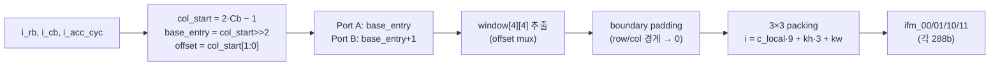

# 9장. RTL — 메모리 버퍼

> [← 8장 Convolution 엔진](08_rtl_convolution_engine.md) · [목차](README.md) · [10장 특수 연산 유닛 →](10_rtl_special_units.md)

---

연산 엔진이 매 cycle 데이터를 굶지 않으려면, 온칩 버퍼가 정확한 포맷·타이밍으로 데이터를 공급해야 합니다. 이 장은 네 개의 버퍼 모듈을 다룹니다: 입력 윈도우를 만드는 `ifm_line_buf`, 가중치/바이어스를 담는 `gbuff_param`, 그리고 이들의 기반인 `dpram_wrapper`/`spram_wrapper`입니다.

---

## 9.1 ifm_line_buf.v — IFM 라인 버퍼

[ifm_line_buf.v](../../yolohw/src/ifm_line_buf.v)는 conv 엔진에서 **가장 복잡한 데이터 정렬 로직**을 담습니다. 역할은 "DRAM에서 받은 NHWC entry를 4행으로 쌓고, conv가 요청하는 좌표의 3×3(또는 1×1) 윈도우를 36-byte씩 4벌 뽑아주는 것"입니다.

### 9.1.1 물리 구조

```
4개 line buffer (bank) × 2048 entry × 128-bit
  각 entry = 4 col × 4 ch = 16 byte  ([6장 6.2-②] NHWC entry)
  bank index = IFM_row mod 4 (cyclic)
```

행을 4개만 유지하는 이유: 3×3 conv는 인접 3행만 동시에 필요하고, 2×2 출력 블록(`ifm_10/11`은 다음 행)을 위해 1행 더, 총 4행이면 충분합니다. 행이 진행되면 가장 오래된 bank를 새 행으로 덮어씁니다(cyclic).

### 9.1.2 cyclic row mapping

```verilog
// window slot ln_y ∈ {0,1,2,3} → physical bank
base_line = i_rb[0] ? 2'd1 : 2'd3;        // (2*Rb-1) mod 4
line_sel_k = base_line + k;                // mod 4 (2-bit wrap)
```

`i_rb`(출력 half-row)가 1 진행하면 입력 행은 2 진행하므로, base bank가 토글됩니다. 이 매핑으로 DMA가 새 행을 어느 bank에 쓸지(`i_dma_wr_line`, 외부가 `IFM_row mod 4`로 계산)와 read 시 윈도우 추출이 일관됩니다.

### 9.1.3 3×3 윈도우 추출



- `col_start = 2*Cb − 1`: 2×2 출력 블록의 좌측 입력 컬럼(패딩 −1 포함).
- entry가 4 col 단위이므로, 원하는 컬럼이 entry 경계를 걸치면 **2개 entry(A, B)를 읽어 `offset`으로 mux**합니다([ifm_line_buf.v:325-353](../../yolohw/src/ifm_line_buf.v#L325)).
- **boundary padding**: `col_start`나 행 위치가 `[0, W)`·`[0, H)`를 벗어나면 해당 윈도우 칸을 0으로(zero-padding). pad=1 conv의 가장자리 처리입니다.
- packing 인덱스 `i = c_local*9 + (kh*3+kw)`로 36-byte를 채워 `mac_stack`이 기대하는 배치를 만듭니다([8장 8.4](08_rtl_convolution_engine.md)).

### 9.1.4 1×1 윈도우 추출

```verilog
col_block_1x1 = i_cb >> 1;            // entry index
col_inblk_1x1 = i_cb[0] ? 2 : 0;      // entry 내 짝수 col
// ch 0..3 을 byte 0, 9, 18, 27 에 배치 (weight slot 정렬)
ifm00_w[7:0]     = window[1][col_inblk][7:0];     // ch0 @ byte0
ifm00_w[79:72]   = window[1][col_inblk][15:8];    // ch1 @ byte9
ifm00_w[151:144] = window[1][col_inblk][23:16];   // ch2 @ byte18
ifm00_w[223:216] = window[1][col_inblk][31:24];   // ch3 @ byte27
```

1×1은 커널이 1점이므로 padding이 없고, 한 입력 채널당 weight 1개입니다. weight slot이 채널을 9 byte 간격(byte 0/9/18/27)에 두므로 입력도 동일 위치에 배치합니다([6장 6.3](06_data_representation_memory_map.md)). 이 정렬이 Phase 2의 핵심 버그 수정 지점이었습니다.

### 9.1.5 타이밍 — 2-cycle read latency

```
i_rd_en → (BRAM read 1cyc) → window mux (0cyc, 조합) → output reg (1cyc) → o_vld
        총 2 cycle
```

`conv_top`이 이 latency를 보상하려고 **look-ahead 좌표**를 보냅니다([8장 8.7-③](08_rtl_convolution_engine.md)). 또한 BRAM 출력이 유효해지는 cycle과 offset/boundary 판정을 맞추려고, 모듈 내부에서도 `offset_r`/`col_inv_r`/`row_inv_r`/`bline_r`을 1-cycle pipeline합니다([ifm_line_buf.v:230-250](../../yolohw/src/ifm_line_buf.v#L230)).

### 9.1.6 포트 요약

| 그룹 | 신호 | 설명 |
|------|------|------|
| 파라미터 | `i_mode`, `i_w_blocks`, `i_ci_groups`, `i_w`, `i_h`, `i_line_valid` | 3×3/1×1, 크기, 경계 |
| DMA write | `i_dma_wr_en`, `i_dma_wr_line`, `i_dma_wr_addr`, `i_dma_wr_data` | 새 행 적재 (line=row mod 4) |
| conv read | `i_rd_en`, `i_rb`, `i_cb`, `i_acc_cyc` | 윈도우 요청 |
| 출력 | `o_ifm_00/01/10/11` (288b), `o_vld` | 4 spatial set |

---

## 9.2 gbuff_param.v — 파라미터 버퍼

[gbuff_param.v](../../yolohw/src/gbuff_param.v)는 가중치와 바이어스/시프트를 담습니다. [8장](08_rtl_convolution_engine.md)에서 본 대로 `conv_top`이 인스턴스화합니다.

### 9.2.1 비대칭 가중치 메모리

```
Weight: dpram_4096x72
  write 측: 72-bit × 4096 entry  (DMA가 16-byte slot 단위로 기록)
  read  측: 288-bit × 1024 entry (mac_stack에 36 weight 공급)
  → 288 = 4 × 72,  read entry n = write entry {4n, 4n+1, 4n+2, 4n+3}
```

시뮬 모델은 이 비대칭을 명시적으로 구현합니다([gbuff_param.v:124](../../yolohw/src/gbuff_param.v#L124)):
```verilog
rd_wgt_data_r <= { wgt_mem[{rd_wgt_addr, 2'd3}], wgt_mem[{rd_wgt_addr, 2'd2}],
                   wgt_mem[{rd_wgt_addr, 2'd1}], wgt_mem[{rd_wgt_addr, 2'd0}] };
```

FPGA에서는 BMG의 비대칭 Simple Dual Port(write 72/4096, read 288/1024)로 구현됩니다.

### 9.2.2 바이어스 메모리

```
Bias: spram_2560x32 (single port)
  entry당 32-bit = {bias[15:0], shift[15:0]} packed (설계 의도)
  전 레이어 filter 수 합 ≈ 2294 < 2560 → 한 번에 적재
```

각 레이어의 bias는 `Lx_BIAS_ENTRY_BASE`(예: L2=16, L10=496)부터 배치됩니다([7장 7.3](07_rtl_yolo_engine_top.md)). 16-bit bias를 32-bit로 적재할 때 **sign-extend**가 필수입니다([6장 6.4](06_data_representation_memory_map.md)).

### 9.2.3 read latency

가중치·바이어스 모두 **BRAM read latency 1 cycle**입니다. `conv_top`의 `ST_LOAD`가 이 1 cycle을 흡수하도록 설계되어 있습니다([8장 8.7](08_rtl_convolution_engine.md)).

---

## 9.3 dpram_wrapper.v — Simple Dual-Port 래퍼

[dpram_wrapper.v](../../yolohw/src/dpram_wrapper.v)는 쓰기 포트(A)와 읽기 포트(B)가 분리된 dual-port RAM을 추상화합니다. OFM dpram(65536×32)과 line buffer bank(2048×128)의 기반입니다.

```verilog
module dpram_wrapper(clk, ena, addra, wea, enb, addrb, dia, dob);
parameter DW=64, AW=8, DEPTH=256, N_DELAY=1;
```

| 포트 | 신호 | 용도 |
|------|------|------|
| A (write) | `ena`, `wea`, `addra`, `dia` | 쓰기 전용 |
| B (read) | `enb`, `addrb`, `dob` | 읽기 (N_DELAY cycle 후) |

**파라미터화 + generate**: `(DEPTH, DW)` 조합으로 적절한 BMG IP를 선택합니다.

| DW × DEPTH | IP | 용도 |
|------------|-----|------|
| 72 × 512 | `dpram_512x72` | (weight 후보) |
| 32 × 65536 | `dpram_65536x32` | **OFM dpram (256 KB)** |
| 128 × 2048 | `dpram_2048x128` | **line buffer bank** |
| 32 × 8192 | `dpram_8192x32` | OFM 후보 |
| 128 × 16384 | `dpram_16384x128` | 구 IFM 핑퐁 (미사용, 호환 보존) |

`N_DELAY=1`은 BMG "No Output Register"와 같은 1-cycle latency입니다. 시뮬 모델은 read-first 동작이며, **uninitialized X를 막기 위해 `ram`·`rdata`를 `initial` 0 초기화**합니다([dpram_wrapper.v:210](../../yolohw/src/dpram_wrapper.v#L210)) — [15장 Vivado 2025 이슈](15_vivado_project.md)의 핵심 조치입니다.

---

## 9.4 spram_wrapper.v — Single-Port 래퍼

[spram_wrapper.v](../../yolohw/src/spram_wrapper.v)는 하나의 주소 포트로 읽기/쓰기를 시분할하는 single-port RAM입니다. `gbuff_param`의 bias 메모리 등에 쓰입니다.

```verilog
module spram_wrapper(clk, addr, we, cs, wdata, rdata);
parameter DW=64, AW=8, DEPTH=256, N_DELAY=1;
```

| 동작 | 조건 |
|------|------|
| 쓰기 | `cs=1, we=1` → `mem[addr] ← wdata` |
| 읽기 | `cs=1, we=0` → N_DELAY cycle 후 `rdata` |

지원 IP 조합: `spram_512x72`, `spram_4096x32`, `spram_65536x32`, `spram_2048x128`, `spram_128x32`. `dpram_wrapper`와 마찬가지로 시뮬 모델은 `mem`·`rdata_o`를 `initial` 0 초기화합니다.

---

## 9.5 FPGA / 시뮬 전환과 메모리 초기화

네 모듈 모두 `` `ifdef FPGA `` 로 두 경로를 가집니다.

```mermaid
graph TB
    DEF{{"`define FPGA ?"}}
    DEF -->|활성 합성| FPGA["BMG IP 인스턴스<br/>(dpram_*, spram_*)"]
    DEF -->|주석 시뮬| SIM["behavioral reg 배열<br/>+ initial 0 초기화"]
```

| 모듈 | sim 메모리 | 0 초기화 대상 |
|------|-----------|---------------|
| `dpram_wrapper` | `ram[]` | `ram`, `rdata`, `rdata_r` |
| `spram_wrapper` | `mem[]` | `mem`, `rdata_o` |
| `ifm_line_buf` | `mem[]×4` | `mem×4`, `dout_a_r`, `dout_b_r` |
| `gbuff_param` | `wgt_mem`, `bias_mem` | `wgt_mem`, `bias_mem`, read 레지스터 |

> `initial` 블록은 시뮬레이션 전용(합성 시에는 BMG 경로라 무관)이며, **실제 FPGA BRAM의 0 초기화와 일치**합니다. 이 초기화가 없으면 Vivado 버전에 따라 chain 검증에서 비결정적 ±1 LSB mismatch가 발생합니다([2장 2.9](02_dev_environment.md), [15장](15_vivado_project.md)). 따라서 fps·Energy·정확도에는 전혀 영향이 없으면서 검증 재현성만 확보합니다.

---

## 9.6 이 장의 요약

- `ifm_line_buf`는 4-row cyclic 버퍼로 NHWC entry를 쌓고, 3×3/1×1 윈도우를 36-byte씩 4벌 추출(read latency 2, conv_top look-ahead로 보상).
- 3×3은 entry 경계를 offset mux로 처리하고 boundary zero-padding, 1×1은 채널을 byte 0/9/18/27에 배치.
- `gbuff_param`은 비대칭 가중치 메모리(write 72/read 288)와 packed bias 메모리({bias16,shift16}), read latency 1.
- `dpram_wrapper`/`spram_wrapper`는 `(DEPTH,DW)` generate로 BMG IP를 선택하는 파라미터화 래퍼.
- 네 모듈 모두 FPGA(BMG)/sim(reg+initial 0) 이중 경로이며, sim 0 초기화가 Vivado 버전 간 재현성을 보장.

다음 장에서는 conv가 아닌 **특수 연산 유닛(pooling, upsample, REPACK)**을 다룹니다.

---

> [← 8장 Convolution 엔진](08_rtl_convolution_engine.md) · [목차](README.md) · [10장 특수 연산 유닛 →](10_rtl_special_units.md)
