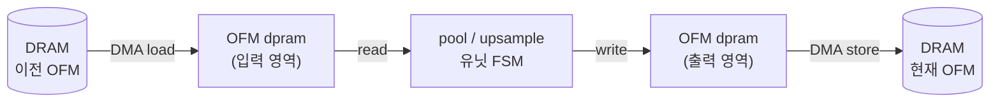
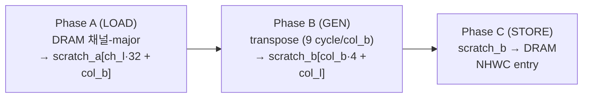

# 10장. RTL — 특수 연산 유닛

> [← 9장 메모리 버퍼](09_rtl_memory_buffers.md) · [목차](README.md) · [11장 AXI / DMA 인터페이스 →](11_rtl_axi_dma.md)

---

Convolution 외의 형상 변환 연산을 담당하는 세 모듈(`max_pool_unit`, `max_pool_s1_unit`, `upsample_unit`)과, 데이터 포맷을 바꾸는 `yolo_engine` 내장 **REPACK 엔진**을 다룹니다. 이들의 공통점은 **OFM dpram을 in-place로 읽고 쓰는 단순 FSM**이라는 것입니다.

---

## 10.1 공통 동작 패턴

세 유닛 모두 `yolo_engine`의 OFM dpram에 붙어, 다음 패턴으로 동작합니다([7장 7.7](07_rtl_yolo_engine_top.md)).



공통 인터페이스:

| 신호 | 방향 | 설명 |
|------|------|------|
| `i_start` / `o_done` | in/out | 1-cycle 시작/완료 펄스 |
| `o_rd_en`, `o_rd_addr` / `i_rd_data` | out/in | OFM dpram read (latency 1) |
| `o_wr_en`, `o_wr_addr`, `o_wr_data` | out | OFM dpram write |

데이터는 모두 [6장 6.2-③](06_data_representation_memory_map.md)의 **2×2 packed word**(32-bit = 4픽셀)입니다.

---

## 10.2 max_pool_unit.v — stride-2 MaxPool

[max_pool_unit.v](../../yolohw/src/max_pool_unit.v)는 L1/3/5/7/9의 2×2 stride-2 풀링입니다.

### 핵심 통찰: conv 2×2 블록 = pool window

conv가 만든 **2×2 packed word 한 개가 곧 pool의 2×2 window**입니다. 따라서 입력 32-bit word(4 byte)의 최댓값을 구하면 그것이 pool 출력 1픽셀이 됩니다 — 별도 윈도우 슬라이딩이 필요 없습니다.

```
입력 word = {b3, b2, b1, b0}  (한 2×2 conv block)
max-of-4   = max(b0, b1, b2, b3)  → pool 출력 1 byte
4개 누적   → 32-bit packed → 출력 (in-place)
```

### FSM

```
ST_IDLE → ST_RUN → ST_DRAIN → ST_DONE
```

- `ST_RUN`: 매 cycle `in_addr_r`로 read 발사하며 증가. 1-cycle 전에 발사한 결과(`i_rd_data`)에서 `in_max`를 계산해 `buf_b0~b2`에 누적, 4번째(`buf_cnt==3`)에 32-bit로 묶어 write.
- read latency 1을 `issued_d`(1-cycle 지연 플래그)로 정렬합니다.

### In-place write 안전성

출력 word `K`는 입력 word `4K+3`까지 읽은 뒤 기록됩니다. read 주소(`4K+3`)가 write 주소(`K`)보다 항상 앞서므로, 같은 dpram을 in-place로 써도 덮어쓰기 충돌이 없습니다([max_pool_unit.v:14-17](../../yolohw/src/max_pool_unit.v#L14)). 비용은 약 `N_in + 1` cycle(입력 word 수만큼).

---

## 10.3 max_pool_s1_unit.v — stride-1 MaxPool (L11)

[max_pool_s1_unit.v](../../yolohw/src/max_pool_s1_unit.v)는 L11 전용입니다. stride-1 + same-padding이라 **크기가 유지**(8×8→8×8)되므로, stride-2 모듈과 전혀 다른 동작이 필요합니다([CLAUDE.md 규칙 3](../../CLAUDE.md)).

### 출력 한 픽셀이 4개 입력 블록에 걸침

stride-1 2×2 윈도우는 packed 블록 경계를 가로지릅니다. 출력 블록 `(R,C)`의 네 픽셀은 인접한 **4개 입력 블록**의 특정 byte들에서 최댓값을 취합니다:

```
out_pix_00 = max(blockRC.b0, .b1, .b2, .b3)
out_pix_01 = max(blockRC.b1, blockRC1.b0, blockRC.b3, blockRC1.b2)
out_pix_10 = max(blockRC.b2, .b3, blockR1C.b0, blockR1C.b1)
out_pix_11 = max(blockRC.b3, blockRC1.b2, blockR1C.b1, blockR1C1.b0)
```

`blockRC1`(우측), `blockR1C`(하단), `blockR1C1`(우하단)은 경계(`C+1≥W_b`, `R+1≥H_b`)를 벗어나면 0으로 채웁니다(same-padding, ReLU 이후라 0이 안전).

### FSM — 출력 블록당 7 phase

```
phase 0: read RC 발사
phase 1: read RC1 발사 (valid_rc1 판정)
phase 2: read R1C 발사,  RC 샘플
phase 3: read R1C1 발사, RC1 샘플
phase 4: R1C 샘플
phase 5: R1C1 샘플
phase 6: write output + 카운터 진행 (f → r → c)
```

read latency 1을 흡수하려고 발사(phase 0~3)와 샘플(phase 2~5)을 어긋나게 배치합니다. 비용은 약 `Co × H_b × W_b × 7` cycle. L11(512ch, 4×4 block)은 약 **57,344 cycle**(≈ 0.57 ms @ 100 MHz)입니다.

> dpram 분할: `i_in_base=0`(L10 OFM 적재), `i_out_base=8192`(L11 결과). 입력과 출력 영역을 분리해 in-place 충돌을 피합니다([7장 7.9](07_rtl_yolo_engine_top.md)).

---

## 10.4 upsample_unit.v — 2× Nearest-Neighbor (L18)

[upsample_unit.v](../../yolohw/src/upsample_unit.v)는 L18 전용으로, 8×8×128을 16×16×128로 키웁니다. 각 입력 픽셀을 2×2로 복제(nearest-neighbor)합니다.

### 입력 1블록 → 출력 4블록

입력 packed 블록 하나(4픽셀)의 각 픽셀이 출력에서 2×2 블록(같은 값 4벌)이 됩니다:

```
입력 block (R,C) 의 pix_00 → 출력 block (2R,   2C  ) = {pix_00 ×4}
                    pix_01 → 출력 block (2R,   2C+1) = {pix_01 ×4}
                    pix_10 → 출력 block (2R+1, 2C  ) = {pix_10 ×4}
                    pix_11 → 출력 block (2R+1, 2C+1) = {pix_11 ×4}
```

출력 주소는 `f×(2H_b×2W_b) + (행 offset) + (열 offset)`로 계산합니다.

### FSM — 입력 블록당 6 phase

```
phase 0: read 발사
phase 1: wait (dpram latency)
phase 2: sample + write_00 (top-left)
phase 3: write_01 (top-right)
phase 4: write_10 (bottom-left)
phase 5: write_11 (bottom-right) + 카운터 진행
```

비용은 약 `Co × H_b × W_b × 6` cycle. L18(128ch, 4×4 block)은 약 **12,288 cycle**(≈ 0.12 ms @ 100 MHz). dpram 분할: `i_in_base=0`, `i_out_base=2048`.

> upsample은 곱셈이 전혀 없고 단순 byte 복제이므로 [CLAUDE.md 규칙 4](../../CLAUDE.md)의 "전용 모듈" 예외로 둡니다(Route와 달리 주소 패턴이 규칙적이라 모듈화가 깔끔).

---

## 10.5 REPACK 엔진 (yolo_engine 내장)

REPACK은 별도 .v 파일이 아니라 `yolo_engine` FSM에 내장된 변환 로직입니다([6장 6.6](06_data_representation_memory_map.md)). 채널-major/2×2 packed 데이터를 다음 conv가 요구하는 **NHWC 16-byte entry**로 재배치합니다. 두 종류가 있습니다.

### 10.5.1 pool→conv REPACK (L1→L2, L3→L4, L5→L6, L7→L8, L9→L10)

pool 출력(채널-major byte stream)을 3×3 conv 입력(NHWC entry)으로 바꿉니다. state `S_RP_LOAD`~`S_RP_NEXT_CIG`([7장 7.5](07_rtl_yolo_engine_top.md)).



- ci_group(4채널 묶음)별로, 한 행을 scratch_a에 적재 → 컬럼별로 4채널을 transpose하여 scratch_b에 16-byte entry 형성 → DRAM에 기록.
- `REPACK_LOAD_WORDS_PER_BURST=32`, `REPACK_STORE_WORDS_PER_CIG=128` 등 레이어별 파라미터로 일반화([7장 7.3](07_rtl_yolo_engine_top.md)).

### 10.5.2 conv→conv REPACK (L11→L12, L12→L13, L13→L14, L12→L17)

conv/pool OFM(2×2 packed)을 1×1·3×3 conv 입력(NHWC entry)으로 바꿉니다. state `S_L12_RP_LOAD`~`S_L12_RP_NEXT`. **entry당 13 cycle**(8 dpram read + 4 dpram write + 제어)로 동작합니다([HISTORY 7차](../../HISTORY.md)).

```
변환식 (L11→L12 예):
  L12_entry[col_l·4 + ch_l] =
      L11_OFM[ch=ci_g·4+ch_l, h=row>>1, w=col_b·2 + (col_l>>1)]
             [byte sub_h=row[0], sub_w=col_l[0]]

phase 0..7 : dpram read 주소 발사 (ch_l × sub_wb 조합 8개)
phase 1..8 : 직전 cycle의 packed word에서 2 byte 추출 → entry byte 채움
phase 9..12: entry의 4 word → dpram write
```

이 REPACK FSM은 **일반화**되어 있어, `conv_phase_r` 값으로 입력 채널 수(Ci=512 또는 256), entry 수, ci_group 범위를 mux합니다(`cur_rp12_*` wire). 그래서 L12·L13·L14·L17이 같은 state path를 공유합니다([HISTORY 8·10차](../../HISTORY.md)).

### 10.5.3 L19 Route concat (2-source REPACK)

L20 입력은 L18(128ch)과 L8(256ch)을 concat한 384ch입니다. state `S_L19_RP_LOAD_A`(L18 OFM → dpram[0..]), `S_L19_RP_LOAD_B`(L8 OFM → dpram[8192..]), `S_L19_RP_GEN`(REPACK), `S_L19_RP_STORE`(→ L20 IFM). 두 소스를 한 dpram에 적재한 뒤 NHWC entry로 묶는 점만 다르고, GEN 로직은 conv→conv REPACK과 유사합니다([16장](16_appendix_future.md)).

---

## 10.6 특수 유닛 비교 표

| 유닛 | 레이어 | window/동작 | phase/단위 | dpram 분할 (in/out) | 비용(대략) |
|------|--------|-------------|------------|---------------------|------------|
| `max_pool_unit` | L1,3,5,7,9 | 2×2 packed = pool window | ~1 cyc/word | in-place | `N_in+1` |
| `max_pool_s1_unit` | L11 | stride-1, 4블록 걸침 | 7 cyc/block | 0 / 8192 | ~57 K cyc |
| `upsample_unit` | L18 | 1픽셀→2×2 복제 | 6 cyc/block | 0 / 2048 | ~12 K cyc |
| REPACK(pool→conv) | L2,4,6,8,10 전 | 채널-major→entry | ~9 cyc/col_b | scratch_a/b | (작음) |
| REPACK(conv→conv) | L12,13,14,17 전 | 2×2 packed→entry | 13 cyc/entry | dpram 영역 | (작음) |

---

## 10.7 이 장의 요약

- 특수 유닛은 모두 OFM dpram에 붙어 `load → process → store` 패턴으로 동작하며, 2×2 packed word를 다룹니다.
- `max_pool_unit`(stride-2)은 conv 2×2 블록이 곧 pool window라서 word당 max-of-4로 끝나고 in-place 안전.
- `max_pool_s1_unit`(L11)은 stride-1이라 출력 픽셀이 4개 입력 블록에 걸치며, 블록당 7-phase FSM + same-padding.
- `upsample_unit`(L18)은 입력 1블록을 출력 4블록으로 복제, 블록당 6-phase FSM.
- REPACK은 `yolo_engine` 내장 FSM으로 채널-major/2×2 packed를 NHWC entry로 변환(pool→conv 9cyc/col, conv→conv 13cyc/entry), L19는 2-source concat.

다음 장에서는 외부 DRAM과 데이터를 주고받는 **AXI DMA와 제어 인터페이스**를 다룹니다.

---

> [← 9장 메모리 버퍼](09_rtl_memory_buffers.md) · [목차](README.md) · [11장 AXI / DMA 인터페이스 →](11_rtl_axi_dma.md)
