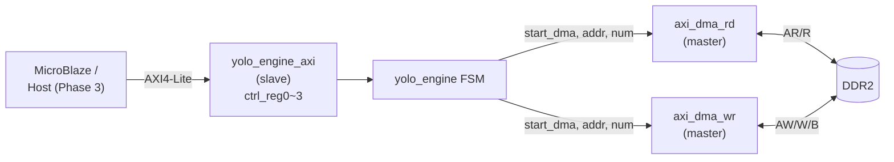
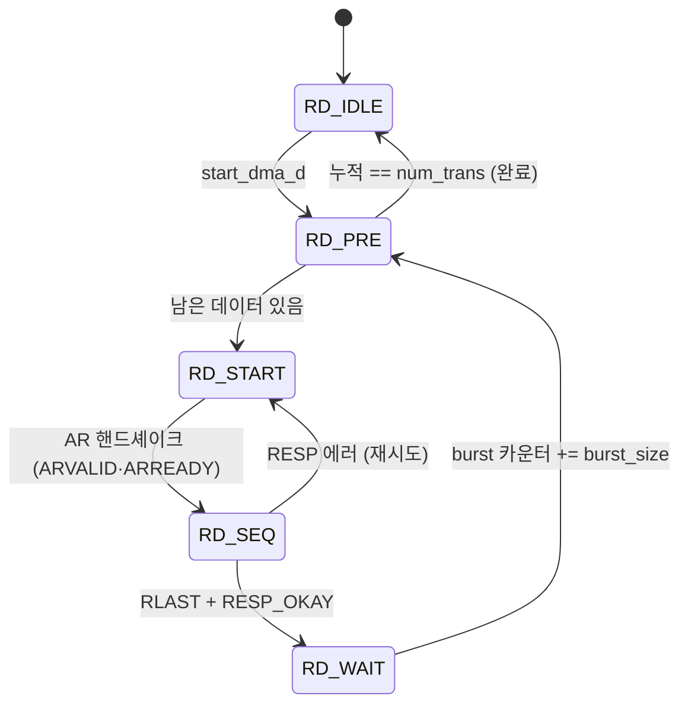
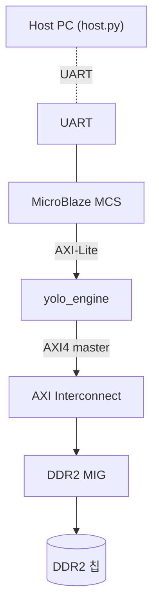

# 11장. RTL — AXI / DMA 인터페이스

> [← 10장 특수 연산 유닛](10_rtl_special_units.md) · [목차](README.md) · [12장 동작 과정과 타이밍 →](12_operation_timing.md)

---

이 장은 가속기가 외부 세계와 통신하는 경계를 다룹니다: 외부 DRAM과 데이터를 주고받는 **AXI4 master DMA 한 쌍**(`axi_dma_rd`, `axi_dma_wr`), 제어 명령을 받는 **AXI4-Lite slave**(`yolo_engine_axi`), 그리고 합성/시뮬을 가르는 매크로 파일(`user_define_h`, `define`)입니다.

---

## 11.1 인터페이스 전경



- **제어 평면**: MicroBlaze가 AXI4-Lite로 base 주소를 쓰고 `ap_start`를 펄스, `network_done`을 polling.
- **데이터 평면**: `yolo_engine`이 `start_dma`/`num_trans`/`start_addr`로 DMA를 트리거하고, AXI4 master가 DDR2를 burst로 읽고 씀.

---

## 11.2 axi_dma_rd.v — AXI4 master read

[axi_dma_rd.v](../../yolohw/src/axi_dma_rd.v)는 DRAM에서 가중치·바이어스·IFM을 읽어옵니다. 한 인스턴스가 [7장 7.8](07_rtl_yolo_engine_top.md)의 8종 target에 데이터를 공급합니다.

### 기능 인터페이스

| 신호 | 방향 | 설명 |
|------|------|------|
| `start_dma` | in | 1-cycle 시작 펄스 |
| `num_trans` | in | 읽을 32-bit 워드 수 |
| `start_addr` | in | DRAM 시작 주소(byte) |
| `data_o`, `data_vld_o` | out | 수신 데이터(1-cycle 지연) |
| `data_cnt_o` | out | burst 내 워드 인덱스 |
| `done_o` | out | 전체 완료 펄스 |

### 5-state FSM과 burst 분할



- **FIXED_BURST_SIZE = 256 워드(1 KB)** 단위로 AXI4 INCR burst를 발행. 마지막 burst는 잔여 워드 수로 길이를 조정합니다.
- AXI 설정: `ARSIZE=3'b010`(4 byte/beat), `ARBURST=2'b01`(INCR), `ARQOS=4'b1111`(최고 우선순위), `M_RREADY=1`(back-pressure 없음, 데이터 오는 대로 수락).
- 주소는 burst마다 `+1024 byte`(256×4) 증가.
- `done_o`는 마지막 burst의 마지막 beat에서 `RESP=OKAY`일 때 1-cycle 펄스.

파라미터 `BITS_TRANS`(기본 18, `yolo_engine` 인스턴스에서 20으로 설정 — 최대 1 M 워드)가 한 DMA의 최대 전송 크기를 정합니다([ARCHITECTURE.md §6](../../ARCHITECTURE.md)).

---

## 11.3 axi_dma_wr.v — AXI4 master write

[axi_dma_wr.v](../../yolohw/src/axi_dma_wr.v)는 OFM dpram의 결과를 DRAM에 기록합니다. read와 대칭이지만 **데이터를 외부(yolo_engine)에서 받아야** 하므로 요청 신호가 추가됩니다.

### 기능 인터페이스

| 신호 | 방향 | 설명 |
|------|------|------|
| `start_dma`, `num_trans`, `start_addr` | in | read와 동일 |
| `indata` | in | 쓸 데이터 (32-bit) |
| `indata_req_o` | out | 데이터 요청 (1-cycle look-ahead) |
| `done_o` | out | 완료 펄스 |

`indata_req_o=1`인 클록의 **다음 사이클에 `indata`가 유효**해야 합니다. `yolo_engine`은 이 요청에 맞춰 OFM dpram read 주소(`dpram_store_addr_r`)를 진행시켜 데이터를 공급합니다([7장 7.9](07_rtl_yolo_engine_top.md)).

### 6-state FSM

```
WR_IDLE → WR_PRE → WR_START → WR_SEQ → WR_WAIT → (WR_PRE 반복)
                                          (+ WR_BUFF_WAIT 예약, 현재 bypass)
```

- `WR_START`: AW 채널로 주소/길이 전송 (`AWSIZE=3'b010`, `AWBURST=INCR`).
- `WR_SEQ`: W 채널로 beat 전송, `M_WSTRB=4'b1111`(4 byte 전부 유효), 마지막 beat에 `M_WLAST=1`.
- `WR_WAIT`: B 채널 응답(`BRESP=OKAY`) 대기 후 카운터 갱신.

파라미터 `OUT_BITS_TRANS=13`(최대 8192 워드)이 한 write DMA의 크기 한계입니다 — OFM dpram(65536 워드)을 분할 전송하기에 충분합니다.

---

## 11.4 yolo_engine_axi.v — AXI4-Lite slave

[yolo_engine_axi.v](../../yolohw/src/yolo_engine_axi.v)는 Vivado AXI4-Lite slave 템플릿 기반으로, 4개의 32-bit 제어 레지스터를 노출합니다.

| offset | 레지스터 | 의미 |
|--------|----------|------|
| `0x0` | `ctrl_reg0` | `[0]`=ap_start (write), 읽기 시 `[1]`=network_done |
| `0x4` | `ctrl_reg1` | `dram_wgt_base` (weight+bias DRAM 주소) |
| `0x8` | `ctrl_reg2` | `dram_ifm_base` (입력 이미지 주소) |
| `0xC` | `ctrl_reg3` | `dram_ofm_base` (출력 주소) |

### 완료 polling 메커니즘

읽기 시 `ctrl_reg0`은 특수 처리됩니다:

```verilog
reg_data_out = { slv_reg0[31:2], network_done, slv_reg0[0] };
```

즉 bit[1]에 `network_done`을 삽입하여, 소프트웨어가 `ctrl_reg0`을 polling하며 bit[1]로 추론 완료를 감지합니다. 동작 시퀀스는 [16장 host.py](16_appendix_future.md)에서 다룹니다.

파라미터: `C_S_AXI_DATA_WIDTH=32`, `C_S_AXI_ADDR_WIDTH=4`(주소 4-bit → 레지스터 4개, `[3:2]`로 인덱스). 표준 AXI4-Lite write(AW/W/B)·read(AR/R) 핸드셰이크를 따릅니다.

---

## 11.5 user_define_h.v — 전역 매크로

[user_define_h.v](../../yolohw/src/user_define_h.v)는 프로젝트 전역에서 `` `include `` 되어 합성/시뮬을 전환합니다([2장 2.8](02_dev_environment.md)).

```verilog
`define NUM_BRAMS   16        // BRAM 인스턴스 수
`define BRAM_WIDTH  128       // BRAM 데이터 폭
`define BRAM_DELAY  3         // (상수, 실제 read latency는 모듈별 1)

//`define FPGA  1             // ← 합성 시 주석 해제 / 시뮬 시 주석 유지
```

`` `define FPGA `` 활성 시 합성에 필요한 IP 목록(주석으로 명시):

| IP | 폭/깊이 | 타입 |
|----|---------|------|
| `xbip_dsp48_macro_0` | (mul) | Multiplier |
| `spram_512x72` / `4096x32` / `65536x32` / `2048x128` / `128x32` | 각 조합 | Single Port |
| `dpram_512x72` / `4096x32` / `65536x32` / `2048x128` / `8192x32` | 각 조합 | Simple DP |

> ⚠️ FPGA 매크로를 켠 채 시뮬레이션하면 존재하지 않는 IP 참조로 elaboration이 실패합니다. 반대로 끈 채 합성하면 behavioral 메모리가 합성되어 LUT를 낭비합니다. 상세 IP 설정은 [15장](15_vivado_project.md)·`gen_bram_ips.tcl`.

---

## 11.6 define.v — 레거시 stub

[define.v](../../yolohw/src/define.v)는 `mul.v`가 `` `include "define.v" `` 로 참조하는 빈 stub입니다. 현재 모든 매크로는 `user_define_h.v`에 있으므로 내용은 비어 있으며, iverilog 등의 컴파일 호환성을 위해 유지됩니다.

---

## 11.7 AXI 시스템 통합 (Phase 3 전망)

현재 Phase 1·2에서는 TB가 AXI master를 받아 `sim_dram_model`로 응답합니다([13장](13_testbench_strategy.md)). Phase 3에서는 다음과 같이 실제 SoC에 통합됩니다([16장](16_appendix_future.md)):



`yolo_engine`의 AXI master 2개(rd/wr)는 interconnect를 통해 MicroBlaze와 DDR2 대역폭을 공유합니다. 이때 BITS_TRANS·burst 설정은 그대로 유지됩니다.

---

## 11.8 이 장의 요약

- 데이터 평면은 `axi_dma_rd`(5-state, 256-word INCR burst)와 `axi_dma_wr`(6-state, indata 1-cycle look-ahead 공급)의 master 한 쌍.
- 두 DMA 모두 `ARSIZE/AWSIZE=4B`, `INCR`, `QOS 최고`, 1 KB burst 분할, `done_o` 완료 펄스.
- 제어 평면은 `yolo_engine_axi`(AXI4-Lite slave) — ctrl_reg0~3(ap_start / wgt·ifm·ofm base), 읽기 시 bit[1]에 network_done 삽입.
- `user_define_h.v`의 `` `define FPGA `` 가 합성(BMG IP)/시뮬(behavioral) 전환, `define.v`는 빈 호환 stub.
- Phase 3에서 MicroBlaze + interconnect + DDR2 MIG와 통합 예정.

이로써 모든 RTL 모듈(7~11장)을 다루었습니다. 다음 장에서는 이 모듈들이 시간 축에서 **어떻게 협력하여 한 장의 추론을 완성하는지**, 동작 시퀀스와 타이밍을 종합합니다.

---

> [← 10장 특수 연산 유닛](10_rtl_special_units.md) · [목차](README.md) · [12장 동작 과정과 타이밍 →](12_operation_timing.md)
