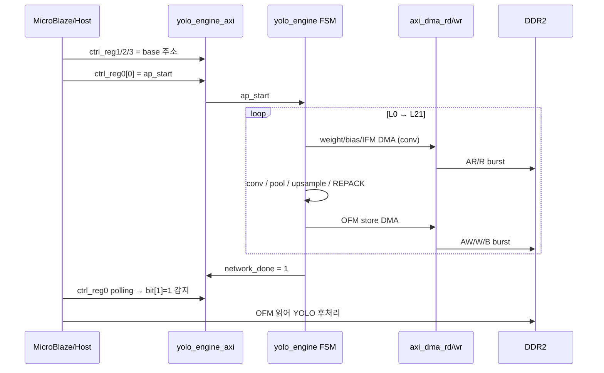

# 12장. 동작 과정과 타이밍

> [← 11장 AXI / DMA 인터페이스](11_rtl_axi_dma.md) · [목차](README.md) · [13장 검증 전략과 인프라 →](13_testbench_strategy.md)

---

7~11장에서 모듈을 하나씩 봤다면, 이 장은 그것들이 **시간 축에서 어떻게 협력하여 한 장의 추론을 완성하는지** 종합합니다. 전체 시퀀스 → 레이어 내부 cycle → MAC 파이프라인 → 성능 추정의 순서로 좁혀 들어갑니다.

---

## 12.1 전체 추론 시퀀스

`ap_start` 한 번으로 `yolo_engine` FSM이 L0부터 L21까지 자동 순회합니다([7장](07_rtl_yolo_engine_top.md)).



레이어 유형별 처리 시간 비중(연산량 기준, [4장 4.6](04_network_architecture.md)):

```
████████████████████████████████████████ Conv (88%, 특히 6개 3×3)
███ Conv 1×1 + 검출 헤드
█ Pool / Upsample / REPACK (제어 오버헤드)
```

---

## 12.2 Conv 레이어 내부 cycle 흐름

[7장 7.6](07_rtl_yolo_engine_top.md)에서 본 rb·filter 이중 루프를 cycle 관점으로 펼치면:

```
레이어 시작
 └─ bias DMA (레이어당 1회)                      ~Co cycle + burst latency
 └─ for rb in 0..(H/2-1):
      ├─ IFM DMA load → line buffer              ~IFM_words + burst
      └─ for fi in 0..(Co-1):
           ├─ weight DMA load → gbuff             ~acc_len×16 word + burst
           ├─ conv_top 실행:
           │    ST_LOAD (1) + ST_RUN (W/2 × acc_len)
           │    + ST_DRAIN (~8+acc_len) + ST_NEXT
           └─ OFM dpram → DRAM store              ~W/2 word + burst
```

핵심 관찰:
- **conv 연산 자체**는 한 (rb, fi)에서 `W/2 × acc_len` cycle(ST_RUN). 여기에 파이프라인 채움(`ST_LOAD`)·비움(`ST_DRAIN`, 약 `8+acc_len`)이 더해집니다.
- **DMA가 연산과 직렬화**되어 있습니다(현재 구조는 streaming load → conv → store가 순차). 이는 제어를 단순화하지만, weight/IFM DMA 시간이 conv 시간에 더해집니다.
- 따라서 작은 레이어(L17 등)는 DMA·파이프라인 오버헤드 비중이, 큰 레이어(L2~L10)는 conv 연산 비중이 큽니다.

---

## 12.3 MAC 파이프라인 타이밍

연산 코어의 정밀 타이밍입니다([8장 8.8](08_rtl_convolution_engine.md)). 한 (rb, fi)의 ST_RUN 구간을 cycle 단위로 보면:

```
cycle:   0    1    2  ...        ← ST_RUN, 매 cycle 새 IFM+weight
i_vld:   1    1    1  ...
              │
              ├─ mul (4) ──┐
              │            ├─ add_tree (4) ──┐
              │            │                 ├─ 첫 부분합 (8 cycle 후)
              ▼            ▼                 ▼
mac_vld:                              1    1   ... (8 cycle 지연)
                                      │
                                      ├─ accumulator (i_len cycle 누적)
                                      ▼
acc_done:                                          1 (i_len 누적 완료)
                                                   │
                                                   ├─ post_process (1)
                                                   ▼
output_valid:                                           1 (4픽셀 출력)
```

| 구간 | cycle | 모듈 |
|------|-------|------|
| 곱셈 | 4 | `mul` (DSP48) |
| 가산 트리 | 4 | `add_tree_36in` |
| 누적 | `i_len` | `mac_kern` accumulator |
| 후처리 | 1 | `post_process` |
| **총 latency** | **`8 + i_len + 1`** | (마지막 i_vld → output_valid) |

> **중요**: 이 latency는 파이프라인 채움/비움에만 보입니다. 정상 운전 중에는 `acc_len` cycle마다 한 2×2 블록(4픽셀)이 완성되므로, **처리량은 `4픽셀 / acc_len cycle`** 입니다. 예: L10(acc_len=64)은 64 cycle마다 4픽셀, L0(acc_len=1)은 1 cycle마다 4픽셀.

acc_len이 큰(채널 깊은) 레이어일수록 한 출력당 cycle이 길지만, 출력 공간이 작아(8×8) 균형이 맞습니다 — [4장](04_network_architecture.md)에서 본 "6개 3×3 레이어가 모두 75.5 M MAC으로 동일"한 이유와 같은 구조적 균형입니다.

---

## 12.4 BRAM latency 정렬

이 설계에서 가장 섬세한 부분은 **여러 1-cycle BRAM latency를 어긋나지 않게 맞추는 것**입니다. 곳곳에 정렬 장치가 있습니다.

| 위치 | 정렬 장치 | 목적 |
|------|-----------|------|
| `conv_top` → `gbuff_param` | `ST_LOAD`에서 read 발사, `mac_vld_d` 1-cycle 지연 | weight read latency 1 흡수 |
| `conv_top` → `ifm_line_buf` | look-ahead 좌표(`lah_row/col/acc`) | line buffer latency 2 보상 |
| `ifm_line_buf` 내부 | `offset_r`/`col_inv_r`/`bline_r` pipeline | BRAM 출력과 판정 cycle 일치 |
| `max_pool_unit` | `issued_d` 1-cycle 지연 플래그 | read 결과 sample 타이밍 |
| `max_pool_s1_unit` | phase 0~3 발사 / 2~5 sample | 4-read 순차 정렬 |
| `axi_dma_rd/wr` | `start_dma_d`, `ext_rlast_r` 래치 | AXI 핸드셰이크 정렬 |

> Phase 2의 conv_top 버그(`ST_LOAD`에서 `wgt_addr+1` advance)가 바로 이 정렬이 어긋난 사례였습니다. IFM 2-cycle latency와 `mac_vld_d` 1-cycle 지연을 고려하면 weight를 advance하면 안 됩니다([8장 8.7](08_rtl_convolution_engine.md), [HISTORY](../../HISTORY.md)).

---

## 12.5 특수 레이어 타이밍

[10장](10_rtl_special_units.md)에서 본 유닛들의 cycle 비용:

| 레이어 | 유닛 | cycle/단위 | 총 cycle(대략) |
|--------|------|-----------|----------------|
| L1/3/5/7/9 | `max_pool_unit` | ~1/word | 입력 word 수 + 1 |
| L11 | `max_pool_s1_unit` | 7/block | 512×16×7 ≈ 57 K |
| L18 | `upsample_unit` | 6/block | 128×16×6 ≈ 12 K |
| REPACK(pool→conv) | FSM | ~9/col_b | ci_g × W_blk × 9 |
| REPACK(conv→conv) | FSM | 13/entry | entry 수 × 13 |

이들은 conv에 비해 작지만, 각 레이어 전후로 DMA load/store가 직렬로 붙으므로 무시할 수 없는 제어 오버헤드를 만듭니다.

---

## 12.6 DMA 타이밍

[11장](11_rtl_axi_dma.md)의 DMA는 256-word(1 KB) burst 단위입니다.

```
start_dma → [RD_PRE → RD_START(AR 핸드셰이크) → RD_SEQ(256 beat 수신) → RD_WAIT] × N_burst → done_o
```

- 한 burst = AR 핸드셰이크(수 cycle) + 256 beat(이상적 256 cycle) + 응답.
- 큰 레이어의 IFM/weight는 여러 burst로 분할되며, burst 사이 오버헤드(RD_PRE/START/WAIT)가 누적됩니다.
- 실제 DDR2 대역폭과 latency는 Phase 3 MIG 통합 후 확정됩니다. 현재 TB의 `sim_dram_model`은 단순화된 응답 모델입니다([13장](13_testbench_strategy.md)).

---

## 12.7 성능 추정

> ⚠️ 아래는 **이상적 conv 처리량 기반 거친 추정**입니다. DMA 대기·제어 오버헤드·DDR2 실제 대역폭이 반영되지 않았으므로, 확정 fps·Energy는 [Phase 4 보드 측정](16_appendix_future.md)에서 결정됩니다.

### conv 연산 cycle (이상적, 100% MAC 활용 가정)

레이어 conv cycle ≈ `(W/2)×(H/2)×Co×acc_len`:

| 레이어 | (W/2)×(H/2) | Co | acc_len | conv cycle |
|--------|-------------|-----|---------|------------|
| L0 | 128×128 | 16 | 1 | 262 K |
| L2 | 64×64 | 32 | 4 | 524 K |
| L4 | 32×32 | 64 | 8 | 524 K |
| L6 | 16×16 | 128 | 16 | 524 K |
| L8 | 8×8 | 256 | 32 | 524 K |
| L10 | 4×4 | 512 | 64 | 524 K |
| L12 | 4×4 | 256 | 128 | 524 K |
| L13 | 4×4 | 512 | 64 | 524 K |
| L14 | 4×4 | 195 | 128 | 399 K |
| L17 | 4×4 | 128 | 64 | 131 K |
| L20 | 8×8 | 195 | 96 | 1198 K |
| **합** | | | | **≈ 5.7 M cycle** |

### fps 추정

```
이상적 conv:   5.7 M cycle  @ 100 MHz = 57 ms → ~17 fps (conv만)
오버헤드 포함:  DMA·pool·REPACK·파이프라인 → 추가 cycle
참고 (TB chain): L0~L18 chain 시뮬 ≈ 183 ms sim-time (HISTORY 11차)
```

- 이상적으로는 conv만 ~17 fps이지만, DMA·제어 오버헤드를 더하면 낮아집니다.
- 목표 **5 fps = 200 ms/inference = 20 M cycle @ 100 MHz**. conv 5.7 M에 오버헤드를 더해도 이 예산 안에 들 가능성이 높습니다.
- 정확한 값은 클럭 주파수(timing closure 후 확정)와 DDR2 대역폭에 좌우됩니다.

---

## 12.8 Energy 관점

점수 공식의 분모인 Energy를 줄이는 설계 선택([1장 1.2](01_project_overview.md)):

| 선택 | Energy 효과 |
|------|-------------|
| INT8 정수 연산 | FP 대비 곱셈기/스위칭 에너지 대폭 절감 |
| 144-MAC 병렬 + 빠른 완료 | 같은 일을 짧은 시간에 → 누설 에너지 절감 |
| 온칩 버퍼 재사용(streaming) | DRAM 접근 횟수 최소화 (DRAM 접근이 가장 큰 에너지) |
| 단일 연산 유닛 재사용 | 유휴 로직 면적 최소화 |
| 1-cycle BRAM(불필요 파이프 제거) | 클럭당 스위칭 최소 |

DRAM 접근이 온칩 연산보다 훨씬 큰 에너지를 쓰므로, **streaming weight + in-place pool + OFM dpram 재사용**이 Energy 점수에 직접 기여합니다. 실측 전력은 Phase 4에서 보드 측정으로 확정합니다.

---

## 12.9 이 장의 요약

- `ap_start` 한 번으로 FSM이 L0~L21을 순회하며 레이어마다 `DMA load → 연산 → DMA store`를 반복.
- conv 한 (rb,fi)는 `ST_LOAD(1) + ST_RUN(W/2×acc_len) + ST_DRAIN(~8+acc_len)`; 처리량은 `4픽셀/acc_len cycle`.
- MAC latency는 `8 + i_len + 1`이며 파이프라인 채움/비움에만 보이고, 정상 운전은 acc_len 주기로 4픽셀 산출.
- 여러 1-cycle BRAM latency를 look-ahead·지연 플래그·pipeline 레지스터로 정밀 정렬(Phase 2 핵심 버그 영역).
- 이상적 conv는 ~5.7 M cycle(≈17 fps@100 MHz), 오버헤드 포함해도 목표 5 fps 예산(20 M cycle) 내 가능성 — 확정은 Phase 4 측정.

다음 장부터는 이 동작이 "정확한지"를 확인하는 **검증(Testbench) 인프라**를 다룹니다.

---

> [← 11장 AXI / DMA 인터페이스](11_rtl_axi_dma.md) · [목차](README.md) · [13장 검증 전략과 인프라 →](13_testbench_strategy.md)
