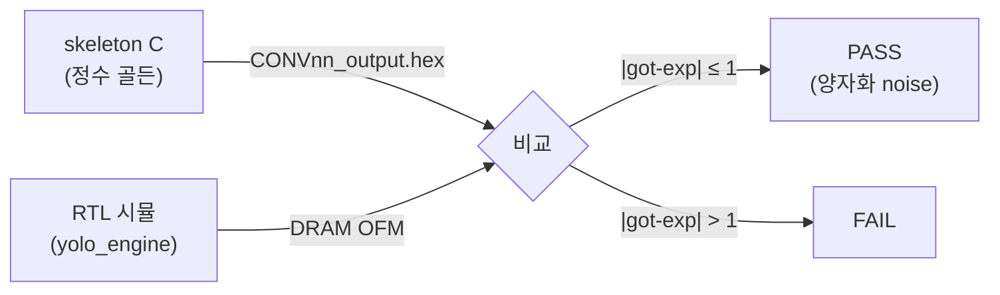
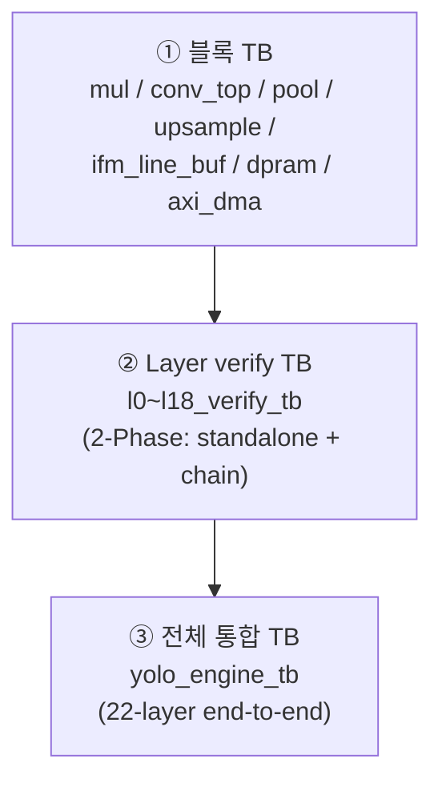

# 13장. 검증 전략과 인프라

> [← 12장 동작 과정과 타이밍](12_operation_timing.md) · [목차](README.md) · [14장 Layer별 / 블록 Testbench →](14_testbench_per_layer.md)

---

이 장은 "RTL이 정확한가?"를 어떻게 객관적으로 판정하는지 — 검증 철학·인프라·로그 규격을 다룹니다. 개별 레이어 TB의 구체적 내용은 [14장](14_testbench_per_layer.md)에서 이어집니다.

---

## 13.1 검증 철학

모든 검증의 기준은 하나입니다: **"RTL 출력이 skeleton C(정수 모델)의 출력과 같은가?"** ([3장](03_skeleton_reference.md))



- **PASS 기준**: 골든과 비트 일치(exact) 또는 `|got − exp| ≤ TOLERANCE(=1)`. 1 LSB 차이는 시뮬레이터/반올림 차이로 간주합니다.
- 이 정의 덕분에 "정확성"이 주관이 아니라 측정 가능한 수치(mismatch 수, tol-exceed 수)가 됩니다.

---

## 13.2 3계층 검증 구조

검증은 작은 단위부터 전체까지 3계층으로 쌓입니다.



| 계층 | TB | 검증 대상 | 골든 |
|------|-----|-----------|------|
| ① 블록 | `mul_tb`, `conv_top_tb`, `pool_tb`, `pool_s1_tb`, `upsample_tb`, `ifm_line_buf_tb`, `dpram_tb`, `spram_tb`, `axi_dma_rd/wr_tb`, `conv1x1_micro_tb` | 단일 모듈 산술/동작 | 수식/소규모 데이터 |
| ② Layer | `l0~l18_verify_tb` | 한 레이어 (standalone + chain) | `CONVnn_*.hex` |
| ③ 전체 | `yolo_engine_tb`, `yolo_engine_golden_tb` | 22-layer 완주 | network_done + 일부 OFM |

각 TB의 구체적 내용은 [14장](14_testbench_per_layer.md)에서 다룹니다.

---

## 13.3 2-Phase 검증 (verify TB의 핵심)

Layer verify TB의 정수는 **같은 레이어를 두 방식으로 검증**하는 것입니다([l13_verify_tb.v](../../yolohw/testbench/l13_verify_tb.v) 기준).

### Phase A — Standalone (단위 테스트)

해당 레이어만 단독 실행합니다. golden 입력을 직접 주입하므로, **그 레이어 RTL의 정확성만** 분리 검증합니다.

```verilog
// 1. golden IFM을 software REPACK하여 DRAM에 배치
software_repack_l13_ifm;
// 2. base 주소 force
force u_yolo_engine.u_axi.slv_reg1/2/3 = ...;
// 3. 레이어 진입점으로 강제 점프
force u_yolo_engine.layer_idx    = 5'd13;
force u_yolo_engine.conv_phase_r = 5'd13;
force u_yolo_engine.state_r      = 6'd1;   // S_LOAD_BIAS
// 4. release 후 자연 실행 → layer_idx==14 될 때까지 대기
release ...;
wait (u_yolo_engine.layer_idx == 5'd14);
// 5. DRAM OFM ↔ golden 비교
compare_l13_ofm(mm_A, tf_A);
```

### Phase B — Chain (통합 테스트)

`ap_start`만 주고 L0부터 자연 진행시킵니다. 이전 레이어들의 출력이 누적되어 들어오므로, **REPACK·state machine·레이어 간 연결**까지 검증합니다.

```verilog
rstn = 0; dram_zero; load_dram_inputs;     // 입력 이미지만
force slv_reg0 = 1;                         // ap_start
wait (u_yolo_engine.layer_idx == 5'd14);   // L0~L13 자연 진행
compare_l13_ofm(mm_B, tf_B);
```

> **두 Phase가 모두 PASS여야 신뢰**합니다. Phase A만 PASS면 "레이어는 맞지만 연결이 틀렸을" 수 있고, Phase B만 보면 "어느 레이어가 틀렸는지" 모릅니다. 둘을 비교해 RTL 정확성을 이중으로 확인합니다.

---

## 13.4 force/release 메커니즘

Phase A의 "레이어 진입점 강제 점프"는 Verilog `force`/`release`로 구현됩니다.

| 대상 | 값 | 의미 |
|------|----|----|
| `u_axi.slv_reg1/2/3` | base 주소 | ctrl_reg 강제 설정 (AXI 트랜잭션 없이) |
| `layer_idx`, `conv_phase_r` | 13 | "지금 L13" 으로 가장 |
| `fi_r`, `rb_r` | 0 | 카운터 초기화 |
| `state_r` | `S_LOAD_BIAS`(1) | conv 시작 state로 점프 |

force로 진입점을 세팅한 뒤 `release`하면, FSM이 그 지점부터 자연 실행됩니다. Phase B는 `slv_reg0=1`(ap_start)만 force하여 정상 경로로 시작합니다.

---

## 13.5 TB 내장 DRAM 모델

verify TB는 각자 **간단한 AXI4 slave DRAM 모델**을 내장합니다([l13_verify_tb.v:128-178](../../yolohw/testbench/l13_verify_tb.v#L128)).

```verilog
reg [31:0] dram [0:DRAM_WORDS-1];      // 4M word = 16 MB

// Read FSM: M_ARVALID → rd_busy → dram[addr] beat 출력 → M_RLAST
// Write FSM: M_AWVALID → wr_busy → dram[addr]=M_WDATA → M_BVALID
```

- 단일 outstanding burst를 지원하는 단순 모델로, 주소 디코딩은 `dram[addr[23:2]]`(word 주소).
- 합성 대상이 아니라 시뮬 전용이며, `dram_zero` task로 초기화해 [15장](15_vivado_project.md)의 X 전파 문제를 회피합니다.

별도의 정교한 모델인 [sim_dram_model/](../../yolohw/testbench/sim_dram_model/)(`sram_ctrl`, `axi_sram_if`, `sync_reg_fifo`, `sram`)은 FIFO 기반 AXI SRAM 컨트롤러로, 전체 통합 TB(`yolo_engine_tb`)에서 보드 DDR2에 가까운 동작을 모델링하는 데 쓰입니다.

---

## 13.6 통일 로그 포맷 (canonical = l13)

모든 verify TB(l20 제외)는 **`l13_verify_tb.v`를 미러링한 통일 포맷**을 씁니다([reference 메모리](../../HISTORY.md)).

```
[L13V-TB] Loading WGT  : .../gen_wgt_dram.mem
[L13V-TB] ============== Phase A : Standalone L13 ==============
[L13V-TB][<time>] Phase A : force layer_idx=13 conv_phase=13 state=S_LOAD_BIAS
[L13V-TB][<time>] Phase A : L13 COMPLETED (layer_idx -> 14)
[L13V-TB] delta dist : total=0  +d=0  -d=0  max|d|=0
[L13V-TB]   |d|=1    : 0  (0%)
[L13V-TB]   |d|=2    : 0
[L13V-TB]   |d|=3    : 0
[L13V-TB]   |d|=4..8 : 0
[L13V-TB]   |d|>8    : 0
[L13V-TB]   |d|>1 (tol-exceed) : 0
[L13V-TB][Phase A] OFM mismatch: 0 / 32768   (tol-exceed: 0)
[L13V-TB][Phase A] *** PASS (exact, 0 mismatches) ***
... (Phase B 동일) ...
[L13V-TB] Phase A : PASS (mismatch=0, tol-exceed=0)
[L13V-TB] Phase B : PASS (mismatch=0, tol-exceed=0)
```

규격(메모리 `reference_verify_tb_log_format` 기준):
- 태그 `[LNNV-TB]` (L0는 단일 phase라 `[L0V-TB][Result]`).
- `localparam integer TOLERANCE = 1;`
- compare task는 `(mismatch_cnt, tol_fail_cnt)` 두 값을 출력.
- delta-dist 7줄 블록(`total/+d/-d/max|d|`, `|d|=1/2/3/4..8/>8`, `tol-exceed`).
- 판정 3분기: `mismatch==0 → PASS (exact)`; `tol_fail==0 → PASS (within tolerance)`; `else → FAIL`.
- **비-ASCII 금지**: `→`는 `->`, `×`는 `x`, `±`는 `+-`, `Δ` 제거. 단, **코드 주석은 한글 유지**([feedback 메모리](../../CLAUDE.md)).

---

## 13.7 Tolerance 판정과 delta 분포

`compare_*` task는 단순 PASS/FAIL이 아니라 **오차의 분포**를 측정합니다([l13_verify_tb.v:254-315](../../yolohw/testbench/l13_verify_tb.v#L254)).

```verilog
if (tg !== te) begin
    mismatch_cnt++;
    abs_diff = |tg - te|;
    // |d|=1, 2, 3, 4..8, >8 구간별 카운트
    // +d / -d (부호별)
    if (abs_diff > TOLERANCE) tol_fail_cnt++;   // 진짜 실패
end
```

이 분포가 디버깅의 핵심 단서입니다:
- **대부분 `|d|=1`** → 양자화/반올림 noise(정상). [HISTORY](../../HISTORY.md)의 chain mismatch들이 이 패턴.
- **`|d|`가 크거나 특정 패턴** → 진짜 RTL 버그(예: L14의 `got=00 exp=ff`는 ReLU clip 버그, L2의 `×8 at col=0`은 라인버퍼 오버플로우).

---

## 13.8 Software REPACK (Phase A 입력 준비)

Phase A는 golden IFM(NCHW byte)을 conv 입력 포맷(NHWC entry)으로 직접 변환해 DRAM에 넣습니다. 이는 RTL REPACK([10장](10_rtl_special_units.md))의 **소프트웨어 참조 구현**이기도 합니다.

```verilog
// l13: golden_l13_ifm(NCHW) → DRAM L13 IFM(NHWC entry)
//   entry byte (col_l*4 + ch_l) =
//       golden[(ci_g*4+ch_l)*64 + row*8 + (col_b*4+col_l)]
//   DRAM word = OFM_WORD_BASE + L13_IFM_OFF_W + (row*128 + ci_g*2 + col_b)*4 + word_idx
```

Phase A(software REPACK)와 Phase B(RTL REPACK)가 모두 PASS면, **RTL REPACK이 software 참조와 일치**함이 증명됩니다([6장 6.6](06_data_representation_memory_map.md)).

---

## 13.9 hex 데이터 구조 정리

[inout_data_sw/](../../yolohw/testbench/inout_data_sw/)의 구성([3장 3.7](03_skeleton_reference.md)):

| 파일/디렉토리 | 포맷 | 용도 |
|---------------|------|------|
| `gen_wgt_dram.mem` | 32-bit/line | DRAM weight 영역 (`$readmemh`, ~2.58 M word) |
| `gen_bias_dram.mem` | 32-bit/line | DRAM bias 영역 (2294 word @ 0xA00000>>2) |
| `gen_ifm_dram.mem` | 32-bit/line | L0 입력 이미지 (65536 word @ 0xB00000>>2) |
| `log_feamap/CONVnn_input.hex` | 8-bit/line | Phase A 입력 golden (NCHW byte) |
| `log_feamap/CONVnn_output.hex` | 8-bit/line | 출력 골든 (비교 대상) |
| `log_param/CONVnn_param_*.hex` | weight/bias/scale | 양자화 파라미터 (참고) |

TB는 `$readmemh`로 `.mem`을 DRAM 배열에 적재하고, `.hex` golden을 별도 reg 배열(`golden_*`)에 적재해 비교합니다.

---

## 13.10 이 장의 요약

- 검증 기준은 "RTL == skeleton C 정수 골든", `|got−exp| ≤ 1`이면 PASS(양자화 noise).
- 3계층(블록 TB → layer verify TB → 전체 yolo_engine_tb)으로 작은 단위부터 통합까지 검증.
- verify TB는 2-Phase: Phase A(force/release로 단독 실행, 단위 테스트) + Phase B(ap_start로 chain, 통합 테스트).
- 통일 로그 포맷(canonical=l13): `[LNNV-TB]` 태그, TOLERANCE=1, delta 분포 7줄, 3분기 판정, ASCII만.
- delta 분포(|d|=1/2/3/...)가 디버깅 단서 — 대부분 |d|=1은 noise, 큰 값/패턴은 진짜 버그.
- Phase A의 software REPACK = RTL REPACK의 참조 구현이며, 둘 다 PASS면 RTL REPACK 정확성 증명.

다음 장에서는 L0~L18 각 verify TB와 블록 TB의 구체적 내용·결과를 정리합니다.

---

> [← 12장 동작 과정과 타이밍](12_operation_timing.md) · [목차](README.md) · [14장 Layer별 / 블록 Testbench →](14_testbench_per_layer.md)
