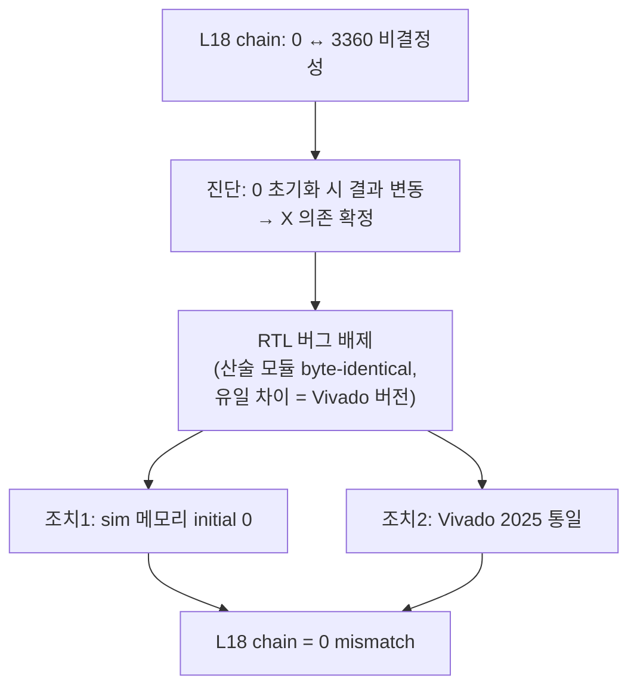

# 15장. Vivado 프로젝트

> [← 14장 Layer별 / 블록 Testbench](14_testbench_per_layer.md) · [목차](README.md) · [16장 부록 →](16_appendix_future.md)

---

이 장은 RTL을 실제 FPGA 비트스트림으로 만들고 시뮬레이션하는 Vivado 환경을 다룹니다. 프로젝트 생성·BMG IP·합성/시뮬 흐름, 그리고 **검증 정확성을 좌우한 Vivado 2021 vs 2025 이슈**를 정리합니다.

---

## 15.1 프로젝트 개요

| 항목 | 값 |
|------|----|
| 도구 | **Vivado 2025.x** (검증 환경) |
| Part | `xc7a100tcsg324-1` (Nexys A7-100T) |
| Top 모듈 | `yolo_engine` (Phase 1·2) |
| 프로젝트 디렉토리 | [yolohw/fpga/vivado_yolohw/](../../yolohw/fpga/) |

[yolohw/fpga/](../../yolohw/fpga/) 구성:

| 파일/디렉토리 | 역할 |
|---------------|------|
| `create_project_25.tcl` | **Vivado 2025 프로젝트 생성** (권장) |
| `gen_bram_ips.tcl` | BMG(Block Memory Generator) IP 생성 |
| `NEXYS_A7_100T.xdc` | 핀·클럭 제약 |
| `yolohw.tcl` | 구 2021 프로젝트 스크립트 (참고용, 696줄) |
| `vivado_yolohw/` | 생성된 프로젝트 |
| `vitis/` | MicroBlaze 펌웨어 (Phase 3) |
| `yolo_design_1_wrapper.xsa` | 구 block design (참고) |

---

## 15.2 프로젝트 생성 — create_project_25.tcl

[create_project_25.tcl](../../yolohw/fpga/create_project_25.tcl)은 깨끗한 새 프로젝트를 만듭니다(구 2021 IP-locked 프로젝트 폐기).

```tcl
# Windows Vivado 2025.x Tcl Console
set fpga_dir "Z:/2026 CAU/AIX2026/git/Yolo_Accelerator/yolohw/fpga"
source $fpga_dir/create_project_25.tcl
```

핵심 동작:
1. `xc7a100tcsg324-1`로 프로젝트 생성(`-force`로 동명 덮어쓰기).
2. `src/*.v` 전체 추가(`*_wip.v` 제외).
3. **합성 fileset에만 FPGA 매크로 주입**:
   ```tcl
   set_property verilog_define {FPGA=1} [get_filesets sources_1]
   ```
   파일의 `` `define FPGA `` 는 주석 상태로 두고, 합성 fileset에만 define을 주입합니다. 이렇게 하면 시뮬 fileset(`sim_1`)은 매크로 off 상태를 유지하므로, **파일 수정 없이** 합성/시뮬 모드가 분리됩니다([2장 2.8](02_dev_environment.md), [CLAUDE.md 규칙 1](../../CLAUDE.md)).
4. include path에 `src/` 등록(`user_define_h.v` 검색용), 합성·시뮬 양쪽.
5. `NEXYS_A7_100T.xdc` 제약 추가, top = `yolo_engine`.
6. `gen_bram_ips.tcl`로 BMG IP 생성.

---

## 15.3 BMG IP — gen_bram_ips.tcl

[gen_bram_ips.tcl](../../yolohw/fpga/gen_bram_ips.tcl)이 생성하는 Block Memory Generator IP입니다. `` `ifdef FPGA `` 경로에서 `dpram_wrapper`/`spram_wrapper`/`gbuff_param`/`ifm_line_buf`가 인스턴스화합니다([9장](09_rtl_memory_buffers.md)).

| IP | 타입 | Write W×D | Read W | 용도 |
|----|------|-----------|--------|------|
| `dpram_4096x72` | Simple DP | 72 × 4096 | **288** | gbuff weight (**비대칭** 72/288) |
| `spram_2560x32` | Single Port | 32 × 2560 | 32 | gbuff bias |
| `dpram_2048x128_tdp` | **True DP** | 128 × 2048 | 128 | line buffer (×4 bank) |
| `dpram_65536x32` | Simple DP | 32 × 65536 | 32 | **OFM dpram (256 KB)** |
| `spram_2048x128` | Single Port | 128 × 2048 | 128 | (구/weight 정렬, 호환) |
| `spram_128x32` | Single Port | 32 × 128 | 32 | (구 bias, 호환) |
| `dpram_16384x128` | Simple DP | 128 × 16384 | 128 | (구 IFM 핑퐁, 미사용) |

> **공통 설정 두 가지가 중요**합니다:
> - **`Register_Port*_Output_of_Memory_Primitives = false`** (No Output Register) → read latency **1 cycle**. 이것이 [9장](09_rtl_memory_buffers.md) 시뮬 모델의 `N_DELAY=1`·`conv_top`의 정렬과 일치합니다. output register를 켜면 latency가 2가 되어 conv_top look-ahead 정렬이 깨집니다.
> - **`dpram_4096x72`의 비대칭**(Write_Width 72 / Read_Width_B 288) → 한 read entry가 4개 write entry(36 weight)를 합칩니다([6장 6.3](06_data_representation_memory_map.md)).

---

## 15.4 제약 — NEXYS_A7_100T.xdc

[NEXYS_A7_100T.xdc](../../yolohw/fpga/NEXYS_A7_100T.xdc)는 Nexys A7-100T 보드의 핀 매핑과 클럭 제약을 정의합니다(70줄). 클럭 입력, 리셋, LED(`network_done_led`) 등 보드 신호를 FPGA 핀에 연결합니다. 실제 클럭 주파수(timing closure 후 확정)가 [12장 12.7](12_operation_timing.md)의 fps 추정을 좌우합니다.

---

## 15.5 합성 / 구현 흐름

```tcl
# Windows Vivado 2025.x Tcl Console (create_project_25.tcl 실행 후)
launch_runs synth_1 -jobs 4
wait_on_run synth_1
launch_runs impl_1 -to_step write_bitstream -jobs 4
```

합성 시 주의([CLAUDE.md 규칙 1](../../CLAUDE.md)):
- DSP48/BRAM IP는 **명시적 인스턴스화**(`a*b+c` 추론 사용 금지) — `mul.v`의 `xbip_dsp48_macro_0`, BMG IP.
- FPGA 매크로가 합성 fileset에 주입되어 있어야 함(자동, `create_project_25.tcl`이 처리).

---

## 15.6 시뮬레이션 흐름

```tcl
# 시뮬 fileset은 FPGA 매크로 off 상태 (behavioral 메모리)
set_property top l18_verify_tb [get_filesets sim_1]
launch_simulation
```

운영 규칙:
- ⚠️ **`log_all_signals` OFF 유지** — 켜면 `.wdb` 파형이 TB당 수백 MB로 폭증([CLAUDE.md 규칙 6](../../CLAUDE.md)).
- 시뮬은 매크로 off라 `dpram_wrapper`/`spram_wrapper`/`ifm_line_buf`/`gbuff_param`의 behavioral reg 배열(+`initial` 0)이 동작([9장](09_rtl_memory_buffers.md)).

---

## 15.7 Vivado 2021 vs 2025 이슈 (중대)

> 이 절은 [2장 2.9](02_dev_environment.md)에서 예고한 검증 정확성의 핵심 문제를 상세히 다룹니다.

### 증상

L18 chain 검증(Phase B)에서 **동일 RTL·데이터·TB인데 환경에 따라 mismatch가 0 ↔ 3360으로 달라지는** 비결정성이 발견되었습니다.

| Vivado | L18 chain 결과 |
|--------|----------------|
| **2025** | **0 mismatch** |
| 2021 | 3360 mismatch (\|Δ\|≤3, 92%가 \|Δ\|=1) |

### 원인: uninitialized 메모리(X)의 시뮬레이터 버전 차이

진단 결과 원인은 **behavioral 메모리의 uninitialized X 값 처리가 Vivado 버전마다 다른 것**이었습니다. 결정적 증거:
- 메모리를 0으로 강제 초기화하니 2021 결과가 3360 → **3676으로 바뀜** → chain이 미초기화 메모리 값에 의존한다는 직접 증거.

### RTL 버그가 아님을 배제한 근거

| 검증 | 결과 |
|------|------|
| golden 자가 일관성 | 100% (인접 layer output==input, route/upsample 0 mismatch) |
| 다른 PC(2025)와 산술 모듈 비교 | mul/mac_kern/mac_stack/add_tree/post_process/conv_top/upsample **byte-identical** |
| 입력 데이터·golden·TB 비교 | **모두 동일** |
| 유일한 차이 | **Vivado 버전(2021 vs 2025)** |

### 조치

1. **sim behavioral 메모리 `initial` 0 초기화** — `dpram_wrapper`(ram+rdata+rdata_r), `spram_wrapper`(mem+rdata_o), `ifm_line_buf`(mem×4+dout_a/b_r), `gbuff_param`(wgt_mem+bias_mem). 모두 `` `ifdef FPGA `` else 영역이라 **합성·fps·Energy에 영향 없음**, 실제 FPGA BRAM의 0 초기화와 일치([9장 9.5](09_rtl_memory_buffers.md)).
2. **검증 환경을 Vivado 2025로 통일**.

### 결론

RTL 자체는 정확합니다. ±1 LSB는 시뮬레이터 X 처리 차이였으며 **mAP·점수(fps/Energy)에 무관**합니다. 향후 모든 chain 검증은 Vivado 2025 기준입니다([HISTORY 2026-05-24](../../HISTORY.md)).



---

## 15.8 이 장의 요약

- Vivado **2025** + `xc7a100tcsg324-1`, top=`yolo_engine`. `create_project_25.tcl`이 깨끗한 새 프로젝트를 생성.
- 합성 fileset에만 `verilog_define FPGA=1`을 주입 → 파일 수정 없이 합성/시뮬 모드 분리.
- BMG IP 7종(weight 비대칭 dpram_4096x72, OFM dpram_65536x32, line buffer dpram_2048x128_tdp 등), **모두 No Output Register = read latency 1**.
- 합성은 DSP48/BRAM IP 명시 인스턴스화, 시뮬은 `log_all_signals` OFF.
- Vivado 2021은 uninitialized X 처리가 달라 chain 비결정성 → sim 메모리 0 초기화 + 2025 통일로 해결(RTL 버그 아님, 점수 무관).

다음 장(부록)에서는 아직 검증 중인 L19~L21, Phase 3·4 계획, host.py, 용어집을 정리합니다.

---

> [← 14장 Layer별 / 블록 Testbench](14_testbench_per_layer.md) · [목차](README.md) · [16장 부록 →](16_appendix_future.md)
