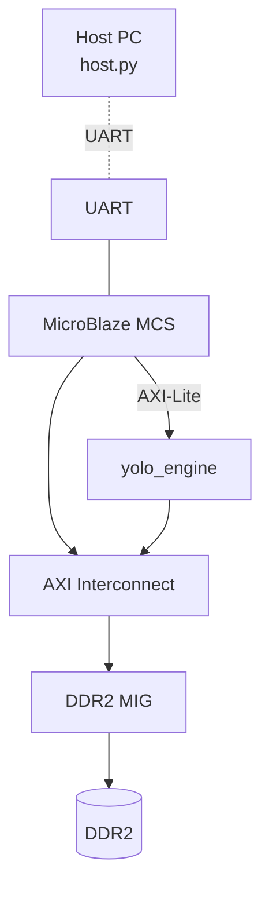
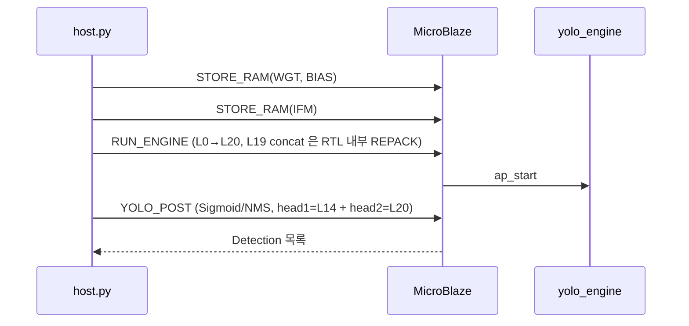

# 16장. 부록 — 향후 작업 / 용어집

> [← 15장 Vivado 프로젝트](15_vivado_project.md) · [목차](README.md)

---

이 장은 **현재 문서 범위(L0~L18 검증 완료) 밖**의 내용을 모읍니다. L19~L21과 Phase 3·4가 완료되면 해당 절을 본문 장으로 승격할 예정입니다. 또한 용어집·약어·참고 문서를 정리합니다.

---

## 16.1 L19~L21 — 검증 진행 중

### L19 Route concat

L20 입력은 업샘플된 L18(16×16×128)과 백본 L8(16×16×256)을 채널 축으로 이어 붙인 16×16×384입니다([4장 4.4](04_network_architecture.md)). RTL은 [10장 10.5.3](10_rtl_special_units.md)의 2-source REPACK으로 처리합니다.

- `S_L19_RP_LOAD_A`: L18 OFM → dpram[0..]
- `S_L19_RP_LOAD_B`: L8 OFM → dpram[8192..]
- `S_L19_RP_GEN`: NHWC entry로 묶기 → `S_L19_RP_STORE`: L20 IFM
- 검증 TB: [l20_verify_tb.v](../../yolohw/testbench/l20_verify_tb.v) (untracked, Phase A force layer_idx=19/state=S_L19_RP_LOAD_A).
- L8 OFM golden은 별도 생성 필요(skeleton C에서 재생성 또는 CONV20_input.hex의 채널 128~383).

### L20 검출 헤드 2

L14와 같은 검출 헤드 구조(`activation=linear`, INT8 raw, `i_relu_en=0`)이며, Ci=384, Co=195, 16×16 격자. acc_len=96(=384/4). post_process의 toward-zero rounding이 L14와 동일하게 적용됩니다([8장 8.6](08_rtl_convolution_engine.md)).

### L21 YOLO output

RTL 연산 없음. L20 OFM이 DRAM에 있고, 소프트웨어가 후처리합니다.

> **승격 조건**: L20 chain(Phase B)이 0 mismatch가 되면, L19~L21 내용을 [4·7·10·14장](14_testbench_per_layer.md)의 본문으로 통합하고 이 절을 정리합니다.

---

## 16.2 Phase 3 — MicroBlaze + UART + DDR2

### 시스템 통합 (예정)



- Vivado block design: MicroBlaze MCS + UART + DDR2 MIG + `yolo_engine` IP를 interconnect로 연결.
- Vitis firmware([vitis/](../../yolohw/fpga/vitis/)): UART 명령 해석, DDR2 DMA, yolo_engine ctrl_reg 제어, YOLO 후처리(Sigmoid/Softmax/NMS). **L19 concat 은 RTL REPACK(`S_L19_RP_*`)으로 처리되어 firmware memcpy 불필요** — single-inference 로 동작. (현 firmware 코드의 double-inference 잔재는 Phase 3 통합 시 정리 예정)

### host.py — Host PC UART 클라이언트

[host.py](../../yolohw/firmware/host.py)(492줄)는 UART로 가속기를 구동합니다.

**UART 명령(MODE):**

| MODE | 값 | 역할 |
|------|----|----|
| `MODE_TEST_HELLO` | 0x01 | 'Hello' 응답 확인 |
| `MODE_TEST_ECHO` | 0x02 | echo 테스트 |
| `MODE_STORE_RAM` | 0x03 | DDR2[offset]에 데이터 적재 |
| `MODE_LOAD_RAM` | 0x04 | DDR2 읽기 |
| `MODE_RUN_ENGINE` | 0x06 | 22-layer 추론 + network_done 대기 |
| `MODE_CONCAT_L19` | 0x07 | (레거시) L19 가 RTL REPACK 으로 처리되어 single-inference 에서는 미사용 |
| `MODE_YOLO_POST` | 0x08 | Sigmoid/NMS → 검출 목록 수신 |

**DDR2 메모리 맵(byte offset):**

```
DDR2_OFF_WGT  = 0x0000_0000   # weight 전체
DDR2_OFF_BIAS = 0x00A0_0000   # bias (weight ~9.8 MB 이후)
DDR2_OFF_IFM  = 0x0100_0000   # 입력 이미지 (256×256×3 packed)
DDR2_OFF_OFM  = 0x0200_0000   # OFM (per-layer offset)
```

**추론 시퀀스 (single-inference — L19 RTL REPACK):**



> L19 concat(L18 ‖ L8)을 yolo_engine FSM 의 REPACK(`S_L19_RP_LOAD_A`~`S_L19_RP_NEXT`, 8 states)이 추론 도중 자동 처리하므로 **single-inference(L0→L20 한 번)** 로 충분합니다. 과거 double-inference + `MODE_CONCAT_L19` memcpy 방식은 폐지되었습니다(RTL 이 L8 OFM 을 dpram 에 적재 후 L18 OFM 과 채널 concat → L20 IFM 으로 REPACK). 보드 통합 후 이 흐름의 타이밍·전력이 [Phase 4](16_appendix_future.md#163-phase-4)에서 측정됩니다.

---

## 16.3 Phase 4 — 비트스트림 / 보드 / 측정

| 작업 | 산출물 |
|------|--------|
| 합성 → 구현 → 비트스트림 | `.bit` ([15장 15.5](15_vivado_project.md)) |
| 보드 프로그래밍 | Nexys A7-100T 적재 |
| 100장 테스트셋 추론 | mAP, fps, 전력 측정 |
| 점수 산출 | `Score = 10⁴/Energy × ReLU(mAP−0.2) × ReLU(fps−5)` |

이 단계에서 [12장 12.7](12_operation_timing.md)의 fps 추정과 [12장 12.8](12_operation_timing.md)의 Energy 가정이 실측으로 확정됩니다. 측정 결과는 새 장(예: "17장 보드 측정 결과")으로 추가할 예정입니다.

---

## 16.4 용어집

| 용어 | 설명 |
|------|------|
| **NCHW byte order** | 채널-major 특징맵 포맷. 채널 하나의 H×W를 통째로 저장 후 다음 채널([6장](06_data_representation_memory_map.md)) |
| **NHWC 16-byte entry** | conv 입력 포맷. 128-bit = 4 col × 4 ch ([6장](06_data_representation_memory_map.md)) |
| **2×2 packed word** | conv 출력 포맷. 32-bit = 한 2×2 블록 4픽셀 ([6장](06_data_representation_memory_map.md)) |
| **REPACK** | 채널-major/packed → NHWC entry 재배치 ([10장](10_rtl_special_units.md)) |
| **streaming weight** | 필터마다 가중치를 fresh DMA하는 방식 ([8·9장](08_rtl_convolution_engine.md)) |
| **output-stationary** | 출력 픽셀을 고정하고 입력·가중치를 흘려 누적하는 loop ([8장](08_rtl_convolution_engine.md)) |
| **acc_len** | 한 출력의 누적 cycle 수 (3×3: ceil(Ci/4)) ([8장](08_rtl_convolution_engine.md)) |
| **spatial set** | mac_stack의 4벌 입력(2×2 출력 위치 00/01/10/11) ([8장](08_rtl_convolution_engine.md)) |
| **descaling** | MAC 결과를 다음 레이어 스케일로 줄이는 산술 시프트 ([3·6장](06_data_representation_memory_map.md)) |
| **toward-zero rounding** | C 나눗셈과 일치시키는 음수 반올림 보정 ([6·8장](08_rtl_convolution_engine.md)) |
| **Phase A / B** | verify TB의 standalone / chain 검증 ([13장](13_testbench_strategy.md)) |
| **tolerance** | mismatch 허용 임계(±1 LSB = 양자화 noise) ([13장](13_testbench_strategy.md)) |
| **cyclic row mapping** | line buffer가 행을 4 bank에 순환 배치(row mod 4) ([9장](09_rtl_memory_buffers.md)) |
| **look-ahead** | BRAM latency 보상을 위해 다음 좌표를 미리 발사 ([8·12장](12_operation_timing.md)) |

---

## 16.5 약어

| 약어 | 풀이 |
|------|------|
| IFM / OFM | Input / Output Feature Map (입력/출력 특징맵) |
| MAC | Multiply-Accumulate (곱셈-누적) |
| BMG | Block Memory Generator (Vivado BRAM IP) |
| BRAM / SPRAM / DPRAM | Block RAM / Single-Port RAM / Dual-Port RAM |
| DSP48 | Xilinx DSP slice (곱셈기) |
| FSM | Finite State Machine |
| NMS | Non-Maximum Suppression (검출 후처리) |
| mAP | mean Average Precision (검출 정확도) |
| TB | Testbench |
| TDP | True Dual Port |

---

## 16.6 참고 문서

| 자료 | 위치 | 용도 |
|------|------|------|
| `CLAUDE.md` | [../../CLAUDE.md](../../CLAUDE.md) | 작업 가이드 + 치명적 규칙 8가지 |
| `ARCHITECTURE.md` | [../../ARCHITECTURE.md](../../ARCHITECTURE.md) | 아키텍처 스펙 요약 |
| `HISTORY.md` | [../../HISTORY.md](../../HISTORY.md) | layer-by-layer 검증·버그 수정 이력 |
| `README.md` (루트) | [../../README.md](../../README.md) | 프로젝트 개요 + 빌드/시뮬 |
| 강의 PDF 12종 | [../](../) | DSP/MAC, BRAM, System Integration |

강의 PDF 중 본 설계와 직결되는 것:
- `05_AIX2025_DSP_MAC_Manual.pdf` / `05_HDL_Computing_Units.pdf` → [8장 MAC](08_rtl_convolution_engine.md)
- `06_AIX2025_Block_Ram_Manual.pdf` / `06_BRAM_Buffers.pdf` → [9장 메모리](09_rtl_memory_buffers.md)
- `07_System_Integration_Controller.pdf` / `08_System_integration_Top_Module.pdf` → [7장 TOP](07_rtl_yolo_engine_top.md)
- `03_SDK_Programming_Guide_Quantization.pdf` → [3장 양자화](03_skeleton_reference.md)

---

## 16.7 문서 유지보수 가이드

이 기술 레퍼런스를 최신으로 유지하는 방법:

1. **L19~L21 검증 완료 시**: [16.1](#161-l19l21--검증-진행-중)을 [4·14장](14_testbench_per_layer.md) 본문으로 통합, 검증 결과 표 갱신.
2. **Phase 3 보드 통합 시**: [16.2](#162-phase-3--microblaze--uart--ddr2)를 새 장(시스템 통합)으로 승격.
3. **Phase 4 측정 후**: 새 장(보드 측정 결과)에 fps/mAP/Energy/Score 실측 추가, [12장](12_operation_timing.md)의 추정치를 실측으로 교체.
4. **RTL 변경 시**: 해당 모듈 장(7~11장)의 포트·파라미터·라인 링크를 갱신. 라인 번호보다 식별자(모듈/state/파라미터명)를 기준으로 확인.
5. **충돌 시 우선순위**: 실제 소스 코드 > 본 문서 > 강의 PDF.

> 각 장 말미의 요약과 [README.md 빠른 참조](README.md#2-빠른-참조-quick-facts)를 함께 갱신하면 일관성이 유지됩니다.

---

## 16.8 맺음말

본 레퍼런스는 L0~L18 검증이 완료된 시점에서, skeleton C 골든부터 RTL·검증·Vivado까지 전 계층을 한 곳에 정리했습니다. 핵심은 다음 한 문장으로 요약됩니다:

> **"INT8 정수 파이프라인과 144-MAC 병렬, 온칩 버퍼 재사용으로 22-layer YOLOv2를 Artix-7 한 장에 담되, skeleton C와 비트 단위로 일치시켜 정확도를 지키고 에너지를 최소화한다."**

L21까지의 chain 검증과 보드 동작 확인이 완료되면, 이 문서는 그 결과를 담아 완성됩니다.

---

> [← 15장 Vivado 프로젝트](15_vivado_project.md) · [목차](README.md)
